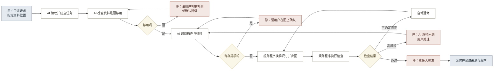

# 01 · AI 能力与人机分工

## 一、结论

AI 价值分为任务处理和人机交互两层。

任务处理层读取照片和文档，产出构件清单、材料清单、位置与尺寸预估、资料缺口和问题定位。规则程序继续负责计算、校验、出图和组包。

人机交互层接收自然语言和图像框选，显示处理进度与证据，并在专业判断、规范选择和签发节点请求人工确认。

每项 AI 功能都需说明新增产出及其验收方式。固定字段、确定计算和稳定校验交给规则程序。

## 二、任务处理层

各环节的输入、AI 产出和规则程序边界见表 1。

**表 1：各环节的 AI 产出**

| 环节 | 输入 | AI 产出 | 规则程序边界 |
|---|---|---|---|
| 建立任务 | 用户口述要求，一个资料文件夹 | 从任务书提取成果类型、比例、精度、规范和交付项，形成任务卡草稿；识别文件类型 | 可按扩展名和文件名分类；任务要求需结构化输入 |
| 整理资料 | 照片、扫描件、旧图纸、现场记录 | 标注拍摄部位、覆盖范围和可用性，形成遮挡、缺面和低分辨率清单 | 可检查格式、分辨率和数量；语义覆盖需人工标注 |
| 核对构件 | 立面照片 | 生成构件与材料候选，给出位置、数量、尺寸预估、依据和存疑原因 | 需预先提供固定类别及其可计算特征 |
| 记录现状 | 构件清单、实测尺寸、多角度照片 | 草拟空间关系，提取可见残损线索，标记无实测依据部位 | 可依据实测基准换算比例和校验几何关系 |
| 生成图纸 | 确认后的构件数据、画法规则 | 将非标准形制整理为可校验的画法参数 | 可稳定绘制已经参数化的标准形制 |
| 检查与签发 | 图纸、对象数据、规范要求 | 解释错误原因，定位位置，并按后果排序 | 可执行明确的字段、几何和规范检查 |
| 交付归档 | 成果、证据、检查记录、版本 | 起草交付说明，概括版本变化和修改原因 | 可组合文件、核对清单和比对字段差异 |
| 复查更新 | 不同时期的照片与图纸 | 形成差异候选及原因，区分采集条件与建筑变化 | 可执行配准、像素和结构化字段比对 |

图纸生成由规则程序执行，保证相同数据得到稳定结果。AI 只把非标准形制转成可校验的画法参数。

## 三、人机交互层

五种协作方式对应 13-1 的 10 项协作问题（见表 2）。

**表 2：五种协作方式**

| 协作方式 | 用户实际做什么 | 系统实际做什么 | 解决问题 |
|---|---|---|---|
| 自然语言交代任务 | 说明项目、资料位置和特殊要求 | 读取资料，建立任务，列出已知信息和缺口 | 43、50 |
| 自动推进与停靠 | 回答系统提出的必要问题 | 完成当前步骤后继续处理；遇到责任节点时暂停，并显示动作和资料 | 42、45 |
| 原图框选修正 | 框出位置并说明问题 | 定位构件，更新数据与受影响成果，保存修正记录 | 44、49 |
| 项目内复用 | 确认术语、构件或做法 | 写入项目构件库；跨项目复用前再次确认 | 47、48 |
| 依据和责任始终可见 | 查看某条结果时点开依据 | 用不同标记区分实测依据、AI 推测和人工确认三种状态，并记录每次修改的人、时间、原因和影响范围 | 46、51 |

原图框选把证据、问题和修改对象连在同一处，省去在照片与表格之间反复定位。

## 四、AI、规则程序与人工的分工

分工原则是让 AI 做需要理解的事，让规则程序做需要确定的事，让人做需要负责的事（见表 3）。

**表 3：八个模块的三方分工**

| 模块 | AI 承担 | 规则程序承担 | 人工承担 |
|---|---|---|---|
| 建立任务 | 理解口述要求，读取任务书，形成任务卡草稿 | 校验必填项，套用规范模板，生成验收清单 | 选择适用规范，批准任务，确认责任人 |
| 整理资料 | 判断资料类型、拍摄对象、覆盖范围和可用性 | 检查格式、分辨率、重复和命名，登记来源与时间 | 确认数据权属与保密条件，决定是否补拍补测 |
| 核对构件 | 识别构件与材料，给出位置、数量和尺寸预估，标出不确定项 | 统计数量，校验字段完整性，分配对象编号 | 确认存疑构件的名称与形制，判定术语适用范围 |
| 记录现状 | 形成空间关系草稿，提取可见残损线索 | 按实测基准换算尺寸，检查尺寸之间的几何关系 | 完成现场实测，判断保存状态与病害性质 |
| 生成图纸 | 把非标准形制翻译成画法参数 | 按规则绘制图形、标注、图层和版面，导出多种格式 | 确认特殊构件画法与正式表达方式 |
| 检查与签发 | 解释错误原因，定位到具体位置，按后果排序 | 执行规范、字段、尺寸关系和完整性检查 | 处理未知与冲突项，复核并签发 |
| 交付归档 | 起草交付说明，说明版本之间的差异 | 组合交付包，校验清单完整性，建立来源与版本关系 | 确认接收条件、授权范围和部署要求 |
| 复查更新 | 提出差异候选并说明可能原因 | 配准同一对象的多期记录，保留历史版本 | 判定变化性质，决定是否更新正式记录 |

分工原则可概括为：AI 负责识别和表达，规则程序负责计算和约束，人工负责专业判断与签发。各模块仍需按数据、风险和验收要求确认边界。

## 五、可迁移的技术能力与边界

表 1 和表 3 中的 AI 产出依赖以下能力，每项都有已公开的实现和明确限制（见表 4）。

**表 4：可迁移能力及边界**

| 能力 | 用途 | 外部依据 | 主要限制 |
|---|---|---|---|
| 文档解析与视觉检索 | 读取任务书、扫描件、表格和图纸，返回原始位置 | [Docling](https://research.ibm.com/publications/docling-an-efficient-open-source-toolkit-for-ai-driven-document-conversion)、[MinerU](https://github.com/opendatalab/MinerU)支持复杂文档解析；[ColPali](https://arxiv.org/abs/2407.01449)支持按页面视觉内容检索 | 复杂图纸、手写内容和专业术语仍需样本验证 |
| 开放概念分割 | 用文本或图像提示定位未预设类别的构件 | [SAM 3](https://ai.meta.com/research/publications/sam-3-segment-anything-with-concepts/)支持开放词汇概念分割；[DINOv3](https://ai.meta.com/research/publications/dinov3/)提供通用视觉特征 | 外观相似、遮挡和地区做法差异会造成误判 |
| 多视图几何 | 从多张照片形成相机位置、深度和三维草稿 | [VGGT](https://github.com/facebookresearch/vggt)可联合预测多种三维属性 | 不能替代实测，也不能恢复不可见部位 |
| 点云构件语义分割 | 从扫描点云自动区分构件类别，为构件清单提供候选 | [Scan-to-BIM 实例分割](https://github.com/LTTM/Scan-to-BIM)提供全自动分割研究实现；[BIMNet 基准](https://github.com/LydJason/BIMNet)提供基于 IFC 的 14 类构件标注与几何加拓扑双维评测（AUTCON 2025） | 学界最好水平 mIoU 43.7%（BIM-Net++ 在 HePIC 数据集，2025），远未达到免核对程度，每个识别结果必须可人工确认 |
| 结构化生成 | 按固定字段输出对象、状态和问题 | [Structured Outputs](https://openai.com/index/introducing-structured-outputs-in-the-api/)可约束模型输出结构 | 输出事实仍需核对 |
| 参数化 CAD | 由对象参数和约束生成可编辑图形 | [CAD 约束生成研究](https://arxiv.org/abs/2504.13178)表明模型可辅助生成几何约束 | 画法规则与尺寸依据必须先确定 |
| 确定性规则检查 | 把明确要求写成机器可执行规则 | [buildingSMART IDS](https://www.buildingsmart.org/standards/bsi-standards/information-delivery-specification-ids/)展示了可机读信息要求与自动检查方法 | 不能判断真实性、价值和法律责任 |
| 受控工具调用 | 将自然语言映射到允许的动作，并调用指定工具 | [Anthropic agents](https://resources.anthropic.com/building-effective-ai-agents)与[评测方法](https://www.anthropic.com/engineering/demystifying-evals-for-ai-agents)说明工具调用与可重复评测 | 长流程会累积错误，流程顺序和停靠条件需由固定规则控制 |
| 风险校准 | 把低把握结果转成人工问题 | [Conformal prediction](https://arxiv.org/abs/2505.24693)提供覆盖风险的方法；[NIST AI RMF](https://www.nist.gov/itl/ai-risk-management-framework)强调风险治理与人工监督 | 必须用古建样本校准，不能直接采用通用置信度 |
| 跨期比较 | 对多时相资料提取变化候选 | [TerraMind](https://www.esa.int/Applications/Observing_the_Earth/ESA_and_IBM_collaborate_on_TerraMind)展示多模态多时相分析 | 需区分采集差异与真实变化 |
| 来源与版本追踪 | 记录资料、处理过程、人工修改与成果的关系 | [W3C PROV-O](https://www.w3.org/TR/prov-o/)提供通用来源关系模型 | 需要统一对象身份、权限与记录规则 |

编排层负责流程推进、停靠和退回；模型只在允许的动作清单内理解指令并调用工具。

## 六、AI 必要性

表 5 对比规则程序的能力上限和 AI 的新增产出。

**表 5：AI 增量与验证重点**

| 环节 | 规则方案 | AI 增量 | V1A 判断 |
|---|---|---|---|
| 建立任务 | 表单录入、必填校验 | 从口述和任务书生成任务卡草稿 | 建设 |
| 整理资料 | 格式、分辨率和数量检查 | 判断拍摄部位、覆盖范围和语义缺口 | 建设 |
| 核对构件 | 固定类别和字段管理 | 生成带位置、依据和存疑原因的构件候选 | 重点验证 |
| 记录现状 | 尺寸换算和几何校验 | 草拟空间关系和可见残损线索 | 有限建设 |
| 生成图纸 | 参数化绘制和稳定导出 | 整理非标准形制参数 | 规则程序主导 |
| 检查与签发 | 执行明确检查规则 | 解释错误、定位位置并说明后果 | 重点验证 |
| 交付归档 | 自动组包和模板说明 | 生成版本差异与限制条件草稿 | 先用模板 |
| 复查更新 | 配准和差异比对 | 解释差异原因并形成复查线索 | V3 评估 |

V1A 优先验证构件核对和检查解释。图纸生成由规则程序负责；交付说明先采用模板，真实需求成立后再评估 AI 价值。

## 七、问题处理分类

问题处理等级取决于成因是否消除（见表 6）。

**表 6：问题处理分类**

| 判断 | 问题编号 | 判断依据 | 产品含义 |
|---|---|---|---|
| 可彻底解决 | 9、12、15、16、21、24、25、27、30、31、33、35、36、38、42、44、45、49、50 | 在限定成果和数据范围内，可通过统一身份、来源关系、参数规则、分阶段检查和新的交互形态消除流程性成因 | 删除重复录入、重复修改、晚检查、人工组包和固定顺序 |
| 可局部优化 | 1 至 3、5 至 7、10、11、13、17、19、22、23、26、28、29、39、43、46、47、48 | AI 可减少整理、初判和检查工作，但内容仍受项目条件、样本、地区规则或人员差异影响 | 保留人工确认，减少机械工作和低风险全量检查 |
| 暂时必须保留 | 4、8、14、18、20、32、34、37、40、41、51 | 缺少真实项目、实测、不可见事实、独立基准、接收要求或法定责任，AI 不能补造 | 在真实证据出现前设为阻断项或人工责任点 |

## 八、处理与返修路径

系统在证据不足、结论存疑、规范选择和正式签发四类节点请求人工处理，其余节点按固定流程推进（见图 1）。

**图 1：处理与返修路径**

四个停靠点分别对应问题 7 与 11、14 与 17、26 与 33、34。用户可以在任何时刻插话改变方向，不必等系统走到停靠点。

近期返修由人工发起。取得真实错误样本并确定风险阈值后，再开放低风险自动返修。

## 九、AI 使用边界

专业人员负责补充实测和历史证据，判断遮挡部位、适用规范、保护价值与病害结论，并承担数据授权、正式审核和签发责任。

系统负责定位待判断事项、汇集证据并记录处理过程。确认按钮只保存人工决定，不转移专业责任。
