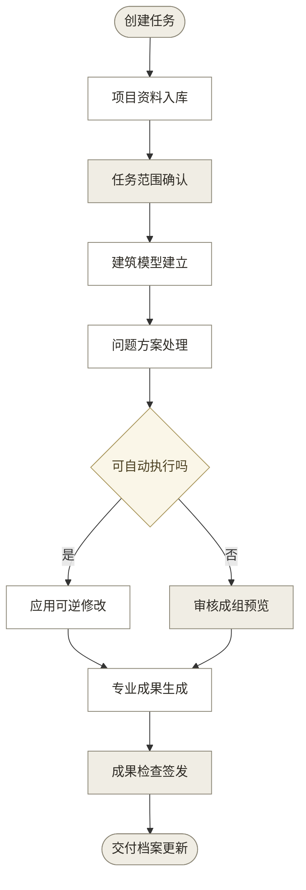

# 03 · 古建保护成果工作台核心 PRD v1.3（已确认）

> v1.3 修订范围：4.9 助手职责引用 05 界面与交互形态的动作清单与确认机制；第 10 章依据补充同文件。其余章节与 v1.2 一致。

## 1. 产品概述

### 1.1 一句话描述

古建保护成果工作台帮助测绘与保护团队把项目资料转成可追溯的三维模型、专业图纸和交付档案。

### 1.2 产品目标

产品以专业成果可用为前提，减少资料整理、重复录入、逐项确认和重复制图。

**表 1：产品目标**

| 目标 | 衡量指标 | 目标值 | 时限 |
|------|----------|--------|------|
| 达到专业交付要求 | 基准项目的必检项通过率 | 100%，致命错误为 0 项 | 工程流程验证通过前 |
| 保证事实可追溯 | 正式成果关键数据的来源覆盖率 | 100% | 工程流程验证通过前 |
| 减少人工操作 | 非签发环节中的重复录入与逐项确认次数 | 比人工基线减少至少 80% | 试点后 3 个月 |
| 控制返工范围 | 数据变化后错误扩大到无关成果的次数 | 0 次 | 工程流程验证通过前 |
| 验证真实需求 | 继续使用、主动询价、采购测试或付费行为 | 至少出现 1 类真实行为 | 试点后 3 个月 |

“减少至少 80%”是待验证目标。正式试点前用同一任务脚本、输入资料和角色配置记录人工基线：写入业务数据、确认预览或因信息重复而返工计为一次操作，导航、搜索和阅读不计入。

### 1.3 核心假设

1. 假设：专业人员愿意审核成组变更和图纸预览，不愿逐项录入系统已经能够推导的数据。
   验证方式：邀请至少 5 名测绘、建筑或保护专业人员完成同一任务，对比逐项确认和成组审核的耗时、修改量与接受率。
2. 假设：照片、测量记录、历史图纸和任务要求可以形成稳定的建筑对象与证据关系。
   验证方式：使用至少 2 套建筑类型、开间和资料完整度不同的项目数据完成导入、建模、出图、检查和回导。
3. 假设：AI 负责理解与推进任务，确定性程序负责几何和格式，可以达到专业制图要求。
   验证方式：将系统成果与公开实测图纸逐项比较，并由专业人员按图层、尺寸、线型、标注、图签和可编辑性评分。
4. 假设：团队愿意为可复查、可更新的项目成果持续使用或付费。
   验证方式：在真实项目中记录继续使用、主动询价、采购测试和付费行为，不以演示反馈代替商业证据。

### 1.4 产品边界

产品覆盖古建测绘与保护成果的资料管理、三维重建、专业制图、检查、签发准备、交付和后续更新。

**表 2：产品边界**

| 不做 | 理由 | 处理方式 |
|------|------|----------|
| 代替现场测量 | 照片和模型不能补成不存在的实测事实 | 缺失部位保持未知并提示补测 |
| 代替责任签发 | 法定与专业责任必须由有权人员承担 | 系统只完成签发准备和记录 |
| 把不可见构造写成现状事实 | 推测会降低档案可靠性 | 单独标为推断，并禁止进入正式实测数据 |
| 通用建筑设计与工程计算 | 产品服务于既有古建记录和保护成果 | 结构设计、施工算量等由专业软件完成 |
| 通用 GIS 与公众展示 | 与核心交付流程无直接关系 | 通过标准格式与外部系统交换 |

## 2. 用户分析

### 2.1 目标用户

四类用户共享同一项目数据，但承担不同责任。

**表 3：目标用户**

| 角色 | 描述 | 频率 | 核心任务 | 优先级 |
|------|------|:----:|----------|:------:|
| 项目负责人 | 设置任务、适用规范、责任角色和交付范围 | 每周 | 管理项目范围、审核进度、组织签发 | P0 |
| 测绘与建模人员 | 整理证据、核对建筑对象和处理缺失信息 | 每天 | 从资料建立可用的建筑数据与模型 | P0 |
| 专业审核人 | 审核成组变更、模型和图纸预览 | 每周 | 处理专业选择并确认成果 | P0 |
| 档案接收人 | 核验交付清单、版本和来源关系 | 每月 | 接收、退回和查阅成果 | P0 |

### 2.2 用户旅程

主流程由 AI 主动推进，确定性程序执行，专业人员审核成组成果。系统不要求人工重复录入能够从证据、规则和已确认设置中取得的内容。

如图 1 所示，流程只在三类节点等待人工：补充缺失的现场事实；选择非唯一的专业方案或适用规范；审核成组成果并承担签发责任。

**图 1：从项目资料到成果交付的核心流程**

九个步骤的主干由系统推进：任务创建与范围确认、资料入库、模型建立、问题方案处理、成果生成、检查签发和交付更新。人工只出现在三类节点：补充缺失的现场事实、选择非唯一方案或适用规范、成组审核与签发。各步骤的详细流程见第 4 章对应需求。

### 2.3 自动处理与人工责任

AI 是能够理解项目并调用工具的项目助手。它主动整理资料、分析问题和提出方案。

AI 可以请求执行授权范围内的可逆操作，并把任务推进到可审核成果。确定性程序在写入前检查证据、规则和影响范围。AI 不得编造现场测量，也不得冒充签发人。

人工只处理三类责任节点：

1. 补充系统无法取得的现场事实。系统先列出缺失项、关联对象和补测要求，不要求用户重新填写已有信息。
2. 选择存在多个有效答案的专业方案、适用规范或责任安排。系统先提供证据、差异和影响范围，并合并同类问题。
3. 审核成组成果并完成责任签发。技术检查由程序自动执行，不设置逐项确认。

资料分类、对象关联、测量转写、唯一规则结果、成果目录、比例、图幅、技术检查和流程状态不设置独立确认；只有内容缺失、冲突或发生变更时，才进入上述人工节点。

**表 4：AI、确定性程序和人工的职责**

| 工作 | AI | 确定性程序 | 人工 |
|------|----|------------|------|
| 理解任务 | 提取目标、缺失项和建议设置 | 校验必填项与格式 | 处理缺失或非唯一的范围与责任 |
| 整理资料 | 分类、转写、关联对象、说明质量 | 计算哈希、单位和完整性 | 补充系统无法获得的现场事实 |
| 建立模型 | 识别对象、关系和几何候选 | 求解几何、约束和派生视图 | 审核非唯一专业选择 |
| 处理问题 | 分析存疑、冲突与风险，形成方案 | 验证规则、影响范围和可重复结果 | 审核非唯一或责任性决定 |
| 生成成果 | 组织说明、调用制图和检查能力 | 生成模型、图纸、表格和文件 | 审核成组成果并签发 |
| 更新档案 | 解释变化、提出处理顺序 | 失效受影响成果并保存版本 | 审核非唯一变更或已签发成果更新 |

自动执行不能仅依赖模型置信度。系统需要同时满足以下条件：

- 结论可以由现有证据直接支持，或由已确认规则唯一得出。
- 操作不新增现场事实，不改变适用规范和责任人。
- 操作可撤销，影响范围明确，并能通过确定性检查。
- 项目负责人已经在任务范围中允许该类操作。
- 该类模型任务已经通过固定测试集的质量底线。未通过时只能形成建议或转人工处理。
- 操作不会使原本不合格的数据获得正式资格。

正式签发、责任转移和已签发成果更新必须由有权人员处理。系统自动生成处理理由、证据摘要和影响范围；专业人员只有在驳回、改写或责任制度要求时输入补充原因。

## 3. 需求清单与优先级

### 3.1 优先级定义

**表 5：优先级定义**

| 级别 | 含义 | 不做的后果 |
|:----:|------|------------|
| P0 | 核心流程必须具备 | 无法形成专业交付 |
| P1 | 正式团队使用必须具备 | 协作或评估效率明显下降 |
| P2 | 后续扩展能力 | 不影响核心成果生成 |

### 3.2 需求总览

需求按用户旅程排列。每项需求使用同一名称贯穿流程、界面和验收。

**表 6：需求总览**

| 编号 | 需求名称 | 模块 | 优先级 | 业务输入 | 场景 |
|:----:|----------|------|:------:|----------|------|
| R001 | 任务范围确认 | 项目 | P0 | 任务书或项目目标 | 创建与变更任务 |
| R002 | 项目资料入库 | 证据 | P0 | 已建立任务 | 导入照片、测量和图纸 |
| R003 | 建筑模型建立 | 建模 | P0 | 已登记资料 | 建立对象与三维模型 |
| R004 | 问题方案处理 | 助手 | P0 | 项目问题与相关资料 | 处理存疑、冲突与风险 |
| R005 | 专业成果生成 | 制图 | P0 | 可用模型与成果要求 | 生成三维与图纸 |
| R006 | 成果检查签发 | 审核 | P0 | 待检查成果与责任角色 | 检查、预览与签发 |
| R007 | 交付档案更新 | 交付 | P0 | 已检查成果 | 交付、退回和复查 |
| R008 | 项目数据交换 | 数据 | P0 | 可无；导出时需要项目 | 导入、选择、导出和回导 |
| R009 | 项目工作台操作 | 界面 | P0/P1 | 可进入的项目或项目列表 | 团队日常工作 |
| R010 | 模型运行记录与评估 | 模型 | P0/P1 | 模型运行或固定测试集 | 记录来源，评估质量与成本 |
| R011 | 组织成员与责任权限 | 组织 | P0/P1 | 成员身份或代理模式 | 进入项目、分配责任和签发 |
| R012 | 声明式规则层 | 规则 | P1 | 已登记的规则集数据文件 | 尺寸核对、缺失推测与规范选择方案生成 |
| R013 | 受控词表 | 数据 | P1 | 种子词表与专业确认 | 构件命名、同物异名归并与跨项目复用 |
| R014 | 形制参数层 | 建模 | P1 | 形制模板参数与网表 | 应然值推导与实测差异记录 |

表中的业务输入只说明用户执行任务时需要已有的内容，不代表技术建设顺序。数据交换、运行记录、工作台和基础权限是横向能力，建设顺序由技术架构定义。

R009 的主框架、业务状态、来源查看和助手降级属于 P0，筛选组合与个人布局属于 P1。R010 的真实运行记录、输入版本、失败和来源属于 P0，跨模型对比与成本看板属于 P1。R011 的身份、项目权限和签发资格属于 P0，复杂组织策略管理属于 P1。本核心 PRD 不安排 P2 能力。

R012 至 R014 是 v1.2 新增的数据与规则能力，服务 R003 至 R005 的核对、推测与方案生成：规则以数据文件表达并逐条标注规范出处；构件类型从自由文字升级为词表引用；形制模板推导应然值，实测值覆盖后两层差异进入现状记录。三项的验收条件在对应功能章节与数据模型中定义。

## 4. 功能详细说明

### 4.1 任务范围确认

- **需求编号**：R001
- **优先级**：P0
- **用户故事**：作为项目负责人，我想让系统从任务资料和组织设置中形成任务要求，只处理缺失或非唯一的内容，以便后续工作自动推进。
- **前置条件**：用户已创建空项目，或已导入一个项目包。
- **主流程**：
  1. 用户上传任务书或描述目标。
  2. AI 提取建筑、工作内容、成果清单、期限、适用规范和责任角色。
  3. 系统引用已确认的组织角色、项目设置和自动处理原则，形成任务要求。
  4. 内容有唯一依据时，系统记录任务版本并继续处理，不增加确认步骤。
  5. 内容缺失或存在非唯一选择时，系统合并问题，由项目负责人一次处理。
  6. 系统保存任务版本，并标出范围变化会影响的对象和成果。
- **分支流程**：资料未声明适用规范时，AI 提供需要选择的候选及差异；用户可以先保存为“待确定”，但系统阻止相关成果签发。
- **界面要求**：任务页同时显示原文、提取结果、缺失项和变更影响。确认时不要求重复填写身份。
- **数据要求**：保存任务原文、任务版本、成果要求、适用规范、责任角色、自动处理原则和决定记录。当前 R001 任务版本是成果目录、比例、图幅、图纸要求、CAD 资格工具、项目制图标准和交付范围的唯一业务来源。
- **依赖**：用户与角色信息、规范目录、成果类型目录。
- **验收标准**：
  - [ ] 有唯一依据的任务内容不要求人工确认；非唯一内容只处理 1 次，后续页面直接引用。
  - [ ] 成果生成、检查和交付不再保存一套独立的成果要求。
  - [ ] 任务变更后，系统列出所有受影响的数据、模型、图纸和交付版本。
  - [ ] 未确认的规范或责任角色会阻止正式签发，但不阻止资料整理。

### 4.2 项目资料入库

- **需求编号**：R002
- **优先级**：P0
- **用户故事**：作为测绘人员，我想直接导入现有资料，由系统完成整理，以便尽快开始建模和制图。
- **前置条件**：项目已经建立，任务可以处于草稿或已确认状态。
- **主流程**：
  1. 用户导入照片、测量记录、历史图纸、任务书和说明文件。
  2. 系统保存原文件，记录哈希、类型、时间、权属声明和导入人。
  3. AI 提取文字、尺寸、单位、拍摄方向、可见构件和文件关系。
  4. 系统建立资料清单，并自动关联建筑、楼层、轴线、构件或成果要求。
  5. 系统把缺失、冲突和质量问题交给 R004 处理。
- **分支流程**：文件不可读时保留原文件和失败原因；用户可以替换、重新解析或保留为未解析证据。项目包存在迁移冲突、安全异常或无法自动解决的资源冲突时，系统才请求人工处理。
- **界面要求**：资料页支持拖放、批量导入、搜索、预览、对象关联和处理状态。系统自动分类并关联对象，不要求用户逐份确认文件类别。
- **数据要求**：每份资料保存原文件、证据类型、来源、权属、用途、质量、对象关系、版本和处理记录。
- **依赖**：文件解析、图像理解、文字识别、病毒与格式检查。
- **验收标准**：
  - [ ] 从空项目导入资料后，文件进入项目版本、审计和后续成果来源关系。
  - [ ] 远程地址、路径穿越、超限文件和不符合格式的内容不能进入正式项目数据。
  - [ ] AI 分类失败不删除原文件，用户仍可查看和重新处理。

### 4.3 建筑模型建立

- **需求编号**：R003
- **优先级**：P0
- **用户故事**：作为测绘与建模人员，我想从证据建立统一的建筑对象和三维模型，以便所有图纸使用同一组数据。
- **前置条件**：项目至少有一份可用证据，且建筑对象已建立。
- **主流程**：
  1. AI 从照片、尺寸记录和历史图纸识别建筑层级、轴线、构件、空间、材料和现状候选。
  2. 系统将原始测量、可见观察、模型推断和规则结果分别记录。
  3. 几何程序根据带单位的尺寸、约束和对象关系求解三维几何。
  4. AI 分析矛盾与缺失，并调用 R004 形成处理方案。
  5. 系统生成三维模型、对象树和证据关系预览。通过一致性检查后，形成不可改写的冻结建筑模型版本，供全部成果引用。
- **分支流程**：必要尺寸缺失时，系统保留局部未知或生成明确标注的参考模型，不用默认值补成实测成果。
- **形制模板应用（R014）**：用户可为建筑登记形制模板参数（模数基参、逐间面阔进深、举架系数组、柱网与枋连接网表）。规则程序按模板推导应然尺寸与构件布局，来源标记为规则结果。实测值始终覆盖应然值；两层差异按容差进入现状记录与 R004 问题队列，作为变形、残损或历史改动的候选线索。应然值不能作为实测成果或正式标注依据。
- **界面要求**：模型页同时显示对象树、三维视图、关键尺寸、证据和未知区域。选择对象时显示来源关系。登记形制模板后，尺寸页并列显示应然值、实测值和差异。
- **数据要求**：对象必须有稳定身份、类型、位置、关系、几何、材料、现状、证据和版本；所有尺寸必须带单位。对象类型引用词表条目（R013），兼容期同时保留原类型文字。
- **依赖**：R002、几何求解、受控词表（R013）、规则层（R012）、三维查看器。
- **验收标准**：
  - [ ] 更换项目名称或复制项目后，模型流程不依赖固定项目 ID 和内置样例分支。
  - [ ] 同一成果批次的三维、平面、立面、剖面和详图引用同一冻结建筑模型版本。
  - [ ] 冻结只固定生成输入，不代表模型已经获得专业资格。
  - [ ] 未知几何在模型和图纸中可见，且不会被标为现场实测。

### 4.4 问题方案处理

- **需求编号**：R004
- **优先级**：P0
- **用户故事**：作为专业审核人，我想让 AI 先处理存疑、冲突和风险，只审核整理后的方案与预览，以便减少逐项判断和录入。
- **前置条件**：项目存在资料问题、模型冲突、规则结果或成果检查问题。
- **主流程**：
  1. AI 汇总同一原因或同一影响范围的问题，避免重复提示。
  2. AI 查阅项目证据、适用规范、对象关系和历史决定，形成一个或多个处理方案。规范选择类问题由规则层（R012）按并存规则集分别计算，每个方案附数值、系数出处和规则集引用。
  3. 每个方案说明证据、理由、影响范围、可逆性和预期结果。
  4. 系统运行确定性检查，判断是否满足 §2.3 的自动执行条件。
  5. 满足条件的方案自动应用；其余方案进入成组预览。
  6. 专业人员接受、调整或驳回成组方案。系统自动记录决定和影响。
- **分支流程**：AI 无法形成可靠方案时，说明缺少的现场事实或规范选择，并提供补测、保留未知或暂停相关成果的出口。
- **界面要求**：问题页按“已自动处理、建议审核、阻止签发”分组。每组提供证据、前后差异、三维与图纸预览以及撤销入口。
- **数据要求**：保存问题、模型运行、规则运行、方案、工具操作、预览、审核决定和失效范围。多方案问题保存方案数组（方案标识、名称、数值、规则集引用、出处），人工选择保存所选方案标识和理由。记录每组问题的自动处理数、人工处理数、处理耗时、接受、改写和驳回结果。系统生成的理由不得冒充人工原话。
- **依赖**：R001-R003、规则程序、模型能力、变更预览。
- **验收标准**：
  - [ ] 专业存疑、规则冲突和高风险内容先经过 AI 分析，不直接要求用户填写原因。
  - [ ] 满足自动条件的事项不再出现人工确认弹窗，并可从审计记录撤销。
  - [ ] 同一原因造成的多个问题可以一次审核，但每个受影响对象仍有独立记录。
  - [ ] 缺失现场事实、规范选择和签发责任不能被 AI 自动补全。
  - [ ] 每个问题都进入自动处理、成组审核或签发阻断中的一类，并可统计人工操作与处理结果。

### 4.5 专业成果生成

- **需求编号**：R005
- **优先级**：P0
- **用户故事**：作为测绘与建模人员，我想从统一模型生成三维与完整图纸，以便交付可编辑、可复查的专业成果。
- **前置条件**：建筑模型存在可生成区域，成果要求和单位已经明确。
- **主流程**：
  1. 系统读取当前 R001 任务版本中的成果集、比例、图幅和图纸目录。只有要求缺失、存在非唯一选择或发生变更时，才进入 R004。
  2. 系统从同一冻结建筑模型版本生成三维成果、总平面、各层平面、屋顶平面、各向立面、关键剖面和构件详图。
  3. 系统生成尺寸、标高、轴号、索引、材料、病害、图例、说明、图签和修订信息。
  4. AI 根据项目上下文补充说明和图纸编排建议，但不改写实测事实。
  5. 系统输出可编辑 CAD、可交换三维模型、预览文件、结构化数据和成果清单。新生成成果初始标记为 `generated-not-qualified`，并保持 `L1=false`。
- **分支流程**：资料只能支持部分视图时，系统生成可用范围并明确缺失视图、未知区域和正式资格；不使用固定建筑形制补齐。
- **界面要求**：成果页提供三维与图纸目录、版面预览、对象定位、来源查看、版本对比和重新生成。
- **数据要求**：成果记录输入版本、冻结模型版本、生成版本、视图定义、比例、单位、图层、对象引用、证据引用、文件哈希、审核状态和正式资格。
- **依赖**：R003、R004、三维与制图程序、成果模板。
- **验收标准**：
  - [ ] CAD 模型空间按 1:1 真实单位生成，图纸空间或版面明确比例和图幅。
  - [ ] 图层、线型、线宽、文字、标注、填充、轴网、标高、索引、图签和修订信息符合项目确认的标准。
  - [ ] 规范 CAD 在 R001 指定的资格工具中完成打开、编辑、保存和重新打开，尺寸、文字、填充、块、布局和其他原生对象保持可编辑且结构有效。
  - [ ] 同一规范 CAD 在第二个常用工具中完成打开、查看和打印兼容检查，致命结构错误为 0 项。
  - [ ] 第二个工具保存的兼容副本必须单独标记，不能覆盖规范 CAD，也不能代替资格工具检查。
  - [ ] 每个关键尺寸和构件都能从图纸定位到模型对象与证据。
  - [ ] 同一成果批次的三维、CAD、SVG、PDF、预览和报告引用同一冻结建筑模型版本。
  - [ ] 生成完成与程序检查通过不改变 §5.1 的资格状态。
  - [ ] 相同输入、规则和模板重复生成时，几何与业务内容一致。

### 4.6 成果检查签发

- **需求编号**：R006
- **优先级**：P0
- **用户故事**：作为专业审核人，我想查看系统已经检查过的三维与图纸预览，以便集中审核并承担签发责任。
- **前置条件**：至少存在一个成果版本，责任角色和适用规范已经确认。
- **主流程**：
  1. 系统自动检查数据完整性、几何约束、视图一致性、尺寸关系、图层、标注、图签、文件结构和交付清单。
  2. AI 汇总检查结果，解释影响并形成修改方案。
  3. 自动条件内的问题由系统处理并重新检查。
  4. 专业审核人查看成组差异、三维预览和最终图纸预览，并对指定成果版本作出专业审核决定。
  5. 同一责任人同时具备审核和签发资格时，一次接受操作同时完成该版本的成组审核与签发。系统锁定签发版本并记录责任。
  6. 审核人退回时，只退回指定对象与视图，不产生签发记录。
- **分支流程**：组织制度要求审核与签发职责分离时，审核人先接受成果，另一名有权人员完成签发。第二名人员核验版本、审核决定和阻断项，不重复执行同一轮专业审核。缺少真实实测证据、责任身份或权限时，系统允许代理预览和内部审核，但阻止正式签发并保持 `L1=false`。
- **界面要求**：审核页按图纸目录显示通过项、已自动修正项和阻断项。退回时可直接在模型或图纸上标记范围。
- **数据要求**：保存检查版本、检查规则、结果、自动修改、审核决定、审核身份、签发身份、职责分离规则、时间和锁定版本。同一责任人一次完成审核与签发时，审核决定和签发记录引用同一成果版本与责任操作；职责分离时分别记录两名责任人。
- **依赖**：R004、R005、权限与身份、检查规则。
- **验收标准**：
  - [ ] 技术检查不要求用户逐项点击确认。
  - [ ] 专业审核人可以一次查看全部变更，并只退回受影响对象或视图。
  - [ ] 同一责任人具备审核和签发资格时，同一成果版本只需要一次接受操作，不再设置第二次签发确认。
  - [ ] 只有组织职责分离规则生效时，系统才要求第二名有权人员签发；第二人不重复填写审核意见或重新审核未变化的成果。
  - [ ] 系统不能以代理确认、演示身份或模型结果代替正式签发。
  - [ ] 成果只有完成专业审核，且证据、规范、身份、权限和检查条件全部满足后，才可获得正式资格。
  - [ ] 代理成果即使完成专业审核，也保持 `L1=false`，不得显示为正式成果。
  - [ ] 签发后的数据变化生成新版本，不改写原签发成果。

### 4.7 交付档案更新

- **需求编号**：R007
- **优先级**：P0
- **用户故事**：作为项目负责人或档案接收人，我想交付、核验和更新完整成果，以便保持长期可查和可复用。
- **前置条件**：成果已经完成检查；正式交付还需要有效签发。
- **主流程**：
  1. 系统按成果要求生成文件、检查报告、来源摘要、版本说明和交付清单。
  2. 系统根据成果资格计算允许的交付类型，并只显示当前可执行的交付操作。正式资格未满足时，只允许代理交付。
  3. 项目负责人执行一次交付操作，不再重复选择系统已经确定的交付类型。
  4. 接收人核验文件、版本、签发和来源范围，接受或退回指定内容。
  5. 系统保存交付版本和接收结果。交付包回导后，用户可以继续查询、更新和再次交付。
  6. 新资料进入后，系统定位受影响对象、模型和图纸，创建更新任务。
- **分支流程**：接收人退回部分成果时，系统只使对应内容及下游版本失效，未受影响成果继续有效。
- **界面要求**：交付页显示清单、文件预览、检查状态、签发状态、来源范围和退回位置。
- **数据要求**：交付与回导闭包至少保存项目版本、资源及哈希、来源、模型运行、规则运行、人工决定、冻结模型版本、成果及哈希、交付与上一交付关系、审计链头。交付记录还需保存交付类型、签发记录、接收记录、退回范围和后续更新关系。
- **依赖**：R005、R006、文件打包、版本管理。
- **验收标准**：
  - [ ] 交付包包含真实生成的模型、CAD、预览、结构化数据、检查报告和清单。
  - [ ] 接收方退回一个视图时，不会使无关对象、决定和历史成果失效。
  - [ ] 交付包重新导入后，资源、版本、来源、运行、决定、成果、交付和审计关系保持完整。
  - [ ] 回导项目可以继续生成新版本；系统能还原新旧交付之间的关系。

### 4.8 项目数据交换

- **需求编号**：R008
- **优先级**：P0
- **用户故事**：作为团队成员，我想导入、选择和导出结构化项目数据，以便切换项目、备份、迁移和复查。
- **前置条件**：用户可以进入项目列表；导入文件来自本地或受控仓库。
- **主流程**：
  1. 用户从项目列表创建、导入或选择项目。
  2. 受控仓库资料先经过授权、下载、哈希校验和资源登记，再获得稳定资源标识。
  3. 系统预览项目名称、建筑、版本、资源数量、签发和兼容性。
  4. 系统校验结构、引用、文件数量、大小、类型、哈希和路径。
  5. 校验通过后，系统自动导入项目；失败时不留下部分业务数据。
  6. 用户可导出完整项目包或单独的结构化项目数据。
- **分支流程**：系统可以唯一确定迁移方式时自动迁移并记录过程。存在版本冲突、资源冲突或安全异常时，系统生成预览并请求人工处理；缺少资源时保留缺失记录，不按文件名猜测替换。
- **界面要求**：项目列表提供搜索、筛选、导入、导出、复制和最近访问。工作区顶部始终显示当前项目。
- **数据要求**：项目包包含清单、项目数据、证据、成果和审计记录。进入项目的数据只通过稳定资源标识关联；未授权或未登记的远程地址不能写入项目。
- **依赖**：项目模型、存储、迁移与安全校验。
- **验收标准**：
  - [ ] HABS 成功样本和高都阻断样本分别完成端到端流程，状态互不污染。
  - [ ] 第三个未预置项目无需修改代码、项目 ID、页面分支或几何规则，也能完成适用的业务流程。
  - [ ] 恶意字段、未授权远程资源、路径穿越、哈希错误和超限文件被拒绝并说明原因。
  - [ ] 任一写入步骤失败后，项目库中不存在不可用的半成品项目。

### 4.9 项目工作台操作

- **需求编号**：R009
- **优先级**：P0（主框架、状态、来源与降级）；P1（组合筛选与个人布局）
- **用户故事**：作为团队成员，我想在一个正式工作台中查看项目、任务、证据、模型、问题、成果和交付，以便减少页面切换和状态判断。
- **前置条件**：用户已选择项目。
- **主流程**：
  1. 用户从阶段导航进入当前任务。
  2. 主工作区显示对象、证据、模型或图纸。
  3. 用户选择对象、尺寸或成果时，系统显示原始证据、模型或规则候选、人工决定、冻结模型版本和成果版本之间的来源链。
  4. 右侧助手读取当前选择，给出解释、方案和可执行操作。可执行操作按 [05 界面与交互形态](05_界面与交互形态.md) 第八节动作清单执行，确认级别与留痕遵循该节确认机制。
  5. 用户切换对象或视图时，来源关系和助手上下文同步变化。
  6. 系统自动更新阶段状态，不要求用户手动切换流程状态。
- **分支流程**：助手不可用时，项目数据、模型预览、规则检查和已有成果仍可操作。
- **界面要求**：使用浅灰背景、白色工作面板、细边框、紧凑表格、左侧导航和可收起助手。1280 px 与 1440 px 桌面宽度下不得遮挡主操作。
- **数据要求**：页面状态只引用当前项目和当前版本。来源链显示产生来源、证据引用、运行或规则版本、人工决定、冻结模型版本、成果版本、核对状态和正式资格。助手操作必须记录目标对象、影响范围与模型原始输出。
- **依赖**：R001-R008、搜索、权限和响应式布局。
- **验收标准**：
  - [ ] 新用户在不阅读说明的情况下，可以从项目列表找到当前阶段、阻断原因和下一项操作。
  - [ ] 选择任一关键尺寸、构件或成果后，可以沿来源链定位到原始证据、候选、人工决定和受影响成果版本。
  - [ ] 模型、规则、人工和演示来源使用不同标签；来源链缺失时显示阻断原因，不用空白或默认值代替。
  - [ ] 键盘可以到达搜索、导航、表格、预览和主要操作，焦点状态清楚。
  - [ ] 助手收起后主工作区可完整使用；助手失败不阻断既有业务。

### 4.10 模型运行记录与评估

- **需求编号**：R010
- **优先级**：P0（真实运行记录、输入版本、失败与来源）；P1（跨模型对比与成本看板）
- **用户故事**：作为项目负责人，我想知道 AI 在每类任务中的质量、成本和人工修改量，以便决定是否自动处理和如何选型。
- **前置条件**：项目发生过真实模型调用，或正在运行固定测试集。
- **主流程**：
  1. 系统按任务记录模型、时间、输入版本、工具调用、流式输出、状态、耗时、用量、费用和失败。
  2. 系统把模型结果与已知答案、规则结果、专业修改和最终成果比较。
  3. 项目负责人按任务类型查看准确性、完成率、重试、成本和人工修改量。
  4. 用户可以调整该任务的自动处理权限，但不能取消证据与签发门槛。
- **分支流程**：模型失败或供应商不可用时，系统保留真实失败记录，并允许重试、换模型或继续确定性流程。用户取消任务后，迟到响应只进入运行记录，不得写入候选或业务事实。
- **界面要求**：模型页按任务类型展示实时进度、流式结果、质量、费用、取消、失败和人工修改；演示数据与真实运行使用不同标签。
- **数据要求**：真实运行必须保存运行标识、模型标识、任务类型、时间、输入版本、工具调用、状态、流式事件和用量；取消、失败、超时和迟到响应分别记录。演示数据必须保存样例标识。
- **依赖**：模型服务、任务测试集、成本记录和人工审核记录。
- **验收标准**：
  - [ ] 真实模型、规则、人工和演示数据在界面、导出和审计中均可区分。
  - [ ] 模型运行基于旧项目版本时，其结果不能写入当前成果。
  - [ ] 某类模型任务未通过固定测试集质量底线前，不能请求自动执行。
  - [ ] 更换模型或提示词不会改变固定规则的结果。
  - [ ] 模型失败不会显示预置成功内容，也不会阻止已有数据的导出。
  - [ ] 真实 Kimi K2.6 成功运行时，界面连续显示流式输出，完成后保存唯一运行记录和候选结果。
  - [ ] 真实 Kimi K2.6 超时时，系统按项目策略受控重试；每次尝试单独留痕，业务数据和候选结果不得重复写入。
  - [ ] 用户可以主动取消真实 Kimi K2.6 运行。取消后不得继续写入候选或业务事实，运行记录保留已发生事件。
  - [ ] 取消或超时后的迟到响应必须隔离并记录，不得改变当前运行状态、候选或成果。
  - [ ] 每次真实 Kimi K2.6 运行分别记录输入与输出用量、缓存用量、计费依据和费用；缺少费用依据时明确标为待核算，不填演示金额。
  - [ ] 终局产品按任务类型管理模型，不把业务规则、成果资格或交付条件绑定到 Kimi K2.6 或单一供应商。

### 4.11 组织成员与责任权限

- **需求编号**：R011
- **优先级**：P0（身份、项目权限与签发资格）；P1（复杂组织策略管理）
- **用户故事**：作为项目负责人，我想为项目成员分配工作与责任权限，以便系统区分操作、审核、签发和接收责任。
- **前置条件**：项目已经建立。正式责任操作还需要组织提供可验证的成员身份。
- **主流程**：
  1. 组织管理员建立成员身份和组织角色。
  2. 项目负责人把成员加入项目，并分配查看、编辑、审核、签发、接收和导出权限。
  3. 系统在任务开始时保存当前责任分工，后续操作直接使用，不重复输入身份。
  4. 系统在执行受限操作前核对当前成员、项目角色和签发资格。
  5. 成员或权限变化后，系统保留历史操作与原责任身份。
- **分支流程**：
  - 组织尚未建立可验证身份 → 系统进入代理模式，阻止正式签发，只允许代理交付。
  - 当前成员没有所需权限 → 系统拒绝操作，说明所需权限和申请路径。
  - 签发资格缺失或失效 → 系统保留检查结果，但阻止正式签发，只允许代理交付。
  - 成员离开项目 → 系统停止其后续访问，历史决定和签发记录保持不变。
- **界面要求**：项目设置页显示成员、组织角色、项目角色、权限和签发资格。日常页面只显示当前责任身份，不重复要求填写姓名。
- **数据要求**：保存组织、成员、项目成员关系、权限、签发资格、有效期和历史责任快照。对外项目包只保存必要责任记录，不包含无关组织资料。
- **依赖**：身份服务、组织策略、审计记录。
- **验收标准**：
  - [ ] 没有查看权限的成员不能读取项目资料和成果。
  - [ ] 没有编辑、审核、签发、接收或导出权限的成员不能执行对应操作。
  - [ ] 成员移除或权限变化后，历史决定仍能还原当时的身份、角色和资格。
  - [ ] 正式签发不能由代理身份、演示身份或失效资格完成。
  - [ ] 没有可验证身份和签发权限时，用户可以完成代理交付，但代理交付始终保持 `L1=false`。

## 5. 最小项目数据模型

最小数据模型只保留完成任务、建模、出图、审核和交付所需的对象。页面、模型服务和制图程序都通过同一项目数据工作，样例数据不进入业务代码。

**表 7：最小项目数据模型**

| 对象 | 记录内容 | 主要关系 | 解决的问题 |
|------|----------|----------|------------|
| 项目与建筑 | 项目、建筑、位置、时期和工作状态 | 包含任务与建筑对象 | 当前在处理什么 |
| 任务要求 | 范围、规范、成果、责任角色和自动原则 | 引用任务书与决定，是成果要求的唯一来源 | 为什么做、做到什么程度 |
| 资料与证据 | 文件、证据类型、来源、权属、质量和哈希 | 关联建筑对象与事实 | 结论从哪里来 |
| 构件与关系 | 建筑、楼层、轴线、空间、构件和连接关系 | 关联几何与证据 | 建筑由什么组成 |
| 观察与测量 | 可见现象、测量值、单位、方法、时间和人员 | 引用原始记录与对象 | 现场实际记录了什么 |
| 运行与候选 | 模型运行、规则运行、候选、置信和输入版本 | 关联证据、对象和工具 | 系统怎样得到建议 |
| 问题与决定 | 问题、方案、影响、自动操作和人工决定 | 关联运行、对象和版本 | 冲突如何处理 |
| 模型与成果 | 冻结模型版本、三维、视图、图纸、报告、文件、检查和资格 | 同一成果批次引用同一冻结模型版本 | 交付内容如何生成 |
| 交付与审计 | 交付、签发、接收、退回和操作记录 | 关联成果与责任人 | 谁在何时交付了什么 |
| 词表条目 | 构件概念、首选名、别名、上位概念、术语出处和确认记录 | 被构件类型与规则主体引用 | 同物异名如何归并、命名依据是什么 |
| 规则集 | 规则清单、公式、基准参数、容差、规范出处和偏离记录 | 被规则运行与方案生成引用 | 核对和推测依据哪条规范 |
| 形制参数 | 模数基参、逐间尺寸、举架系数组、柱网与枋连接网表 | 引用词表与规则集，派生应然事实 | 这类建筑按形制应当是什么样 |

每类对象只保留支撑业务判断和成果追溯的最小字段。字段使用稳定英文键，界面和数据字典显示中文名称。

**表 8：最小字段与业务影响**

| 对象 | 最小字段 | 数据来源 | 使用位置 | 必填与缺失影响 | 更新责任与失效范围 |
|------|----------|----------|----------|----------------|--------------------|
| 项目与建筑 | `id`、`name`、`buildingRefs`、`status`、`createdAt` | 建项信息、任务书 | 项目列表、任务和交付 | 名称与建筑缺失时不能建立任务 | 项目负责人更新；范围变化使相关任务和成果失效 |
| 任务要求 | `id`、`scope`、`standardRefs`、`deliverables`、`roleAssignments`、`autoPolicy` | 任务书或项目目标、已确认组织设置、对缺失或非唯一项的人工决定；AI 提取只作为候选 | 建模、问题处理、检查和签发 | 范围、成果或责任角色缺失时不能进入正式成果流程 | 项目负责人更新；只使受变更要求影响的成果失效 |
| 资料与证据 | `id`、`assetId`、`evidenceType`、`sha256`、`quality`、`declarations`、`relatedObjectRefs` | 原始文件与导入声明 | 资料页、模型、事实和审计 | 文件、哈希或必要声明缺失时不得作为正式证据 | 测绘人员补充；证据变化使引用它的事实和成果失效 |
| 构件与关系 | `id`、`kind`、`conceptRef`、`name`、`parentRef`、`relationRefs`、`geometryRef` | 图纸、照片、测量和词表条目 | 对象树、三维模型和图纸 | 对象类型或层级缺失时不能生成对应视图 | 建模人员更新；只使关联模型、视图和成果失效 |
| 观察与测量 | `id`、`subjectRef`、`value`、`unit`、`method`、`observedBy`、`observedAt`、`originalEvidenceRef` | 现场原记录、人工观察、模型转写 | 几何求解、标注、检查和来源查看 | 正式尺寸缺少单位、人员、时间、方法或原记录时保持阻断 | 测绘人员补充；使引用该事实的模型、图纸和检查失效 |
| 运行与候选 | `id`、`producerType`、`runRef`、`inputRevisionRef`、`inputHash`、`proposal`、`evidenceRefs`、`status` | 真实模型运行、规则运行或演示样例 | 问题页、变更预览和模型评估 | 缺少运行或输入版本时不能写入业务事实 | 系统追加，审核人只处理非唯一方案；候选变化不改写既有事实 |
| 问题与决定 | `id`、`type`、`severity`、`scopeRefs`、`options`、`decisionRef`、`reason`、`status` | AI 分析、规则冲突、人工决定 | 问题处理、审核和签发 | 阻断问题未解决时不能签发受影响成果 | AI 先形成方案；有权人员只处理非唯一选择，决定变化使相关成果失效 |
| 模型与成果 | `id`、`kind`、`sourceRevisionRef`、`inputRefs`、`generatorVersion`、`assetId`、`sha256`、`checkStatus`、`qualificationStatus`、`l1Eligible` | 固定项目版本和生成程序 | 三维、图纸、报告和交付 | 缺少冻结模型版本、文件、检查或专业审核时不能进入正式交付 | 程序生成；输入变化只使依赖它的成果失效 |
| 交付与审计 | `id`、`projectRevisionRef`、`assetRefs`、`assetHashes`、`sourceRefs`、`runRefs`、`decisionRefs`、`artifactRefs`、`artifactHashes`、`manifestRef`、`deliveryRef`、`previousDeliveryRef`、`actorRef`、`roleSnapshot`、`timestamp`、`auditHeadHash` | 交付、签发、接收和业务命令 | 交付包、回导、归档和责任查询 | 项目版本、资源哈希、来源、运行、决定、成果、交付关系或审计链缺失时不能完成回导闭包 | 系统追加，不覆盖历史；退回只使指定成果进入新版本 |
| 词表条目 | `conceptId`、`prefLabelZh`、`altLabels`、`broader`、`source`、`confirmedBy` | 种子词表、专业人员确认 | 构件类型选择、规则主体、跨项目统计 | 缺少首选名或出处时条目不可被引用 | 专业人员确认后更新；条目变化不改写既有引用 |
| 规则集 | `ruleSetId`、`sourceText`、`rules`（每条含 `ruleId`、`subjectConceptRef`、`dimension`、`formula`、`baseParams`、`tolerance`、`sourceText`、`deviation`、`applicability`）、`version`、`sha256` | 规则数据文件，专业人员逐条可审 | 尺寸核对、缺失推测、多方案生成 | 公式或出处缺失时该规则不参与求值 | 数据文件版本化更新；规则变化只使新一次规则运行生效 |
| 形制参数 | `id`、`buildingRef`、`baseParams`、`bayDimensions`、`liftRatioSetRef`、`pillarNet`、`fangNet`、`sourceDeclaration`、`producer` | 形制判断（人工或候选确认） | 应然值派生、实测对照、现状记录 | 网表或基参缺失时不做派生 | 建模人员更新；变化使派生应然事实与对照失效 |

### 5.1 来源与资格

产生来源、证据类型、核对状态、数据状态和正式资格分别记录，不能用一个“已确认”状态代替。

- **产生来源**：`model` 表示真实模型运行，`rule` 表示确定性规则运行，`human` 表示人员输入或决定，`demo` 表示演示样例。
- **系统事件**：导入、保存、迁移和失效等系统行为只进入审计记录，不作为业务事实来源。
- **证据类型**：照片、测量原记录、历史图纸、任务书、规范、现场观察等单独记录。
- **核对状态**：未核对、已接受、已拒绝或已替代，只说明处理状态。
- **数据状态**：可用、存疑、缺失或失效，只说明当前完整性。
- **正式资格**：系统根据证据、测量元数据、适用规范、审核和签发条件计算，并列出阻断原因。

新生成成果的资格状态必须是 `generated-not-qualified` 且 `L1=false`，文件生成成功、程序检查通过、演示确认和代理交付都不能改变该状态；系统只有在专业人员审核指定成果版本后，才继续核验证据、适用规范、责任身份和权限。代理成果始终保持 `L1=false`。

真实模型结果关联运行标识与输入版本，规则结果关联规则运行与规则版本，人工决定关联身份、角色、时间与影响范围，演示数据关联样例标识。AI 转写测量记录的数字仍属模型来源；原始证据包含测量人、时间、方法、单位和原记录时，系统才把该数值认定为现场测量事实。人工核对转写内容不能补成不存在的实测证据。

### 5.2 成果失效

项目事实变化后，系统按对象和引用关系计算影响。受影响的冻结模型版本、视图、图纸、检查和交付准备进入失效状态；无关内容和历史版本保持不变。

已签发成果不可改写。系统创建新版本，保留原签发文件、来源和责任记录。

## 6. 专业成果要求

专业成果是可以继续编辑、检查、打印和归档的文件集合。同一成果批次的三维、平面、立面、剖面、详图、CAD、SVG、PDF、预览和报告必须来自同一冻结建筑模型版本；冻结只表示生成输入不再变化，不表示通过专业审核，资格状态按 §5.1。

**表 9：专业成果组成**

| 类别 | 必备内容 | 质量要求 | 来源要求 |
|------|----------|----------|----------|
| 三维模型 | 建筑层级、构件、空间、几何、材料和现状 | 坐标、单位、层级和对象稳定 | 对象和几何可回到证据 |
| 平面图 | 总平面、各层平面、屋顶平面 | 轴网、尺寸、标高、剖切和索引完整 | 尺寸引用测量或有效规则 |
| 立面图 | 任务要求的各向立面 | 轮廓、构件、材料、病害和标高一致 | 可见与推断内容分开表达 |
| 剖面图 | 关键轴线和构造剖面 | 剖切关系、层高、屋面和构造清楚 | 剖面位置与三维模型一致 |
| 详图与表格 | 构件详图、门窗表、材料表和病害表 | 编号、索引、比例和注释一致 | 每项关联对象与证据 |
| 交付文件 | CAD、三维交换、PDF、结构化数据和报告 | 可编辑、可打开、可打印、可复查 | 保存版本、哈希和清单 |

每套 CAD 成果需要分别通过规范资格检查和兼容检查：

- 模型空间使用 1:1 真实单位，版面注明图幅、比例和出图设置。
- 图层、颜色、线型、线宽、文字、标注样式、填充和打印样式可以按项目标准配置。
- 轴号、尺寸、标高、图名、图号、索引、图例、说明、图签和修订信息完整。
- 平、立、剖和三维模型之间的同一对象保持一致。
- 未测、不可见和推断内容使用明确状态，不与现场实测混合。
- 规范 CAD 在 R001 指定的资格工具中打开，编辑原生尺寸、文字、填充、块和布局，保存后重新打开。原生对象、引用、图层和版面结构必须保持有效。
- 同一规范 CAD 在第二个常用工具中完成打开、查看和打印。第二个工具只验证兼容性，不授予规范资格。
- 第二个工具保存的文件必须标为兼容副本。兼容副本不得覆盖规范 CAD，也不得代替资格工具中的编辑、保存和重新打开检查。

## 7. 非功能性需求

正式团队使用要求数据安全、任务可恢复、结果可重复，并能在常见桌面环境中稳定工作。

**表 10：非功能性需求**

| 类别 | 要求 | 衡量方式 |
|------|------|----------|
| 性能 | 常用页面操作在 2 秒内出现结果或明确进度 | 1280 px、1440 px 桌面环境测试 |
| 保存 | 用户操作后 1 秒内显示已保存、保存中或保存失败 | 注入存储延迟与失败测试 |
| 安全 | 密钥不进入浏览器、项目包或审计导出 | 代码扫描与导出检查 |
| 隐私 | 模型传输范围按项目配置，传输前显示文件和用途 | 网络请求与审计检查 |
| 可恢复 | 中断、刷新和模型失败后可从最近有效版本继续 | 浏览器关闭与故障注入测试 |
| 可重复 | 固定输入、规则和模板的业务结果一致 | 重复生成并比较模型与文件 |
| 兼容 | 支持 Chrome 与 Edge 最新两个稳定版本 | 浏览器矩阵测试 |
| 可访问 | 键盘可操作，焦点可见，文字与背景对比合格 | 自动检查与人工走查 |
| 数据隔离 | 项目之间不共享状态、资源和运行结果 | 多项目并行测试 |
| 成本 | 每次模型任务记录耗时、费用、重试和人工修改 | 运行记录与费用报表 |
| 容量 | 每个发布版本公布已验证的文件数、总容量、最大单文件、对象数和成果数 | 使用边界规模与超限规模分别测试，超限时不得留下部分数据 |

## 8. 指标与验收

产品验收同时检查专业质量、自动处理、数据真实性和跨项目泛化，不以页面展示成功代替交付成功。

**表 11：核心指标**

| 指标 | 定义 | 目标值 |
|------|------|--------|
| 关键数据追溯率 | 代理成果、成组专业审核和正式成果使用的关键数据中，可定位到原始证据、模型或规则运行、人工决定及对应版本的数据数 ÷ 这些阶段使用的关键数据总数 | 100% |
| CAD 必检通过率 | 通过单位、图层、标注、图签、结构和打印检查的项数 ÷ 必检项总数 | 100% |
| 致命文件错误 | 导致文件不能打开、编辑或打印的错误数 | 0 项 |
| 系统问题分流覆盖率 | 已进入自动处理、建议审核或阻止签发分组的问题数 ÷ 问题总数 | 100% |
| AI 有效方案覆盖率 | AI 已形成可靠方案和影响说明的问题数 ÷ 适合由 AI 分析的问题总数 | 先记录基线，不预设 100% |
| 问题分组处理率 | 已记录自动处理、成组审核或签发阻断结果的问题数 ÷ 问题总数 | 100% |
| 现场事实补充量 | 人工补充的现场事实数、平均处理时间和关联补测项数 | 记录基线，不预设目标值 |
| 非唯一专业决定量 | 人工处理的规范、构造或专业方案数、平均处理时间和改写率 | 记录基线，不预设目标值 |
| 成组专业审核效率 | 成组审核覆盖的对象或视图数 ÷ 人工审核操作数，并记录审核时间 | 记录基线，不预设目标值 |
| 重复录入减少率 | 1 − 系统流程人工录入次数 ÷ 人工基线录入次数 | 至少 80% |
| 无关失效次数 | 修改一个对象后错误失效无关成果的次数 | 0 次 |
| 同源成果一致率 | 三维、图纸、预览和报告引用同一冻结模型版本的成果批次数 ÷ 成果批次总数 | 100% |
| 端到端通过率 | 完成资料导入、建模、出图、检查、交付、导出和回导的基准项目数 ÷ 2 套端到端项目 | 100%，HABS 成功样本与高都阻断样本分别通过其预期路径 |
| 第三项目泛化通过率 | 无需修改代码即可完成适用流程的第三项目数 ÷ 第三项目总数 | 100%，至少 1 套 |

### 8.1 成功样本场景

成功样本使用一套许可清晰且达到最低资料要求的 HABS 实测档案。资料至少包含官方说明、公开全景照片、构件或构造近景、实测平面、立面、剖面、可核对尺寸，以及原始调查记录或测量元数据。验收报告必须记录建筑名称、官方来源、许可、文件清单和哈希，不得混入其他建筑的数据。

公开档案缺少任一最低资料项时，该项目不能作为成功样本，系统必须逐项声明缺失内容并按阻断或局部验证处理。缺失照片时，不对不可见构件和病害作事实判断；缺失可核对尺寸或测量元数据时，模型和图纸只能表达有证据支持的范围；缺失原始调查记录时，不得把整理结果表述为现场实测。局部结果仍可用于验证相应模块，但不计入成功路径通过率。

系统从空项目导入完整档案，建立冻结建筑模型版本，生成三维、平面、立面、剖面、详图和 CAD 成果，完成自动检查、成组专业审核、代理交付、导出和回导。

通过条件：专业必检项全部通过；关键数据追溯率和同源成果一致率均为 100%；专业人员只审核成组成果。成功表示代理生产流程通过，不代表中国古建形制验证、法定签发或正式测绘成果，交付保持 `L1=false`。

### 8.2 中国古建资料不足阻断场景

中国古建资料不足样本使用高都项目。该项目只使用自身照片、原始记录和已登记尺寸，不得混入 HABS、其他中国建筑或演示建筑的数据。系统建立资料清单、参考模型和证据可以支持的图纸，明确缺失尺寸、未知区域和补测要求。

通过条件：系统不使用默认值伪造现场测量；正式签发和 `L1` 资格保持阻断；已有事实与参考成果可以代理导出；交付清单说明全部阻断原因。

### 8.3 规则冲突场景

两个规则对同一表达给出不同结果。AI 分析适用范围、证据和影响，优先使用项目已经确认的规则次序；只有不存在唯一答案时才生成成组审核。

通过条件：系统不重复要求用户输入已知信息；自动处理和人工选择均保存完整理由、证据与影响。

### 8.4 模型失败场景

模型在资料识别或方案分析时失败。系统保存失败运行，原始资料、项目数据、几何程序和已有成果继续可用。

通过条件：界面不显示演示成功内容；重试不会重复写入业务数据；用户可以换模型、稍后重试或继续确定性流程。取消后的迟到响应不能写入候选或业务事实，运行用量和最终状态仍可查询。

### 8.5 跨项目场景

两个端到端项目分别验证正常路径和阻断路径。HABS 成功样本完成资料导入、建模、出图、检查、代理交付、导出和回导；高都阻断样本完成同一流程，但在正式资格门槛处保持阻断并输出补测要求。

第三个未预置项目单独验证泛化能力。它按自身资料条件完成适用流程，不计入两套端到端项目的通过率。

通过条件：第三项目无需修改代码、项目 ID、页面分支、三开间、对称关系、固定比例或预置几何；项目状态和资源互不污染。成功样本不得因阻断样本失败，阻断样本也不得显示成功样本的成果。

### 8.6 更新与退回场景

接收人退回一个尺寸依据和一张图纸，或项目新增一份测量记录。系统定位受影响对象与成果，生成更新版本。

通过条件：未受影响的模型、图纸、决定、签发和历史交付保持不变；新版本可以与旧版本逐项比较。

## 9. 术语表

**表 12：术语表**

| 术语 | 含义 |
|------|------|
| 专业成果 | 可以继续编辑、检查、打印、签发和归档的三维、CAD、报告与数据文件 |
| 业务事实 | 项目中描述任务、建筑、构件、观察、测量或专业决定的记录 |
| 候选 | AI 或规则提出但尚未满足使用条件的结果 |
| 可逆操作 | 可以恢复到操作前版本，且影响范围明确的修改 |
| 成组预览 | 将同一原因或影响范围的修改合并展示，包括证据、差异和结果预览 |
| 冻结建筑模型版本 | 供一个成果批次共同引用且不可改写的建筑模型输入版本；冻结不代表专业审核通过 |
| 正式资格 | 某条数据或成果是否满足正式使用条件，以及不满足时的阻断原因 |
| `generated-not-qualified` | 成果已经生成，但尚未完成专业审核或其他正式资格条件的状态 |
| `L1` | 成果可用于正式专业交付的资格标记；代理成果和未完成专业审核的成果均为 `false` |
| 代理交付 | 用于验证流程和文件质量的交付，不代表法定签发或正式测绘成果 |
| 签发 | 有权人员对指定成果版本承担专业责任的操作 |

## 10. 依据

- 产品流程与人工节点依据：[《辅导 11 要点笔记》](笔记/辅导11要点笔记_260809.md)第 3、4、8 节。
- 产品级数据模型依据：[《辅导 11 要点笔记》](笔记/辅导11要点笔记_260809.md)第 3 节。
- 助手动作清单与确认机制依据：[《05 · 界面与交互形态》](05_界面与交互形态.md)第八节。
- 资料、模型、规则与人工来源区分依据：[《01 · AI 能力与人机分工》](01_可迁移AI能力与流程影响.md)第四、八、九部分。
- 专业制图验证样本与开放技术预研：[《02 · 正式制图能力与验证样本预研》](02_正式制图能力与验证样本预研.md)。
- 完整人工节点与验收指标：[《06 · AI 与人工节点审查》](06_AI与人工节点审查.md)第 2、5 节。

## 附录 A：人工节点矩阵

本 PRD 的人工节点逐项验收采用 [《06 · AI 与人工节点审查》](06_AI与人工节点审查.md)第 2 节完整矩阵。该矩阵是本 PRD 的规范性附表，开发和验收不能只使用 §2.3 的三类摘要。

矩阵中的“保留用户操作”只表示用户主动创建、导入、导出、交付或接收，不构成专业审核门槛。“条件式保留”只有在现场事实缺失、没有唯一专业答案、组织职责分离或已签发成果发生变化时出现。标为删除的固定确认、重复选择和手动状态操作不得以新弹窗重新加入流程。
