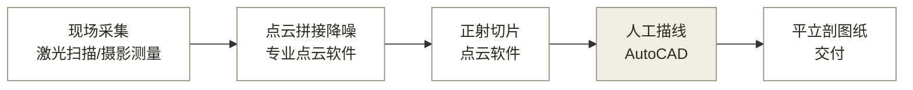

# 04 · MVP 工作流工具调研：照片到 CAD 图纸

## 1. 结论

照片直接到交付级 CAD 图纸没有现成产品，链路要拆成三段看：三维重建段工具成熟且有免费选项；正射影像到矢量线划段是半自动，行业现状靠人在 CAD 里描线；古建部件语义段完全空白。中间和末端的空白正是产品要做的事，也是概念验证（PoC）要确认的技术风险。建议 PoC 走两条路线并行：先用大模型加脚本验证语义识别和规范出图（成本只有 token），再用免费摄影测量工具验证几何精度路线。

## 2. 行业现状链路

古建/历史建筑数字化测绘的标准作业流程如图 1 所示（华创同行、华测导航方案及地方技术规范均同）。

**图 1：行业现状作业链路**
（灰底节点为人工描线环节，即行业痛点所在）

行业痛点在第 4 步：正射影像出来后，矢量线划图靠测绘员在 AutoCAD 里对着影像手工绘制。复杂装饰构件（斗拱、脊饰、砖雕）绘制是古建测绘中最耗时、难度最大的环节（行业文章及技术博客公开佐证）。定量人天占比待数据。

## 3. 分段工具盘点

### 3.1 三维重建段（照片 → 点云/正射影像）：成熟

**表 1：三维重建段工具盘点**

| 工具 | 类型 | 成本 | 说明 |
|------|------|------|------|
| Agisoft Metashape | 商业摄影测量 | 有试用版 | 近景摄影测量事实标准，照片直接重建 |
| RealityScan（原 RealityCapture） | 商业摄影测量 | 个人条件性免费（待核实） | Epic 旗下，重建质量高 |
| 大疆智图 / 重建大师（大势智慧） | 国产商业 | 授权制 | 国内测绘公司常用，倾斜摄影为主 |
| Meshroom / COLMAP | 开源 | 免费 | PoC 零成本选项，质量够验证用 |

结论：这段不自研，PoC 用免费工具，产品化后做集成。

### 3.2 出图段（点云/正射 → 矢量图纸）：半自动，人工为主

**表 2：出图段工具与差距**

| 工具 | 能做到 | 差距 |
|------|--------|------|
| PointCab Origins | 点云自动生成平立剖正射影像，部分矢量线，导出 DWG/DXF | 输出是几何线，无构件语义，复杂立面仍需人描 |
| Undet for AutoCAD | CAD 内点云切片、辅助拟合实体 | 辅助工具，本质还是人在画 |
| ArcScan / Scan2CAD / Raster Design | 栅格图像自动矢量化 | 面向扫描图纸，对照片正射的复杂纹理效果差 |
| 灵犀、建筑学长等 AI 线稿工具 | 照片一键生成 CAD 风格线稿 | 渲染级产物：像图纸但尺寸不可信、无图层无规范，不可交付 |
| Trae/Cursor 等 AI 编程生成 CAD | 自然语言驱动脚本画图（DXF） | 证明了脚本出图路线可行，但无人做古建识别的前端 |

结论：全自动照片到交付级矢量图在商业上是空白，学术界（线稿矢量化、立面解析）仍在研究阶段。MVP 不承诺全自动，走人机协同（AI 初稿 + 人工校正）。

### 3.3 古建语义段（部件拆解与标注）：空白，产品核心

没有任何现成工具输出"斗拱、檐柱、雀替"级别的部件识别与命名。可行路径是多模态大模型（Claude、Qwen-VL 级别）做部件识别与术语标注，输出结构化数据（部件名、位置、尺寸），再用脚本库（如 Python 的 ezdxf）按制图规范生成带图层、标注的 DXF。此路径是纯假设，PoC 路线 1 即验证它。

## 4. 规范锚点

北京市地方标准《历史建筑数字化技术规范》（规自委 2024.12 挂网）明确了点云拼接、降噪、正射切片、矢量化绘制四步流程和成果要求，测绘图纸宜用 CAD 数字线划图。条款摘录与 PoC 差距对照见 06 文档。

## 5. PoC 方案建议

**路线 1（先做，纯 AI，成本为 token）**：验证产品核心假设 H：大模型能从古建照片识别部件并输出可用于制图的结构化数据。

1. 选一处有公开测绘图纸的古建（营造学社图集或高校测绘成果），作为对照组
2. 立面照片 + 人工量注的关键尺寸 → 大模型识别部件、推算几何 → 输出结构化 JSON
3. ezdxf 脚本按规范生成 DXF 立面图（分图层、带标注）
4. 与公开测绘图对照，评估部件识别率与尺寸误差

**路线 2（第二步，几何精度路线）**：环绕拍摄或用公开照片集 → Meshroom/COLMAP 重建 → 正射影像 → 作为路线 1 的输入底图，验证摄影测量精度能否支撑交付。

判别标准：路线 1 部件识别率与尺寸误差达到人工校正可接受水平（初设识别 ≥ 80%、人工修正 ≤ 重画 50%）即继续产品化；两条路线都不通则考虑重心移向归档段。

## 6. 对现有文档的影响

- 照片无绝对尺度，必须配尺寸数据才能出可交付图纸
- 渲染类 AI 工具与产品的差异化：前者输出像图纸的图片，后者输出符合测绘规范、带部件语义和标注的交付物
