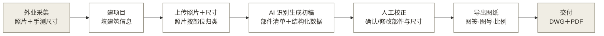

# 07 · PRD：MVP 图纸闭环 v1

## 1. 产品概述

### 1.1 一句话描述

帮古建测绘和文保勘察人员把现场照片与实测尺寸自动生成符合测绘规范的 CAD 立面图。

### 1.2 产品目标

**表 1：产品目标与衡量指标**

| 目标 | 衡量指标 | 目标值 | 时限 |
|------|----------|--------|------|
| 出图提效（业务） | 同一立面产品出图对照人工描线的人天 | 下降 ≥50% | M3 对照交付 |
| 成果可用（用户） | AI 初稿的人工修正工作量对照重画 | ≤50% | M3 对照交付 |
| 交付合规（业务） | 图纸按 06 表 1 条款逐项核验 | 全项通过 | M3 |

### 1.3 核心假设

引用 03 表 2：H1（大模型部件识别可用，PoC 已验证路径，精度待盲测）、H2（乙方愿付费）。

### 1.4 不做清单

**表 2：本期不做清单**

| 不做 | 理由 | 计划阶段 |
|------|------|----------|
| 三维模型输出 | 图纸加标注可再生模型，模型只是体验提升 | 1.0 后按反馈 |
| 平面图、剖面图、详图 | 一期只验证立面一种图纸类型，做通再横向扩 | 1.0 |
| 多模态输入（点云/视频直读） | 每种模态是独立功能 | 1.0 |
| 归档、检索、知识图谱 | 实现顺序在闭环之后（02 §5.6） | 1.0 |
| 多用户与权限 | 第一批用户是单个项目组 | 有付费客户后 |
| 在线协同编辑 | 校正在导出的 DXF 里做即可满足 | 不做，除非用户反馈推翻 |

## 2. 用户分析

### 2.1 目标用户

**表 3：目标用户与核心任务**

| 角色 | 一句话描述 | 使用频率 | 核心任务 | 优先级 |
|------|------------|:--------:|----------|:------:|
| 乙方项目负责人 | 测绘/文保勘察项目组长，对交付质量负责 | 每项目 | 建项目、审 AI 初稿、定稿交付 | P0 |
| 乙方绘图员 | 外业回来负责整理出图的人 | 每项目高频 | 上传资料、校正识别结果、导出图纸 | P0 |
| 区县文物科员 | 交付物的接收与迎检使用者 | 每年检/督查 | 查验图纸合规性（本期只作为交付对象，不直接用产品） | P1 |

用户分层、使用动作与场景的详版见 01 用户与场景分析，冲突时以 01 为准。

### 2.2 用户旅程（核心流程）

**图 1：从外业到交付的核心流程**
（灰底节点为产品外动作，白底节点为产品内动作）

人工校正是核心信任建立点。修正体验差则弃用；修正量随使用下降是留存的核心信号。

## 3. 需求清单与优先级

### 3.1 需求总览

**表 4：需求总览**

| 编号 | 需求名称 | 所属模块 | 优先级 | 依赖 | 对应假设 |
|:----:|----------|----------|:------:|------|:--------:|
| R001 | 项目与建筑单元管理 | 项目 | P0 | — | — |
| R002 | 照片与尺寸数据导入 | 输入 | P0 | R001 | H1 |
| R003 | AI 部件识别与结构化 | 识别 | P0 | R002 | H1 |
| R004 | 识别结果人工校正 | 校正 | P0 | R003 | H2 |
| R005 | 规范立面图生成 | 出图 | P0 | R004 | H1/H2 |
| R006 | 合规导出与命名 | 交付 | P0 | R005 | H2 |
| R007 | 数据多源一致性提示 | 识别 | P1 | R003 | — |
| R008 | 出图比例与图幅选择 | 出图 | P1 | R005 | — |

R007 来自 PoC 核验：AI 提取数据出现过与已核验值矛盾的假数据，产品需包含一致性检查。

## 4. 功能详细说明

### 4.1 项目与建筑单元管理（R001）

- **用户故事**：作为项目负责人，我想按项目和建筑单元组织资料，以便多栋建筑互不混淆
- **前置条件**：无
- **主流程**：新建项目（项目名、委托方、文保编号）→ 新建建筑单元（名称、地址、年代、结构类型）→ 进入该单元的工作区
- **数据要求**：文保编号为可选字段（未定级建筑没有），缺省时用项目内编号替代
- **验收标准**：
  - [ ] 一个项目可含多个建筑单元，资料严格隔离
  - [ ] 建筑单元字段满足图签所需信息（06 表 1 条款 5.4.9）

### 4.2 照片与尺寸数据导入（R002）

- **用户故事**：作为绘图员，我想把外业照片和手测尺寸传进系统，以便 AI 有识别依据
- **前置条件**：建筑单元已创建
- **主流程**：上传照片（单立面 1 到 20 张）→ 按拍摄部位打标（全景/檐部/门窗/细部）→ 录入实测尺寸表（开间、柱高、进深等，字段带单位）
- **分支流程**：
  - 照片分辨率低于识别下限 → 提示重拍，不阻断
  - 无实测尺寸 → 允许继续，出图标注全部标（估）并导出时警告
  - 校正开始后追加照片 → 允许，走增量识别（R003），不重置已有工作
- **数据要求**：照片 JPG/PNG；尺寸表结构化录入（部位、数值、单位、测量方式）；来源溯源字段必填（谁测的、何时测的）
- **验收标准**：
  - [ ] 尺寸无单位无法提交
  - [ ] 每条尺寸带来源，符合书写规范的溯源要求

### 4.3 AI 部件识别与结构化（R003）

- **用户故事**：作为绘图员，我想让 AI 从照片识别出构件清单和几何关系，以便不用从零画起
- **前置条件**：至少 1 张全景照片
- **主流程**：AI 识别立面部件（参照 05 的 14 类清单：柱、阑额、铺作、椽飞、屋面、脊饰、门窗、墙体、台基等）→ 输出结构化数据（部件名、术语、位置关系、尺寸引用、置信度）→ 与实测尺寸表绑定
- **分支流程**：
  - 部件置信度低于阈值 → 标记为待确认，进入 R004 队列头部
  - 照片间识别结果冲突 → 全部保留并标冲突，交人工裁决（R007）
  - 识别结果为空或严重不全 → 不阻断，进入 R004 由人工从零新增
  - 追加照片的增量识别 → 只识别新增内容并入清单标待确认；已人工确认的部件不被覆盖，AI 有矛盾证据时标差异提示交人工裁决
- **数据要求**：输出为结构化 JSON（格式沿用 `验证材料/02_PoC工作流验证/` 中的部件识别 JSON）；术语用标准名；字段对齐 02 MRD §4.0 数据模型，预留来源溯源与生成版本字段；人工新增部件的溯源字段为录入人
- **验收标准**：
  - [ ] 每个部件带置信度和识别依据（哪张照片）
  - [ ] 无实测值的几何量一律标（估），不得输出无来源的绝对尺寸

### 4.4 识别结果人工校正（R004）

- **用户故事**：作为绘图员，我想快速确认或修改 AI 的识别结果，以便对交付内容负责
- **前置条件**：R003 已产出初稿
- **主流程**：按部件清单逐项过（确认/改名/改尺寸/删除/新增）→ 待确认项优先展示 → 全部处理后标记"校正完成"
- **状态机**：草稿 → 校正中 → 校正完成 → 已出图 → 重开校正（回到校正中）
- **分支流程**：修改实测尺寸 → 触发关联部件几何联动更新，要求填修改原因
- **界面要求**：清单与照片联动（点部件高亮照片对应区域）；不做图形化编辑器，几何微调留到 CAD 里做
- **数据要求**：校正记录全留痕（谁、何时、改了什么），这是档案溯源属性的雏形
- **验收标准**：
  - [ ] 未校正完成不能进入出图
  - [ ] 校正耗时可统计（表 6 指标的数据来源）

### 4.5 规范立面图生成（R005）

- **用户故事**：作为绘图员，我想一键生成符合规范的立面线划图，以便直接交付或少量修整后交付
- **前置条件**：校正完成
- **主流程**：选比例（1:50/1:100/1:150/1:200，默认 1:50）→ 生成 DXF：分层线划 + 轴线 + 开间与竖向尺寸标注 + 地坪/檐口/屋脊标高符号 + 部件标签 + 图号 + 图签 + A3 布局
- **分支流程**：估算尺寸存在 → 图面标（估）并在图签说明栏声明
- **数据要求**：图层与线型对照制图国标（06 §4 待办 2 完成后固化，该对照是本条的前置依赖）；图签字段取自 R001；版本号写入图签（06 表 1 条款 5.4.9 含版本号字段），与 R004 状态机联动
- **验收标准**：
  - [ ] 06 表 1 中 5.4.4（图号）、5.4.6（比例）、表 5.4.7 立面行（轮廓/构件/标高标注）、5.4.9（图签）逐项通过
  - [ ] DXF 在 AutoCAD 打开无报错（ezdxf 审计 0 错误为下限）

### 4.6 合规导出与命名（R006）

- **用户故事**：作为项目负责人，我想导出的文件名和格式直接符合归档要求，以便交付不返工
- **前置条件**：图纸已生成
- **主流程**：导出 DWG + PDF，命名"编号_名称_图纸内容"（06 表 1 条款表 7.2.3）；同时导出部件结构化 JSON
- **版本存档**：交付文件名按规范不变；产品内部按版本存档历史导出；导出遇同名历史版本时禁止静默覆盖
- **验收标准**：
  - [ ] 命名规则自动生成，人工不可改错（只可换编号来源）
  - [ ] JSON 与图纸内容一致（同一数据源出）
  - [ ] 重新导出不覆盖历史版本，版本号与图签一致

## 5. 非功能性需求

**表 5：非功能性需求**

| 类别 | 要求 | 衡量方式 |
|------|------|----------|
| 识别精度 | 部件识别初稿覆盖率 ≥80%（盲测口径，待真实项目标定） | M3 对照交付统计 |
| 输入精度 | 使用正射影像输入时像素 ≤5 mm×5 mm（06 表 1 条款 5.4.3） | 影像元数据校验 |
| 数据合规 | 涉密坐标数据不出本地环境；支持私有化部署（02 表 12 涉密风险） | 部署审计 |
| 兼容性 | DXF R2018，AutoCAD 与主流国产 CAD 可打开 | 双软件开图测试 |
| 溯源 | 所有尺寸与修改可追溯到人和时间 | 抽查校正记录 |

## 6. 数据埋点与指标

**表 6：核心指标**

| 指标名称 | 定义 | 口径 | 目标值 |
|----------|------|------|--------|
| 修正率 | 人工校正改动的部件数 / AI 初稿部件总数 | 每立面 | 首次 ≤50%，第三个项目起 ≤20% |
| 出图人天 | 从上传到导出的总耗时 | 每立面 | 对照人工描线降 ≥50% |
| 一次交付通过率 | 未被委托方/验收方退回的图纸占比 | 每项目 | ≥80% |

## 7. 附录

### 7.1 术语表

| 术语 | 含义 |
|------|------|
| 数字线划图 | 用 CAD 矢量线绘制的测绘图，区别于影像图 |
| 铺作 | 斗拱的宋式称谓，柱头承托屋檐的木构组合 |
| 阑额 | 柱头之间的水平联系构件 |
| 正射影像 | 经几何纠正、无透视变形的影像，可直接量尺寸 |
| 图签 | 图纸角落的信息栏，含单位、人员、图号等责任信息 |
