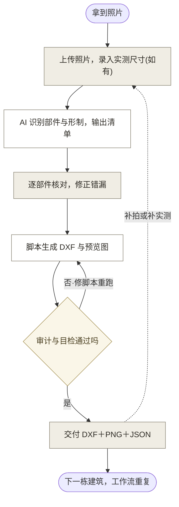

# 09 · MVP 工作流说明与多样本验证报告

## 目录

- 第一部分　工作流说明
  - 一、工作流概要
  - 二、环节全景与结构
  - 三、环节职责
  - 四、与产品需求的映射
- 第二部分　核心使用流程图
  - 五、流程图
  - 六、步骤说明
  - 七、边界情况
- 第三部分　多样本验证记录
  - 八、样本选择
  - 九、样本卡
  - 十、交叉验证汇总
  - 十一、bug 与断点记录
  - 十二、结论

---

# 第一部分　工作流说明

## 一、工作流概要

用户场景：测绘或文保勘察人员手里有古建照片（外业拍摄或档案照片），需要一张符合测绘规范的 CAD 立面图。传统做法是在 CAD 里对照片或正射影像手工描线，复杂装饰构件最耗时（04 §2）。

本工作流用现有工具把这件事串成五个环节：照片进，识别部件出结构化数据，人工核对，脚本按规范出图，核验交付。目的不是产品，是验证这条路径能不能通、换建筑是否复现（辅导6 第 4 条：先不做产品化，用现有工具把工作流跑通）。

当前状态：南禅寺大殿单例已跑通（`验证材料/02_PoC工作流验证/05_PoC路线1验证报告.md`）。本报告用两处盲测样本重跑同一条链，验证复现性并记录断点。

## 二、环节全景与结构

工作流五个环节与数据流向如图 1 所示。照片是唯一原始输入；结构化 JSON 是中枢，识别结果、修正结果、出图参数全在里面；DXF 和 PNG 是输出。每个环节的产出都存档在 `验证材料/02_PoC工作流验证/`，可回溯。

**图 1：工作流五环节与数据流**
（矩形为处理环节，平行四边形为数据产物，虚线为返工回边）

## 三、环节职责

### 环节1 输入（照片与尺寸）

- 要解决：识别需要合格的原始素材，交付图需要实测尺寸
- 输入：立面照片 1 到 3 张（全景为主，斜视与细部辅助）；实测尺寸表（可缺省）
- 处理：核对照片来源与版权许可；有实测尺寸则录入，无实测则声明盲测条件，全部尺寸转为照片比例估算
- 输出：素材文件加来源记录（写入识别 JSON 的识别输入节）
- 工具：Wikimedia Commons（本轮素材来源，CC BY-SA 4.0）、PowerShell 下载
- 现实依据：`验证材料/02_PoC工作流验证/05_PoC路线1验证报告.md` 结论，照片只给形制不给绝对尺寸；无实测尺寸时全图标（估）是规范允许的现状记录方式（06 表 2）

### 环节2 识别（部件与形制）

- 要解决：从照片提取部件清单、术语命名、位置关系和比例尺寸，替代人从零判读
- 输入：环节1 的照片
- 处理：多模态大模型识别立面部件（类别、营造法式或清式术语、数量、位置），判断形制（开间、屋顶、铺作类型），无实测时按参照物假设推算尺寸；每项标注置信度和识别依据
- 输出：结构化 JSON（字段结构沿用南禅寺样本：对象、识别输入、核心尺寸、部件清单、简化说明）
- 工具：Claude（多模态大模型，对话内完成）
- 现实依据：古建部件语义识别无现成工具，是链路空白段和产品核心（04 §3.3）；识别在分钟级完成

### 环节3 交叉验证（人工核对）

- 要解决：AI 识别结果不能直接采信，PoC 阶段曾出现单源假数据（`验证材料/02_PoC工作流验证/05_PoC路线1验证报告.md` §3 教训）
- 输入：环节2 的 JSON
- 处理：逐部件与建筑学人工判读核对，分对、错、漏三类记录；形制判断（开间数、屋顶类型）单独标注置信度；错漏当场修正后才进出图
- 输出：交叉验证表（本报告第十节），修正后的 JSON
- 工具：人工（建筑学背景判读，Jiajia 复核）
- 现实依据：对应 07 PRD R004 人工校正，是信任建立点；盲测条件下人工判读即基准（08 §2）

### 环节4 出图（规范 DXF 生成）

- 要解决：把结构化数据变成符合规范的分图层线划图
- 输入：修正后的 JSON
- 处理：Python 脚本读 JSON，按规范生成 DXF：10 个部件图层、轴线、开间与竖向尺寸标注（估算值全部带（估）后缀）、标高符号、部件标签、图号图签、A3 布局视口、合规命名（无文保编号时按 07 PRD R001 用项目内编号）
- 输出：DXF 加 PNG 预览两张（模型空间加 A3 布局）
- 工具：ezdxf（Python 库，uv 运行）
- 现实依据：规范 5.4.2 认可依据影像绘制数字线划图（06 表 1）；脚本画法逻辑当前按建筑定制，复用性是本轮验证的测量点

### 环节5 核验（审计与目检）

- 要解决：图纸交付前的质量确认
- 输入：环节4 的 DXF 与 PNG
- 处理：ezdxf 审计（errors 必须为 0）；PNG 渲染逐要素目检（构件位置、标注数值、文字压线、视口裁切）；发现问题回环节4 修脚本重跑
- 输出：核验记录（本报告第十一节 bug 表）
- 工具：ezdxf audit 加人工目检
- 现实依据：南禅寺样本目检三轮修掉标注放大、视口裁字等 bug（`验证材料/02_PoC工作流验证/05_PoC路线1验证报告.md` §4），目检是必要环节不是可选项

## 四、与产品需求的映射

工作流五环节与 07 PRD 六项 P0 需求的对应关系如表 1 所示，验证工作流即预演产品流程。

**表 1：工作流环节与 PRD 需求映射**

| 工作流环节 | 对应 PRD 需求 | 当前工具形态 | 产品化后形态 |
|------------|---------------|--------------|--------------|
| 环节1 输入 | R001 项目管理、R002 照片与尺寸导入 | 手工建目录、JSON 里记来源 | 界面化项目与上传 |
| 环节2 识别 | R003 AI 部件识别与结构化 | 对话内识别 | 识别服务加置信度队列 |
| 环节3 交叉验证 | R004 人工校正、R007 一致性提示 | 人工核对表 | 清单与照片联动校正界面 |
| 环节4 出图 | R005 规范立面图生成 | 定制脚本 | 参数化出图引擎（本轮验证其可行性） |
| 环节5 核验 | R006 合规导出 | 审计加目检 | 自动核验加导出 |

---

# 第二部分　核心使用流程图

## 五、流程图

从拿到照片到交付图纸的完整使用路径如图 2 所示，逐步骤说明见第六节。

**图 2：核心使用流程（用户视角）**
（灰底节点为用户动作，白底节点为 AI 自动处理，菱形为判断；虚线为跨轮次回边）

## 六、步骤说明

图 2 的六个步骤逐项展开如表 2 所示。

**表 2：步骤说明**

| 步骤 | 阶段 | 用户做什么 | AI 做什么 | 对应环节 |
|:---:|------|------------|-----------|:--------:|
| 1 | 准备 | 提供照片，说明建筑名称与位置；有实测尺寸一并给 | 核对照片可用性（分辨率、视角、遮挡）与版权 | 环节1 |
| 2 | 识别 | 等待 | 识别部件、判断形制、推算尺寸，输出 JSON，逐项标置信度与依据 | 环节2 |
| 3 | 核对 | 逐部件确认识别对不对，指出错漏 | 按用户修正更新 JSON | 环节3 |
| 4 | 出图 | 等待 | 脚本读 JSON 生成 DXF，审计，渲染预览 | 环节4 |
| 5 | 目检 | 看预览图，指出图面问题 | 修脚本重跑直到通过 | 环节5 |
| 6 | 交付 | 拿到 DXF、PNG、JSON | 存档，记录本次耗时与 bug | 环节5 |

## 七、边界情况

六类边界情况与处理方式如表 3 所示。

**表 3：边界情况与处理**

| 边界 | 出现场景 | 处理 |
|------|----------|------|
| 无实测尺寸 | 盲测、初勘、只有档案照片 | 不阻断：设参照物基准假设，全图尺寸标（估），图签声明。本轮两个样本即此条件 |
| 照片有遮挡 | 树木、电线、堆放物挡住立面局部 | 被挡部件标低置信度进核对队列；完全不可见的不虚构 |
| 形制判断不确定 | 开间数被墙包柱掩盖、屋顶类型被树遮挡 | 给出倾向判断加置信度，列待复核项，不写死 |
| 识别结果为空 | 照片质量过低或非古建 | 终止并说明原因，不强行出图 |
| 脚本画法不支持该形制 | 新样本的构件类型脚本没有对应画法 | 断点记录（本轮核心观察项），新写画法段 |
| 审计或目检不过 | 标注错位、文字压线、视口裁切 | 回环节4 修正重跑，记入 bug 表 |

---

# 第三部分　多样本验证记录

## 八、样本选择

选择标准：低知名度木构古建（省保及以下），无公开测绘图纸发表，与南禅寺形制拉开差异（否则测不出出图脚本的复用性），照片许可明确。

**表 4：样本清单**

| 样本 | 名称 | 位置与级别 | 年代 | 与南禅寺的形制差异 | 照片来源 |
|:---:|------|------------|------|--------------------|----------|
| 基准 | 南禅寺大殿 | 山西五台，国保 | 唐 | （对照组，有文献辅助） | Wikimedia Commons，CC BY-SA 4.0 |
| A | 东呈古佛堂 | 山西长治上党区东呈村，省保 | 元 | 五开间、墙包柱、有普拍枋、有补间铺作、双下昂、雕花脊筒加楼阁式脊刹 | Wikimedia Commons，作者 仙女传奇，CC BY-SA 4.0 |
| B | 高都玉皇庙主殿 | 山西晋城泽州县高都镇，省保（2021 第六批，级别读自照片中保护碑） | 待考 | 敞廊无门窗墙、方形石柱露明带楹联、清式密布斗拱、悬山顶、彩绘额枋 | Wikimedia Commons，作者 Windmemories，CC BY-SA 4.0 |

两个样本均为盲测条件：无文献尺寸辅助，全部尺寸由照片比例推算（样本 A 基准假设为板门净高 2500 mm，样本 B 为石柱净高 3400 mm），一律标（估）。

## 九、样本卡

### 样本 A：东呈古佛堂

**表 5：样本 A 验证记录**

| 项 | 记录 |
|----|------|
| 输入 | 照片 3 张（正立面正投影、东南斜视、室内梁架仰视） |
| 识别 | 18 项部件（16 项入立面图，梁架为年代佐证、石供案不绘），六项形制差异点显式输出；JSON 见 `验证材料/02_PoC工作流验证/部件识别_东呈古佛堂正立面.json` |
| 出图 | `验证材料/02_PoC工作流验证/东呈古佛堂_正立面现状示意图.dxf`，1:100 A3 布局，195 实体 |
| 审计 | errors=0 fixes=0 |
| 目检 | 2 轮：第 1 轮发现前檐砖墙标签压直棂窗轮廓，移至下碱区后通过 |
| 预览 | `验证材料/02_PoC工作流验证/东呈古佛堂_正立面_预览.png`、`验证材料/02_PoC工作流验证/东呈古佛堂_A3布局_预览.png` |
| 脚本 | `验证材料/02_PoC工作流验证/生成立面图_东呈古佛堂.py`，基于南禅寺脚本改写：框架、图层、标注、标高、图签、布局、输出段复用（约六成），立面构成段新写（墙包柱、五开间轴系、补间铺作、双下昂示意、歇山加脊刹吻兽） |

### 样本 B：高都玉皇庙主殿

**表 6：样本 B 验证记录**

| 项 | 记录 |
|----|------|
| 输入 | 照片 3 张（正立面、院内斜视、省保碑） |
| 识别 | 13 项部件（12 项入图，石供案不绘）；与前两样本的五项形制差异点显式输出；JSON 见 `验证材料/02_PoC工作流验证/部件识别_高都玉皇庙正立面.json` |
| 出图 | `验证材料/02_PoC工作流验证/高都玉皇庙主殿_正立面现状示意图.dxf`，1:100 A3 布局，97 实体 |
| 审计 | errors=0 fixes=0 |
| 目检 | 2 轮：第 1 轮发现雀替标签与廊内神龛标签重叠，神龛标签移入龛框内后通过 |
| 预览 | `验证材料/02_PoC工作流验证/高都玉皇庙_正立面_预览.png`、`验证材料/02_PoC工作流验证/高都玉皇庙_A3布局_预览.png` |
| 脚本 | `验证材料/02_PoC工作流验证/生成立面图_高都玉皇庙.py`，复用段同上；立面构成段新写（敞廊方石柱加柱础、雀替、彩绘额枋带、清式斗拱示意带、悬山屋面加宝顶脊刹） |

## 十、交叉验证汇总

识别结果的独立复核人是 Jiajia（建筑学判读）。表 7 为 AI 识别输出与照片证据的对照及待复核清单。

复核结论（2026-07-11）：照片判读层面大致合理，未发现明显错误识别。复核的局限如实声明：复核人无现场实测数据，只能确认识别结果与照片证据自洽，不能作为识别准确率的基准。因此本报告不给出识别率数字；量化验证需要有实测基准的样本（乙方真实项目或现场实拍加手测），出现此类机会时执行。

**表 7：识别结果与待复核项**

| 样本 | 高置信度识别（照片证据直接） | 中置信度待复核（证据受遮挡或分辨率限制） |
|:---:|------------------------------|--------------------------------------------|
| A 东呈 | 台基踏步、大额枋、普拍枋、椽飞、雕花脊筒、楼阁式脊刹、吻兽、板门（石框门簪）、直棂窗 4、前檐砖墙 | 开间数（柱被墙包砌，按窗-窗-门-窗-窗推断五开间）、铺作构成（疑五铺作双下昂计心造，需细部照片）、屋顶（歇山倾向，山面被树遮挡）、补间铺作朵数 |
| B 高都 | 台基踏步、方形石柱（楹联）、雀替、彩绘大额枋、斗拱层存在、椽飞、正脊脊刹吻兽垂脊、敞廊无门窗墙 | 屋顶（悬山倾向，硬山未排除）、斗拱攒数与踩数（分辨率不足，图中以示意带表达不逐攒绘制）、殿座定名（院内多殿，主殿名待查）、脊刹形制细节 |

复核方式：Jiajia 对照 `验证材料/02_PoC工作流验证/盲测素材/` 原照片逐行打勾或修正；修正项回写识别 JSON 并重出图。

**表 8：识别能力的定性观察（两样本共同点）**

| 观察 | 说明 |
|------|------|
| 形制差异被主动识别 | 两样本相对南禅寺的差异点（普拍枋有无、补间有无、墙包柱、敞廊、脊饰类型）均被显式列出，未发生把南禅寺特征套到新样本上的张冠李戴 |
| 不确定项主动降级 | 被遮挡和分辨率不足的判断标中置信度并给出倾向加待复核，未虚构 |
| 尺寸全部可溯源 | 每个估算尺寸绑定基准假设，图面和图签双重声明 |

## 十一、bug 与断点记录

**表 9：全程 bug 与断点记录**

| # | 环节 | 现象 | 破坏闭环？ | 处理 | 对产品化的含义 |
|:-:|------|------|:---:|------|----------------|
| 1 | 输入 | Wikimedia 原图下载 429 限流 | 否 | 间隔重试加缩略图通道 | 产品的照片上传不依赖外部图床，无影响 |
| 2 | 识别 | 形制判断存在不确定项（遮挡、分辨率） | 否 | 置信度分级加待复核清单，不写死 | 印证 07 PRD R003 置信度机制和 R004 待确认队列的必要性 |
| 3 | 出图 | 脚本画法逻辑按建筑定制，换形制必须新写立面构成段（本轮两样本各新写约四成代码） | 否，但费人工 | 复用框架段，新写构成段 | 出图段的产品化核心是参数化画法库（按部件类型配画法），不是每栋写脚本；这是 MVP 产品化的最大工程量所在 |
| 4 | 核验 | 部件标签坐标手写，换建筑后重叠（样本 A 墙标签压窗、样本 B 雀替与神龛标签叠） | 否 | 目检发现，改坐标重跑，各 2 轮通过 | 产品化需自动标签避让；目检环节不可省 |
| 5 | 全程 | 无实测尺寸分支全程走通（两样本均无实测） | 否 | 全图标（估）加图签声明 | 07 PRD R002 无实测分支被完整预演，可行 |

断点结论：五项记录均未破坏闭环，两样本照片进、图纸出全程走通，无死角。

## 十二、结论

1. **路径复现性成立**。同一条五环节工作流在两处非名建筑上完整复现：照片进，识别出结构化 JSON，人工核对，脚本出规范 DXF（审计 0 错误），目检通过。加上南禅寺共三个样本、三种立面构成（唐式露明柱、元式墙包柱、清式敞廊），闭环均走通。
2. **识别环节是稳定段**。换样本不需要改任何识别方法，形制差异被主动捕捉，不确定项被诚实降级。人工照片判读复核为大致合理（表 7 复核结论）；识别率无数字，因为缺少现场实测基准，量化留待有实测条件的样本。
3. **出图环节是定制段**。框架六成可复用，立面构成四成每换形制要新写。这不破坏工作流验证的结论（工具阶段本来就允许人工改脚本），但明确了产品化的核心工程量：把画法从每栋一个脚本变成按部件类型的参数化画法库。
4. **对辅导6 任务的回答**：工作流跑通且可复现，路径成立。可以进入下一步判断（是否开始产品化包装），建议带本报告和三套图纸上辅导7 由老师评审。
