# 11-1 · 候选行业事实与流程调研
## 一、调研结论

行业事实支持三项结论。

1. 原始信息需要经过质量检查、专业处理和结果审核，才能成为行业正式结果。
2. 测量、安全、医疗、档案和工程成果均需要独立验证和明确责任人。
3. 精度、阈值和自动化范围由具体用途、法规、风险和合同决定，各行业需要独立定义。

### 1.1 候选行业纳入依据

候选行业用于补充古建产品的能力判断。市场优先级需要通过古建市场证据另行判断。行业纳入同时满足以下条件：

1. 存在可以还原的端到端业务过程，能够从信息输入追踪到专业结果、审核、交付或保存。
2. 核心结果需要专业判断，文件转换、内容展示和设备操作构成辅助环节。
3. 能为古建产品提供至少一项不同的能力证据，包括空间量测、对象结构化、专业判断、质量责任、长期保存或跨期更新。
4. 存在标准、监管指南、行业组织资料、官方产品资料或原始论文，可以核实流程和适用边界。
5. 与已纳入行业不存在大范围重复；若方法相似，必须具有不同的正式结果或成立条件。

13 个候选行业覆盖五类对照作用：

- 遗产与档案类：遗产数字化、文档智能与档案数字化，用于检查真实性、来源、元数据、保存和授权利用。
- 空间量测与重建类：建筑外观 AI 测量、无人机测绘与实景三维、建筑逆向建模、消费级三维捕获，用于区分尺度、几何、语义和视觉质量。
- 高责任判断类：医疗影像 AI、自动驾驶感知、电力与基建巡检 AI、工业质检 AI、安防视频结构化，用于检查不确定性、人工责任、持续监控和处置记录。
- 时序空间分析类：遥感解译，用于检查跨期比较、变化识别和适用范围。
- 约束生成类：AI 建筑生成出图，用于检查规则约束、专业协同、成果审核和正式交付。

### 1.2 排除依据

以下类型不作为独立候选行业：

1. 采集设备、扫描硬件或通用模型服务供应商。此类供应商提供实现方法，缺少独立业务结果链。
2. 效果图、展示内容或营销素材工具。此类结果不承担测量、档案、工程或安全责任。
3. 通用项目管理、知识库、文件存储和办公协同产品。它们缺少行业对象到专业结果的核心转换。
4. 单纯的 GIS、BIM、数字孪生或档案平台。平台是承载环境，只有存在独立的专业生产和审核过程时才纳入对应行业。
5. 与已纳入行业在对象、专业转换、结果和责任条件上基本相同的细分场景。此类材料纳入已有行业的补充证据。

---

## 二、遗产数字化

### 行业目标

把遗产对象的形态、材质、历史语境和权属信息转化为可验证、可检索、可复用且能长期保存的数字记录，并进一步支持保护设计、监测、研究和公众传播。

### 端到端流程

遗产数字化从对象和任务定义开始，以可信存储、授权利用和持续维护结束（见图 1）。

**图 1：遗产数字化具体流程**

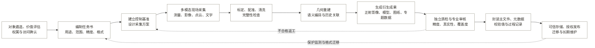

### 能力抽象

遗产数字化需要对象治理、现场记录、空间处理、语义组织、质量控制、长期保存和授权利用能力（见表 1）。

**表 1：遗产数字化能力**

| 能力域 | 抽象能力 | 关键产物或控制点 |
|---|---|---|
| 遗产治理 | 遗产价值判断、采集优先级、权属/敏感性与访问规则管理 | 对象清单、授权记录、风险分级 |
| 项目定义 | 把保护、研究、展示等用途转成范围、精度、分辨率和交付格式 | 技术任务书、验收规则 |
| 现场记录 | 融合手工测量、摄影测量、激光扫描、GNSS、文字和历史影像 | 原始观测、控制点、现场日志 |
| 空间数据处理 | 标定、配准、去噪、坐标统一、网格/纹理和正射产品生成 | 点云、网格、正射影像、误差报告 |
| 语义与知识组织 | 建筑构件、材料、病害、年代、事件与资料之间的关联 | 编目数据、知识关系、唯一标识符 |
| 质量与真实性 | 检查精度、覆盖、可读性、来源链和人工解释是否充分 | 检查点残差、缺失清单、审核签名 |
| 数字保存 | 主文件/衍生文件分离、元数据、校验、版本、格式迁移 | 保存包、校验值、迁移记录 |
| 服务与再利用 | 面向保护设计、监测、研究、教育和展示发布适配成果 | GIS/BIM/网页/展陈接口、授权策略 |

### 关键边界

遗产数字成果只有同时满足可核验性、测量依据和保存要求，才能作为正式成果。

- 点云或网格属于观测与计算产物。正式成果还需包含测绘图纸、历史研究、现场记录和保存元数据。
- 高拟真反映视觉效果。几何精度需要通过控制网、独立检查点和误差报告证明。
- 长期保存要求应在采集方案和格式选择阶段确定，并贯穿项目全过程。

### 主要依据

遗产数字化流程和边界主要依据以下来源。

- [Historic England：Geospatial Survey Specifications for Cultural Heritage（2024）](https://historicengland.org.uk/images-books/publications/geospatial-survey-specifications-cultural-heritage/)
- [Historic England：Photogrammetric Applications for Cultural Heritage](https://historicengland.org.uk/images-books/publications/photogrammetric-applications-for-cultural-heritage/)
- [U.S. National Park Service：Laser Scan Guidance](https://www.nps.gov/subjects/heritagedocumentation/laser-scan-guidance.htm)
- [UNESCO：Charter on the Preservation of Digital Heritage](https://www.unesco.org/en/legal-affairs/charter-preservation-digital-heritage)

---

## 三、建筑外观 AI 测量

### 行业目标

从地面影像、无人机影像、激光点云或多传感器数据中识别立面构件，恢复尺度和几何关系，输出可追溯的立面尺寸、面积、位置、正射图或简化模型。

### 端到端流程

建筑外观 AI 测量从测量要求和采集设计开始，以结果校核、成果交付和记录留存结束（见图 2）。

**图 2：建筑外观 AI 测量具体流程**

```mermaid
flowchart LR
    F10["定义测量对象<br/>用途、精度与构件分类"] --> F11["布设尺度/控制信息<br/>设计视角与覆盖"]
    F11 --> F12["采集影像、点云<br/>记录设备与环境"]
    F12 --> F13["影像质量检查<br/>相机标定与姿态求解"]
    F13 --> F14["立面语义/实例分割<br/>墙、窗、门、构件"]
    F14 --> F15["摄影测量或点云重建<br/>尺度恢复与坐标统一"]
    F15 --> F16["平面、边界、开口<br/>特征线提取"]
    F16 --> F17["尺寸、面积、间距计算<br/>输出置信度与不确定度"]
    F17 --> F18["检查点验证<br/>人工修订与成果审核"]
    F18 --> F19["输出正射立面、矢量<br/>测量表或 CAD/BIM 数据"]
    F18 -. "误差或漏检超限" .-> F11

    classDef process fill:#FFFFFF,stroke:#8B8676,color:#2D2A24
    class F10,F11,F12,F13,F14,F15,F16,F17,F18,F19 process
```

### 能力抽象

建筑外观 AI 测量需要测量定义、采集设计、几何标定、对象解析、量测计算、人工复核和成果交付能力（见表 2）。

**表 2：建筑外观 AI 测量能力**

| 能力域 | 抽象能力 | 关键产物或控制点 |
|---|---|---|
| 测量定义 | 按工程用途定义构件分类、可见细节、比例尺和容许误差 | 任务书、对象字典、验收样本 |
| 采集设计 | 视场、重叠度、拍摄距离、遮挡、照明和控制点设计 | 拍摄路线、控制/尺度标志 |
| 几何标定 | 相机内外参、畸变、姿态、坐标和尺度恢复 | 标定参数、重投影误差 |
| 立面理解 | 检测/分割墙面、门窗、阳台、檐口、材料区和遮挡物 | 像素掩膜、构件实例、置信度 |
| 几何提取 | 从影像/点云提取平面、轮廓、开口和构件空间关系 | 特征线、构件边界、参数几何 |
| 量测计算 | 距离、面积、间距、窗墙比、偏移和变形计算 | 测量值、单位、误差传播 |
| 人机复核 | 将低置信、遮挡、玻璃反射和不规则构件送人工处理 | 异常队列、修订轨迹 |
| 成果互操作 | 生成带坐标和来源说明的正射、CAD、GIS 或 BIM 数据 | 分层矢量、测量表、报告 |

### 关键边界

绝对量测结论必须具有尺度依据，并明确标记不可测区域。

- 单张普通照片通常支持相对比例判断。绝对尺寸成果需要已知尺度、控制点、可靠深度或经验证的多视图几何。
- 玻璃、强反射、重复纹理、植被遮挡和透视过大都会造成构件漏检或边界偏差，应显式标记不可测区域。
- AI 分割精度和最终尺寸精度是两类指标；后者还受标定、尺度、重建和边界拟合误差影响。

### 主要依据

建筑外观 AI 测量流程和边界主要依据以下来源。

- [RICS：Measured surveys of land, buildings and utilities（第 3 版）](https://www.rics.org/content/dam/ricsglobal/documents/standards/measured_surveys_of_land_buildings_and_utilities_3rd_edition_rics.pdf)
- [Historic England：Geospatial Survey Specifications for Cultural Heritage](https://historicengland.org.uk/images-books/publications/geospatial-survey-specifications-cultural-heritage/)
- [ISPRS Journal：Detailed Three-Dimensional Building Façade Reconstruction：A Review](https://www.mdpi.com/2072-4292/14/11/2579)
- [Sensors：Towards Semantic Photogrammetry](https://pmc.ncbi.nlm.nih.gov/articles/PMC8840648/)

---

## 四、医疗影像 AI

### 行业目标

围绕明确的临床用途，利用医学影像及相关临床数据形成辅助检测、分割、定量、分诊、诊断或预后输出，并在全产品生命周期内证明安全性、有效性、公平性和可持续性能。

### 端到端流程

医疗影像 AI 从临床用途和数据治理开始，以临床集成、运行监测和受控更新结束（见图 3）。

**图 3：医疗影像 AI 具体流程**

```mermaid
flowchart LR
    M20["界定预期用途、用户<br/>人群、场景与风险"] --> M21["数据治理与方案设计<br/>伦理、隐私、代表性"]
    M21 --> M22["DICOM 数据接入<br/>去标识与影像质控"]
    M22 --> M23["标注规范<br/>多专家判读与仲裁"]
    M23 --> M24["预处理、分层与锁定<br/>训练/验证/测试数据"]
    M24 --> M25["模型开发<br/>偏差、鲁棒性与可解释性分析"]
    M25 --> M26["分析/技术验证<br/>输入到输出是否准确可靠"]
    M26 --> M27["临床验证<br/>人机协同与临床获益"]
    M27 --> M28["监管申报、质量体系<br/>网络安全与变更计划"]
    M28 --> M29["PACS/RIS/工作站集成<br/>结果结构化呈现"]
    M29 --> M210["上市后监测<br/>漂移、事件与受控更新"]
    M210 -. "真实世界证据与问题" .-> M21

    classDef process fill:#FFFFFF,stroke:#8B8676,color:#2D2A24
    class M20,M21,M22,M23,M24,M25,M26,M27,M28,M29,M210 process
```

### 能力抽象

医疗影像 AI 需要临床问题定义、数据治理、专业标注、证据验证、监管交付和运行监测能力（见表 3）。

**表 3：医疗影像 AI 能力**

| 能力域 | 抽象能力 | 关键产物或控制点 |
|---|---|---|
| 临床问题定义 | 把临床需求转为预期用途、适应证、用户、输入、输出和风险 | SaMD 定义、临床流程、风险分析 |
| 医疗数据治理 | 同意/伦理、隐私、去标识、站点授权、数据代表性和血缘 | 数据卡、授权记录、队列统计 |
| 影像互操作 | 接入 DICOM，处理序列、设备、协议差异并回写结构化结果 | DICOM 对象、分割、测量报告 |
| 临床标注 | 专家标注规范、盲法、多阅片者一致性和仲裁 | 参考标准、争议记录、标注质量 |
| 模型工程 | 预处理、训练、校准、鲁棒性、亚组偏差和可解释性 | 锁定模型、版本、模型说明 |
| 证据验证 | 区分有效临床关联、分析验证和临床验证 | 指标、置信区间、外部/前瞻研究 |
| 人机交互 | 在临床时点提供可理解的结果、局限和失败提示 | 用户界面、置信度、覆盖范围、操作说明 |
| 受监管交付 | 质量体系、软件验证、网络安全、监管文档和变更控制 | 技术文档、风险控制、PCCP |
| 运行监测 | 站点验收、真实世界性能、漂移、投诉和事件管理 | 监测看板、CAPA、回滚/更新记录 |

### 关键边界

医疗影像 AI 需要分别验证技术性能和临床有效性，并保留专业责任和失败处理机制。

- 测试集性能属于技术证据。临床关联、技术输出和真实使用条件下的临床性能需要分别举证。
- 训练、调参与最终测试应隔离，并按患者、机构、设备、时间和人群亚组分析性能与置信区间。
- 高风险输出应明确由谁复核、何时可忽略 AI、失败时如何降级；界面和人机团队也属于验证对象。

### 主要依据

医疗影像 AI 流程和边界主要依据以下来源。

- [FDA：Good Machine Learning Practice for Medical Device Development](https://www.fda.gov/medical-devices/software-medical-device-samd/good-machine-learning-practice-medical-device-development-guiding-principles)
- [IMDRF：Software as a Medical Device：Clinical Evaluation](https://www.imdrf.org/documents/software-medical-device-samd-clinical-evaluation)
- [FDA：Transparency for Machine Learning-Enabled Medical Devices](https://www.fda.gov/medical-devices/software-medical-device-samd/transparency-machine-learning-enabled-medical-devices-guiding-principles)
- [DICOM：Structured Reporting and Common Data Elements](https://www.dicomstandard.org/activity/wgs/wg-08)

---

## 五、无人机测绘与实景三维

### 行业目标

通过无人机获取具有规定覆盖、分辨率和空间基准的影像/传感器数据，生成正射影像、点云、DSM/DTM、网格或可交互实景表示，并以独立检查证明空间精度和交付质量。

### 端到端流程

无人机测绘与实景三维从测区要求和飞行设计开始，以独立精度检查、成果交付和周期更新结束（见图 4）。

**图 4：无人机测绘与实景三维具体流程**

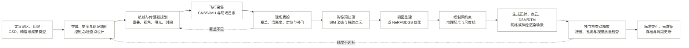

### 能力抽象

无人机测绘与实景三维需要任务规划、飞行采集、空间重建、地理基准、精度验证和成果管理能力（见表 4）。

**表 4：无人机测绘与实景三维能力**

| 能力域 | 抽象能力 | 关键产物或控制点 |
|---|---|---|
| 任务与合规 | 测区、GSD、精度、空域、现场安全和隐私约束管理 | 飞行任务书、许可、风险评估 |
| 航测设计 | 航高、重叠、倾斜视角、速度、光照、RTK/PPK 与地面控制设计 | 航线、控制点/检查点方案 |
| 飞行采集 | 传感器控制、定位姿态同步、覆盖监测、异常和补飞 | 原始影像、GNSS/IMU、飞行日志 |
| 摄影测量 | 特征匹配、束平差、稀疏/稠密重建、正射和高程产品 | 相机姿态、点云、正射、DSM/DTM |
| 神经场景重建 | 基于已求解姿态训练 NeRF 或优化 3D 高斯并实时渲染 | 辐射场/高斯场、相机路径、渲染端 |
| 地理基准 | 控制网约束、坐标转换、尺度和高程基准统一 | 有坐标成果、转换参数 |
| 精度与质量 | 使用独立检查点验证位置精度，检查孔洞、拖影、接缝和漂浮物 | RMSE/分位误差、覆盖图、质量报告 |
| 成果管理 | 瓦片化、压缩、GIS/三维服务、元数据和版本更新 | 标准产品、服务端点、版本清单 |

### 关键边界

测绘精度由控制基准和独立检查证明，视觉质量需要单独评价。

- NeRF 和 3DGS 的核心目标是新视角合成与渲染质量。量测用途需要控制、尺度、独立检查点和误差统计。
- 地面控制点参与解算，检查点独立用于验收，两组点应分别设置。
- 植被、水面、反射、动态人车和重复纹理容易产生不稳定几何或视觉伪影，应在成果中标记限制。

### 主要依据

无人机测绘与实景三维流程和边界主要依据以下来源。

- [ASPRS：Positional Accuracy Standards for Digital Geospatial Data（2024）](https://old.asprs.org/archives/asprs-approves-edition-2-version-2-of-the-asprs-positional-accuracy-standards-for-digital-geospatial-data-2024.html)
- [USGS：UAS-SfM 测量的精度与地面控制研究](https://www.usgs.gov/publications/fine-resolution-repeat-topographic-surveying-dryland-landscapes-using-uas-based)
- [ECCV 2020：NeRF：Representing Scenes as Neural Radiance Fields](https://www.ecva.net/papers/eccv_2020/papers_ECCV/papers/123460392.pdf)
- [ACM TOG / SIGGRAPH 2023：3D Gaussian Splatting](https://doi.org/10.1145/3592433)

---

## 六、建筑逆向建模：点云转 BIM

### 行业目标

把既有建筑的点云/影像观测转换为满足指定用途和信息要求的参数化、语义化 BIM，同时保留模型与实物偏差、数据来源和不可确定部分。

### 端到端流程

建筑逆向建模从信息要求和采集设计开始，以模型检查、专业复核和受控交付结束（见图 5）。

**图 5：建筑逆向建模具体流程**

```mermaid
flowchart LR
    B40["定义 BIM 用途<br/>信息需求、细节与精度"] --> B41["扫描与控制方案<br/>构件分类和编码规则"]
    B41 --> B42["激光/影像采集<br/>现场补充调查"]
    B42 --> B43["点云配准、去噪<br/>裁剪与坐标统一"]
    B43 --> B44["语义/实例分割<br/>构件识别与空间分区"]
    B44 --> B45["基元、轮廓与拓扑拟合<br/>规则化和异常保留"]
    B45 --> B46["生成参数化 BIM 构件<br/>补充属性与关系"]
    B46 --> B47["IFC 映射<br/>坐标、分类与属性标准化"]
    B47 --> B48["点云偏差、覆盖度<br/>拓扑与 IDS 合规检查"]
    B48 --> B49["人工修模与专业复核<br/>问题协调"]
    B49 --> B410["发布模型、报告与源数据<br/>进入 CDE/资产系统"]
    B48 -. "偏差或信息缺失" .-> B44

    classDef process fill:#FFFFFF,stroke:#8B8676,color:#2D2A24
    class B40,B41,B42,B43,B44,B45,B46,B47,B48,B49,B410 process
```

### 能力抽象

建筑逆向建模需要点云处理、构件解析、逆向几何、BIM 语义、质量检查和交付管理能力（见表 5）。

**表 5：建筑逆向建模能力**

| 能力域 | 抽象能力 | 关键产物或控制点 |
|---|---|---|
| 信息需求 | 按运维、改造、保护、算量或协调用途定义所需几何和属性 | 信息需求、构件清单、验收规则 |
| 点云工程 | 多站/多源配准、降采样、去噪、分块、坐标和大数据管理 | 注册点云、残差、覆盖图 |
| 场景理解 | 空间分区、语义/实例分割、墙板柱梁门窗设备识别 | 带标签点云、构件候选 |
| 逆向几何 | 平面/曲面/中心线/轮廓拟合，连接关系和拓扑修复 | 参数、轮廓、拓扑图、偏差面 |
| BIM 语义 | 对象类型、材质、状态、系统和空间关系组织 | 参数化构件、属性集、空间结构 |
| 开放互操作 | IFC 映射、分类字典、坐标交付、IDS 自动检查与 BCF 问题管理 | IFC、IDS 报告、BCF 问题 |
| 模型质量 | 几何偏差、覆盖度、完整性、拓扑、属性和来源可追溯检查 | QA 报告、低置信对象、修订记录 |
| 交付治理 | 模型、源点云、图纸、说明和版本在共同数据环境中受控发布 | 信息容器、状态、版本、审批 |

### 关键边界

逆向模型需要保留与实物的偏差、异常和不确定性。对象建模还需处理边界、关系、参数和属性。

- 点级语义分割输出点的类别判断。形成 BIM 构件还需要对象边界、连接关系、参数和属性。
- 规则化模型会有意简化实物；必须同时说明建模公差，并保留偏差、异常和源点云供复核。
- 历史建筑和异形构件不宜强制套入标准族；必要时应使用非规则几何、分级表达或显式的不确定性标记。

### 主要依据

建筑逆向建模流程和边界主要依据以下来源。

- [ISPRS Archives：Automation of As-Built BIM Creation from Point Cloud：Overview](https://isprs-archives.copernicus.org/articles/XLIII-B2-2022/193/2022/index.html)
- [Infrastructure：Scanning Technologies to Building Information Modelling：A Review](https://www.mdpi.com/2412-3811/7/4/49)
- [buildingSMART：IFC 4.3 Documentation](https://standards.buildingsmart.org/IFC/RELEASE/IFC4_3/HTML/content/scope.htm)
- [buildingSMART：Information Delivery Specification（IDS）](https://www.buildingsmart.org/standards/bsi-standards/information-delivery-specification-ids/)

---

## 七、消费级三维捕获与神经渲染

### 行业目标

让非专业用户利用手机或普通相机完成对象/空间捕获，并把影像转换为可浏览、可分享或可用于电商、AR/VR、文创和内容生产的网格、材质、NeRF 或 3DGS 资产。

### 端到端流程

消费级三维捕获从目标用途和引导采集开始，以目标设备检查、发布和版本管理结束（见图 6）。

**图 6：消费级三维捕获具体流程**

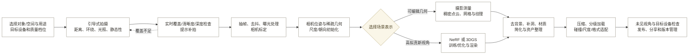

### 能力抽象

消费级三维捕获需要采集引导、数据筛选、空间重建、资产整理、运行优化和目标设备验证能力（见表 6）。

**表 6：消费级三维捕获能力**

| 能力域 | 抽象能力 | 关键产物或控制点 |
|---|---|---|
| 捕获体验 | 把专业摄影测量约束转成普通用户可执行的引导和实时反馈 | 覆盖热图、移动速度/模糊提示、补拍指引 |
| 设备感知 | 融合相机、IMU、AR 位姿和可用深度，识别设备能力 | 帧、姿态、深度、设备配置 |
| 数据筛选 | 抽帧、清晰度/曝光/重复帧评估、动态物体和背景处理 | 可用帧集、质量分数 |
| 位姿与几何 | 相机标定、特征匹配、SfM、尺度和朝向初始化 | 相机轨迹、稀疏点云 |
| 多表示重建 | 按用途生成网格纹理、NeRF 或 3D 高斯场 | 3D 资产、渲染表示 |
| 资产整理 | 去漂浮物、补洞、裁剪、纹理烘焙、坐标/单位和碰撞体 | 可编辑/可运行资产 |
| 运行时优化 | 几何/纹理/高斯压缩、LOD、流式加载和跨设备适配 | glTF/USDZ/运行包、性能预算 |
| 质量评估 | 未参与训练视角的图像质量、几何完整性和目标设备帧率测试 | PSNR、SSIM、LPIPS、孔洞率、帧率和体积 |

### 关键边界

消费级三维成果应按目标使用环境验证。精密量测和专业建模需要独立流程。

- 柔性或移动对象、透明/高反射表面、纹理稀少表面和光照变化会破坏跨帧对应关系。
- NeRF/3DGS 更适合高拟真浏览；需要精确碰撞、尺寸、拓扑编辑或制造时，通常仍需网格化、尺度校验和人工资产整理。
- 自由浏览可靠性需要通过未见视角和目标设备验证，检查加载时间、内存和帧率。

### 主要依据

消费级三维捕获流程和边界主要依据以下来源。

- [Apple Developer：Capturing photographs for RealityKit Object Capture](https://developer.apple.com/documentation/realitykit/capturing-photographs-for-realitykit-object-capture/)
- [Google ARCore：Depth adds realism](https://developers.google.com/ar/develop/depth)
- [Khronos：glTF：Runtime 3D Asset Delivery](https://www.khronos.org/gltf/)
- [NeRF 原始论文](https://www.ecva.net/papers/eccv_2020/papers_ECCV/papers/123460392.pdf)；[3DGS 原始论文](https://doi.org/10.1145/3592433)

---

## 八、自动驾驶感知

### 行业目标

在定义明确的运行设计域（ODD）内，把多传感器观测持续转换为带位置、速度、类别、占用、可行驶空间和不确定性的环境模型，为预测、规划和控制提供安全相关输入。

### 端到端流程

自动驾驶感知从运行范围和安全目标定义开始，以道路验证、运行监测和受控更新结束（见图 7）。

**图 7：自动驾驶感知具体流程**

```mermaid
flowchart LR
    A60["定义 ODD、感知任务<br/>危害与安全目标"] --> A61["传感器选型与布置<br/>标定、同步和诊断设计"]
    A61 --> A62["相机/雷达/激光雷达<br/>GNSS/IMU 数据采集"]
    A62 --> A63["传感器健康监测<br/>时间与空间同步"]
    A63 --> A64["定位与地图上下文<br/>多传感器融合"]
    A64 --> A65["检测、分割、车道<br/>可行驶区与交通要素"]
    A65 --> A66["多目标跟踪<br/>占用与动态状态估计"]
    A66 --> A67["行为/轨迹预测<br/>世界模型与不确定度"]
    A67 --> A68["向规划控制输出<br/>完整性监测与安全降级"]
    A68 --> A69["场景仿真、封闭场地<br/>道路验证与安全论证"]
    A69 --> A610["运行日志、事件分析<br/>数据反馈与受控更新"]
    A610 -. "新场景与性能退化" .-> A60

    classDef process fill:#FFFFFF,stroke:#8B8676,color:#2D2A24
    class A60,A61,A62,A63,A64,A65,A66,A67,A68,A69,A610 process
```

### 能力抽象

自动驾驶感知需要传感器工程、定位融合、场景理解、动态预测、安全监控和运行反馈能力（见表 7）。

**表 7：自动驾驶感知能力**

| 能力域 | 抽象能力 | 关键产物或控制点 |
|---|---|---|
| ODD 与安全 | 场景边界、天气/道路/速度条件、危害分析、安全目标和验收场景 | ODD、危害清单、安全论证 |
| 传感器工程 | 传感器覆盖、冗余、时间同步、内外参标定、在线健康诊断 | 标定参数、诊断状态、退化模式 |
| 定位与融合 | GNSS、IMU、里程计和地图融合，完成不同传感器的时间与空间同步 | 车辆位姿、融合特征、协方差 |
| 场景感知 | 目标检测、语义/实例分割、车道线、信号标志、深度和自由空间 | 目标、地图要素、占用栅格 |
| 动态理解 | 数据关联、多目标跟踪、遮挡管理、速度/姿态与轨迹预测 | 轨迹、生命周期、预测分布 |
| 不确定性与完整性 | 置信度校准、分布外检测、遮挡/恶劣天气退化和故障隔离 | 质量标志、风险边界、降级请求 |
| 实时系统 | 计算图、延迟预算、确定性调度、冗余与车端部署 | 端到端延迟、资源和丢帧指标 |
| 验证与数据反馈 | 场景库、仿真、回放、道路测试、少见场景识别、再标注与变更控制 | 覆盖矩阵、安全指标、版本证据 |

### 关键边界

自动驾驶感知结果必须受运行范围、安全条件和不确定性约束。

- 安全论证需要分别处理功能故障（ISO 26262）和预期功能安全问题（SOTIF），常规准确率属于其中一项证据。
- 感知结果应包含不确定性、传感器健康和适用范围，为规划模块提供有条件的目标信息。
- 更新模型会改变安全证据，数据、软件、标定和场景覆盖必须一起纳入配置与变更管理。

### 主要依据

自动驾驶感知流程和边界主要依据以下来源。

- [ISO 26262：Road vehicles：Functional safety](https://www.iso.org/publication/PUB200262.html)
- [ISO 21448:2022：Safety of the intended functionality（SOTIF）](https://www.iso.org/standard/77490.html)
- [UNECE：UN Regulation No. 157：Automated Lane Keeping Systems](https://unece.org/transport/documents/2021/03/standards/un-regulation-no-157-automated-lane-keeping-systems-alks)
- [Autonomous Driving with Deep Learning：A Survey](https://arxiv.org/abs/2006.06091)

---

## 九、电力与基建巡检 AI

### 行业目标

围绕电网、桥梁、道路、隧道等资产，以风险为导向安排巡检。系统识别并量化缺陷，合格人员确认状态后形成维护决策和复检记录。

### 端到端流程

电力与基建巡检 AI 从资产风险和巡检计划开始，以专业复核、维护处置和复检归档结束（见图 8）。

**图 8：电力与基建巡检 AI 具体流程**

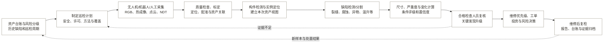

### 能力抽象

电力与基建巡检 AI 需要资产定位、缺陷量化、风险评价、专业复核、维护联动和持续监测能力（见表 8）。

**表 8：电力与基建巡检 AI 能力**

| 能力域 | 抽象能力 | 关键产物或控制点 |
|---|---|---|
| 资产与风险 | 资产分层、构件清单、关键度、历史缺陷和风险驱动周期 | 资产台账、风险等级、巡检计划 |
| 安全作业 | 电气/结构/交通/飞行风险评估、许可和人员资质控制 | 作业许可、方法书、应急方案 |
| 多模态采集 | RGB、热红外、紫外、电场、LiDAR、声学和 NDT 获取 | 原始证据、传感器参数、覆盖记录 |
| 资产定位 | 将图像和缺陷准确关联到线路、塔位、跨距、桥梁和构件 | 资产 ID、构件 ID、空间位置 |
| 缺陷智能 | 构件检测、异常发现、缺陷分类/分割和跨期变化识别 | 缺陷实例、掩膜、置信度 |
| 量化与评级 | 裂缝/腐蚀/净空/温升等量测，结合规则形成条件和严重度 | 尺寸、评级、变化趋势 |
| 专业复核 | 证据浏览、低置信升级、关键发现时限和签署责任 | 复核记录、关键发现通知 |
| 维护联动 | 与 EAM/CMMS、工单、库存、投资计划和复检关联 | 工单、处置优先级、完成状态 |
| 模型运行 | 现场差异、误报漏报、漂移、版本和数据回流管理 | 运行 KPI、再训练集、版本证据 |

### 关键边界

巡检 AI 形成检查证据，资产关联和专业复核决定结果能否进入维护流程。

- AI 检出属于检查证据。合格检查人员仍需完成结构评估、负载评级或电气安全判断。
- 缺陷必须关联到唯一资产和具体构件，并记录位置、尺度、时间和处置状态。
- 自动采集须执行飞行、电气、交通和现场安全许可程序。

### 主要依据

电力与基建巡检 AI 流程和边界主要依据以下来源。

- [FHWA：National Bridge Inspection Standards](https://www.fhwa.dot.gov/bridge/nbis.cfm)
- [FHWA：Recommended Framework for a Bridge Inspection QC/QA Program](https://www.fhwa.dot.gov/BRIDGE/nbis/nbisframework.cfm)
- [National Grid：Autonomous Drone Inspections Across the Network](https://www.nationalgrid.com/powering-future-national-grid-rolls-out-centralised-autonomous-drone-inspections-across-its-network)
- [National Grid：AI Corrosion Inspection of Transmission Pylons](https://www.nationalgrid.com/age-ai-national-grid-trial-futuristic-automated-corrosion-inspection-electricity-transmission)

---

## 十、工业质检 AI

### 行业目标

工业质检依据产品和工艺规范，对零部件或成品进行可追溯的检测、测量和放行判断。不合格处置、统计过程控制、根因分析和持续改进形成连续过程。

### 端到端流程

工业质检 AI 从质量要求和检测方案开始，以合格判定、不合格处置和过程改进结束（见图 9）。

**图 9：工业质检 AI 具体流程**

```mermaid
flowchart LR
    Q80["定义 CTQ、缺陷字典<br/>公差与质量风险"] --> Q81["设计检验方案<br/>抽样、量具与 MSA"]
    Q81 --> Q82["布置相机/传感器<br/>光学、触发、工位和标定"]
    Q82 --> Q83["在线采集<br/>绑定产品、批次与工艺参数"]
    Q83 --> Q84["图像/信号预处理<br/>质量门控与标准化"]
    Q84 --> Q85["检测、分割、分类<br/>异常发现与尺寸测量"]
    Q85 --> Q86["与规格/公差比较<br/>合格、隔离或复检决策"]
    Q86 --> Q87["自动分拣/返工<br/>人工升级与不合格控制"]
    Q87 --> Q88["SPC、根因分析<br/>纠正预防措施 CAPA"]
    Q88 --> Q89["反馈工艺参数<br/>模型与控制计划更新"]
    Q89 -. "持续改进" .-> Q80

    classDef process fill:#FFFFFF,stroke:#8B8676,color:#2D2A24
    class Q80,Q81,Q82,Q83,Q84,Q85,Q86,Q87,Q88,Q89 process
```

### 能力抽象

工业质检 AI 需要质量规则、测量系统、自动检测、符合性判定、结果追溯和过程改进能力（见表 9）。

**表 9：工业质检 AI 能力**

| 能力域 | 抽象能力 | 关键产物或控制点 |
|---|---|---|
| 质量知识 | 把图纸、规范、CTQ、缺陷等级、FMEA 和控制计划结构化 | 缺陷字典、公差、控制规则 |
| 测量系统 | 传感器/量具选择、标定、重复性再现性和测量不确定度 | MSA、校准记录、黄金样件 |
| 工位集成 | 光源、镜头、触发、节拍、机器人/PLC 与防错设计 | 稳定成像、时序和接口 |
| 视觉/信号 AI | 分类、检测、分割、OCR、尺寸测量和少样本异常检测 | 缺陷位置、类别、尺寸、分数 |
| 质量决策 | 阈值、限制规则、抽检或全检、复检和故障安全逻辑 | 合格或不合格、隔离、人工队列 |
| 自动执行 | 分拣、停线、返工路由和不合格品状态控制 | PLC/MES 指令、处置记录 |
| 追溯与统计 | 绑定序列号/批次/工艺，开展 SPC 和趋势预警 | 追溯链、控制图、质量看板 |
| 根因与改进 | 关联设备、材料、班次和工艺参数，推动 CAPA | 根因证据、纠正措施、验证结果 |
| 模型治理 | 新产品换型、概念漂移、稀有缺陷、版本和回滚管理 | 版本批准、漂移告警、回滚方案 |

### 关键边界

工业质量判断必须来自可追溯的测量系统、明确标准和经过验证的判定规则。

- 视觉分类输出类别判断。尺寸放行还需要可追溯的标定、测量系统分析和不确定度控制。
- 未知缺陷需要通过异常检测、人工升级和安全侧默认策略处理。
- 阈值需按漏检成本、误杀成本和过程能力设定，并在换线、换料、换光源或换设备后重新验证。

### 主要依据

工业质检 AI 流程和边界主要依据以下来源。

- [ISO：ISO 9001 explained](https://www.iso.org/home/insights-news/resources/iso-9001-explained.html)
- [NIST：Augmented Intelligence for Manufacturing Systems](https://www.nist.gov/programs-projects/augmented-intelligence-manufacturing-systems-aims)
- [AIAG：Quality Core Tools：APQP、Control Plan、PPAP、FMEA、MSA、SPC](https://www.aiag.org/expertise-areas/quality/quality-core-tools)
- [NIST：2026 Roadmap on AI/ML for Smart Manufacturing](https://www.nist.gov/publications/2026-roadmap-artificial-intelligence-and-machine-learning-smart-manufacturing)

---

## 十一、遥感解译

### 行业目标

把卫星、航空或其他对地观测数据转换为具有明确分类体系、空间时间范围、精度和不确定性的地物分类、目标、变化、参数估计、地图或统计产品。

### 端到端流程

遥感解译从问题定义和数据选择开始，以独立精度评价、成果发布和周期监测结束（见图 10）。

**图 10：遥感解译具体流程**

```mermaid
flowchart LR
    R90["定义问题、AOI、时间窗<br/>分类体系与精度目标"] --> R91["检索数据源<br/>传感器、许可、云量与时相"]
    R91 --> R92["数据接入与目录化<br/>元数据、质量波段和血缘"]
    R92 --> R93["辐射/大气/几何/地形校正<br/>云影与无效像元掩膜"]
    R93 --> R94["配准、镶嵌、融合<br/>时间序列与尺度统一"]
    R94 --> R95["样本设计、标注<br/>训练/验证/独立测试"]
    R95 --> R96["特征构建与模型推理<br/>分类、分割、检测、反演"]
    R96 --> R97["变化检测、参数统计<br/>空间后处理"]
    R97 --> R98["独立精度评定<br/>误差矩阵与不确定性"]
    R98 --> R99["地图、统计与服务发布<br/>元数据和适用范围"]
    R99 --> R910["周期监测<br/>新时相与模型更新"]
    R98 -. "精度或代表性不足" .-> R95

    classDef process fill:#FFFFFF,stroke:#8B8676,color:#2D2A24
    class R90,R91,R92,R93,R94,R95,R96,R97,R98,R99,R910 process
```

### 能力抽象

遥感解译需要数据发现、分析准备、多源融合、样本治理、空间分析、精度评价和成果发布能力（见表 10）。

**表 10：遥感解译能力**

| 能力域 | 抽象能力 | 关键产物或控制点 |
|---|---|---|
| 问题建模 | AOI、时间尺度、分类体系、最小制图单元和精度目标定义 | 图例、任务书、验收指标 |
| 数据发现 | 多平台/多传感器检索、许可、时相、云量和覆盖筛选 | 场景清单、STAC/目录记录 |
| 分析就绪处理 | 辐射、几何、地形、大气校正和逐像元质量信息管理 | ARD、质量掩膜、处理记录 |
| 多源时空融合 | 配准、镶嵌、重采样及全色、多光谱、SAR、高程和时序融合 | 配准影像组、合成产品 |
| 样本治理 | 概率/分层抽样、标注规范、时空独立划分和样本版本 | 参考样本、抽样权重、数据卡 |
| 遥感 AI | 地物分类、语义分割、目标检测、变化检测和物理参数反演 | 栅格/矢量、概率、变化图 |
| 空间统计 | 邻域、连通域、对象化、面积/密度和时序趋势计算 | 地块/对象、统计表、趋势 |
| 精度与不确定性 | 独立参考数据、混淆矩阵、用户/生产者精度和空间误差分析 | 精度报告、置信区间、限制说明 |
| 发布与监测 | 地图服务、瓦片、API、STAC 元数据、版本和周期更新 | 可查询资产、版本、更新记录 |

### 关键边界

跨期遥感结论依赖可比较的输入、独立样本和明确的适用范围。

- 跨期变化检测依赖可靠的几何共注册、辐射一致性和云影处理；预处理差异可能被误判为地表变化。
- 训练样本与独立精度样本应分别设置。面积或比例报告还需记录抽样设计并处理抽样偏差。
- 可识别的最小对象尺寸由传感器、模型和制图尺度共同决定，成果应说明具体适用范围。

### 主要依据

遥感解译流程和边界主要依据以下来源。

- [CEOS：Analysis Ready Data Governance Framework](https://ceos.org/ard/files/CEOS_ARD_Governance_Framework_18-October-2021.pdf)
- [USGS：Landsat Collection 2](https://www.usgs.gov/landsat-missions/landsat-collection-2)
- [USGS：Landsat Levels of Processing](https://www.usgs.gov/landsat-missions/landsat-levels-processing)
- [OGC：SpatioTemporal Asset Catalog（STAC）](https://www.ogc.org/standards/stac/)

---

## 十二、文档智能与档案数字化

### 行业目标

把纸质或非结构化电子文档转化为保持原始语境、真实性和层级关系的数字记录，同时生成可检索文本、结构化字段、索引和长期保存包，支持业务利用与依法处置。

### 端到端流程

文档智能与档案数字化从档案鉴定和实体准备开始，以长期保存、授权利用和到期处置结束（见图 11）。

**图 11：文档智能与档案数字化具体流程**

```mermaid
flowchart LR
    D100["鉴定、范围与保管期限<br/>权利、敏感性和访问规则"] --> D101["实体整理与保护处理<br/>排序、编号、拆装和准备"]
    D101 --> D102["扫描/拍摄与主文件生成<br/>设备标定和批次记录"]
    D102 --> D103["图像与元数据质检<br/>漏页、顺序、清晰度、色彩"]
    D103 --> D104["OCR/HTR 与版面分析<br/>段落、表格、印章、手写"]
    D104 --> D105["文档分类<br/>字段、实体与关系抽取"]
    D105 --> D106["规范化、去重与关联<br/>人名、日期、案卷和业务对象"]
    D106 --> D107["置信度路由<br/>人工校对与抽样复核"]
    D107 --> D108["著录、索引与权限<br/>保持原有层级和上下文"]
    D108 --> D109["主文件、衍生文件、元数据<br/>校验值与保存事件封装"]
    D109 --> D110["检索利用、移交<br/>保管、迁移与到期处置"]
    D103 -. "不合格重扫" .-> D101
    D107 -. "规则/模型修订" .-> D104

    classDef process fill:#FFFFFF,stroke:#8B8676,color:#2D2A24
    class D100,D101,D102,D103,D104,D105,D106,D107,D108,D109,D110 process
```

### 能力抽象

文档智能与档案数字化需要影像获取、内容结构化、档案关联、质量复核、长期保存和依法利用能力（见表 11）。

**表 11：文档智能与档案数字化能力**

| 能力域 | 抽象能力 | 关键产物或控制点 |
|---|---|---|
| 档案治理 | 鉴定、保管期限、处置、权利、隐私、开放和原有秩序管理 | 档案范围、处置授权、访问规则 |
| 实体准备 | 整理、编号、修复、拆装、页序和批次控制 | 移交清单、页码/条码、操作日志 |
| 影像获取 | 标定后的扫描/摄影、主文件格式、色彩/清晰度和设备控制 | 保存级主文件、技术元数据 |
| 文档感知 | OCR/HTR、版面、阅读顺序、表格、印章、签名和图像区域识别 | 文本层、区域坐标、结构树 |
| 信息抽取 | 文档分类、字段、实体、关系、事件和表格抽取 | JSON/XML/数据库字段、置信度 |
| 规范与关联 | 统一日期、人名、地名、机构、文号和案卷，并关联业务主数据 | 规范值、唯一标识、关联图 |
| 人机质检 | 基于风险和置信度的逐件/抽样复核、双录和争议处理 | 错误率、修订轨迹、签署 |
| 著录检索 | 描述/管理/结构/权限元数据、全文索引和层级浏览 | 目录、索引、检索接口 |
| 长期保存 | 主/衍生分离、校验、版本、格式迁移、PREMIS 保存事件 | 保存包、校验值、事件日志 |
| 利用与处置 | 授权访问、脱敏副本、移交、保管期复审和合法销毁 | 利用记录、移交包、处置证明 |

### 关键边界

档案数字化成果必须保留原始语境，并同时满足质量、元数据和长期管理要求。

- OCR 和结构化字段属于可检索衍生数据，保存级影像、原始文档语境和档案层级需要独立保留。
- 扫描完成后，还需完成质量管理、元数据记录、真实性检查、存储、访问和长期维护。
- 永久档案和临时业务记录的质量、保管和处置要求不同，应在批量处理前完成分类与规则绑定。

### 主要依据

文档智能与档案数字化流程和边界主要依据以下来源。

- [FADGI：Technical Guidelines for Digitizing Cultural Heritage Materials（第 3 版）](https://www.digitizationguidelines.gov/guidelines/digitize-technical.html)
- [U.S. National Archives：Digitization of Federal Records](https://www.archives.gov/records-mgmt/policy/digitization)
- [ISO 15489-1:2016：Records management：Concepts and principles](https://www.iso.org/standard/62542.html)
- [Library of Congress：PREMIS Preservation Metadata](https://www.loc.gov/standards/premis/)

---

## 十三、AI 建筑生成出图

### 行业目标

把业主需求、场地、法规和性能目标转为可计算约束，利用生成式与参数化方法探索方案，经性能评估和专业决策后形成协调的 BIM，并从受控模型生成、校核和签发工程图纸。

### 端到端流程

AI 建筑生成出图从任务和约束定义开始，以专业协调、图纸检查和责任签发结束（见图 12）。

**图 12：AI 建筑生成出图具体流程**

```mermaid
flowchart LR
    G110["项目目标、场地与利益相关者<br/>法规和交付阶段"] --> G111["结构化设计任务书<br/>空间、成本、性能与约束"]
    G111 --> G112["场地/环境/规范数据建模<br/>建立基准方案"]
    G112 --> G113["生成候选布局、体量<br/>立面或构造方案"]
    G113 --> G114["规则检查与性能模拟<br/>结构、能耗、采光、疏散等"]
    G114 --> G115["多目标比较<br/>建筑师/工程师选择和修改"]
    G115 --> G116["参数化深化<br/>编译为语义 BIM"]
    G116 --> G117["多专业协调<br/>碰撞、接口与问题管理"]
    G117 --> G118["从模型生成平立剖、详图<br/>表格与标注"]
    G118 --> G119["图模一致、尺寸、规范<br/>完整性与可建造性校核"]
    G119 --> G1110["专业审批与签发<br/>CDE 版本和交付管理"]
    G114 -. "不满足约束" .-> G113
    G119 -. "问题回改" .-> G116

    classDef process fill:#FFFFFF,stroke:#8B8676,color:#2D2A24
    class G110,G111,G112,G113,G114,G115,G116,G117,G118,G119,G1110 process
```

### 能力抽象

AI 建筑生成出图需要需求结构化、方案生成、性能评价、BIM 深化、专业协调、图纸生成和交付管理能力（见表 12）。

**表 12：AI 建筑生成出图能力**

| 能力域 | 抽象能力 | 关键产物或控制点 |
|---|---|---|
| 需求形式化 | 把自然语言任务书转成空间、邻接、面积、性能、成本和法规约束 | 约束模型、信息需求、优先级 |
| 场地理解 | GIS、地形、气候、交通、日照、周边和法定边界整合 | 场地模型、机会/限制图 |
| 方案生成 | 生成布局、体量、立面、构造或参数组合，保留可追溯参数 | 候选集、种子/提示、参数 |
| 性能计算 | 规则检查与结构、能耗、采光、风环境、疏散、造价等模拟 | 指标、违规项、模拟假设 |
| 多目标决策 | 处理相互冲突的目标，比较方案并记录专业判断 | 方案矩阵、Pareto 集、选择依据 |
| BIM 编译 | 把选定方案转换为有对象、属性、关系和坐标的参数化 BIM | 原生模型/IFC、对象映射 |
| 协调管理 | 多专业模型聚合、碰撞、接口、BCF 问题和变更影响追踪 | 协调模型、问题单、关闭记录 |
| 自动出图 | 视图、图框、尺寸、标注、索引、表格和详图规则自动化 | 图纸集、明细表、引用关系 |
| 图纸质检 | 图模一致性、尺寸链、标注、规范、完整性和可建造性检查 | 检查报告、例外、签署 |
| 信息交付 | CDE 状态、版本、审批、IFC/IDS 检查和阶段性发布 | 信息容器、审批和交付记录 |

### 关键边界

自动生成输出候选成果，专业协调、规则检查和责任签发决定成果是否成立。

- AI 生成的效果图、平面草图或 CAD 线条属于候选成果。BIM 或工程图纸还需满足协调、计算和施工要求。
- 自动规则检查覆盖已结构化且可计算的条款。法规解释、例外条件和专业责任由有资质人员确认。
- 方案评价应保存输入约束、模拟假设和选择依据，避免按视觉偏好选择无法实施的方案。

### 主要依据

AI 建筑生成出图流程和边界主要依据以下来源。

- [RIBA：Plan of Work 2020](https://www.architecture.com/-/media/GatherContent/Test-resources-page/Additional-Documents/2020RIBAPlanofWorktemplatepdf.pdf)
- [ISO 19650：BIM information management：Concepts and principles](https://www.iso.org/obp/ui?_escaped_fragment_=iso%3Astd%3Aiso%3A19650%3A-1%3Adis%3Aed-2%3Av1%3Aen)
- [buildingSMART：IFC 4.3](https://standards.buildingsmart.org/IFC/RELEASE/IFC4_3/HTML/content/introduction.htm)；[BCF](https://technical.buildingsmart.org/standards/bcf/)；[IDS](https://www.buildingsmart.org/standards/bsi-standards/information-delivery-specification-ids/)
- [Generative AIBIM：BIM 与生成式 AI 的结构设计管线](https://arxiv.org/abs/2311.04052)

---

## 十四、安防视频结构化

### 行业目标

在合法、必要、比例适当且安全的前提下，把连续视频转换为可查询的对象、轨迹、属性、关系和事件元数据，用于实时告警、事后检索、统计或案件辅助，并保留人工核验和审计证据。

### 端到端流程

安防视频结构化从处理目的和合法条件开始，以人工复核、安全存储、到期删除和性能监测结束（见图 13）。

**图 13：安防视频结构化具体流程**

```mermaid
flowchart LR
    V120["明确目的、合法基础<br/>DPIA、必要性与保存期限"] --> V121["摄像机/场景设计<br/>位置、画质、盲区与告示"]
    V121 --> V122["设备接入、校准<br/>时间同步与身份管理"]
    V122 --> V123["视频流接入<br/>解码、抽帧与质量监控"]
    V123 --> V124["目标/人脸/车辆/号牌<br/>检测与特征提取"]
    V124 --> V125["单镜头跟踪<br/>跨镜关联/ReID"]
    V125 --> V126["属性、行为、关系<br/>区域与时序事件识别"]
    V126 --> V127["生成标准化元数据<br/>索引与事件流"]
    V127 --> V128["规则、检索与告警<br/>风险和置信度排序"]
    V128 --> V129["人工核验与处置<br/>案件/工单和审计记录"]
    V129 --> V1210["安全存储、导出<br/>到期删除与性能监测"]
    V1210 -. "误报漏报与场景变化" .-> V121

    classDef process fill:#FFFFFF,stroke:#8B8676,color:#2D2A24
    class V120,V121,V122,V123,V124,V125,V126,V127,V128,V129,V1210 process
```

### 能力抽象

安防视频结构化需要视频治理、对象和事件解析、检索告警、人工处置、安全审计和期限管理能力（见表 13）。

**表 13：安防视频结构化能力**

| 能力域 | 抽象能力 | 关键产物或控制点 |
|---|---|---|
| 合规与治理 | 目的限制、合法基础、DPIA、数据最小化、告示、权利和保存期 | DPIA、处理记录、访问/删除规则 |
| 视频基础设施 | 设备发现、身份、流媒体、时间同步、编码、带宽和存储管理 | 设备台账、健康状态、视频流 |
| 场景与画质 | 镜头位置、视场、遮挡、照明、分辨率和算法可用性评估 | 场景配置、盲区/质量告警 |
| 目标理解 | 人/车/物检测，姿态、人脸、号牌和其他特征提取 | 框/掩膜、特征、质量分 |
| 时空关联 | 单镜跟踪、跨镜 ReID、轨迹拼接、地理区域和时间关系 | 轨迹、对象 ID、关联概率 |
| 事件结构化 | 属性、计数、越界、徘徊、遗留物、拥挤和复杂关系建模 | 事件、对象关系、证据片段 |
| 元数据互操作 | 标准化对象、地理位置、车辆/人脸/人体和事件接口 | ONVIF 元数据流、索引、API |
| 检索与告警 | 按人/车/属性/轨迹/事件查询，阈值和优先级管理 | 查询结果、告警、置信度 |
| 人工处置 | 匹配/告警复核、证据固化、案件或工单协同和审计 | 处置记录、复核意见、证据链 |
| 安全与评测 | 加密、权限、日志、留存删除，以及按场景/人群的误报漏报评测 | 审计日志、性能报告、漂移告警 |

### 关键边界

视频结构化结果必须满足目的限制、人工核验和保存期限要求。

- 人脸识别和可唯一识别个人的生物特征处理通常具有更高权利风险，应证明必要性和比例性，并在实际部署前更新 DPIA。
- 告警或候选匹配属于待核验信息。高影响处置前，应由受训人员核验原视频、质量、阈值和其他证据。
- 保存期限应由明确目的决定，视频和元数据应按期限处置。

### 主要依据

安防视频结构化流程和边界主要依据以下来源。

- [ISO/IEC 30137-1:2024：Biometrics in video surveillance：System design](https://www.iso.org/standard/87734.html)
- [ISO/IEC 30137-4:2021：Ground truth and video annotation](https://www.iso.org/standard/72454.html)
- [ONVIF：Profile M：Metadata and events for analytics](https://www.onvif.org/profiles/profile-m/)
- [UK ICO：Video surveillance data-protection principles](https://ico.org.uk/for-organisations/uk-gdpr-guidance-and-resources/cctv-and-video-surveillance/guidance-on-video-surveillance-including-cctv/how-can-we-comply-with-the-data-protection-principles-when-using-surveillance-systems/)

---
