# 11-2 · 候选行业抽象流程定义
## 一、定义原则

行业流程需要同时保持结果清晰、层级一致和行业差异。

1. 节点统一描述阶段结果。
2. 每个行业依据自身事实独立定义。
3. 同一流程中的节点处于相近层级。
4. 服务同一结果的动作合并为一个节点。
5. 流程保留行业特有的输入、专业转换和正式结果。
6. 行业事实与来源见 [11-1 候选行业事实与流程调研](11-1_候选行业事实与流程调研.md)。

## 二、遗产数字化

遗产数字化把遗产信息转为经过审核、能够保存和持续更新的数字成果。

**图 1：遗产数字化能力流程**

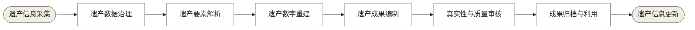

## 三、建筑外观 AI 测量

建筑外观 AI 测量把外观信息转为可校核、可交付的尺度和几何成果。

**图 2：建筑外观 AI 测量能力流程**

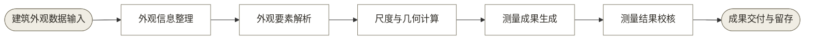

## 四、医疗影像 AI

医疗影像 AI 把影像信息转为经过专业复核的临床相关结论。

**图 3：医疗影像 AI 能力流程**

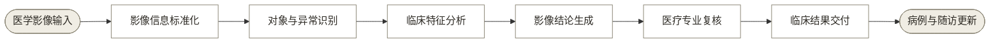

## 五、无人机测绘与实景三维

无人机测绘与实景三维把测区观测信息转为具有空间基准的测绘成果。

**图 4：无人机测绘与实景三维能力流程**

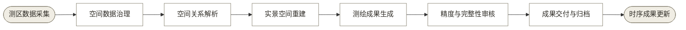

## 六、建筑逆向建模

建筑逆向建模把既有建筑空间信息转为几何与语义一致的建筑信息模型。

**图 5：建筑逆向建模能力流程**

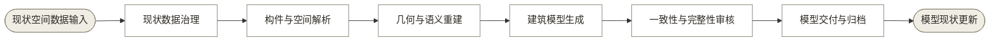

## 七、消费级三维捕获与神经渲染

消费级三维捕获把对象或场景信息转为可发布、可使用的三维数字资产。

**图 6：消费级三维捕获能力流程**

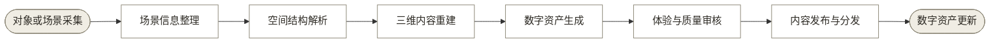

## 八、自动驾驶感知

自动驾驶感知把连续道路观测转为供车辆决策使用的动态环境状态。

**图 7：自动驾驶感知能力流程**

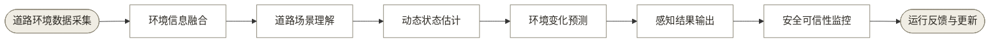

## 九、电力与基建巡检 AI

电力与基建巡检 AI 把资产观测转为经过复核的风险结论和维护任务。

**图 8：电力与基建巡检 AI 能力流程**

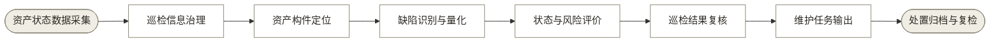

## 十、工业质检 AI

工业质检 AI 把产品状态转为符合性判断、处置结果和质量记录。

**图 9：工业质检 AI 能力流程**

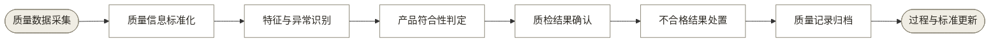

## 十一、遥感解译

遥感解译把对地观测转为空间专题结论、发布成果和时序记录。

**图 10：遥感解译能力流程**

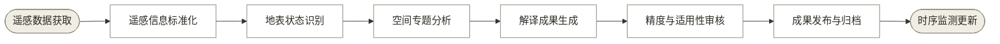

## 十二、文档智能与档案数字化

文档智能与档案数字化把档案对象转为保持原有语境、能够检索和长期保存的记录。

**图 11：文档智能与档案数字化能力流程**

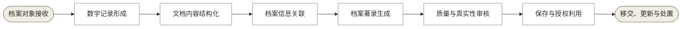

## 十三、AI 建筑生成出图

AI 建筑生成出图把设计条件和约束转为经过专业审核的建筑图纸成果。

**图 12：AI 建筑生成出图能力流程**

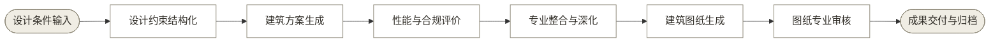

## 十四、安防视频结构化

安防视频结构化把连续视频转为经过人工复核、受保存期限约束的事件和证据信息。

**图 13：安防视频结构化能力流程**

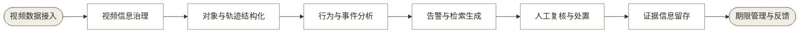
