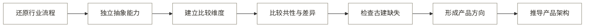

# 11-3 · 跨行业比较与缺失分析

## 一、调研结论

古建产品需要建立从资料输入到专业成果、责任审核、正式归档和跨期更新的完整过程。近期范围聚焦保护成果生产与交付，区域档案平台需要等待真实交付和持续使用证据。
13 个行业反复出现的稳定能力有四项：

1. 输入必须具有用途、来源和质量依据。
2. 行业对象必须先被结构化，才能产生可复用的专业结果。
3. 自动结果必须经过独立检查或责任确认，才能进入真实业务。
4. 正式结果需要保留来源、版本和处置记录，持续性业务还需要更新机制。

行业之间需要保留差异的部分有四项：

1. 核心专业转换不同，例如空间重建、临床判断、质量判定、档案著录和事件分析。
2. 正式结果的形式不同，例如测量成果、医学结论、维护任务、档案记录和设计图纸。
3. 结果成立条件不同，例如空间精度、临床有效性、法规合规、真实性和责任签署。
4. 更新时间尺度不同，包括一次性交付、周期复查和连续运行。

因此，古建产品可以借鉴其他行业的结果链和责任机制。算法、精度指标、监管结论和硬件方案需要在古建场景中重新验证。

## 二、调研顺序

跨行业比较必须在各行业完成独立调研和能力抽象后进行，如图 1 所示。

**图 1：跨行业调研顺序**

## 三、比较维度

行业比较采用对象、输入、专业转换、正式结果、成立条件、责任方式和持续机制七个维度（见表 1）。

**表 1：跨行业比较维度**

| 比较维度 | 需要回答的问题 |
|---|---|
| 行业对象 | 行业持续管理的核心对象是什么 |
| 信息输入 | 什么信息进入行业流程，输入质量由什么约束 |
| 核心专业转换 | 行业最关键的专业判断或状态转换是什么 |
| 正式结果 | 哪一种结果会进入后续真实业务 |
| 成立条件 | 结果满足什么条件才可被采用 |
| 责任方式 | 谁检查、确认或承担结果责任 |
| 持续机制 | 结果是否需要留存、复查、迁移或持续更新 |

## 四、13 个行业的差异比较

13 个行业的主要差异集中在专业转换、正式结果、成立条件和持续机制（见表 2）。

**表 2：13 个行业差异比较**

| 行业 | 核心对象 | 核心专业转换 | 正式结果 | 结果成立的核心条件 | 持续机制 |
|---|---|---|---|---|---|
| 遗产数字化 | 遗产对象、环境、历史资料 | 遗产要素解析与现状重建 | 数字记录、图纸、模型和档案成果 | 真实性、完整性、精度和来源可追溯 | 迁移、监测、版本更新和授权利用 |
| 建筑外观 AI 测量 | 建筑外观及构件 | 外观信息转为尺度和几何关系 | 尺寸、面积、正射或测量图 | 有尺度依据并可独立校核 | 交付留存，必要时重新测量 |
| 医疗影像 AI | 影像、患者和临床任务 | 影像特征转为临床相关结论 | 结构化结果或报告 | 临床有效，并由医疗专业人员确认 | 病例随访、运行监测和受控更新 |
| 无人机测绘与实景三维 | 测区和空间观测 | 观测数据转为有空间基准的成果 | 正射、点云、模型和测绘数据 | 空间精度、覆盖完整性和适用范围明确 | 新时相更新和成果版本管理 |
| 建筑逆向建模 | 既有建筑和空间观测 | 现状几何转为有语义的建筑对象 | BIM、图纸和模型报告 | 模型与现状、信息要求和偏差说明一致 | 改造或运维过程持续更新 |
| 消费级三维捕获 | 对象或场景 | 影像转为可使用的三维内容 | 可浏览、分享或再利用的数字资产 | 目标使用环境中的体验质量 | 资产发布、适配和版本更新 |
| 自动驾驶感知 | 连续道路环境 | 观测转为动态环境状态与预测 | 供规划控制使用的感知结果 | 实时、安全、能够表达不确定性和退化 | 连续监测、事件回放和能力更新 |
| 电力与基建巡检 | 基础设施资产和构件 | 观测转为缺陷、风险和处置优先级 | 巡检结论、维护任务和复检记录 | 关联具体资产，并由合格人员复核 | 维修、复检和资产状态更新 |
| 工业质检 | 产品、批次和工艺 | 产品状态转为符合性判断 | 合格、隔离、返工或放行结果 | 判定标准一致，测量和处置可追溯 | 质量统计、根因处理和过程更新 |
| 遥感解译 | 地表对象和时间序列 | 对地观测转为空间专题结论 | 地图、变化清单和统计结果 | 独立精度评价和适用范围明确 | 周期监测和新时相更新 |
| 文档智能与档案数字化 | 文件、案卷和业务语境 | 非结构化内容转为保持关系的档案记录 | 著录、索引和长期保存包 | 真实性、完整性、可用性、安全性和责任确认 | 移交、迁移、保管期复审和处置 |
| AI 建筑生成出图 | 设计任务、场地和约束 | 约束转为协调的设计成果 | BIM、图纸和设计交付物 | 专业协调、规范合规和责任审核 | 设计版本和交付状态管理 |
| 安防视频结构化 | 视频对象、轨迹和事件 | 连续视频转为可查询事件和证据 | 告警、检索结果和证据记录 | 合法、可核验、人工复核并受保存期限约束 | 性能反馈、审计和到期处置 |

## 五、跨行业共性

### 5.1 共性的适用边界

跨行业共性描述反复出现的结果要求，各行业仍保留各自的方法和专业规则（见表 3）。

**表 3：跨行业共性能力**

| 共性能力 | 独立流程中的覆盖情况 | 跨行业含义 |
|---|:---:|---|
| 有依据的信息输入 | 13 个行业 | 行业结果必须回溯到原始信息和任务用途 |
| 输入准备、标准化或质量治理 | 13 个行业 | 各行业会按自身任务处理缺失、不适用、未校准或约束不清的信息 |
| 行业对象结构化 | 13 个行业 | 原始文件需要转为可识别、可关联、可修改的业务对象 |
| 专业状态转换 | 13 个行业 | 专业判断体现产品价值，文件格式转换属于基础处理 |
| 正式结果生成 | 13 个行业 | 中间识别结果需要继续转成行业可使用的成果 |
| 质量或可信性检查 | 13 个行业 | 结果需要独立验证、人工复核或运行可信性监控 |
| 业务交付、记录或处置 | 13 个行业 | 结果必须进入下游工作，并保存必要记录 |
| 主动持续更新 | 11 个行业 | 多数行业存在随访、复检、时序监测或运行反馈；建筑外观测量和建筑出图更多以一次交付或版本留存为主 |

覆盖数量根据 [11-1 候选行业事实与流程调研](11-1_候选行业事实与流程调研.md) 和 [11-2 候选行业抽象流程定义](11-2_候选行业抽象流程定义.md) 统计。

部分能力在抽象流程中合并到相邻节点，因此覆盖数量属于分析结果。

### 5.2 共性能力链

13 个行业共同形成八个连续结果，关系见图 2。

**图 2：跨行业共性能力链**

### 5.3 稳定的结构关系

跨行业流程中存在三组稳定关系。

第一，原始资料、行业对象和正式结果是三类不同数据。

- 原始资料证明信息从哪里来。
- 行业对象承载类别、关系、状态和修改结果。
- 正式结果服务交付、审核或处置。

第二，生成、检查和责任确认是三个不同动作。

- 生成回答系统得到了什么。
- 检查回答结果是否符合精度、规则和完整性要求。
- 责任确认回答谁允许结果进入真实业务。

第三，一次交付和持续维护是两种不同产品条件。

- 一次交付依赖明确的成果和验收条件。
- 持续维护还需要稳定对象身份、复查责任、使用频率、权限和预算。

## 六、需要保留的行业差异

行业差异主要体现在专业转换、结果成立条件和运行时间三个方面。

### 6.1 核心转换类型

行业的核心转换分为五类，不同类型需要保留各自的专业流程（见表 4）。

**表 4：核心转换类型**

| 转换类型 | 对应行业 | 对古建的启发 |
|---|---|---|
| 空间量测与重建 | 建筑外观测量、无人机测绘、点云转 BIM、消费级三维 | 古建需要把几何基准和构件语义分开保存 |
| 识别到专业判断 | 医疗影像、巡检、工业质检、遥感解译 | 古建识别后还需要现状、风险、规范和适用性判断 |
| 信息到正式记录 | 遗产数字化、文档与档案数字化 | 古建成果必须保留原始语境、来源和版本 |
| 约束到正式成果 | AI 建筑生成出图 | 古建出图需要由结构化对象和规则驱动，并经过专业审核 |
| 连续信息到实时状态 | 自动驾驶、安防视频 | 古建采用项目交付与周期复查架构，并保留不确定性、事件和变化记录 |

### 6.2 正式结果成立条件

正式结果需要满足测量、责任、保存、安全或业务使用条件（见表 5）。

**表 5：正式结果成立条件**

| 条件类型 | 代表行业 | 古建适用边界 |
|---|---|---|
| 测量精度与空间基准 | 建筑测量、无人机测绘、点云转 BIM | 古建标准需要依据项目用途和专业规范另行确定 |
| 专业有效性和责任签署 | 医疗、巡检、建筑设计 | AI 置信度用于提示风险，专业人员承担成果确认责任 |
| 真实性、完整性和保管要求 | 遗产、档案 | 正式归档需要文件、元数据、版本和责任记录 |
| 安全与持续监控 | 自动驾驶、安防 | 古建场景采用项目交付和周期复查机制 |
| 业务可用性和体验质量 | 消费级三维 | 测量或档案成果需要独立的专业证据 |

### 6.3 时间尺度

古建保护采用“一次项目交付加周期复查”的时间模式（见表 6）。

**表 6：行业运行时间模式**

| 时间模式 | 行业 | 产品含义 |
|---|---|---|
| 一次任务交付 | 建筑外观测量、建筑出图、部分三维内容 | 价值由交付效率和结果采用决定 |
| 周期复查 | 遗产、巡检、遥感、档案 | 需要对象身份、历史版本和复查任务 |
| 连续运行 | 自动驾驶、安防、部分工业质检 | 需要实时监控、退化处理和持续反馈 |

## 七、对古建产品的适用结论

跨行业经验分为直接采用、验证后采用和重新研究三类。

### 7.1 应直接借鉴的能力原则

古建可以直接采用六项结果和责任原则（见表 7）。

**表 7：古建可直接采用的原则**

| 能力原则 | 主要参照行业 | 古建产品中的表达 |
|---|---|---|
| 先定义正式成果，再决定需要哪些信息 | 测量、医疗、建筑设计 | 先确定图纸、记录、清单和验收要求，再生成资料清单 |
| 原始证据、对象数据和成果分层 | 遗产、BIM、档案 | 照片、点云和文档作为原始证据，构件和正式成果分别管理 |
| 未知与不确定状态显式保留 | 医疗、自动驾驶、遥感 | 遮挡、资料不足、类别不明和关系存疑均转人工 |
| 生成、检查和确认分开 | 医疗、测绘、质检、档案 | 自动草稿、规则检查、专业审核使用不同状态 |
| 对象身份贯穿交付和后续更新 | 遗产、巡检、档案 | 建筑、构件、资料、成果和历次版本共用一套身份关系 |
| 变化先形成复查问题，不直接改写事实 | 遥感、巡检 | 跨期变化生成疑问清单，由专业人员确认后更新 |

### 7.2 需要验证后采用的内容

以下四项能力需要完成古建场景验证后再决定是否采用。

- 多来源采集能否降低返工，需要用同一对象和同一成果标准对照。
- 自动识别覆盖哪些古建构件，需要基于真实样本确定。
- 结构化数据能否稳定生成多种成果，需要先验证一类正式成果。
- 机构是否需要持续档案平台，需要验证复查责任、使用频率和预算。

### 7.3 需要重新研究的内容

以下内容需要根据古建场景重新定义和验证：

- 其他行业的准确率、精度、处理时延和自动化比例。
- 医疗、汽车、安防等行业的监管结论和责任配置。
- 专用传感器、大规模训练体系和实时计算架构。
- 消费级三维的视觉质量指标。
- 单个企业的页面结构和功能列表。

## 八、古建当前产品的缺失能力

### 8.1 当前产品链

当前第 0 代产品已经形成从照片输入到文件导出的路径（见图 3）。

**图 3：第 0 代产品流程**

该路径已经可以运行。真实测量精度、图纸合规性、交付采用和人力节省仍待验证。

现状证据见 [09 MVP 工作流验证报告](09_MVP工作流验证报告.md) 第十二节和 [早期网页演示说明](验证材料/01_早期网页演示/README.md)。

### 8.2 缺失能力对照

当前产品与未来产品之间存在九项能力缺口（见表 8）。

**表 8：古建当前产品的能力缺口**

| 未来需要的能力 | 当前已有 | 主要缺失 | 缺失程度 |
|---|---|---|:---:|
| 保护任务与成果要求定义 | 项目、建筑单元、图纸类型 | 规范、精度、对象范围、验收项与资料要求尚未共同定义 | 高 |
| 多来源资料治理 | 照片、尺寸和来源字段 | 历史文档、已有图纸、空间成果、覆盖检查和缺失状态未形成统一入口 | 高 |
| 遗产对象与关系结构化 | 部件表和基础 JSON | 建筑、构件、环境、历史事件、来源、层级、连接和版本关系不足 | 高 |
| 现状与空间关系重建 | 照片比例和控制尺寸 | 缺少稳定的几何基准、坐标尺度、偏差和不可确定区域表达 | 高 |
| 专业状态分析 | 构件类别和形制判断 | 尚未覆盖保存现状、残损、风险、价值和跨期资料关系 | 高 |
| 正式成果生成 | 示意级 SVG、样本 DXF 和出图配置 | 尚未形成可复用画法规则、正式 DWG、完整图纸集和多类保护成果 | 高 |
| 独立质量检查 | 文件审计、预览目检和审核状态 | 缺少尺寸、规范、完整性、真实性和责任记录的独立检查报告 | 高 |
| 正式交付与归档 | 导出页、交付记录和本机版本 | 缺少成果包、元数据、检查证据、授权、长期保存和外部系统接入 | 高 |
| 跨期更新与复查 | 版本号和重开校正 | 缺少同一对象的跨期比较、疑问清单、复查确认和历史时间线 | 高 |

“缺失程度高”用于描述当前能力与未来要求的差距。第 1 代最小可行产品范围仍按验证优先级确定。

## 九、产品方向

产品应先形成可核验的保护成果生产与交付能力，再根据持续使用证据扩展档案能力。长期产品定义为：

> 面向古建测绘与文保项目团队，以建筑、构件及其证据为核心，把多来源现场与历史资料转成可校正的保护成果，经专业复核形成可交付、可归档、可持续更新的正式记录。

产品近期定位为保护成果生产与交付工具，出图构成其中一项成果能力。正式成果流程得到验证后，再沿同一对象和版本关系扩展持续档案。区域数据库留待持续使用需求得到验证后评估。

## 十、主要证据与来源

### 10.1 行业事实底稿

每个行业的流程、边界和完整来源见 [11-1 候选行业事实与流程调研](11-1_候选行业事实与流程调研.md)。资料优先来自国际标准、政府或监管机构、行业标准组织和原始论文。

### 10.2 重点复核来源

重点判断可以追溯到表 9 所列来源。

**表 9：重点判断与权威来源**

| 结论用途 | 权威来源 |
|---|---|
| 遗产对象、关系模型、长期兼容与遗产清册 | [Arches Resource Model](https://www.archesproject.org/arm-wg/)、[What is Arches](https://www.archesproject.org/what-is-arches/) |
| 固定类别内的空间理解、参数化输出和适用边界 | [Apple RoomPlan](https://machinelearning.apple.com/research/roomplan) |
| 点云处理与 BIM 建模分属不同环节 | [Autodesk ReCap 在 Scan-to-BIM 中的作用](https://www.autodesk.com/support/technical/article/caas/sfdcarticles/sfdcarticles/Role-of-Autodesk-ReCap-in-scan-to-BIM-workflows.html) |
| 测绘成果的坐标、格式和几何输出 | [DJI Terra 官方支持文档](https://www.dji.com/support/product/dji-terra) |
| 医学影像结构化报告 | [DICOM Structured Reporting](https://www.dicomstandard.org/activity/wgs/wg-08) |
| 连续感知中的时序对象身份、检测与跟踪 | [Waymo Open Dataset](https://waymo.com/research/scalability-in-perception-for-autonomous-driving-waymo-open-dataset/) |
| 电子档案元数据、四性检测和责任确认 | [国家档案局《电子档案管理办法》](https://www.saac.gov.cn/daj/xzfgk/202412/41b270e9dfc44f48a09adcc5f4fe8296.shtml) |
| 工业质量体系和持续改进 | [ISO 9001 说明](https://www.iso.org/home/insights-news/resources/iso-9001-explained.html)、[NIST 制造系统增强智能项目](https://www.nist.gov/programs-projects/augmented-intelligence-manufacturing-systems-aims) |
| 遥感分析就绪数据和质量信息 | [CEOS ARD Governance Framework](https://ceos.org/ard/files/CEOS_ARD_Governance_Framework_18-October-2021.pdf)、[USGS Landsat Collection 2](https://www.usgs.gov/landsat-missions/landsat-collection-2) |
| 视频结构化元数据、人工处置和期限约束 | [ONVIF Profile M](https://www.onvif.org/profiles/profile-m/)、[UK ICO 视频监控数据保护指南](https://ico.org.uk/for-organisations/uk-gdpr-guidance-and-resources/cctv-and-video-surveillance/guidance-on-video-surveillance-including-cctv/how-can-we-comply-with-the-data-protection-principles-when-using-surveillance-systems/) |

网络来源复核日期为 2026-07-23。厂商资料的用途限于说明公开产品边界。古建精度、效率和市场规模需要独立证据。
