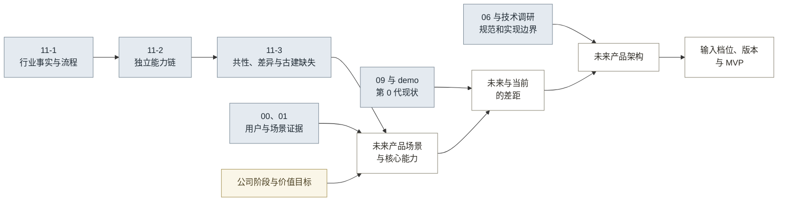
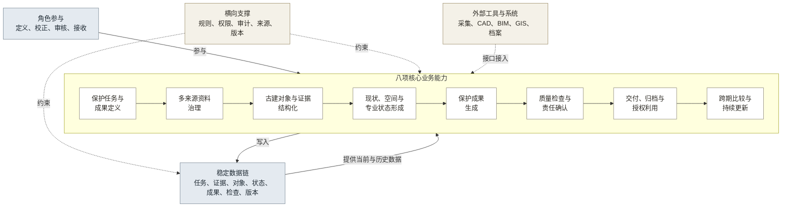
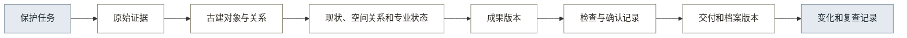

# 12 · 调研结论

## 一、价值与立项判断

当前证据支持继续验证一类正式成果，不支持建设完整平台。

### 1.1 公司前提

假设：项目由资源有限的 0→1 垂直 AI 产品团队推进。近期优先证明正式成果的用户采用、单位成本和付费可能；长期再沉淀可复用的对象、规则和质量数据。品牌传播不作为当前立项依据。

验证方式：通过真实团队成本核算、乙方项目交付、采购访谈和付费行为修正该假设。

### 1.2 是否值得做

现有证据只能证明业务问题和技术路径存在，商业价值仍待验证（见表 1）。

**表 1：立项依据**

| 判断项 | 当前证据 | 结论 |
|---|---|---|
| 业务问题 | 11-3 第八部分和 09 第十一部分显示资料分散、跨文件修改、检查滞后和交付追溯不足 | 值得继续验证 |
| 技术路径 | 09 第十二部分与 demo 已串联照片识别、对象校正和样本出图 | 只证明路径可运行 |
| 用户采用 | 尚无真实乙方项目使用记录 | 未证明 |
| 商业回报 | 尚无成交价格、交付成本、付费行为和回收周期 | 未证明 |
| 长期价值 | 对象、规则和质量数据可能跨项目复用 | 推断，需用复用率和持续使用验证 |

因此，当前值得投入的是范围受控的第 1 代交付验证，不是完整平台开发。

### 1.3 价值目标

产品必须同时改善用户结果和公司结果（见表 2）。

**表 2：价值目标与验证指标**

| 对象 | 必须改善的结果 | 验证指标 |
|---|---|---|
| 操作用户 | 减少资料整理、重复录入和跨文件修改 | 单项工时、重复录入次数、人工修改量 |
| 责任用户 | 提前发现问题并保留审核依据 | 审核时间、退回次数、责任记录完整率 |
| 接收方 | 获得可核验、可追溯的正式成果包 | 核验时间、问题定位时间、成果采用 |
| 买单方 | 降低单项交付成本和返工风险 | 单项成本、一次通过率、续用或采购意愿 |
| 产品公司 | 近期形成可收费成果，长期积累可复用资产 | 贡献金额、回收周期、规则复用率、持续收入 |

### 1.4 决策门

真实采用、成本和付费证据共同决定是否继续扩建。

- 继续：真实项目采用成果，质量不低于人工基线，净成本下降，并出现主动询价、采购测试或付费。
- 调整：用户只认可资料治理、出图或归档中的单一环节，重新收缩产品边界。
- 暂停扩建：真实项目完成交付后仍不采用，交付成本未下降，且没有付费意愿。

## 二、产品方向

第 1 代聚焦正式成果生产、检查和交付，长期再扩展持续档案。

### 2.1 产品定义

产品长期定义为：

> 面向古建测绘与文保项目团队，以建筑、构件及其证据为核心，把多来源现场与历史资料转成可校正的保护成果，经专业复核形成可交付、可归档、可持续更新的正式记录。

产品名称暂定为“古建保护成果生产与持续归档工作台”。

### 2.2 目标角色

第 1 代暂按四类角色设计（见表 3）。真实分工和采购关系仍待验证。

**表 3：近期角色与任务**

| 角色 | 近期定位 | 核心任务 |
|---|---|---|
| 乙方绘图员或资料整理人员 | 操作用户 | 整理资料、校正对象数据、生成成果 |
| 乙方项目负责人 | 责任用户 | 配置成果要求、审核问题、确认交付 |
| 区县文物部门业务人员 | 接收方 | 检查成果完整性、查询和后续使用 |
| 乙方企业、项目总包方或区县文物部门 | 潜在买单方 | 购买项目交付能力或产品化服务 |

验证方式：记录真实项目的操作人、确认人、接收单位、采购决策人、预算来源和合同关系。

## 三、方向与架构推导

产品方向由行业证据、用户场景、公司价值目标和当前能力共同决定（见图 1）。

**图 1：产品方向与架构的推导关系**

## 四、目标场景

### 4.1 业务场景

未来产品围绕正式成果的定义、生产、确认、交付和更新组织完整业务过程。

项目负责人收到一项古建测绘、修缮或建档任务后，先在产品中明确保护对象、需要交付的成果、适用规范、精度要求、审核角色和验收条件。系统据此形成资料要求和检查清单。

项目团队导入照片、尺寸、历史图纸、文字记录和空间资料。系统检查来源、时间、覆盖、质量和缺失项，并将资料关联到建筑、构件、环境和历史事件。

系统形成构件、空间关系和专业状态草稿，明确标记遮挡、资料不足、类别不明和关系存疑的内容。绘图员完成校正后生成图纸、清单和现状记录，项目负责人依据检查结果确认成果。

确认后的成果形成包含正式文件、结构化数据、检查记录、版本说明和元数据的交付包。后续巡查、修缮或补测资料进入同一对象的时间线，变化先形成复查任务，经专业人员确认后更新记录。

### 4.2 用户流程

用户从任务定义开始，最终获得可追溯的交付成果和后续复查任务（见图 2）。

**图 2：未来产品的用户流程**

这条流程描述未来用户获得的结果。具体采集设备、识别模型和重建方法在技术方案中另行确定。

## 五、产品能力

### 5.1 主能力链

未来产品需要八项长期稳定的业务能力，按照成果形成顺序衔接（见图 3）。

**图 3：未来产品主能力链**

### 5.2 能力定义

八项能力的结果边界见表 4。

**表 4：未来产品能力定义**

| 能力 | 要完成的结果 | 能力边界 |
|---|---|---|
| 保护任务与成果定义 | 明确对象、成果、规范、精度、角色和验收条件 | 覆盖成果成立条件；日常进度、财务和资源管理不在本模块范围内 |
| 多来源资料治理 | 让每份资料具有来源、时间、质量、覆盖和使用状态 | 覆盖资料使用条件；采集设备和通用文件存储不在本模块范围内 |
| 古建对象与证据结构化 | 建立建筑、构件、环境、历史和资料之间的身份与关系 | 候选对象经人工校正并关联来源后进入正式数据 |
| 现状、空间关系与专业状态形成 | 形成可核验的尺度、空间关系、保存现状、专业判断和不确定区域 | 几何、语义和专业判断分别记录，外部重建成果通过接口接入 |
| 保护成果生成 | 从同一对象数据形成图纸、清单、记录和检查材料 | 成果保留对象和来源关系，并进入独立检查 |
| 质量检查与责任确认 | 分别检查精度、规范、完整性、真实性和责任记录 | 技术检查、专业检查和责任确认分别记录，专业责任由指定角色承担 |
| 交付、归档与授权利用 | 形成正式成果包、元数据、版本和访问条件 | 近期形成最小交付包，持续档案由后续使用证据决定 |
| 跨期比较与持续更新 | 将新资料与既有对象比较，形成复查问题并更新记录 | 系统形成变化疑问，专业人员确认后更新正式记录 |

### 5.3 支撑能力

以下能力横向支撑主链，其价值通过主流程体现。

- 规则管理：类别、字段、画法、检查和交付要求分别管理并保留版本。
- 权限与审计：不同角色查看、修改、检查和确认的权限不同。
- 来源与版本：每项对象、结果和判断都能追溯到资料、人员、时间和工具版本。
- 外部工具接入：采集、几何处理、CAD、BIM、GIS 和档案系统通过稳定数据结构接入。
- 运行与部署：部署方式根据项目的数据权属、保密和合规要求确定。

## 六、产品边界

产品负责把行业要求和多来源资料转成可审核的专业成果。采集设备、通用工程软件和专业责任人继续承担各自职责（见表 5）。

**表 5：产品责任边界**

| 边界项 | 产品负责 | 边界外事项 |
|---|---|---|
| 任务与标准 | 把成果、规范、精度、角色和验收项转为任务要求 | 替专业人员决定保护等级或法定标准 |
| 现场资料 | 定义资料要求、检查质量、保存来源和缺失状态 | 开发相机、无人机或扫描设备 |
| 几何成果 | 接入或组织已有几何成果，保存尺度、坐标和偏差 | 自研通用摄影测量或点云重建引擎 |
| 古建对象 | 形成有限范围内可校正的构件与关系数据 | 承诺自动识别全部地区、时期和异形构件 |
| 成果生成 | 从结构化对象和规则生成图纸、清单和记录 | 让生成式模型直接签发最终图纸 |
| 质量与责任 | 提供检查、退回、修改和确认记录 | 代替有责任的专业人员确认 |
| 归档与维护 | 形成可追溯交付包，并预留同一对象的版本链 | 在持续需求未验证前建设区域管理平台 |

## 七、当前状态与未来能力的差距

第 0 代目前只提供识别、校正、样本出图和状态流转能够串联的证据。正式交付和产品价值仍需真实交付验证（见表 6）。

**表 6：第 0 代已完成事项与待验证事项**

| 当前能力 | 已完成 | 尚未证明 |
|---|---|---|
| 输入 | 照片上传、部位标记、尺寸录入 | 真实项目覆盖、精度和补采要求 |
| 识别 | 多模态识别、部件表、依据和置信度 | 有实测基准的类别表现和适用范围 |
| 校正 | 人工修改、重新校正和状态流转 | 完整修改原因、责任和跨文件一致性 |
| 出图 | 三样本脚本 DXF、demo 示意 SVG | 可复用画法库、正式 DWG 和真实交付 |
| 检查 | 文件审计、预览目检和负责人审核节点 | 尺寸、规范、完整性和真实性独立检查 |
| 交付 | 导出页面、交付记录和本机版本 | 接收方采用、档案包和外部系统接入 |

“DXF 审计零错误”的证据范围限于文件结构可读取。尺寸正确性、画法合规性和接收方验收仍需独立验证。

## 八、能力依据与版本边界

行业证据决定需要哪些能力，公司价值与验证成本决定能力何时建设（见表 7）。

**表 7：能力依据与版本边界**

| 行业证据 | 古建缺口 | 产品能力 | 最早进入版本 |
|---|---|---|---|
| 测绘、建筑设计和医疗均先定义任务、适用范围与结果成立条件 | 成果、规范、精度、角色和验收条件未共同定义 | 保护任务与成果定义 | 第 1 代：一类正式成果模板 |
| 遗产、档案和遥感要求记录来源、时间、质量、覆盖与适用范围 | 照片、尺寸、历史资料和空间成果缺少统一质量与缺失状态 | 多来源资料治理 | 第 1 代：照片、尺寸和来源；第 3 代扩展多来源 |
| 遗产、BIM、巡检和自动驾驶依靠稳定对象身份关联历次信息 | 建筑、构件、资料、成果和版本关系不足 | 古建对象与证据结构化 | 第 1 代：最小建筑与构件模型 |
| 测绘、BIM、巡检和遥感分别处理几何、语义、专业判断和不确定性 | 几何基准、空间关系、保存现状和专业状态表达不足 | 现状、空间关系与专业状态形成 | 第 1 代：必要实测基准和有限状态；第 3 代扩展空间成果 |
| 建筑出图、工业质检和档案通过规则把对象转成正式结果 | 出图逻辑按样本定制，其他保护成果尚未形成稳定规则 | 保护成果生成 | 第 1 代：一类立面成果；第 2 代扩展成果类型 |
| 医疗、质检、测绘和安防把自动结果、独立检查与责任确认分开 | 文件审计和人工目检覆盖基础检查，尺寸、规范、完整性和责任需要独立证据 | 质量检查与责任确认 | 第 1 代：独立检查和负责人确认 |
| 遗产和档案把正式文件、元数据、检查记录、版本和权限共同交付 | 当前范围为文件导出和本机版本，元数据、检查记录和权限尚未形成完整交付包 | 交付、归档与授权利用 | 第 1 代：最小交付包；第 4 代形成持续档案 |
| 遥感、巡检和遗产保护先形成变化疑问，再由专业人员确认更新 | 当前缺少同一对象的跨期比较、复查任务和历史时间线 | 跨期比较与持续更新 | 第 4 代：持续档案 |

## 九、目标架构

未来架构直接承接八项核心能力，并遵守五项约束：

1. 正式成果和验收条件决定输入要求。
2. 原始证据、古建对象和正式成果分别保存。
3. 几何、语义和专业状态分别校正和记录。
4. 成果生成、质量检查和责任确认使用不同状态。
5. 对象身份、来源和版本贯穿交付与更新，未知和存疑内容进入人工处理。

### 9.1 总体架构

总体架构以八项核心能力为主链，角色参与业务过程，稳定数据支持全过程，规则和外部工具横向接入（见图 4）。

**图 4：未来产品总体架构**

### 9.2 核心模块

八个核心模块与第 5.1 节的能力链一一对应（见表 8）。

**表 8：未来产品核心模块**

| 模块 | 核心责任 | 主要输出 | 边界外事项 |
|---|---|---|---|
| 保护任务与成果定义 | 定义成果、对象、规范、精度、角色和验收项 | 任务要求、资料清单、检查清单 | 法定标准由专业人员确定 |
| 多来源资料治理 | 导入、检查并关联现场和历史资料 | 可追溯资料集、缺失清单 | 外业采集由项目团队完成 |
| 古建对象与证据结构化 | 管理建筑、构件、环境、历史和资料关系 | 已校正对象及证据关系 | 未知对象进入人工处理 |
| 现状、空间关系与专业状态形成 | 保存几何基准、空间关系、保存现状、专业判断和不确定性 | 可核验现状与专业状态 | 通用重建由外部工具完成 |
| 保护成果生成 | 按规则生成图纸、清单、记录和检查材料 | 成果草稿及来源关系 | 正式成果进入检查和确认流程 |
| 质量检查与责任确认 | 执行检查、退回、修改和确认 | 检查报告、问题和确认记录 | 专业责任由责任用户承担 |
| 交付、归档与授权利用 | 组合交付包，管理元数据、版本和访问条件 | 正式成果包和归档版本 | 区域监管平台留待后续验证 |
| 跨期比较与持续更新 | 对比新旧资料，形成复查问题并更新记录 | 变化清单、复查任务和历史版本 | 变化事实由专业人员确认 |

### 9.3 稳定数据链

稳定数据链与八项核心能力逐步对应，从保护任务延伸到后续复查（见图 5）。

**图 5：未来产品稳定数据链**

外部工具通过接口产生或更新链上的数据。正式记录保留对象身份、来源、检查和版本关系。
