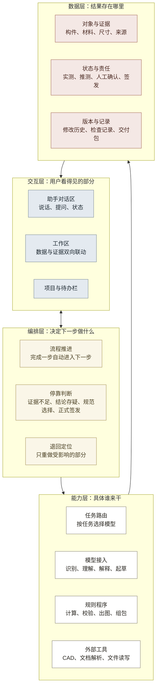
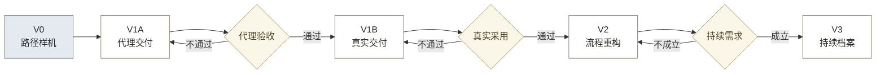
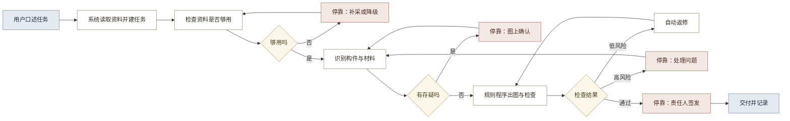

# 13-3 · AI 产品架构与路线图

## 一、产品判断

近期范围为一类正式立面成果，验证成果采用、单位成本和付费可能。完整数字档案平台暂不进入开发范围。价值前提与立项条件见 12 第一部分。

产品采用三栏工作台：用户用自然语言交代任务，系统按固定流程推进，在责任节点请求确认；用户可在原始证据上直接修正结果。界面定义见 [13-6 界面与交互形态](13-6_界面与交互形态.md)。

分工原则是 AI 负责看和说，规则程序负责算和管，人负责定和签。AI 承担识别、理解、解释和起草，规则程序承担计算、校验、出图和组包，项目人员承担实测、专业判断、规范选择和签发。

用户只面对一个助手。服务端按任务类型选择模型，横向接入层统一处理供应商差异、价格和降级规则。具体定义见 [13-7 模型接入与选型](13-7_模型接入与选型.md)。

流程由确定性状态机推进。编排层规定下一步、停靠条件和退回位置；模型处理识别、理解与解释。该分工保证流程可预测、可审计。

三层方案按验证目标划分（见表 1）。

**表 1：三层产品方案与时间路线**

| 层级 | 时间 | 目标 | 流程变化 | 主要交付 | 对应版本 |
|---|---|---|---|---|:---:|
| 流程优化 | 近期 | 证明成果采用、成本改善和付费可能 | 建立工作台形态，合并资料整理，检查前移，人工集中处理停靠点 | 可核验、可采用的正式立面成果包 | V1A、V1B |
| 流程重构 | 中期 | 降低单位成本并提高跨项目复用 | 删除重复录入与组包，构件库跨项目复用，低风险问题自动返修 | 可跨项目复用的成果生产流程 | V2 |
| 成果升级 | 长期 | 形成持续服务和可复用数据资产 | 增加跨期身份、变化复查、授权查询和系统交换 | 可追溯、可更新的古建数字档案 | V3 |

## 二、产品分层

产品分为交互、编排、能力和数据四层（见图 1）。编排层连接任务状态、停靠条件和能力调用。

**图 1：产品分层架构**

四层的职责边界见表 2。

**表 2：分层职责**

| 层 | 职责 | 边界 |
|---|---|---|
| 交互层 | 接收自然语言和框选操作，显示证据、状态与停靠提问 | 业务判断和数据写入交给编排层与能力层 |
| 编排层 | 决定下一步、停靠条件和退回位置 | 具体识别与计算由能力层执行 |
| 能力层 | 路由模型，接入供应商；规则程序执行确定性任务，外部工具负责读写 | 流程顺序由编排层控制，模型配置留在服务端 |
| 数据层 | 保存对象、证据、状态、责任和版本 | 业务规则与校验逻辑独立管理 |

工作区通过数据层定位原始证据和修改记录，对应问题 36 与 49。

## 三、一级模块

八项能力对应八个一级模块。界面名用于产品文档、界面和对外沟通，能力名只用于架构内部（见表 3）。

**表 3：一级模块与近期范围**

| 编号 | 界面名 | 内部能力名 | 近期范围 | 人工边界 |
|:---:|---|---|---|---|
| G1 | 建立任务 | 保护任务与成果定义 | 任务、输入、规则、验收和角色模板 | 选择规范并确认责任人 |
| G2 | 整理资料 | 多来源资料治理 | 照片、尺寸、来源、权限和缺失检查 | 确认权限并决定补采 |
| G3 | 核对构件 | 古建对象与证据结构化 | 建筑与构件身份、证据、状态和存疑项 | 确认术语、类别和身份 |
| G4 | 记录现状 | 现状、空间关系与专业状态形成 | 实测基准、空间关系、专业状态和不确定区域 | 完成实测和专业判断 |
| G5 | 生成图纸 | 保护成果生成 | 一类立面图的画法、布局和导出 | 确认画法、尺寸和特殊构件 |
| G6 | 检查与签发 | 质量检查与责任确认 | 问题队列、校正记录、分阶段检查和签发状态 | 处理停靠项、复核并签发 |
| G7 | 交付归档 | 交付、归档与授权利用 | 成果、证据、检查、版本和权限组成的交付包 | 确认接收、权限和部署条件 |
| G8 | 复查更新 | 跨期比较与持续更新 | 仅预留跨期身份和版本字段 | 确认变化、复查责任和预算 |

界面使用“建立任务、整理资料、核对构件”等任务名称。八个模块用于内部架构和能力管理，工作台左栏按任务进度显示。

## 四、版本路线

产品按五个阶段增加能力，每个阶段都有进入条件（见图 2）。

**图 2：版本路线与决策门**

每个版本同时推进处理能力和交互形态，两者缺一不可（见表 4）。

**表 4：各版本的能力增量与交互形态**

| 版本 | 优先级 | 处理问题 | 能力增量 | 交互形态目标 | 进入下一版的条件 |
|---|:---:|---|---|---|---|
| V0 路径样机 | 已完成 | 证明照片、识别、校正和样本出图能够串联 | 照片输入、AI 识别、人工核对、单栋脚本、DXF 与 PNG | 无交互层，脚本运行，用户看不到过程 | 补齐正式交付能力后进入 V1A |
| V1A 代理交付 | P0 | 1 至 37、42 至 50 | 任务控制、模型路由、资料检查、对象证据、尺度状态、停靠处理、参数化出图、独立检查和交付包 | 三栏工作台成立，单一助手，四类停靠点，框选修正，三种状态标记 | 来源、尺寸依据、模型调用、问题、检查、责任和版本均可核对，且用户无需脱离工作台完成任务 |
| V1B 真实交付 | P0 | 重点验证 4、8、23、26、32、37、43、51 | 接入真实人员、资料、软件、权限和工作记录，不扩展成果类型 | 验证 13-6 第八节的五条交互假设 | 质量不下降，净成本可测，出现续用或付费信号 |
| V2 流程重构 | P1 | 深化 5、10、12、15、16、21、22、24、25、27 至 33、35、36、47、48 | 多来源解析、多视图几何、跨项目构件库、生成与检查调度、低风险自动返修、多成果输出 | 多任务并行，跨项目复用已确认判断，用户可自行补充构件与做法 | 复用和自动检查节省的成本高于规则维护与校正成本 |
| V3 持续档案 | P2 | 38 至 41，并扩展 6、12、36、37 | 跨期身份、变化候选、复查任务、授权查询和外部档案接口 | 按建筑而非按任务组织的查询与更新界面 | 已有固定责任人、复查频率、数据权限和预算 |

V1A 同时验证处理能力和交互形态。若用户仍依赖表单和逐步按钮，需在真实项目验证前调整交互设计。

## 五、V2 目标流程

V2 在 V1B 证明真实采用后，把资料、对象、生成、检查和低风险返修连接为连续流程（见图 3）。

**图 3：V2 的工作流程**

外业实测、规范确认、专业结论和正式签发在所有版本中保留。V2 删除重复录入，减少低风险全量检查。

存疑项只阻断相关分支，其余构件继续进入出图。

## 六、验证与投入

V1 先记录人工基线，再判断质量、成本和效率是否改善（见表 5）。

**表 5：V1 验证指标**

| 目标 | 核心指标 | 数据来源 | 通过判断 |
|---|---|---|---|
| 质量 | 关键错误、退回原因、成果采用 | 独立检查、接收记录 | 不低于原流程，无证据结果减少 |
| 成本 | 总人时、返工人时、模型和支持成本 | 分阶段计时、费用记录 | 单项成果净成本下降 |
| 效率 | 总周期、首稿时间、补充次数、返修轮次 | 状态与版本记录 | 同类成果交付时间缩短 |
| 责任 | 检查、退回、确认和签发记录 | 审计记录 | 正式成果可追到责任人和依据 |
| 采用 | 绘图员、负责人和接收方实际使用 | 使用记录、访谈 | 成果进入真实工作，用户无需脱离系统重新制作 |
| 交互 | 停靠次数、打断次数、框选修正占比 | 操作日志 | 用户主要通过对话和框选完成修正，而非退回表格编辑 |

交互指标记录用户实际采用的操作方式，用于验证对话、停靠和框选是否进入真实工作。

表 5 的指标目前一条都没有真实项目数据。原型已按任务记录模型、供应商、输入、输出、缓存、耗时、重试、费用、失败、降级和结果处理方式。费用只采用带官方来源和核对日期的价格，未配置的模型不估算。

机器侧数字不能单独证明效率提升，必须使用同一份资料记录人工基线，并统计 AI 结果的直接采用和修改时间。选型先过质量底线，再比较单次成功任务的 API、重试和人工成本。在拿到对照数据前，效率提升和最优模型都只是待验证假设。

V1 的开发投入为低置信度估算，用户价值、付费和回收周期仍缺少真实数据（见表 6）。

**表 6：V1 商业估算**

| 判断项 | 当前估算 | 依据 | 证据状态 |
|---|---|---|---|
| 开发投入 | 9.0 至 13.0 个角色月；按每角色月 3 万至 5 万元计算约 27 万至 65 万元 | 一类立面成果，复用现有模型和工具，含交互层与编排层开发，不含销售、外业、长期支持及私有部署 | 低置信度，需由真实团队报价替换 |
| 用户价值 | 节省的整理、绘图、审核和返工人时，加上减少退回造成的损失 | V1B 的人工基线与实际使用记录 | 尚无真实人时和退回成本，不能给出金额 |
| 付费可能 | 现有 MRD 仅提出乙方按项目、席位或使用量采购的假设 | 试用后的主动询价、继续使用、采购或介绍意向 | 尚无用户访谈、报价接受或付款证据，不能把假设当定价 |
| 回收周期 | 研发投入除以月贡献金额；月贡献金额为收入减去模型、实施、交付和支持成本 | 真实成交价、付费客户数、月交付量和直接成本 | 当前不能形成可信年限，V1B 后计算 |

编排层与交互层使开发投入增加约 1.0 至 1.5 个角色月。该估算需由真实团队报价校准。

## 七、近期任务

1. 用现有资料建立六类 AI 任务的固定测试集和人工核对答案。
2. 按 [13-7 模型接入与选型](13-7_模型接入与选型.md) 接入候选模型，先过质量底线，再比较耗时、费用和人工修改量。
3. 获取一套包含实测基准、任务书、适用规范和交付要求的真实或可代理资料。
4. 记录原流程在资料整理、绘图、审核和返工上的分阶段人时。
5. 按 [13-4 模块与优先级](13-4_产品模块总图与迭代优先级.md) 完成 V1A，并进行代理验收。
6. 使用真实项目执行 V1B，依据质量、成本、效率、责任、采用、付费和交互证据决定是否进入 V2。
