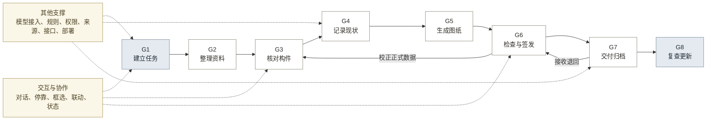

# 13-4 · 产品模块与优先级

## 一、结论

八项能力对应八个一级模块，共 51 个子功能。每项功能均标明执行者、当前状态、问题来源和前置依赖。

交互协作、模型接入、规则管理和审计等横向能力贯穿八个模块。交互层负责呈现 AI 过程与修正入口，模型接入层负责复用、度量和成本核算。

P0 只建设验证正式成果采用、单位成本和付费可能所需的能力。G8 等持续复查责任、权限、频率和预算成立后再建设。

## 二、八个一级模块

界面名用于产品文档、界面和对外沟通；能力名只用于架构内部（见表 1）。

**表 1：一级模块**

| 编号 | 界面名 | 内部能力名 | 主要执行者 | 问题 | 近期范围 |
|:---:|---|---|---|---|---|
| G1 | 建立任务 | 保护任务与成果定义 | AI 起草，人工确认 | 1 至 4 | 一类正式立面成果模板 |
| G2 | 整理资料 | 多来源资料治理 | AI 判断，规则校验 | 5 至 12 | 照片、尺寸及缺失检查 |
| G3 | 核对构件 | 古建对象与证据结构化 | AI 识别，人工确认 | 13 至 17 | 最小对象、证据和存疑状态 |
| G4 | 记录现状 | 现状、空间关系与专业状态形成 | 人工实测，AI 草拟 | 18 至 21 | 实测基准与有限关系 |
| G5 | 生成图纸 | 保护成果生成 | 规则程序为主 | 27 至 30 | 一类正式立面成果 |
| G6 | 检查与签发 | 质量检查与责任确认 | 规则检查，AI 解释，人工签发 | 22 至 26、31 至 34 | 停靠处理、分阶段检查和签发 |
| G7 | 交付归档 | 交付、归档与授权利用 | 规则组包，AI 起草说明 | 35 至 37 | 最小正式交付包 |
| G8 | 复查更新 | 跨期比较与持续更新 | AI 提出，人工确认 | 38 至 41 | 预留身份和版本字段 |

G5 由规则程序主导，保证相同数据得到稳定、可复测的图纸结果。

## 三、子功能清单

执行者由 AI、规则程序和人工单独或组合承担。状态分为样机、局部、未建和待验证；“样机”只表示路径已运行，成果质量仍需验证。

### 3.1 G1 建立任务

AI 从任务书提取成果类型、比例、规范、交付项和责任人，生成任务卡草稿；用户确认或修改（见表 2）。

**表 2：建立任务子功能**

| 编号 | 功能 | 执行者 | 状态 | 问题 | 前置 |
|---|---|---|---|---|---|
| M1-01 | 从口述要求和任务书生成任务卡 | AI 加人工 | 未建 | 1、3、43 | 无 |
| M1-02 | 选择地区、规范版本、比例和精度 | 规则加人工 | 局部：一个地区的征求意见稿 | 1 至 3 | M1-01 |
| M1-03 | 说明该成果所需的资料和实测条件 | 规则 | 未建 | 3 | M1-01、M1-02 |
| M1-04 | 定义操作、审核、接收和签发责任 | 人工 | 待验证 | 1、4 | M1-01 |

### 3.2 G2 整理资料

用户看到的是一份资料清单，每份资料标明拍的是哪个部位、能不能用，以及一份缺口说明（见表 3）。

**表 3：整理资料子功能**

| 编号 | 功能 | 执行者 | 状态 | 问题 | 前置 |
|---|---|---|---|---|---|
| M2-01 | 接收照片、尺寸、草图、文档、图纸和空间资料 | AI 加规则 | 局部：照片和尺寸 | 5、10 | M1-03 |
| M2-02 | 记录来源、取得方式、人员、位置和时间 | AI 加规则 | 局部：公开样本来源 | 6 | M2-01 |
| M2-03 | 记录授权、保密、范围和使用限制 | 人工 | 待验证 | 6 | M1-04、M2-02 |
| M2-04 | 判断覆盖范围与质量，识别缺面、遮挡、模糊和重复 | AI 加规则 | 局部：人工检查 | 7 | M1-03、M2-01 |
| M2-05 | 形成补拍、补测、补文件或降级清单 | AI 加人工 | 未建 | 7、8、11 | M2-04 |
| M2-06 | 记录文件命名、修改和成果引用关系 | 规则 | 局部：目录和文件名 | 9、12 | M2-01 |

M2-04 使用 AI 判断拍摄部位、覆盖范围和遮挡情况；规则程序检查格式与分辨率。

### 3.3 G3 核对构件

用户看到的是构件清单加原始照片。点表格任一行，照片跳到对应位置并高亮；在照片上框选，可直接修正（见表 4）。

**表 4：核对构件子功能**

| 编号 | 功能 | 执行者 | 状态 | 问题 | 前置 |
|---|---|---|---|---|---|
| M3-01 | 管理构件术语、同义词、地区和适用范围 | AI 加人工 | 局部：未经专业确认 | 13 | M1-02 |
| M3-02 | 从照片识别构件与材料，给出位置、数量和尺寸预估 | AI | 样机：缺少标注基准 | 13、14、17 | M2-01、M3-01 |
| M3-03 | 为建筑、构件、环境、历史和资料分配统一编号 | 规则 | 局部：样本内部编号 | 15 | M2-06、M3-01 |
| M3-04 | 记录组成、位置、相邻、从属和历史关联 | AI 加规则 | 局部：关系不完整 | 15、16 | M3-03 |
| M3-05 | 分开记录事实、推断、判断、来源和存疑项 | AI 加规则 | 局部：JSON 混合记录 | 14、16、17、46 | M2-02、M3-03 |
| M3-06 | 校正并关联证据后进入正式数据 | 规则加人工 | 未建 | 14、17 | M3-02 至 M3-05、M6-04 |

M3-02 和 M6-02 是 V1A 的重点验证项，分别产出构件候选和可执行的问题说明。

### 3.4 G4 记录现状

用户看到的是尺寸表、空间关系图和不确定区域标记。实测数据由人提供，AI 只做换算前的整理和关系草拟（见表 5）。

**表 5：记录现状子功能**

| 编号 | 功能 | 执行者 | 状态 | 问题 | 前置 |
|---|---|---|---|---|---|
| M4-01 | 记录控制点、实测值、精度和责任 | 人工加 AI | 局部：缺真实基准 | 18、19 | M1-03、M3-03 |
| M4-02 | 记录视角、畸变、遮挡和可见边界 | AI 加规则 | 未建 | 18、19 | M2-04、M4-01 |
| M4-03 | 形成配准、深度、比例和几何候选 | AI | 未建 | 18、19、21 | M4-01、M4-02 |
| M4-04 | 记录位置、层级、连接和组合关系 | AI 加人工 | 局部：依赖样本脚本 | 19、21 | M3-04、M4-01 |
| M4-05 | 记录可见现状、专业结论和依据 | AI 加人工 | 局部：照片判读 | 20 | M3-05、M4-04 |
| M4-06 | 标记不可见、无依据和待检测内容 | AI 加人工 | 局部：文字说明 | 18 至 20 | M3-05、M4-02、M4-05 |

M4-01 中，AI 读取手写尺寸并匹配部位，专业人员完成现场实测并确认记录。

### 3.5 G5 生成图纸

用户看到的是图纸预览，问题直接标在图上对应位置（见表 6）。

**表 6：生成图纸子功能**

| 编号 | 功能 | 执行者 | 状态 | 问题 | 前置 |
|---|---|---|---|---|---|
| M5-01 | 把有限形制转为参数化画法规则 | 规则加 AI | 局部：单栋脚本 | 27、28 | M1-02、M3-01、M4-04 |
| M5-02 | 依据对象、实测和规则生成立面图 | 规则 | 样机：未正式验收 | 27、28 | M3-06、M4-01、M5-01 |
| M5-03 | 生成尺寸、文字、图签和版面 | 规则 | 样机：存在重叠 | 29、30 | M1-02、M5-02 |
| M5-04 | 生成清单、记录与检查材料 | 规则加 AI | 局部：仍需分别整理 | 24、30 | M3-05、M5-02 |
| M5-05 | 生成 DWG、PDF 和结构化数据 | 规则 | 局部：仍需分别复核 | 24、30 | M5-02 至 M5-04 |

M5-01 使用 AI 整理非标准形制参数，规则程序执行绘制。

### 3.6 G6 检查与签发

用户看到的是问题列表，每条写明是什么问题、在哪里、后果是什么、已自动处理还是需要决定（见表 7）。

**表 7：检查与签发子功能**

| 编号 | 功能 | 执行者 | 状态 | 问题 | 前置 |
|---|---|---|---|---|---|
| M6-01 | 检查资料、字段、身份和状态 | 规则 | 局部：检查较晚 | 21、31 | M1-03、M2-04、M3-05 |
| M6-02 | 发现证据不足和上下游不一致，并解释原因 | AI 加规则 | 局部：人工报告 | 21、31 | M3-05、M4-06、M6-01 |
| M6-03 | 按后果分级并生成停靠队列 | AI 加规则 | 未建 | 22、26、33 | M6-01、M6-02 |
| M6-04 | 保存修改的人员、原因、证据和影响范围 | 规则加人工 | 局部：记录不统一 | 22 至 25、51 | M3-03、M3-05、M6-03 |
| M6-05 | 核对尺度、比例和图形关系 | 规则 | 未建：缺独立基准 | 29、32 | M4-01 至 M4-04、M5-02 |
| M6-06 | 检查图层、标注、布局和规范符合性 | 规则 | 局部：仅文件结构 | 28 至 31 | M1-02、M5-03 至 M5-05 |
| M6-07 | 用实测、合格成果或第二审核人验证 | 人工 | 待验证 | 23、32 | M6-05、M6-06 |
| M6-08 | 自动返修可再次验证的低风险问题 | 规则 | 未建 | 22、26、33 | M6-03 至 M6-07 |
| M6-09 | 分别记录技术、专业和责任确认 | 人工 | 未建 | 4、34 | M1-04、M6-03 至 M6-07 |

M6-02 将规则检查结果转成可理解的说明，并定位到具体对象或图面位置。

### 3.7 G7 交付归档

用户看到的是交付包清单、限制条件说明和签发操作（见表 8）。

**表 8：交付归档子功能**

| 编号 | 功能 | 执行者 | 状态 | 问题 | 前置 |
|---|---|---|---|---|---|
| M7-01 | 定义文件、数据、检查和责任要求 | 规则加人工 | 未建 | 35、37 | M1-01、M1-02、M1-04 |
| M7-02 | 汇集成果、数据、证据和检查记录 | 规则 | 未建 | 35 | M5-05、M6-06、M6-09、M7-01 |
| M7-03 | 核对格式、版本和缺项 | 规则 | 未建 | 35、37 | M7-01、M7-02 |
| M7-04 | 起草元数据、版本和修改说明 | 规则加 AI | 未建 | 35、36 | M2-06、M6-04、M7-02 |
| M7-05 | 从成果定位原始资料、校正和责任人 | 规则 | 局部：JSON 来源 | 36、49 | M2-02、M3-03、M3-05、M7-02 |
| M7-06 | 把退回问题送回对应对象和检查环节 | AI 加人工 | 未建 | 35、37 | M6-03、M7-03 至 M7-05 |
| M7-07 | 记录采用情况和退回原因 | 人工 | 待验证 | 37 | M1-04、M6-09、M7-06 |
| M7-08 | 控制查看、修改、导出和复用权限 | 规则加人工 | 待验证 | 36、37 | M2-03、M7-01 |
| M7-09 | 记录本地、云端、保密和软件要求 | 人工 | 待验证 | 37 | M2-03、M7-08 |
| M7-10 | 提供检索、数据或接口 | 规则 | 未建 | 36、37 | M7-03 至 M7-09 |

### 3.8 G8 复查更新

用户看到的是差异清单，每条写明可能原因，由人判定是采集差异还是真实变化（见表 9）。

**表 9：复查更新子功能**

| 编号 | 功能 | 执行者 | 状态 | 问题 | 前置 |
|---|---|---|---|---|---|
| M8-01 | 连接同一建筑和构件的多期记录 | 规则 | 未建 | 38 | M2-06、M3-03、M7-04 |
| M8-02 | 定位可能变化的位置和属性 | AI | 未建 | 39、40 | M4-02、M4-03、M8-01 |
| M8-03 | 标记设备、视角、光照和季节造成的差异 | AI | 未建 | 39 | M2-02、M4-02、M8-02 |
| M8-04 | 形成现场复查任务与变化结论 | AI 加人工 | 未建 | 40、41 | M6-03、M6-09、M8-02、M8-03 |
| M8-05 | 更新正式记录并保留旧版 | 规则加人工 | 未建 | 38 至 41 | M7-04、M7-08、M8-04 |

## 四、交互与协作能力

交互与协作能力横跨八个模块，属于 V1A 必建范围，对应 13-1 的 10 项协作问题（见表 10）。

**表 10：交互与协作子功能**

| 编号 | 功能 | 执行者 | 状态 | 问题 | 前置 |
|---|---|---|---|---|---|
| X-01 | 用自然语言发起和调整任务，读取指定位置的资料 | AI | 未建 | 43、50 | M1-01 |
| X-02 | 完成一步后自动推进，在四类情况下停靠发问 | 规则 | 未建 | 42、45 | M6-03 |
| X-03 | 在原始照片上框选并用一句话完成修正 | AI 加规则 | 未建 | 44 | M3-02、M3-05 |
| X-04 | 数据与证据双向联动，任何结果可回到原始出处 | 规则 | 未建 | 49 | M3-03、M7-05 |
| X-05 | 区分实测依据、AI 推测和人工确认三种状态 | 规则 | 未建 | 46 | M3-05、M4-06 |
| X-06 | 项目构件库，已确认判断在同项目内复用 | 规则加人工 | 未建 | 47、48 | M3-01、M3-06 |
| X-07 | 显示当前动作、进度和所用资料 | 规则 | 未建 | 45 | X-02 |
| X-08 | 退回定位，只重做受影响的部分 | 规则 | 未建 | 50 | M6-04、M7-06 |

X-03 将原图位置直接关联修改对象，X-05 标明实测、AI 推测和人工确认状态。

## 五、横向支撑能力

七项支撑能力贯穿主链，不单设一级模块（见表 11）。

**表 11：横向支撑能力**

| 支撑能力 | 主要归属 | 支撑的模块 | 近期建设 | 后续扩展 |
|---|---|---|---|---|
| 交互与协作 | 全链 | G1 至 G8 | X-01 至 X-08 | 多任务并行、跨项目复用、语音输入 |
| 模型接入与选型 | 能力层 | G1 至 G8 | 任务协议、模型注册、供应商适配、路由、费用与人工基线 | 跨供应商评测、自动降级和动态路由 |
| 规则管理 | G1 | G1、G3、G5、G6、G7 | 规范、字段、有限画法和检查规则 | 地区、成果类型和规则版本扩展 |
| 权限与审计 | G6、G7 | G1 至 G8 | 修改、检查、确认和签发记录 | 细粒度权限与跨组织审计 |
| 来源与版本 | G2、G3、G7 | G2 至 G8 | 资料、对象、校正和成果追溯 | 跨期来源链与工具版本 |
| 外部工具接入 | 各数据生产模块 | G2、G4、G5、G7 | CAD 和基础文件导入导出 | 重建、BIM、GIS 和档案系统接口 |
| 运行与部署 | G7 | G1 至 G8 | 单项目运行和数据导出边界 | 私有部署、组织配置和运行监控 |

## 六、模块依赖

主链按成果形成顺序连接。交互与协作能力贯穿全部模块，不占据链上位置（见图 1）。

**图 1：一级模块依赖**

## 七、建设优先级

建设顺序同时受成果依赖和价值验证约束。交互能力与业务模块并行建设，不放在最后（见表 12）。

**表 12：建设优先级**

| 顺序 | 优先级 | 建设包 | 范围 | 原因 | 完成条件 |
|---:|---|---|---|---|---|
| 1 | P0 · V1A | 交互底座 | X-01、X-02、X-07 | 后续所有模块都在这个形态里呈现，先定形态再填内容 | 用户可用一句话发起任务，系统自动推进并显示当前动作 |
| 2 | P0 · V1A | 模型接入与度量 | 六类任务协议、模型注册、供应商适配、路由、费用和人工基线 | 先形成通用调用和选型证据，避免业务代码绑定模型 | 浏览器不指定模型；每次调用可追到任务、模型、耗时、费用和采用结果 |
| 3 | P0 · V1A | G1 建立任务 | M1-01 至 M1-04 | 先确定成果、输入、规范、角色和验收条件 | 一类正式立面成果的成立条件可逐项确认 |
| 4 | P0 · V1A | G2 整理资料 | M2-01 至 M2-06 | 先发现覆盖、质量、权限和实测缺口，避免错误进入后续处理 | 已知缺口形成补拍、补测、补文件或降级决定 |
| 5 | P0 · V1A | G3 核对构件 | M3-01 至 M3-05，配合 X-03 至 X-05 | 生成、校正和追溯必须共享同一对象身份和证据结构 | 每个构件可回到原始资料、状态和版本，可框选修正 |
| 6 | P0 · V1A | G4 记录现状最小能力 | M4-01、M4-02、M4-04 至 M4-06 | 正式尺寸和专业状态必须区分测量、判断与不可见区域 | 无依据尺寸和无证据结论不能进入正式成果 |
| 7 | P0 · V1A | G6 前置质量控制 | M6-01 至 M6-04，并完成 M3-06 | 候选构件必须经过校正后才能成为正式数据 | 存疑、冲突和高风险项进入停靠队列，修改依据完整 |
| 8 | P0 · V1A | G5 生成图纸 | M5-01 至 M5-05 | 在正式对象和尺度之上减少重复绘图与多文件同步 | 同类样本无需重写核心脚本，多类文件来自同一对象版本 |
| 9 | P0 · V1A | G6 正式检查与责任 | M6-05、M6-06、M6-09 | 检查必须覆盖几何、图纸、规则和责任状态 | 关键问题不能自动通过，检查和签发分别留痕 |
| 10 | P0 · V1A | G7 最小正式交付 | M7-01 至 M7-05、M7-08，配合 X-08 | 产品价值由完整交付验证，不由单张预览图验证 | 代理接收方可定位文件、来源、版本、问题、责任和访问条件 |
| 11 | P0 · V1B | 真实项目交付验证 | M6-07、M7-06、M7-07、M7-09，校准 M6-03，验证 X-01 至 X-08 | 真实人员、基准、接收和权限决定 V1 是否成立 | 成果进入真实工作，质量、工时、返工、采用、付费和交互方式可记录 |
| 12 | P1 · V2 | 输入、几何与成果扩展 | 扩展 G1 至 G5，建设 M4-03、X-06 | 先证明单类成果，再扩展地区、资料、形制和成果类型 | 跨项目复用收益高于规则、模型和校正成本 |
| 13 | P1 · V2 | 检查返修与授权交换 | M6-08、M7-10，扩展 G6、G7 | 自动返修必须建立在真实错误样本和独立基准上 | 自动返修不增加关键漏检，授权交换条件明确 |
| 14 | P2 · V3 | G8 复查更新 | M8-01 至 M8-05，扩展 M7-10 | 跨期能力依赖固定责任、权限、复查频率和预算 | 真实用户持续复查并使用历史记录，专业更新责任明确 |

交互底座先建立统一操作方式，模型接入与度量随后统一能力调用。业务模块在两项基础能力上依次建设。

P0 是正式立面成果的必要范围，不表示全部自动完成。P1 需先证明真实采用和成本收益；P2 需先证明持续复查需求和付费关系。

界面结构见 [13-6 界面与交互形态](13-6_界面与交互形态.md)，模型接入见 [13-7 模型接入与选型](13-7_模型接入与选型.md)，使用场景见 [13-5 用户旅程](13-5_用户旅程.md)。
