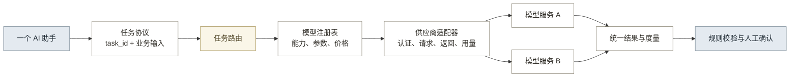

# 13-7 · 模型接入与选型

## 一、定位

模型接入是八个业务模块共用的横向能力。用户面对一个 AI 助手；服务端按任务选择模型，规则程序控制流程、计算、校验和写入，专业人员负责判断与签发。

通用接入先统一任务协议，再由供应商适配器处理地址、认证、参数、返回和用量差异。兼容 OpenAI Chat Completions 的供应商可通过配置接入，其他协议需增加适配器。

## 二、任务分类

调用点归为六类，模型按任务选，不按页面选（见表 1）。

**表 1：任务类型与选型条件**

| 任务类型 | 当前任务 | 必要能力 | 质量底线 |
|---|---|---|---|
| 指令路由 | 意图分发 | 工具调用、低时延 | 只能选择受控动作，失败不执行 |
| 文本结构化 | 立项理解、任务书提取、资料判断、草图解析、框选理解 | 中文理解、稳定 JSON | 缺失字段留空，不能补猜 |
| 文档视觉理解 | 资料分类、任务书识别、草图识别 | OCR、版面与手写内容理解 | 看不清内容必须标出，数值不得猜测 |
| 专业视觉识别 | 构件与材料识别、位置框 | 高分辨率视觉、局部定位、专业术语 | 误识别和遮挡项可定位、可复核 |
| 说明生成 | 检查解释、交付说明 | 忠于输入、结构化输出 | 不新增规则结论，不改变责任边界 |
| 综合分析 | 修改建议、自由问答 | 长上下文、证据引用 | 修改只形成建议，程序校验后由人确认 |

## 三、接入架构

模型调用经过统一任务协议和供应商适配（见图 1）。

**图 1：模型接入与任务路由**

各层边界见表 2。

**表 2：接入职责**

| 层 | 负责 | 边界 |
|---|---|---|
| 任务协议 | 定义任务、输入、最大输出和结构要求 | 模型名称由任务路由管理 |
| 任务路由 | 按任务选择首选与备用模型 | 业务流程由编排层控制 |
| 模型注册 | 声明能力、上游名称、参数策略和官方价格 | 密钥由服务端环境配置 |
| 供应商适配 | 处理地址、认证、参数差异、错误和用量字段 | 业务结果由规则和人工验收 |
| 度量 | 记录任务、模型、输入输出、耗时、重试、费用和采用 | 选型使用多次固定样本结果 |

浏览器不能提交模型名称或模型特殊参数。密钥、模型路由和价格只在服务端配置。

## 四、选型方法

先用固定样本检查质量底线，未通过的模型不进入成本比较。通过后再比较：

1. 任务完成率与字段准确性。
2. 直接采用、人工修改、删除和忽略情况。
3. 首次返回时间、总耗时、失败和重试。
4. 输入、输出、缓存、图像等 API 费用。
5. 人工复核和修改时间。

单次成功任务成本为：

> API 费用 + 失败重试费用 + 人工检查与修改成本

测试资料必须固定，至少覆盖正常、缺失、冲突、遮挡、模糊和手写内容。相同任务使用同一提示词和输出结构，多次运行后再比较。公开基准只能验证通用能力，不能替代古建项目样本。

## 五、价格与记录

价格声明必须包含币种、输入价、输出价、缓存价、官方来源和核对日期。无可靠价格时显示“待配置”，不使用统一单价估算。

每次调用记录：

- 任务与任务类型；
- 供应商、内部模型和上游模型；
- 输入、输出、缓存和推理 Token；
- 耗时、重试、失败与降级；
- 估算费用及价格来源；
- 直接采用、修改、删除或忽略；
- 同任务人工基线和 AI 后核对修改时间。

## 六、当前状态

当前路由用于原型测试，最终选型仍需固定样本评测（见表 3）。

**表 3：当前路由**

| 任务 | 当前模型 | 状态 |
|---|---|---|
| 文字结构化、说明、路由和问答 | Moonshot V1 128K | 已迁入通用适配层；已配置官方输入、输出价格 |
| 文档与专业视觉任务 | Kimi K2.6 | 已迁入通用适配层；已配置官方输入、缓存和输出价格 |
| 其他供应商 | 未接入 | 接口已预留，接入后需用同一批样本测试 |

价格来源：[Moonshot V1](https://platform.kimi.com/docs/pricing/chat-v1)、[Kimi K2.6](https://platform.kimi.com/docs/pricing/chat-k26)，核对日期为 2026-08-09。

原型已完成任务注册、模型注册、供应商适配、服务端路由、候选模型降级和任务级度量。当前仅接入一家供应商，跨供应商比较待补充。

## 七、建设顺序

建设顺序见表 4。

**表 4：模型接入与选型建设顺序**

| 顺序 | 工作 | 完成条件 |
|---:|---|---|
| 1 | 固定任务协议与质量底线 | 每个调用点有 task_id、输入边界和失败处理 |
| 2 | 建立注册、适配、路由与度量 | 更换模型不修改业务代码，浏览器不能指定模型 |
| 3 | 建立古建任务测试集 | 六类任务均有固定输入和人工核对答案 |
| 4 | 接入候选文字与视觉模型 | 至少两种候选可在同一任务上对比 |
| 5 | 形成任务级选型表 | 质量达标后再比较耗时、费用和人工修改量 |
| 6 | 配置首选、备用与降级 | 失败时可切换，所有切换进入记录 |

近期先完成第 3 至第 5 项。没有真实样本结果前，不对外声称某模型是最优解。
