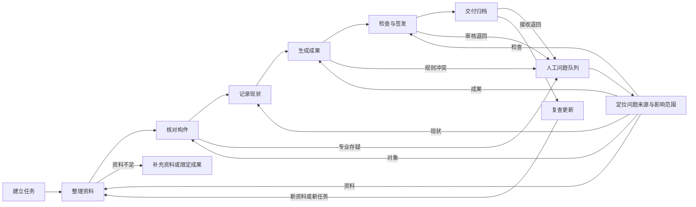

# 13-8 · 古建保护成果工作台 PRD v1.0

## 一、产品概述

古建保护成果工作台帮助测绘与保护团队完成资料接收、成果生产、正式交付、归档和复查更新。

### 1.1 产品目标

产品把分散的照片、图纸、实测记录、任务要求和专业判断组织为可追溯的项目数据。团队在同一工作区核对证据、处理专业问题、生成成果并保留责任记录。

| 目标 | 终局验收要求 |
|---|---|
| 提高成果质量 | 正式成果中的每项关键数据都能回到原始证据、规则结果或人工决定 |
| 减少重复工作 | 同一资料和项目数据不在不同页面重复录入，修改后只更新受影响结果 |
| 缩短交付过程 | 系统自动完成资料整理、固定检查、状态更新和文件汇总，人工只处理责任事项 |
| 保留项目历史 | 交付后的资料、对象、问题、成果和版本可继续查询、比较和更新 |
| 控制模型风险 | 模型结果始终标明来源，模型失败时规则流程和人工录入仍可继续 |

效率提升幅度、真实采用率和付费结果仍是假设。产品上线前需要使用真实项目建立人工基线，并按相同任务比较总耗时、返工量、成果采用和人工修改量。

终局验收不预设没有依据的数值。成果质量不得低于人工基线，无证据结果需要减少。

同一成果的单项净成本应下降，且成果要进入真实项目工作过程。中断恢复与项目恢复测试必须通过。具体阈值由真实项目基线确定。

### 1.2 核心假设

以下四项假设决定产品能否进入真实工作和持续使用。

| 假设 | 如果不成立 | 验证方式 |
|---|---|---|
| 测绘团队愿意围绕结构化项目数据工作 | 产品只能作为一次性演示工具 | 观察真实项目中数据核对、修改和交付过程 |
| 来源与版本记录能减少复核和返工 | 追溯能力不能形成用户价值 | 对比有无工作台时的问题定位时间和重复修改量 |
| 有限类别内的成果生成规则可以复用 | 每个项目都需要重新开发规则 | 使用不同建筑、资料缺口和成果要求进行测试 |
| 交付后存在查询、复查或更新需求 | 持续归档能力缺少使用场景 | 访谈成果接收方并跟踪已交付项目的后续使用 |

### 1.3 产品边界

产品服务古建测绘、现状记录和保护成果生产，不代替现场工作、专业审核和责任签发。

以下事项不属于产品职责：

- 根据单张照片编造不可见结构、尺寸、材料、病害或年代。
- 把模型推测或演示数据转成现场实测事实。
- 代替具备资质的人员作出专业结论或签发正式成果。
- 作为通用三维建模、通用 BIM、通用 GIS 或公众展示平台。
- 在没有权属和授权依据时公开、训练或转发项目资料。

### 1.4 术语

本文使用以下术语区分资料事实、专业责任和成果资格。

| 术语 | 本文含义 |
|---|---|
| 关键数据 | 会影响对象身份、尺寸、专业结论、成果表达或交付资格的数据 |
| 普通事实 | 可由清晰资料直接核对，不需要专业推断的名称、编号、位置或转写内容 |
| 高风险问题 | 可能改变专业结论、正式责任、资料权属或已签发成果的问题 |
| 可靠证据 | 来源、时间、权属和适用范围清楚，且能支持当前用途的资料或现场记录 |
| 正式资格 | 一条记录可否进入正式成果；资格由证据、核对、数据状态和责任条件共同决定 |

## 二、用户与责任

产品按操作、责任、接收和采购四类角色设计。该分法是当前角色假设，需通过真实项目记录和采购访谈验证。

一个人可以兼任多个角色，但不能因此降低专业责任或签发要求。

| 角色 | 典型人员 | 核心任务 | 责任范围 |
|---|---|---|---|
| 操作用户 | 绘图员、内业整理人员 | 整理资料、核对对象、处理普通修改、生成成果 | 对录入和修改记录负责 |
| 责任用户 | 项目负责人、专业审核人 | 确认任务与规范、处理专业问题、审核签发 | 对专业结论和正式成果负责 |
| 接收方 | 委托方、文物部门、代理验收人 | 核验交付内容、提出退回、查询项目记录 | 对接收意见和使用要求负责 |
| 买单方 | 乙方企业、项目总包方、文物部门 | 决定采购、部署和持续使用 | 对预算、数据要求和部署方式负责 |

操作用户不能替责任用户完成正式签发。接收方可以提出退回意见，但不能修改乙方的原始证据和责任记录。

### 2.1 接收方

接收方在交付核验时进入项目。其查看范围包括交付清单、成果版本、检查结果和已授权的来源关系。接收方可以接收或退回指定内容，不能改写生产方数据、人工决定或签发记录。

验收要求：接收方能指出退回对象、理由和影响范围；生产方能根据退回记录定位受影响内容。

### 2.2 买单方

买单方是采购决策相关方，不是日常生产角色。其查看范围包括适用任务、采用情况、成本记录、安全边界和部署条件。预算决定不能修改专业事实或签发结果。

验收要求：买单方能判断产品适用于哪些项目、需要哪些投入、数据存放在哪里，以及上线后如何衡量采用和成本。

## 三、完整工作流程

用户从任务要求出发，经过资料、对象、现状、成果和检查，最终形成可追溯交付，并在新资料出现后继续更新项目记录。

问题解决后回到问题来源或受影响环节。未受影响的数据、人工决定、成果和签发记录继续保留。

### 3.1 建立任务

负责人确认保护对象、成果要求、适用规范、精度、交付内容、期限和责任角色。系统从任务书和已有项目记录中整理候选内容，未提供的信息保持为空。

任务范围、适用规范和责任角色集中确认一次。后续只有任务要求发生变化时才重新确认受影响内容。

### 3.2 整理资料

用户导入照片、图纸、文档、实测记录和历史成果。系统识别文件类型与质量，提取资料中已有的来源、时间、权属和用途声明。

缺失内容保持缺失，由有责任的人员补充或确认。系统指出重复、冲突或不可读取的资料。

资料不足时，用户可以补充资料、限定成果范围或保留为草稿。系统必须说明每种选择对后续成果的影响。

### 3.3 核对构件

系统从资料中提出建筑、构件、位置、关系、尺寸和观察候选。用户核对后形成对象与证据的关系，不需要重复录入已经存在的信息。

模型负责识别和表达候选，规则程序负责计算和固定检查。证据不足、专业存疑、规则冲突和高风险内容进入人工问题队列。

### 3.4 记录现状

系统把可见现象与对应建筑对象关联，区分现场观察、测量事实、模型判断和专业结论。不可见部位、疑似病害和材料判断不能直接写成确定事实。

专业人员可以确认、否定或保留存疑。每个决定记录人员、时间、理由、证据和影响范围。

### 3.5 生成成果

系统根据已确认任务、对象数据、规则版本和成果模板生成图纸、表格、报告或结构化数据。相同输入和规则应得到相同结果。

数据变化后，系统只使受影响成果失效，并说明需要重新生成的内容。既有预览不能继续显示为当前成果。

### 3.6 检查与签发

规则程序自动执行完整性、尺寸关系、格式、版本和交付清单检查。模型可以解释问题和定位证据，但不能修改检查结果或代替专业判断。

专业审核人处理剩余问题，责任人完成正式签发。系统记录签发身份、成果版本、检查版本和时间。

### 3.7 交付归档

系统汇总成果文件、结构化项目数据、检查记录、版本说明、责任记录和交付清单。接收方可以核验文件完整性、来源和版本，并提出有明确影响范围的退回意见。

交付完成后，项目继续保留资料、对象、决定和成果之间的关系，不把交付包当作孤立文件存放。

### 3.8 复查更新

新照片、复查记录、维修资料或新任务进入原项目时间线。系统比较新旧证据和对象状态，形成变化候选与复查任务。

用户确认变化后生成新版本。旧资料、旧结论和旧成果继续保留，任何更新都不能覆盖历史责任记录。

## 四、AI、规则程序与人工分工

AI 负责理解不确定输入，规则程序负责确定计算，人工负责现场事实、专业判断和正式责任。

| 工作 | AI | 规则程序 | 人工 |
|---|---|---|---|
| 理解任务书和自然语言 | 提取候选、解释缺口 | 检查必填项与格式 | 确认范围、规范和责任人 |
| 整理照片、文档和图纸 | 分类、摘要、关联候选 | 去重、文件校验、数量统计 | 补充来源、权属和用途 |
| 识别构件和现状 | 提出名称、位置和观察候选 | 检查词表、关系和数据格式 | 处理专业存疑和高风险问题 |
| 处理实测记录 | 转写原始记录、指出不清内容 | 计算尺寸关系、单位换算 | 完成现场测量并核对转写 |
| 生成成果 | 解释设置、起草文字 | 生成图纸、表格和文件 | 选择专业规则并审核结果 |
| 检查成果 | 解释问题、定位证据 | 执行可重复检查 | 处理规则无法决定的问题 |
| 交付与更新 | 整理说明、提示影响 | 汇总文件、校验版本 | 签发、接收、决定是否更新 |

模型结果必须来自一次可识别的真实调用，并保存模型、任务类型、时间和运行记录。预置内容统一标为演示数据，不能显示为模型结果。

### 4.1 候选准入

模型输出先进入候选区，不直接写入正式数据。候选被核对后，系统建立一条新的业务记录，同时保留模型运行、原始证据和人工决定之间的关系。

不同内容使用不同责任门槛：

- 普通事实可由操作用户对照清晰来源核对。来源可用、核对通过且没有冲突时，记录可以取得正式资格。
- 专业结论、高风险问题和规则冲突必须由匹配的专业审核人决定。普通核对不能替代专业决定。
- 现场实测必须有原始测量记录、单位、方法、时间和人员。模型转写经过核对后仍是对原记录的转写，不能补成不存在的现场事实。
- 规则结果只有在输入记录具备正式资格、适用规则已经确认、规则版本有效且检查通过时，才能用于正式成果。

未核对、已拒绝、已替代或存疑的记录不参与正式成果生成。演示数据永远不能取得正式资格。

系统按证据、核对状态、数据状态和责任条件判断正式资格。用户不能直接改写资格结论。

## 五、人工节点

产品只在责任必须由人承担或系统缺少可靠依据时暂停。

### 5.1 任务确认

负责人一次确认任务范围、适用规范、成果要求和责任角色。系统已经从可靠资料得到且没有冲突的普通字段不要求逐项点击确认。

### 5.2 异常问题处理

人工问题队列只接收以下事项：

- 证据不足或不同资料相互冲突。
- 构件、材料、病害、年代或不可见结构存在专业存疑。
- 规则无法得到唯一结果。
- 修改会影响已确认成果或正式责任。
- 数据权属、隐私或对外使用范围不明确。

批量处理只适用于来源清楚、没有冲突的普通事实。专业结论、现场实测、高风险问题和正式签发不能批量接受。批量处理后每项仍保留独立记录。

普通页面切换、固定检查通过和默认成果样式不设置确认节点。

### 5.3 正式签发

正式成果只允许匹配责任角色的人员签发。签发前必须通过交付门槛，系统不能通过姓名输入框模拟身份和权限。

现场测量、资料整理和绘图属于工作动作，不额外设置形式化确认按钮。系统通过操作记录保存人员和时间。

## 六、产品能力

八项业务任务构成完整产品，交互、来源、权限和模型管理是共同能力。表中的 P0 和 P1 表示终局产品内的重要程度，不代表当前开发已经获得批准。

缺少 P0 时，成果生产或交付不能成立。P1 不阻断核心生产，但属于终局完整产品。

| 编号 | 用户任务 | 主要输入 | 主要输出 | 优先级 |
|---|---|---|---|:---:|
| R001 | 建立任务 | 任务书、用户说明、历史项目 | 已确认任务要求与责任分工 | P0 |
| R002 | 整理资料 | 照片、文档、图纸、实测、历史成果 | 可用资料清单、缺口和证据关系 | P0 |
| R003 | 核对构件 | 资料、对象候选、尺寸与关系 | 可追溯建筑对象与问题队列 | P0 |
| R004 | 记录现状 | 可见现象、测量和专业判断 | 与对象关联的现状记录 | P0 |
| R005 | 生成成果 | 任务、对象数据、规则和模板 | 图纸、表格、报告与结构化数据 | P0 |
| R006 | 检查与签发 | 成果、规则、证据和责任身份 | 检查结果、人工决定和签发记录 | P0 |
| R007 | 交付归档 | 已签发成果与项目记录 | 交付包、版本说明和项目档案 | P0 |
| R008 | 复查更新 | 新资料、新任务和历史版本 | 变化记录、新版本和复查结果 | P1 |
| R009 | 使用统一助手 | 自然语言、文件和框选说明 | 任务候选、解释、操作建议和进度 | P0 |
| R010 | 查看来源与版本 | 任何业务数据或成果 | 证据、产生方式、核对状态和版本关系 | P0 |
| R011 | 管理人员与权限 | 组织、项目和角色信息 | 可执行操作与责任范围 | P0 |
| R012 | 交换项目数据 | 项目数据与资源文件 | 可校验、可恢复的项目包 | P0 |

### 6.1 建立任务

系统必须支持新建任务、从历史项目继续任务和从外部项目包恢复任务。未提供字段保持缺失，不能继承其他项目内容。

验收要求：任务要求可以回到任务书或人工决定；修改任务后，系统能定位受影响资料、规则和成果。

### 6.2 整理资料

系统必须保存文件本身、来源、时间、权属、用途、质量和关联对象。无法读取的文件保留记录并提供替换、重试或人工归类出口。

验收要求：用户能够从资料定位对象，也能从对象返回原始资料；资料缺口明确说明阻止的成果范围。

### 6.3 核对构件

系统必须支持对象层级、稳定身份、位置、关系和属性。模型候选不能直接覆盖已确认数据，人工修改只影响指定对象及其下游结果。

验收要求：用户可以在原图中定位对象、改正名称、补录遗漏、标记不存在或保留存疑，并查看完整修改记录。

### 6.4 记录现状

系统必须区分测量、可见观察、模型候选和专业判断。每条记录说明对象、时间、证据、人员和适用范围。

验收要求：无现场依据的内容不能成为实测事实；单张照片不能直接形成确定材料、病害或年代结论。

### 6.5 生成成果

系统必须使用明确的输入版本、规则版本和成果模板。生成失败时保留已确认项目数据，并说明失败原因和重试条件。

验收要求：相同输入与规则产生一致结果；任何业务修改都会使受影响成果进入失效状态。

### 6.6 检查与签发

系统必须分别显示自动处理问题、需要人工决定的问题和阻止交付的问题。检查规则不依赖模型判断才能执行。

验收要求：正式签发绑定责任身份、成果版本和检查结果；未通过交付门槛时不能签发。

### 6.7 交付归档

系统必须生成包含成果、数据、检查、版本、责任和清单的交付包。导出后重新导入应恢复同一项目关系。

验收要求：接收方可以核对文件数量、哈希、来源和版本；项目之间的数据、资源和记录完全隔离。

### 6.8 复查更新

系统必须支持在历史项目上增加新证据、比较变化、创建复查任务和发布新版本。历史版本只读保留。

验收要求：用户可以说明某项变化来自哪次复查、影响哪些成果，并在需要时恢复查看旧版本。

### 6.9 使用统一助手

任务工作区只有一个助手。助手使用当前项目、当前任务、当前选择和已授权资料作为上下文，提供候选、解释和受控操作。

关闭助手后，用户仍能通过表单、列表和菜单完成全部主操作。

助手失败时不影响已有数据和规则流程。涉及业务数据的操作必须显示对象与影响范围，执行后写入操作记录。助手不能绕过角色权限、专业决定或签发门槛。

验收要求：用户在资料、对象、问题和成果之间切换时不需要重建上下文；同一操作通过助手和普通界面得到相同业务结果。

### 6.10 查看来源与版本

用户选择尺寸、构件、结论或成果时，可以看到原始证据、产生方式、核对记录、数据状态、正式资格和成果版本之间的关系。

关系缺失时，系统显示缺口及其影响，不能用空白或默认值代替。

验收要求：用户能从成果回到证据，也能从证据查看受影响对象和成果；被拒绝或替代的结果不会继续参与当前成果。

### 6.11 管理人员与权限

项目开始时设置人员与责任角色一次。后续操作沿用当前身份，不在每个确认窗口重复填写。角色变更保留生效时间和影响范围，已签发记录不随人员变更而改写。

无权操作必须被阻止并说明所需角色。多人同时修改同一内容时，系统不能静默覆盖；用户需要查看差异并选择保留内容。

验收要求：操作、专业决定、签发、接收和采购查看各自受限；任何责任动作都能回到当时的人员与角色。

### 6.12 交换项目数据

系统支持导入、预览、选择、校验和导出结构化项目数据与配套资源。导入前说明项目身份、内容、版本、资源缺口和冲突；导入失败不改变当前项目。

验收要求：项目导出后可在空环境恢复资料、对象、候选、决定、成果和审计关系；恶意文件、缺失资源和版本不兼容均有明确错误，不执行部分覆盖。

### 6.13 需求阅读索引

下表补充每项需求的用户故事、前置条件及相关章节。功能要求和验收要求以上文各需求正文为准。

| 编号 | 用户故事 | 前置条件 | 主流程 | 异常与权限 | 界面 | 数据 |
|---|---|---|---|---|---|---|
| R001 | 责任用户需要固定任务与责任边界 | 已有任务说明或新任务 | 3.1、6.1 | 第九章任务变化 | 任务工作区 | 任务要求、人员角色 |
| R002 | 操作用户需要整理资料并看见缺口 | 已确认任务 | 3.2、6.2 | 第九章文件不可读、资料不足 | 资料工作区 | 资料、证据、用途声明 |
| R003 | 操作用户需要核对构件和证据 | 已导入可用资料 | 3.3、6.3 | 5.2、9 章专业存疑与冲突 | 原图与对象联动 | 构件、关系、证据 |
| R004 | 操作与责任用户需要记录现状 | 已建立对象 | 3.4、6.4 | 4.1、5.2 的责任门槛 | 对象与现状联动 | 观察、测量、决定 |
| R005 | 操作用户需要生成可重复成果 | 任务和输入版本可用 | 3.5、6.5 | 第九章生成失败与数据变化 | 成果工作区 | 输入、规则、模板、成果 |
| R006 | 审核人与责任人需要检查并签发 | 当前成果已生成 | 3.6、6.6 | 5.3、9 章阻断与退回 | 检查与问题工作区 | 检查、决定、签发 |
| R007 | 接收方需要核验完整交付 | 指定成果已签发 | 3.7、6.7 | 第九章接收退回 | 交付清单与来源查看 | 交付、版本、审计 |
| R008 | 责任用户需要复查并发布新版本 | 存在已交付项目 | 3.8、6.8 | 第九章历史保护与失效 | 时间线与版本比较 | 新旧证据、变化、版本 |
| R009 | 业务用户需要在一个助手中获得帮助 | 已打开项目 | 6.9 | 模型失败与越权操作 | 可收起助手面板 | 当前上下文、运行与操作记录 |
| R010 | 业务用户需要查清来源和影响 | 已选择数据或成果 | 6.10 | 来源缺失与记录替代 | 来源关系查看 | 来源、核对、状态、版本 |
| R011 | 项目管理者需要设置角色和权限 | 已建立项目与人员身份 | 6.11 | 未授权与多人冲突 | 人员与权限设置 | 身份、角色、生效时间、审计 |
| R012 | 操作用户需要交换和恢复项目 | 已选择外部项目或当前项目 | 6.12 | 导入失败与版本不兼容 | 导入预览与导出清单 | 项目数据、资源、哈希、审计 |

## 七、产品数据要求

项目数据必须从交付成果反推，并能解释每项数据为何存在、从哪里来、在哪里使用、由谁更新以及影响什么结果。

| 数据对象 | 必须说明的内容 |
|---|---|
| 项目与建筑 | 身份、地点、保护对象、生命周期和验证性质 |
| 任务要求 | 成果类型、规范、精度、交付内容、期限和责任角色 |
| 资料与证据 | 文件、来源、时间、权属、质量、用途和关联对象 |
| 构件与关系 | 稳定身份、类别、层级、位置、关系和属性 |
| 观察与测量 | 数值或现象、单位、方法、时间、人员和原始证据 |
| 候选结果 | 产生者、运行记录、证据、置信信息和适用范围 |
| 问题与决定 | 阻断原因、责任角色、选择、理由和影响范围 |
| 成果与检查 | 输入版本、规则版本、生成结果、检查结果和状态 |
| 交付与审计 | 交付清单、签发、权限、版本和操作事件 |

产生来源、证据类型、核对状态、完整性状态和正式资格必须分别记录。人工确认模型转写只表示已经核对，不能把推测值变成现场实测事实。

## 八、状态与版本

系统用状态表达业务事实，不用页面步骤代替真实进度。

### 8.1 项目状态

项目状态显示当前工作位置和下一责任人。

- 准备中：任务或资料尚未达到生产条件。
- 处理中：系统或人员正在形成项目数据与成果。
- 待处理问题：存在需要责任角色处理的事项。
- 待签发：检查完成，等待正式责任确认。
- 已交付：指定成果版本已经交付。
- 更新中：交付后出现新资料或新任务。

### 8.2 数据状态

数据状态说明一条记录是否满足当前用途。

- 可用：资料或记录满足当前用途。
- 存疑：证据不足或存在冲突。
- 缺失：任务要求需要但尚未提供。
- 失效：上游数据变化，当前结果需要重新生成。

### 8.3 核对状态

核对状态说明合格人员是否处理过当前记录。

- 未核对：尚无合格人员对照证据处理。
- 已确认：合格人员已在其责任范围内接受该记录。
- 已拒绝：该记录不进入当前业务数据和成果。
- 已替代：新记录已经取代当前记录，旧记录只读保留。

### 8.4 正式资格

正式资格只回答记录能否进入正式成果。

- 可用于正式成果：证据、核对、数据状态和责任条件全部满足。
- 不可用于正式成果：至少一项条件不满足，并列出阻断原因。

核对通过不等于自动取得正式资格。数据存疑、证据缺失、责任角色不匹配或演示来源都会阻止正式资格。

### 8.5 成果状态

成果状态说明当前版本是否可以检查、签发或交付。

- 草稿：允许继续核对，不可正式交付。
- 待检查：生成完成但尚未运行当前版本检查。
- 待人工处理：规则已完成，仍有责任问题。
- 待签发：满足检查要求，等待责任人签发。
- 已签发：责任人确认指定版本。
- 已替代：存在更新版本，继续保留历史记录。

## 九、异常与恢复

任何失败都必须保留已经确认的数据，并给出可执行的下一步。

| 异常 | 系统处理 | 用户出口 |
|---|---|---|
| 文件不可读 | 保留文件记录和失败原因 | 替换、重试或人工归类 |
| 模型不可用 | 停止模型任务，不伪装成功 | 人工录入或稍后重试 |
| 资料不足 | 标记受影响对象和成果 | 补充资料、限定范围或保留草稿 |
| 规则冲突 | 列出规则、对象和证据 | 由专业人员决定适用方式 |
| 任务要求变化 | 计算影响范围并使下游结果失效 | 确认变化后重新处理 |
| 审核退回 | 保存退回原因和成果版本 | 只重做受影响内容 |
| 导入失败 | 不覆盖当前项目 | 查看错误并修正项目包 |
| 本地保存失败 | 保留当前内存状态并提示风险 | 立即导出或更换存储位置 |
| 多人修改冲突 | 保留双方内容和各自版本，不静默覆盖 | 查看差异后决定保留或建立新版本 |
| 审核期间数据变化 | 保留审核对应版本，使受影响检查失效 | 重新检查受影响内容后再签发 |

已签发版本保持只读。任何后续修改都建立新版本，只让受影响内容和下游结果失效。

## 十、非功能要求

正式成果生产要求数据可追溯、规则可重复、任务可恢复，并满足项目资料的安全边界。

| 类别 | 要求 | 验收方式 |
|---|---|---|
| 可追溯 | 正式成果关键数据全部关联来源、决定和版本 | 从成果抽样回查原始证据 |
| 可重复 | 相同输入、规则和模板产生一致结果 | 固定样本重复生成并比较 |
| 隔离 | 项目之间的数据、资源、人员和审计记录不串用 | 切换和导入多个项目测试 |
| 恢复 | 项目包可恢复当前数据、资源、成果和审计关系 | 导出后在空环境重新导入 |
| 安全 | 密钥不进入客户端和项目包，外部文件按不可信输入处理 | 安全检查和恶意文件测试 |
| 隐私 | 项目资料的存储、模型传输和对外使用范围可配置 | 权限与传输记录审计 |
| 可用性 | 不依赖对话也能完成全部主操作 | 关闭助手后执行完整任务 |
| 可访问性 | 主要操作支持键盘，状态不只依赖颜色 | 键盘和颜色对比检查 |
| 成本 | 模型任务记录耗时、费用、失败、重试和人工修改量 | 按任务查看运行与人工成本 |

常用项目规模、文件数量、等待反馈时长和恢复时限尚无可靠基线。上线前应从真实项目记录中建立这些指标，再确定验收阈值。

## 十一、终局验收场景

产品必须通过正常交付、资料不足、模型失败、审核退回、跨期更新和跨项目隔离场景。

### 11.1 正常交付

用户从空项目导入任务书、照片、实测记录和历史图纸。系统整理资料、形成对象候选、处理问题、生成成果，完成自动检查与签发准备。

匹配责任角色的人员完成签发。接收方获得成果文件、结构化数据、检查记录、版本说明和交付清单。

通过条件：全部正式数据可追溯，交付包可重新导入，成果版本与签发记录一致。

### 11.2 资料不足

项目缺少正式实测基准，照片存在遮挡。系统允许继续整理对象和生成草稿，但阻止正式签发，并明确需要补充的资料和受影响范围。

通过条件：系统不编造尺寸或不可见内容，补齐资料后只重新处理受影响结果。

### 11.3 模型失败

模型在资料分类或图像识别时超时。系统保留原始资料和已有项目数据，用户可以人工录入；规则检查和既有成果查看继续可用。

通过条件：界面不显示伪造模型结果，重试不会重复写入业务数据。

### 11.4 审核退回

接收方退回一个尺寸依据和一项图纸表达。系统定位对应证据、对象、规则和成果，只使受影响内容及下游版本失效。

通过条件：未受影响的人工决定和历史成果继续保留。

### 11.5 复查更新

已交付项目加入新的现场照片和维修记录。系统形成变化候选，负责人确认后发布新成果版本。

通过条件：用户可以比较新旧证据、对象状态和成果，旧签发记录不被覆盖。

### 11.6 多项目隔离

用户连续导入结构、资料和成果要求不同的项目，并分别修改和导出。

通过条件：页面、规则、资源、问题、成果和审计始终对应当前项目，不依赖固定项目字段或文案。

## 十二、产品验收结论

产品只有在真实项目中形成可采用成果，并证明来源、质量、责任、成本和恢复能力后，才达到终局要求。

质量不得低于人工基线，同一成果的单项净成本应下降，恢复测试必须通过。至少出现继续使用、主动询价、采购测试或付费中的一种真实行为。

采用率、质量和成本的具体阈值由真实基线确定。

演示数据、代理交付和技术测试只能证明流程与实现可运行。它们不能证明正式成果被采用、法定责任成立、效率已经提升或用户愿意付费。

## 十三、依据索引

本 PRD 延续已有调研与产品分析中的有效结论，依据如下。

- 产品定位、角色假设和验证边界：[《12 · 调研结论》](12_调研结论.md)第二、四、八部分。
- 专业责任与人工职责：[《13-1 · AI 业务问题审计》](13-1_AI视角业务问题审计.md)第五、六部分。
- AI、规则程序、人工分工与返修路径：[《13-2 · AI 能力与人机分工》](13-2_可迁移AI能力与流程影响.md)第四、八、九部分。
- 八项业务任务及共同能力：[《13-4 · 产品模块与优先级》](13-4_产品模块总图与迭代优先级.md)第二至五部分。
- 主流程、异常支线和单张照片的事实边界：[《13-5 · 用户旅程》](13-5_用户旅程.md)第二至四部分。
- 统一助手、任务工作区和证据联动：[《13-6 · 界面与交互形态》](13-6_界面与交互形态.md)第二至五部分。
