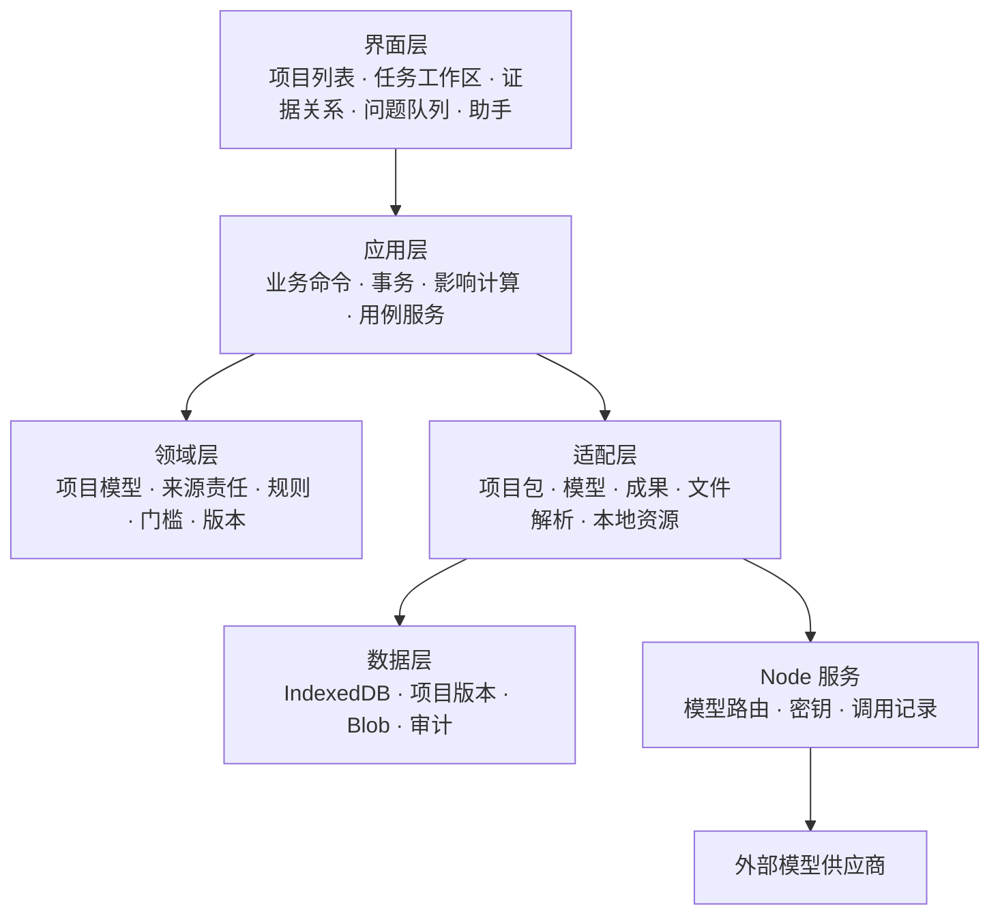
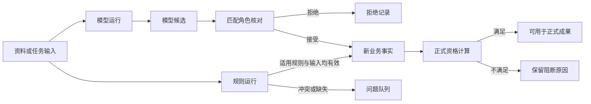

# 13-9 · 古建保护成果工作台技术架构 v1.0

## 一、目标与边界

本轮采用模块化单体，替换旧全局对象、超大编排器和浏览器键值存储。产品输入以 `13-8_核心PRD_古建保护成果工作台.md` 为准。

### 1.1 技术目标

目标是让每项业务数据和操作都有单一责任位置。

- 项目数据、资源、业务逻辑、界面和模型调用分别管理。
- 所有业务修改通过受控命令执行，页面不直接改项目数据。
- 模型只产生候选，规则程序产生可重复结果，人工决定保留责任记录。
- 项目、资源、版本和审计记录在本地完整保存，也能通过项目包交换。
- 高都完成代理交付，东呈验证五开间、资料缺失和交付阻断。
- 新架构通过验收后再移除旧运行入口，旧代码继续保留在 Git 历史中。

### 1.2 本轮范围

本轮实现以下能力：

- React、TypeScript、Vite 网页应用。
- 独立 Node 模型代理服务。
- IndexedDB 项目仓库和二进制资源存储。
- 单独项目数据与完整项目包的导入导出。
- 业务命令、模型候选、规则结果、人工问题和来源查询。
- SVG、DXF、结构化数据、检查报告、审计记录、清单和 ZIP 代理交付包。
- 高都与东呈两套项目数据及自动测试。

本轮不实现 DWG、正式身份认证、组织权限、云端多租户和法定签发。系统不把代理成果称为正式成果。

### 1.3 运行约束

系统首先满足本地代理验证，再保留私有部署扩展点。

- 网页本地优先运行，断开模型服务后仍可整理、检查、生成代理成果和导出项目。
- Node 服务默认不保存项目内容，只接收当前模型任务需要的最少输入。
- 私有服务器存储通过仓库接口扩展，不进入本轮实现。
- 浏览器宽度以 1440 px 和 1280 px 桌面工作台为验收环境。
- 项目资料按不可信输入处理，密钥不进入网页、项目数据或交付包。

## 二、现状与问题

旧原型可作为行为和迁移样本，不能继续承担目标产品运行职责。

### 2.1 当前结构

当前前端由全局脚本组成，Node 服务独立处理模型调用。

```text
index.html
├─ js/data.js              项目 JSON 加载、导入和全局 DATA
├─ js/store.js             localStorage 项目状态
├─ js/orchestrator.js      1509 行流程、对话和业务写入
├─ js/checkrules.js        固定检查
├─ js/drawgen.js           SVG 预览
├─ js/views/*              各阶段视图
└─ js/main.js              全局启动

server.mjs / api/* / server/*
└─ 模型代理、模型路由和调用度量
```

当前已有 10 项 Node 测试。它们覆盖项目数据、导入防护、项目隔离、界面转义和模型路由，可作为迁移回归基线。

### 2.2 主要问题

主要问题来自数据责任、全局状态和真实交付能力缺失。

| 问题 | 当前表现 | 目标要求 |
|---|---|---|
| 数据责任混合 | `状态` 同时表示产生者、可靠性和审核结果 | 分开记录产生者、证据、核对、数据状态和正式资格 |
| 全局可变状态 | `window.DATA`、`window.Store` 和视图共享可变对象 | 项目聚合由仓库读取，修改只经过应用命令 |
| 编排器耦合 | 一个文件处理对话、流程、模型和业务写入 | 按命令、领域规则、模型网关和问题服务拆分 |
| 存储能力不足 | localStorage 只适合小型文本状态 | IndexedDB 保存项目、Blob、版本和审计 |
| 资源关系脆弱 | JSON 保存路径，视图直接拼接资源地址 | 资源使用 `assetId`，界面只读取本地 Blob URL |
| 导入边界不足 | 浏览器直接解析项目 JSON | 深层 schema、数量、大小、路径、MIME 和哈希校验 |
| 成果并非真实生成 | 正式图和交付清单包含静态文件说明 | 按不可变项目版本生成实际文件和清单 |
| 业务特例残留 | 高都、三开间、比例和规范仍散落在旧代码 | 项目数据、规则定义和成果模板均由接口提供 |
| 人工责任不完整 | 姓名输入和状态按钮可模拟确认 | 本轮只允许代理确认，正式签发保持锁定 |

### 2.3 数据事实修正

高都与东呈都没有可核查的原始实测证据。两套现有数据统一作为 `demo` 迁移，不能取得正式资格。

高都现有数据缺少屋面高度，开间合计与通面阔也相差 4400 mm，不能直接用于制图。实现需新增一套独立、自洽并标为 `demo` 的代理制图输入，原矛盾继续保留在检查报告。

东呈缺少正式任务书、实测基准和尺寸制图输入，只能生成五开间证据草图和缺项报告。人工确认不会把两套数据转成现场实测。

## 三、方案选择

推荐模块化单体，因为它能建立明确边界，又不增加分布式系统成本。

| 方案 | 收益 | 代价与风险 | 结论 |
|---|---|---|---|
| 继续扩展旧原型 | 改动少，短期页面可继续运行 | 全局状态和业务特例继续扩大，安全与测试边界难以建立 | 不采用 |
| 模块化单体 | 前后端职责清楚，可按任务迁移和回退 | 需要同时建立类型、仓库和命令边界 | 采用 |
| 前后端服务化平台 | 便于多组织和云端协作 | 本轮没有身份、权限和多租户需求，部署与数据迁移成本过高 | 不采用 |

目标架构不采用微服务、完整事件溯源、通用工作流引擎或独立状态管理框架。当前快照、不可变版本和追加审计记录已经满足本轮恢复与追溯要求。

## 四、总体架构

系统分为界面、应用、领域、适配和数据五层，依赖只从上层指向下层接口。



### 4.1 目录结构

新代码按五层职责放入 `src`，现有 Node 服务继续放在 `server`。

```text
交互原型/02_AI工作台/
├─ src/
│  ├─ app/                  应用装配与路由
│  ├─ ui/                   页面、组件与交互状态
│  ├─ application/          命令和用例服务
│  ├─ domain/               类型、规则、资格与依赖关系
│  ├─ adapters/
│  │  ├─ storage/           IndexedDB 仓库
│  │  ├─ packages/          JSON 与 ZIP 项目包
│  │  ├─ model/             Node 模型网关
│  │  └─ artifacts/         SVG、DXF、报告和 ZIP
│  ├─ data/fixtures/        高都与东呈样例数据
│  └─ tests/                单元、契约和集成测试
├─ server/                  现有 Node 模型代理
├─ index.html
├─ package.json
└─ vite.config.ts
```

迁移期先保留当前 `js/`、`css/` 和旧入口。新应用验收后删除旧运行文件，不保留两套正式入口。

### 4.2 前端状态

React 只保存当前选择、面板开合和筛选条件。项目业务状态来自 `ProjectRepository`，通过应用服务订阅更新。

应用不引入 Redux 或同类全局状态框架。`ProjectCommandService` 是唯一业务写入口。

React 使用 Context 和 `useSyncExternalStore` 读取当前项目快照。

### 4.3 Node 服务

Node 服务保留 `/api/status` 和 `/api/ai`。服务端按任务选择供应商和模型，浏览器不能指定任意模型或上游地址。

每次真实模型调用返回 `runId`、任务类型、供应商、模型、开始时间、结束时间、状态和用量。服务端日志不得保存完整项目包或没有必要的原始资料。

开发时，Vite 在 5173 端口运行，并把 `/api` 转发到 8795 端口的 Node 服务。构建后，Node 服务可以提供 `dist` 静态文件和同源 API。

### 4.4 技术选择

本轮只增加完成本地工作台、校验、项目包和测试需要的依赖。

| 能力 | 选择 | 原因 |
|---|---|---|
| 界面与构建 | React、TypeScript、Vite | 组件和类型边界清楚，保留轻量本地运行 |
| schema | Zod | 导入、命令和模型响应共用可组合校验 |
| 本地数据 | 原生 IndexedDB | 支持事务、索引和 Blob，不增加仓库依赖 |
| ZIP | fflate | 浏览器可生成和读取项目包，体积较小 |
| 增量哈希 | @noble/hashes | 流式校验大文件，不把完整资源读入内存 |
| 单元与集成 | Vitest、Testing Library | 适配 TypeScript 和 React |
| 端到端 | Playwright | 覆盖导入、双项目、下载和恢复 |

Node 服务继续使用现有模块，不在本轮引入 Web 框架。模型供应商适配器沿用现有服务端注册表。

## 五、最小项目数据模型

项目以稳定英文键保存，界面和数据字典显示中文名称。ID 使用 UUID，时间使用带时区的 ISO 8601，尺寸必须带单位，资源只通过 `assetId` 关联。

### 5.1 持久化对象与读模型

不可变 `ProjectSnapshot` 是项目业务状态的唯一版本载体。运行、决定、成果、交付和审计分别追加保存，不嵌入快照，也不形成递归版本列表。

```ts
interface ProjectSnapshot {
  schemaVersion: "2.0";
  project: Project;
  buildings: Building[];
  task: TaskBrief;
  roleAssignments: RoleAssignment[];
  evidence: EvidenceRecord[];
  entities: HeritageEntity[];
  observations: Observation[];
  candidates: Candidate[];
  issues: Issue[];
  rules: TrustedRuleRef[];
  decisionRefs: string[];
  runRefs: string[];
}

interface ProjectRevision {
  id: string;
  projectId: string;
  parentRevisionId?: string;
  snapshot: ProjectSnapshot;
  contentHash: string;
  changedRefs: string[];
  invalidatedRefs: string[];
  createdAt: string;
}

interface ProjectAggregate {
  revision: ProjectRevision;
  modelRuns: ExecutionRun[];
  ruleRuns: RuleRun[];
  decisions: Decision[];
  artifacts: Artifact[];
  deliveries: Delivery[];
  audit: AuditEvent[];
}
```

`ProjectAggregate` 只由查询服务组装，不直接写入数据库或 `project.json`。二进制资源只存在资源仓库，业务对象通过 `assetId` 引用。

### 5.2 核心对象

每个对象只保存自身事实和稳定关联，不保存页面状态。

| 对象 | 关键字段 | 不变量 |
|---|---|---|
| `Project` | `id`、`name`、`status`、`validationMode`、`buildingIds` | 项目之间不共享业务对象 ID |
| `Building` | `id`、`projectId`、`name`、`location`、`protectionLevel` | 缺失信息保持空值，不继承样例 |
| `TaskBrief` | `deliverables`、`standards`、`precision`、`confirmedAt` | 范围、规范和责任角色集中确认一次 |
| `RoleAssignment` | `actorId`、`role`、`effectiveFrom`、`effectiveTo` | 角色变化不改写历史决定 |
| `EvidenceRecord` | `assetId`、`evidenceType`、`capturedAt`、`importedAt`、`quality`、`relatedEntityRefs`、三类声明 | 系统只提取已有声明，不能推断权属 |
| `HeritageEntity` | `id`、`buildingId`、`parentId`、`kind`、`name`、`location` | 构件层级和关系不依赖页面位置 |
| `Observation` | `entityId`、判别类型、事实值、来源和状态 | 测量、可见观察和专业结论分开 |
| `Candidate` | `kind`、`subjectRef`、`proposal`、`confidence`、`applicability`、来源和状态 | 候选不能直接覆盖业务事实 |
| `Issue` | `type`、`severity`、`subjectRefs`、`blockers`、`status` | 只接收证据不足、专业存疑、规则冲突和高风险问题 |
| `Decision` | `actorId`、`actorRole`、`choice`、`reason`、`scopeRefs`、`decidedAt` | 每个决定保留身份、理由和影响范围 |
| `Artifact` | `kind`、`sourceRevisionId`、`generatorVersion`、`assetId`、`sha256`、`status` | 成果由不可变项目版本生成 |
| `Delivery` | `mode`、`artifactIds`、`manifestAssetId`、`eligibility`、`createdAt` | `proxy` 与 `formal` 分开，正式交付本轮锁定 |
| `AuditEvent` | `id`、`projectId`、`commandId`、`actorId`、`type`、`timestamp`、`beforeHash`、`afterHash` | 只追加，不在原记录上改写 |

### 5.3 观察、测量与几何

测量记录必须保留现场记录本身；模型转写不能单独形成测量事实。

```ts
interface Quantity {
  value: number;
  unit: "mm" | "cm" | "m" | "degree";
  precision?: number;
}

type Observation =
  | VisibleObservation
  | MeasurementRecord
  | ProfessionalConclusion;

interface MeasurementRecord extends FactEnvelope<Quantity> {
  observationType: "measurement";
  measuredByActorId: string;
  measuredAt: string;
  method: string;
  originalEvidenceRef: string;
  transcriptionCandidateRef?: string;
}

interface ElevationGeometry {
  baySpans: Array<{ entityId: string; width: Quantity }>;
  baseHeight: Quantity;
  columnHeight: Quantity;
  roofRise: Quantity;
  eaveProjection?: Quantity;
}

interface ProxyDrawingInput {
  id: string;
  projectId: string;
  fixtureId: string;
  purpose: "proxy-artifact-generation";
  geometry: ElevationGeometry;
  limitations: string[];
}
```

`baySpans` 是数组，不预设三开间。正式几何只能由具备资格的事实解析。代理几何来自独立 fixture，必须完整、自洽并标为 `demo`，不能覆盖或修正项目中的原始矛盾记录。

`ElevationGeometry` 是立面成果适配器的输入 DTO，不是所有古建项目共用的领域对象，也不写入 `ProjectSnapshot`。

高都现有通面阔和开间合计不一致，且缺少 `roofRise`。实现时新增一套单独的完整代理制图输入，并在检查报告中继续保留 4400 mm 差异。系统禁止用默认值或项目名称补齐几何。

东呈没有完整制图输入，只能按照片中已标注的构件框生成五开间证据草图和检查报告。它不能生成尺寸立面 DXF，也不能复用高都代理几何。

### 5.4 来源与责任

产生者使用 Zod 判别联合，每种来源都必须引用真实记录。

```ts
type ProducerRef =
  | { producerType: "model"; runId: string }
  | { producerType: "rule"; ruleRunId: string }
  | { producerType: "human"; actorId: string; decisionId: string }
  | { producerType: "demo"; fixtureId: string }
  | { producerType: "system"; operationId: string; scope: "derived-metadata" };

interface FactEnvelope<T> {
  id: string;
  subjectRef: string;
  field: string;
  value: T;
  producer: ProducerRef;
  evidenceRefs: string[];
  reviewStatus: "unreviewed" | "confirmed" | "rejected" | "superseded";
  dataStatus: "available" | "uncertain" | "missing" | "stale";
  formalEligibility: FormalEligibility;
}

interface FormalEligibility {
  eligible: boolean;
  blockerCodes: string[];
  policyVersion: string;
  evaluatedAt: string;
}
```

`formalEligibility` 是独立派生判断，不属于产生来源。`system` 只允许生成哈希、失效状态和其他派生元数据，不能产生测量、可见观察或专业结论。

`evidenceType` 与产生者分开，至少包括 `photo`、`document`、`drawing`、`measurement-sheet`、`survey-note` 和 `artifact`。证据类型不代替数据状态或核对状态。

`producerType` 的唯一程序枚举是 `rule`。旧数据中的 `program` 只在迁移器读取时转换为 `rule`，新代码和导出包不再写入 `program`。

接受模型候选后，新业务事实仍引用模型运行，并通过核对状态和人工决定记录复核。人工修正的新值使用 `human`。系统不能把“已确认”改写成“人工产生”。

正式资格至少使用以下阻断码：

| 阻断码 | 条件 |
|---|---|
| `DEMO_SOURCE` | 记录来自演示数据 |
| `EVIDENCE_MISSING` | 缺少当前用途需要的证据 |
| `REVIEW_REQUIRED` | 核对状态不是已确认 |
| `DATA_UNAVAILABLE` | 数据存疑、缺失或失效 |
| `ROLE_MISMATCH` | 决定人员不具备所需角色 |
| `MODEL_RUN_MISSING` | 模型结果没有真实运行记录 |
| `MEASUREMENT_RECORD_MISSING` | 测量缺少人员、时间、方法、单位或原记录 |
| `RULE_INPUT_INELIGIBLE` | 规则输入中存在不可正式使用的记录 |

资格计算是领域规则。每次相关数据变化后重新计算，并作为事实上的独立字段写入新项目版本。它不另存第二份资格列表。

`UpdateFact` 不能直接修改产生者、核对状态、正式资格或审计字段。

### 5.5 模型与规则运行

模型运行和规则运行分别追加保存，不能共用来源类型。

```ts
interface ExecutionRun {
  id: string;
  projectId: string;
  sourceRevisionId: string;
  taskType: string;
  provider: string;
  model: string;
  startedAt: string;
  finishedAt?: string;
  status: "running" | "succeeded" | "failed" | "cancelled";
  inputHash: string;
  usage?: {
    inputTokens: number;
    outputTokens: number;
    cost?: { amount: number; currency: string };
  };
  errorCode?: string;
}

interface RuleRun {
  id: string;
  projectId: string;
  ruleId: string;
  ruleVersion: string;
  sourceRevisionId: string;
  inputHash: string;
  result: "pass" | "fail" | "blocked";
  outputRefs: string[];
}

interface TrustedRuleRef {
  id: string;
  version: string;
  parameters: Record<string, string | number | boolean>;
  contentHash: string;
}
```

规则结果引用固定输入版本和规则版本。相同输入、规则和模板必须得到相同内容哈希。

模型运行记录只允许从 `running` 转为一个终态，第二次完成请求返回第一次结果。规则运行、决定、成果、交付和审计记录建立后不原地改写；替代关系使用新记录表达。

### 5.6 项目文件与审计真源

数据库中的各对象仓库是运行时唯一事实源。项目包是这些记录在指定版本下的传输表示，不形成第二套可独立修改的数据。

`project.json` 保存 `ProjectRevision`、被引用的模型运行、规则运行、决定、成果元数据和交付元数据。它不保存审计事件正文。

`audit/events.ndjson` 是项目包中的唯一审计正文，并以 `auditHeadHash` 与 `project.json` 关联。

完整项目包导入时必须校验审计哈希和所有引用。单独导入 `project.json` 时，审计状态标为未包含，不能显示为完整恢复。

### 5.7 IndexedDB 存储

新应用使用独立数据库 `gujian-workbench-v2`。升级只通过集中版本迁移执行。

| 对象仓库 | 主键与索引 | 内容 |
|---|---|---|
| `projects` | 主键 `projectId`，索引 `updatedAt` | 当前项目摘要与当前版本 ID |
| `revisions` | 主键 `revisionId`，索引 `projectId` | 不可变 `ProjectRevision` |
| `assets` | 主键 `assetId`，索引 `sha256`、`projectId`、`importSessionId` | 资源记录和 Blob |
| `modelRuns` | 主键 `runId`，索引 `projectId`、`taskType` | 模型运行、用量和错误 |
| `ruleRuns` | 主键 `runId`，索引 `projectId`、`ruleId` | 规则运行与输入版本 |
| `decisions` | 主键 `decisionId`，索引 `projectId`、`decidedAt` | 人工决定与责任角色 |
| `artifacts` | 主键 `artifactId`，索引 `projectId`、`sourceRevisionId` | 成果记录与资源引用 |
| `deliveries` | 主键 `deliveryId`，索引 `projectId`、`sourceRevisionId` | 交付记录、门槛和清单引用 |
| `auditEvents` | 主键 `eventId`，索引 `projectId`、`timestamp` | 追加审计记录 |
| `importSessions` | 主键 `sessionId`，索引 `status`、`createdAt` | 暂存、提交和清理状态 |
| `commandReceipts` | 主键 `commandId`，索引 `projectId` | 保存命令首次结果，保证重试不重复写入 |
| `preferences` | 主键 `key` | 纯界面偏好，不保存业务状态 |

查询服务按 `revisionId` 和引用 ID 组装 `ProjectAggregate`。项目版本不内嵌运行列表、成果、交付或审计，避免递归膨胀。

## 六、应用命令与状态流

所有业务修改都在一个仓库事务内完成，失败时不产生部分写入。

### 6.1 命令格式

每条命令携带项目、人员、预期版本和负载。

```ts
interface ProjectCommand<TPayload = unknown> {
  id: string;
  projectId: string;
  type: string;
  actor: { id: string; role: string };
  expectedRevisionId: string;
  payload: TPayload;
  issuedAt: string;
}

type CommandResult =
  | { ok: true; revisionId: string; changedRefs: string[]; invalidatedRefs: string[] }
  | { ok: false; code: string; message: string; fieldErrors?: Record<string, string> };
```

`expectedRevisionId` 防止多人或多标签页静默覆盖。版本不一致时返回冲突，不自动采用最后写入。

### 6.2 核心命令

外部调用和文件生成在事务外执行，结果必须通过提交命令写入。

| 命令 | 作用 | 自动处理 |
|---|---|---|
| `CreateProject` | 建立空项目和任务草稿 | 生成项目 ID 和初始版本 |
| `ImportProjectPackage` | 提交已校验暂存会话 | 原子提升项目、资源、版本和审计 |
| `ImportEvidence` | 保存资料与声明 | 计算哈希、去重、建立证据记录 |
| `ConfirmTaskScope` | 一次确认范围、规范和责任角色 | 重新计算受影响需求 |
| `StartModelRun` | 保存模型任务开始状态 | 固定项目、输入版本和输入哈希 |
| `CompleteModelRun` | 保存成功运行和候选 | 原子写入终态运行、候选和新版本 |
| `FailModelRun` | 保存失败或取消运行 | 不写候选和业务事实 |
| `CommitRuleEvaluation` | 保存规则运行、结果和问题 | 原子写入运行、候选、事实或问题 |
| `DecideCandidate` | 接受、拒绝或替代候选 | 建立人工决定和新的业务记录 |
| `ResolveIssue` | 处理异常或高风险问题 | 记录理由和影响范围 |
| `UpdateFact` | 修改指定业务事实 | 使受影响成果和检查失效 |
| `CommitArtifactGeneration` | 提交已生成成果与哈希 | 原子写入成果、资源引用和审计 |
| `ConfirmProxyDelivery` | 确认代理交付范围 | 不生成正式签发记录 |
| `CommitDelivery` | 提交清单、交付包和门槛结果 | 原子写入交付、资源引用和审计 |
| `ArchiveProject` | 可恢复隐藏项目 | 不删除版本、资源和审计 |

模型应用用例先执行 `StartModelRun`，再调用模型网关。成功时执行 `CompleteModelRun`；失败或取消时执行 `FailModelRun`。成功运行与候选在同一短事务内提交。

规则、成果和交付使用相同方式：先在事务外读取固定版本并完成计算，再用一个提交命令原子写入结果。提交前再次检查项目 ID、输入版本和输入哈希，迟到结果返回 `STALE_INPUT`。

### 6.3 候选准入

候选只有经过对应责任规则后才能形成业务事实。

```ts
interface Candidate {
  id: string;
  projectId: string;
  targetRef: string;
  field: string;
  operation: "set" | "add" | "remove";
  value: unknown;
  sourceRevisionId: string;
  inputHash: string;
  producer: Extract<ProducerRef, { producerType: "model" | "rule" | "demo" }>;
  evidenceRefs: string[];
  confidence?: number;
  applicability: string[];
  status: "unreviewed" | "confirmed" | "rejected" | "superseded" | "stale";
}
```



操作用户可批量处理来源清楚的普通事实。专业结论、现场实测、高风险问题和签发不支持批量接受。

模型候选默认 `unreviewed`。规则结果在适用规则已于任务确认、输入记录具备资格且运行无冲突时，可由系统建立 `producerType: rule` 的业务事实，不增加逐项人工确认。规则冲突进入问题队列。

`DecideCandidate` 必须检查候选未处理、未失效、输入版本与证据仍有效、人员角色匹配。命令 ID 在项目内唯一；重复命令返回第一次结果，不重复建立决定或业务事实。

人工修改候选值时，系统保留原候选和决定，另建 `producerType: human` 的事实。`UpdateFact` 只能改可编辑业务值，不能改产生者、核对状态、资格、决定或审计字段。

### 6.4 影响与失效

领域层保存对象依赖关系。任务、证据、事实、规则运行、检查和成果之间通过稳定 ID 关联。

数据修改后，`ProjectCommandService` 计算下游影响，只把相关候选、规则运行、检查和成果标为 `stale`。未受影响的人工决定、项目版本和签发记录保持不变。

### 6.5 人工节点

本轮只保留三个责任位置：

1. 任务开始时一次确认范围、规范和责任角色。
2. 只处理证据不足、专业存疑、规则冲突和高风险问题。
3. 最终专业复核与责任签发。

第三项在本轮只能显示正式签发阻断。代理演示使用 `ConfirmProxyDelivery`，不要求用户反复输入姓名，也不创建正式签发记录。

## 七、核心接口

接口返回结构化结果和错误，不把页面提示文字作为业务状态。

### 7.1 项目包

项目包服务把预览、校验、导入和导出分开。

```ts
interface ProjectPackageService {
  preview(input: File | Blob): Promise<PackagePreview>;
  validate(input: File | Blob): Promise<ValidationReport>;
  importPackage(input: File | Blob, options: ImportOptions): Promise<ImportResult>;
  importProjectJson(input: File | Blob, options: ImportOptions): Promise<ImportResult>;
  exportProjectJson(projectId: string, revisionId: string): Promise<Blob>;
  exportPackage(
    projectId: string,
    revisionId: string,
    packageKind: "project-archive" | "proxy-delivery"
  ): Promise<{ blob: Blob; sha256: string }>;
}
```

`ImportResult` 返回 `projectId`、`revisionId`、资源统计、审计状态和冲突处理结果。预览和校验不创建可见项目；最终导入通过 `ImportProjectPackage` 命令提交暂存会话。

本轮公开导出接口不接受 `formal-delivery`。终局正式导出必须由 `DeliveryService` 提供已签发且资格通过的 `deliveryId`，项目包服务不能只凭项目版本生成正式包。

单独导入 `project.json` 时，服务只恢复结构化数据。缺少的资源保持 `missing`，用户可以随后关联本地文件；系统不能从路径或文件名自动加载远程资源。单独导出 JSON 不嵌入二进制资源。

### 7.2 项目命令

项目命令服务提供唯一写入口和只读订阅。

```ts
interface ProjectCommandService {
  execute(command: ProjectCommand): Promise<CommandResult>;
  subscribe(projectId: string, listener: () => void): () => void;
  getSnapshot(projectId: string): ProjectSnapshot;
}
```

### 7.3 模型网关

模型网关只返回运行记录和候选结果。

```ts
interface ModelTaskGateway {
  run(task: ModelTaskRequest, signal?: AbortSignal): Promise<ModelTaskOutput>;
}
```

模型网关不访问仓库。应用用例负责运行状态和候选提交。切换项目时可以取消当前显示，但运行归属不改变；迟到响应按项目、运行 ID、输入版本和哈希校验。

### 7.4 规则引擎

规则引擎只读取项目快照和明确的规则集合。

```ts
interface RuleEngine {
  evaluate(project: ProjectSnapshot, ruleIds: TrustedRuleRef[]): Promise<{
    runs: RuleRun[];
    candidates: Candidate[];
    issues: Issue[];
  }>;
}
```

规则引擎不访问仓库。项目只保存受信任规则 ID、版本、参数和内容哈希；实现来自应用内规则目录。禁止 `eval`、动态函数和项目包脚本。

规则代码不读取页面、项目名称或模型回复。尺寸合计使用任意长度开间数组和受信任规则参数，不写死明间加两个次间。

### 7.5 决定、成果与交付

决定、成果、交付和来源查询各自使用独立接口。

```ts
interface DecisionService {
  decide(input: DecisionInput): Promise<CommandResult>;
}

interface ArtifactService {
  generate(projectId: string, revisionId: string, kinds: ArtifactKind[]): Promise<CommandResult>;
}

interface DeliveryService {
  evaluate(projectId: string, revisionId: string, mode: "proxy" | "formal"): Promise<DeliveryEligibility>;
  create(projectId: string, revisionId: string, mode: "proxy" | "formal"): Promise<CommandResult>;
}

interface AuditQueryService {
  trace(refId: string): Promise<TraceGraph>;
  history(refId: string): Promise<AuditEvent[]>;
}
```

`ArtifactService` 与 `DeliveryService` 是应用用例。它们调用纯生成器，把 Blob 写入暂存会话，再通过提交命令保存记录。生成器不能直接访问仓库。

`DeliveryService` 的正式模式本轮固定返回身份与权限能力缺失。代理模式仍检查项目范围、必要数据、未决问题、成果哈希和清单完整性。

### 7.6 仓库

仓库接口隔离本地存储与未来私有服务器存储。

```ts
interface ProjectReadRepository {
  list(): Promise<ProjectSummary[]>;
  load(projectId: string, revisionId?: string): Promise<ProjectAggregate>;
  getAsset(assetId: string): Promise<{ record: AssetRecord; content: Blob }>;
}

interface ProjectCommandRepository {
  commit(command: ProjectCommand, writeSet: ProjectWriteSet): Promise<CommandResult>;
  commitImport(command: ProjectCommand, sessionId: string, writeSet: ImportWriteSet): Promise<ImportResult>;
}
```

`writeSet` 在事务外构建，事务内只发起 IndexedDB 请求，不等待网络、解压、哈希或文件生成。原始写接口只对 `ProjectCommandService` 可见，不暴露给页面、模型网关或生成器。

项目本轮不做物理删除。`ArchiveProject` 只隐藏项目；资源回收在没有任何版本引用时由独立维护任务执行。

### 7.7 终局责任接口

正式责任通过独立接口扩展，本轮实现统一返回能力缺失。

```ts
interface IdentityProvider { currentActor(): Promise<ActorIdentity | null>; }
interface AuthorizationPolicy { can(actor: ActorIdentity, action: string, projectId: string): Promise<boolean>; }
interface SignatureService { sign(input: SignatureInput): Promise<SignatureRecord>; }
```

本轮不模拟身份、授权或签名。`DeliveryService` 在正式模式返回 `IDENTITY_UNAVAILABLE`、`AUTHORIZATION_UNAVAILABLE` 和 `SIGNATURE_UNAVAILABLE`。

## 八、项目包与导入安全

项目包使用固定目录和清单，所有资源都通过清单哈希验证。

```text
project.gujian.zip
├─ manifest.json
├─ project.json
├─ evidence/
├─ artifacts/
└─ audit/events.ndjson
```

### 8.1 清单

`manifest.json` 保存 `packageKind`、包版本、项目 ID、项目版本、创建时间和文件表。`packageKind` 只能是 `project-archive`、`proxy-delivery` 或 `formal-delivery`。

文件表记录相对路径、MIME、字节数、SHA-256 和用途。根清单不计算自身哈希，ZIP 容器也不包含自身；导出服务在完成后另行返回整个 ZIP 的哈希。

`delivery-manifest.json` 只说明本次交付成果、版本、限制和门槛。根 `manifest.json` 只负责项目包完整性，两者不能互相代替。

`project.json` 保存 5.6 节定义的结构化传输记录和 `assetId`。它不保存远程 URL、绝对路径、Blob URL、密钥、审计正文或浏览器临时状态。

### 8.2 校验顺序

校验先处理文件边界，再处理业务 schema，最后才允许写入仓库。

1. 读取 ZIP 中央目录，在解压前检查条目数、声明展开大小、单文件大小、压缩比和规范化路径。
2. 拒绝绝对路径、盘符、反斜杠、空字节、`..`、大小写归一后重复的路径和超时任务。
3. 使用受限流式解压，累计实际展开字节；任何条目或总量超限时立即取消。
4. 按内容魔数或文本解析结果校验 MIME，不信任扩展名和 `File.type`。
5. 增量计算 SHA-256，只接受清单声明的文件，拒绝额外文件、缺失文件和哈希不符。
6. 对 `project.json` 执行深层 schema、字符串长度、数组数量、UUID 和时间格式校验。
7. 校验全部资源、运行、决定、成果、交付和审计引用。
8. 显示项目身份、包类型、审计状态、资源缺口和冲突，再允许提交。

本轮默认上限为 250 MB 压缩包、25 MB 单文件、200 个文件、500 MB 解压后总量、100:1 压缩比和 5 MB 项目 JSON。上限集中配置，不代表终局容量承诺。

### 8.3 两阶段导入

导入先写不可见暂存，再用短事务提升为可见项目。

1. 服务创建 `importSessionId`，状态为 `staging`。
2. 流式解压、哈希和 schema 校验在项目提交事务外完成。每个资源以 `importSessionId` 暂存，项目查询忽略未提交会话。
3. 全部校验通过后显示预览。默认拒绝同项目 ID，用户只能取消或导入为副本。
4. `ImportProjectPackage` 使用一个短事务写入项目摘要、初始版本、各追加记录和审计，并把会话状态改为 `committed`。
5. 事务内只发起 IndexedDB 请求，不等待网络、文件、解压、哈希或生成器。
6. 失败、取消和启动恢复按会话清理暂存对象。清理失败不影响可见项目，下一次启动继续清理。

真实 Chromium 测试在第 N 次写入、配额不足和 ID 冲突处注入失败。旧项目版本、资源引用、追加记录和审计必须完全不变。

### 8.4 MIME 与资源

代理验证允许 JPEG、PNG、WebP、PDF、纯文本、CSV、JSON 和 DXF。导入 SVG 不进入证据预览；系统生成的 SVG 作为成果保存。

界面使用 IndexedDB 中的 Blob 创建临时对象 URL，并在视图卸载时释放。项目字段不能进入 `src`、`href` 或 HTML 属性。

React 以文本节点显示导入内容，禁止 `dangerouslySetInnerHTML`。应用配置内容安全策略，脚本只允许当前应用资源和受控模型 API。

### 8.5 恶意输入

导入和渲染都使用白名单与上下文转义。

- 拒绝 `__proto__`、`prototype` 和 `constructor` 等危险键。
- 限制对象深度、字符串长度和集合数量，防止超大输入占用浏览器。
- 禁止项目包中的远程资源、脚本、HTML 和可执行文件。
- 生成 SVG、DXF、Markdown 和文件名时分别执行上下文转义。
- Node 模型代理只访问服务端配置的供应商地址，用户输入不能形成上游 URL。

## 九、成果与交付

成果服务从不可变项目版本生成真实文件，静态预览不进入当前交付清单。

### 9.1 代理成果

成果服务生成六类文件，再由项目包服务组成一个 ZIP。ZIP 不包含自身。

| 文件 | 生成方式 | 主要内容 |
|---|---|---|
| `elevation.svg` | 浏览器规则渲染 | 立面轮廓、开间、柱、台基、屋顶、尺寸和代理标识 |
| `elevation.dxf` | 浏览器规则渲染 | R12 ASCII DXF，单位 mm，分层线和文字 |
| `project.json` | 项目包服务 | 当前不可变项目版本和关联追加记录 |
| `check-report.md` | 规则与门槛结果 | 输入版本、规则版本、通过、警告和阻断 |
| `delivery-manifest.json` | 交付服务 | 文件名、类型、字节数、哈希和成果版本 |
| `audit/events.ndjson` | 审计查询服务 | 与当前交付范围有关的操作记录 |
| `project.gujian.zip` | 项目包服务 | 项目、证据、成果、审计和清单 |

DXF 图层至少包括 `OUTLINE`、`COLUMN`、`BASE`、`DIMENSION` 和 `NOTE`。本轮 DXF 用于代理验证，不声明符合具体地区的正式制图规范。

SVG、DXF 和检查报告的核心内容哈希只使用项目版本、规则、模板和生成器版本。交付时间、ZIP 时间戳和审计导出时间不进入核心成果哈希。

### 9.2 代理门槛

代理门槛与正式资格分开。演示来源会阻止正式资格，但不自动阻止代理验证。

代理交付要求任务范围明确、生成器输入齐全、规则检查完成、清单完整。正式资格阻断项必须进入 `scopeLimitations`，不能在代理包中隐藏。

高都只有在独立代理制图输入通过完整性和内部一致性检查后，才能生成代理交付包。现有测量矛盾作为 `scopeLimitations` 保留。文件和页面必须显示 `proxy` 与“不可用于正式签发”。

东呈可以根据照片框生成五开间证据草图 SVG 和检查报告。缺少尺寸几何时不生成 elevation DXF，`DeliveryService` 返回代理交付阻断。

交付阻断不影响数据备份。用户仍可单独导出 `project.json`，也可导出 `packageKind: project-archive` 的恢复包；两者不能显示为代理交付。

### 9.3 正式门槛

正式交付需要真实现场证据、正式资格、专业责任身份、权限系统和当前检查全部通过。本轮缺少身份与权限系统，因此正式模式始终锁定。

该限制写入领域门槛和自动测试，不能只靠按钮禁用或提示文字实现。

## 十、需求映射

每项终局产品需求都有对应模块、数据和接口，本轮只实现已批准范围。

| PRD | 本轮状态 | 主要模块与数据 | 核心接口 | 终局扩展 |
|---|---|---|---|---|
| R001 建立任务 | 实现代理任务 | 任务工作区、`TaskBrief`、`Decision` | `ProjectCommandService` | 私有仓库任务模板 |
| R002 整理资料 | 实现 | 资料工作区、`EvidenceRecord`、`AssetRecord` | `ImportEvidence`、文件适配器、资源仓库 | 更多文件解析器 |
| R003 核对构件 | 实现 | 对象工作区、`HeritageEntity`、`Candidate` | `DecisionService` | 更多构件词表 |
| R004 记录现状 | 实现代理数据 | 现状工作区、`Observation`、`FactEnvelope` | `ProjectCommandService` | 现场采集工具 |
| R005 生成成果 | 实现代理 SVG 与 DXF | 成果生成器、`ProjectRevision`、`Artifact` | `ArtifactService` | 正式图种与规范模板 |
| R006 检查与签发 | 检查实现，正式签发锁定 | 规则引擎、问题队列、`RuleRun`、`Decision` | `RuleEngine`、`DeliveryService` | 身份、授权和签名服务 |
| R007 交付归档 | 实现代理交付与项目归档 | 项目包、`Delivery`、`AuditEvent` | `ProjectPackageService`、`AuditQueryService` | 私有服务器归档 |
| R008 复查更新 | 只实现版本与失效基础 | `ProjectRevision`、影响计算 | `ProjectCommandService` | 跨期比较和复查任务 |
| R009 统一助手 | 实现单一助手 | 助手面板、`ExecutionRun`、`Candidate` | `ModelTaskGateway` | 更多任务路由 |
| R010 来源与版本 | 实现 | 来源关系视图、事实、运行、决定和审计 | `AuditQueryService` | 组织级审计查询 |
| R011 人员与权限 | 只实现任务角色，正式权限锁定 | `RoleAssignment`、`Decision` | `ProjectCommandService` | `IdentityProvider`、`AuthorizationPolicy` |
| R012 项目交换 | 实现 JSON 与 ZIP | 项目文档、资源、清单和暂存会话 | `ProjectPackageService` | 私有仓库同步 |

## 十一、界面架构

界面围绕项目、阶段、证据关系和异常处理组织，不把对话作为唯一操作入口。

### 11.1 项目页

项目页负责发现、搜索、导入、创建和选择项目。

- 左侧分类、项目状态和数据性质筛选。
- 顶部搜索、导入项目、创建空项目和导出入口。
- 项目卡显示当前阶段、待处理问题、最近更新和代理或正式性质。
- 导入先进入预览，用户确认项目身份、资源缺口和冲突后再保存。

### 11.2 任务页

任务页把阶段、主工作区和助手放在同一项目上下文中。

- 左侧显示八个业务阶段、问题数量和当前项目。
- 中间显示当前任务、结构化数据、原始证据和成果。
- 右侧是可收起的统一助手，关闭后不影响主操作。
- 人员身份在任务开始时设置一次，后续决定沿用当前身份。

### 11.3 来源关系

选中尺寸、构件、结论或成果时，界面显示一条来源关系：

```text
原始资料 → 模型或规则运行 → 人工决定 → 业务事实 → 成果版本
```

每个节点显示产生者、核对状态、数据状态和正式资格。缺失关系显示阻断，不绘制虚假连接。

## 十二、错误、恢复与运行质量

错误必须保留已确认数据，并给出可执行的恢复动作。

| 错误码 | 错误 | 系统处理 | 恢复 |
|---|---|---|---|
| `SCHEMA_INVALID` | 项目 JSON 无效 | 不写仓库，返回字段错误 | 修正后重新预览 |
| `PACKAGE_INTEGRITY_INVALID` | ZIP 路径、MIME 或哈希异常 | 立即停止导入 | 更换项目包 |
| `PROJECT_ID_CONFLICT` | 项目 ID 已存在 | 不覆盖当前项目 | 取消或导入副本 |
| `STORAGE_WRITE_FAILED` | IndexedDB 写入失败 | 回滚当前事务，保留旧版本 | 重试或导出当前项目 |
| `MODEL_RUN_FAILED` | 模型超时、失败或取消 | 保存失败运行，不写候选 | 人工录入或重新运行 |
| `RULE_INPUT_MISSING` | 规则输入缺失 | 生成 `blocked` 结果与问题 | 补充证据或限定范围 |
| `ARTIFACT_GENERATION_FAILED` | 成果生成失败 | 保留项目版本和旧成果 | 修正输入后重试 |
| `REVISION_CONFLICT` | 预期版本冲突 | 不覆盖新版本 | 查看差异后重新提交命令 |
| `STALE_INPUT` | 外部结果对应旧版本 | 不写运行结果之外的业务数据 | 在当前版本重新运行 |
| `CAPABILITY_UNAVAILABLE` | 正式身份、权限或签名缺失 | 正式交付保持锁定 | 等待终局能力接入 |
| `INTERRUPTED` | 页面或任务中断 | 从最后成功版本恢复 | 继续未完成任务 |

领域和适配层只返回稳定错误码、字段路径和技术详情。界面负责把错误码映射为中文提示，不能用提示文字反向判断业务状态。

### 12.1 性能与容量

本地操作优先保持即时反馈，大文件任务使用可取消进度。

- 常用本地命令在不含模型调用时应在 100 ms 内给出界面反馈。
- 长文件解析、哈希和成果生成显示进度，并允许取消。
- 项目列表只读取摘要，不加载全部 Blob。
- 资源预览按需创建对象 URL，离开视图后释放。
- 导入容量上限见 8.2，超限时在解压和写入前拒绝。

### 12.2 隐私与成本

系统按任务最小化传输，并记录模型调用成本。

- 模型请求只发送当前任务所需字段和已授权资源。
- 每次模型运行记录任务、模型、耗时、用量、费用、失败和重试。
- 项目包不保存密钥、授权头、模型供应商配置和完整对话。
- 审计日志避免保存重复的原始敏感内容，只保存引用和变更摘要。

本地审计用于项目追溯，不具备防篡改签名和法律不可抵赖性。正式签发阶段需要由 `SignatureService` 提供签名与验证记录。

### 12.3 可访问性

主工作流不依赖鼠标、颜色或助手面板。

- 主操作支持键盘和明确焦点状态。
- 状态同时使用文字或图标，不只使用颜色。
- 表格有标题、空状态和长内容处理。
- 助手收起后，工作区仍保留完整功能。

## 十三、迁移方案

迁移采用新旧并行开发、单次切换和 Git 回退，不在旧编排器上继续叠加功能。

### 13.1 数据迁移

旧 `schemaVersion: 1.0` 数据通过单独迁移器转换为 `2.0`：

- 中文对象字段映射为稳定英文键，中文名称进入数据字典。
- `ai` 转为 `model`，`program` 和旧 `rule` 统一转为 `rule`。
- `measured` 只有在存在原始测量证据、人员、时间、方法和单位时保留测量性质。
- 缺少上述证据的高都和东呈数据转为 `demo`、`uncertain` 和不可正式使用。
- 迁移器为每个项目建立固定 UUIDv5 命名空间。项目、`P01`、`m1` 等旧键按“项目命名空间 + 对象类型 + 旧键”生成确定性 UUID。
- 迁移先生成完整 `legacyKey → UUID` 映射，再一次改写对象 ID 和全部引用。缺失引用直接报错，不保留半迁移结果。
- 内置样例只通过受控资源迁移清单读取文件。清单逐项声明旧路径、用途和预期哈希；外部项目不得按文件名自动补资源。
- 旧静态图和交付清单标为 `legacyReference`，不进入当前成果。

迁移结果保存原项目 ID、源文件哈希和迁移器版本。同一源哈希重复迁移得到相同 ID 和内容哈希；已存在时返回已导入，不重复创建记录。

```ts
interface ImportOptions {
  onProjectConflict: "reject" | "import-copy";
}
```

默认拒绝同项目 ID。导入副本时生成新的项目命名空间，重写全部项目级 ID，并为资源建立新的资源记录；本轮不提供无保护覆盖。

迁移先预览再导入，不改写原 JSON 或 localStorage。旧浏览器存档保留，用户可以取消迁移。

### 13.2 代码迁移

迁移阶段分别验证并提交，切换前始终保留旧入口。

| 阶段 | 输出 | 验证 | 回退 |
|---|---|---|---|
| L1 锁定旧行为 | 现有 10 项测试和迁移特征测试 | Node 回归与来源纠错测试通过 | 只移除新增测试 |
| L2 新应用骨架 | React、TypeScript、Vite 和测试入口 | 构建、类型检查、空页面测试 | 恢复旧入口 |
| L3 领域与 schema | 最小模型、来源和资格规则 | 单元与契约测试 | 撤销 L3 提交 |
| L4a 项目仓库 | IndexedDB、资源和追加记录 | 事务与项目隔离 | 撤销 L4a 提交 |
| L4b JSON 与迁移 | 项目 JSON、UUID 重映射和资源清单 | JSON 往返与幂等迁移 | 撤销 L4b 提交 |
| L4c ZIP 项目包 | 流式校验、暂存和原子提升 | 恶意 ZIP 与恢复测试 | 撤销 L4c 提交 |
| L5a 业务命令 | 命令、决定、问题、失效和恢复 | 命令集成测试 | 撤销 L5a 提交 |
| L5b 运行记录 | 模型候选、规则运行和迟到响应 | 运行与来源测试 | 撤销 L5b 提交 |
| L6a 代理成果 | SVG、DXF 和检查报告 | 独立文件解析与哈希测试 | 撤销 L6a 提交 |
| L6b 交付 | 清单、交付门槛和 ZIP | 交付与归档测试 | 撤销 L6b 提交 |
| L7 正式工作台 | 项目页、任务页、来源关系和助手 | 浏览器验收 | 恢复 L6 页面 |
| L8 双项目验收 | 高都成功、东呈阻断和重新导入 | 端到端测试 | 保留旧入口 |
| L9 旧入口移除 | 单一新运行入口 | 全量回归 | `git revert` L9 |

每个阶段使用独立提交。后一个阶段不能通过修改前一阶段测试口径来获得通过。

L1 只锁定仍然正确的外部行为。模型转写变成 `measured`、演示结果冒充正式数据等旧缺陷必须写成反例，不能固化为兼容要求。

新应用从 L4 起只使用 `gujian-workbench-v2`，不改写旧 localStorage。L4 一次建立本轮需要的全部对象仓库，后续只增加可选字段和索引，不删除字段或执行数据库降级。

回退 L4 之前的代码时，旧应用继续读取旧 localStorage，v2 数据库原样保留。回退 L4 之后的任务时，早期 v2 代码仍能导出项目包。任何 `git revert` 都不得自动删除 IndexedDB。

## 十四、测试与验收

测试覆盖数据责任、项目交换、业务命令、成果文件和两套项目流程。

### 14.1 自动测试

自动测试覆盖旧行为、数据边界、业务流程和真实文件。

| 层级 | 必须覆盖 |
|---|---|
| 旧行为回归 | 现有 10 项测试、旧数据迁移特征、模型转写不得变成实测的纠错测试 |
| 单元 | schema、来源判别联合、候选不变量、正式资格、影响计算、规则可重复性、命令幂等和冲突 |
| 契约 | JSON 与 ZIP 往返、哈希、UUID 重映射、远程资源、危险键、路径穿越、重复规范化路径、伪造 MIME、ZIP bomb、额外与缺失文件 |
| 集成 | 模型开始与终态、失败运行、规则运行、人工决定、项目隔离、成果失效、归档与资源回收 |
| 真实浏览器事务 | 第 N 次写入失败、配额不足、ID 冲突、启动清理，验证零部分可见写入 |
| 端到端 | 高都代理交付、东呈交付阻断与项目归档、模型失败、任务中断恢复、项目包重导入 |
| 文件 | SVG 独立解析；DXF 解析器检查单位、图层、实体、有限数值和边界；清单字节数与 SHA-256 一致 |

### 14.2 浏览器验收

浏览器验收覆盖两种桌面宽度、键盘和恶意导入。

- 1440 px 和 1280 px 桌面宽度无横向页面溢出。
- 项目搜索、筛选、导入、切换和导出可用。
- 长表格、问题队列、证据关系和助手收起可用。
- 键盘可到达主操作，焦点清楚，状态不只依赖颜色。
- 导入恶意字段时页面显示错误，不执行脚本或远程请求。
- 暂存导入取消后没有可见项目，启动清理能回收暂存资源。
- 切换项目和卸载证据视图后释放对象 URL，不继续占用 Blob 预览内存。

### 14.3 交付验收

高都代理 ZIP 必须使用独立 `demo` 制图输入，包含本轮真实生成的 SVG、DXF、项目数据、检查报告、审计记录和清单。检查报告必须保留原尺寸矛盾。ZIP 重新导入后，资源、项目版本和审计关系保持一致。

东呈必须显示五开间证据草图和资料缺失，不得继承高都的几何、图片、比例、规范或右次间文案。交付服务返回阻断原因，不生成代理交付 ZIP，但项目归档包可以导出和恢复。

正式签发始终锁定，直到系统具备真实实测证据、责任身份和权限能力。

## 十五、开发任务与提交

开发任务按数据依赖顺序执行，每项提交只包含一个可回退结果。

1. `test(legacy): lock current behavior`
2. `build(app): scaffold react typescript workbench`
3. `feat(core): add project schema and provenance`
4. `feat(projects): add indexeddb project repository`
5. `feat(projects): add json import export and legacy migration`
6. `feat(projects): add staged zip project packages`
7. `feat(workflow): add atomic project commands`
8. `feat(workflow): add model candidates and rule runs`
9. `feat(delivery): generate proxy svg dxf and reports`
10. `feat(delivery): add manifests and delivery packages`
11. `feat(ui): rebuild tob workbench`
12. `test(e2e): verify two project workflows`
13. `refactor(legacy): remove superseded runtime`

每次提交前运行相关单元、契约、集成或端到端测试。回退使用 `git revert` 撤销对应任务提交，不重写基线历史。

## 十六、风险与待验证项

当前风险集中在专业规则、浏览器容量和真实项目证据，不通过技术默认值掩盖。

| 风险 | 当前处理 | 后续验证 |
|---|---|---|
| 代理几何与真实制图要求不同 | 文件标明代理用途，正式签发锁定 | 由专业人员检查真实项目图层、尺寸和表达 |
| 浏览器存储容量因环境不同 | 导入前检查配额，支持立即导出 | 用目标设备和常用项目规模测试 |
| 项目包可能包含敏感资料 | 本地优先、传输最小化、导出清单明确 | 真实项目确认权属与部署要求 |
| 模型输出格式变化 | 网关 schema 校验，失败不写业务数据 | 多模型契约与失败样本测试 |
| 多人协作尚无服务端锁 | 使用版本冲突保护，不承诺实时协作 | 私有服务器阶段设计身份和并发控制 |
| DXF 只覆盖代理立面 | 模板和规则版本固定，明确非 DWG | 真实项目建立专业回归样本 |

真实工作中的项目规模、文件类型、反馈时限、采购行为和正式责任分工仍需验证。本轮测试结果不能替代真实交付证据。
