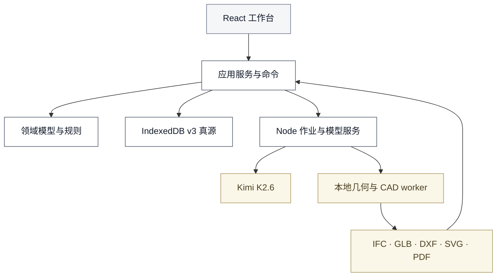
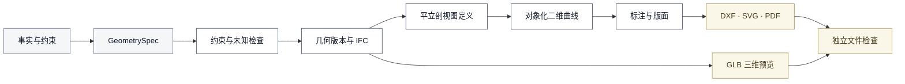

# 13-9 · 古建保护成果工作台技术架构 v0.1（评审中）

## 1. 架构结论

推荐采用“浏览器模块化单体 + 受控 Node 服务 + 本地制图 worker”。

状态：第 2 节为现状盘点；其余 v3 架构、对象、接口、目录和验收均为待实施目标，不代表当前代码已经具备这些能力。

目标 React 工作台负责交互和项目操作，TypeScript 领域层负责业务规则，新的 IndexedDB 数据库保存项目真源。Node 服务负责 Kimi K2.6、制图作业和密钥。Python worker 优先使用 IfcOpenShell 随附几何能力和 ezdxf；独立 OpenCascade 绑定由 T0 决定。

三维模型、平面、立面、剖面、详图和 CAD 必须来自同一个项目版本与几何版本。AI 不直接生成最终几何，也不直接写项目数据。

### 1.1 目标

- 每项项目事实都有来源、证据、状态、更新者和影响范围。
- 所有业务写入经过唯一命令入口，并在一个短事务内提交。
- 项目版本不可变。模型、规则、决定、成果和交付记录只追加或以新记录替代。
- 资料、样例和成果通过项目包进入系统，不写在页面和业务代码中。
- Kimi K2.6 负责资料理解、问题分析和工具调用。确定性程序负责规则、几何、制图和检查。
- 数据变化只使依赖它的几何、视图、成果和检查失效。
- 本地模式可以完成代理成果验证。正式签发只在可验证身份、权限和签名服务接入后开放。

### 1.2 约束

- 产品范围以 `13-8_核心PRD_古建保护成果工作台.md` v1.0 为准。
- 模型和制图依据以 `13-11_正式制图能力与验证样本预研.md` 为准。
- 前端使用 React、TypeScript 和 Vite。Node 服务保持独立进程。
- 项目默认保存在本地浏览器。Node 服务不默认保存完整项目。
- 目标首期专业交换格式采用 IFC、GLB、DXF、SVG、PDF 和结构化数据。
- DWG 需要受许可的转换工具或商业 SDK，不在当前实施范围内。
- 当前本地模式不模拟组织身份、法定签发或多人实时协作。
- 架构确认前不修改正式运行代码。

## 2. 当前结构与问题

现有 React 工作台已经建立部分领域类型、IndexedDB、项目包和命令实验，但仍是代理立面演示，不能支撑已确认 PRD。

### 2.1 当前实现

- `交互原型/02_AI工作台/src` 使用 React 19、TypeScript、Zod、fflate 和原生 IndexedDB。
- `gujian-workbench-v2` 保存项目版本、资源、运行、决定、成果、交付和审计记录。
- `ProjectCommandService` 已实现命令幂等、预期版本检查和事务提交。
- 项目 JSON 与 ZIP 已具备路径、MIME、哈希、schema 和两阶段导入实验。
- 现有检查基线为 13 项旧代码测试和 17 项单元测试。
- Node 服务已有任务路由、限流、用量和费用记录。
- 新界面采用灰白背景、细边框、紧凑表格和可收起助手。

### 2.2 主要问题

| 问题 | 当前表现 | 影响 | 目标处理 |
|------|----------|------|----------|
| 样例仍进入运行代码 | `App.tsx` 和 `Workspace.tsx` 直接导入高都、东呈 fixture，并按固定项目 ID 选择生成器 | 不能验证第三项目 | 样例只通过项目包导入 |
| 没有资料入库命令 | 两套 v2 项目的资料、观察、模型运行、规则运行和资源均为空 | 无法从原始资料开始 | 增加证据导入、解析和关联命令 |
| 成果范围过窄 | 只生成固定代理立面或五开间框选草图 | 无三维、平面和剖面 | 建立统一几何与多视图制图管线 |
| 版本查询混入未来记录 | 读取旧版本时按项目 ID 载入全部追加记录 | 历史导出不准确 | 按版本引用闭包导出 |
| 失效范围过大 | 普通数据变化会使所有有效成果失效 | 造成无关返工 | 保存依赖边并按图遍历 |
| 模型接入不符合决定 | 注册表混用 `moonshot-v1-128k` 与 `kimi-k2.6` | 任务能力和审计口径不一致 | 所有 AI 任务只使用 `kimi-k2.6` |
| 助手没有真实模型 | React 助手返回本地固定文字 | 不能处理专业问题 | 接入模型运行、工具调用和候选提交 |
| 提示词过度限制 | 旧 `js/config.js` 含长规则和 120 字限制 | 限制模型分析 | 使用广义角色提示，规则进入工具和程序 |
| 身份是固定代理人 | 固定 UUID 和“代理验证员”承担所有操作 | 不能正式审核或签发 | 本地模式锁定正式签发，私有模式接入身份与权限 |
| 视觉规范存在冲突 | 早期黑粗边规范与灰白工作台规范并存 | 实施标准不唯一 | 以 `工作台视觉方案.md` 为当前依据 |

现有高都与东呈 JSON、图片和代理几何只用于迁移与反例测试。它们没有足够实测证据，不得转成正式测量或专业成果。

## 3. 方案比较

目标方案解决专业几何、真实模型接入和版本责任问题。继续扩展 v2 会把现有缺陷带入正式流程。

| 方案 | 主要做法 | 收益 | 代价与风险 | 结论 |
|------|----------|------|------------|------|
| A. 保守扩展 | 保留 v2 数据库和浏览器 SVG、DXF 生成器，补充页面与命令 | 改动较少，可复用现有测试 | 难以建立专业三维、剖切、隐藏线和图纸空间；回退会与 v2 schema 冲突 | 不采用 |
| B. 目标架构 | 新建 v3 数据真源；Node 控制作业；本地 Python worker 生成 IFC、GLB 和多视图 CAD | 数据责任清楚；三维与图纸同源；可逐项迁移和回退 | 增加 Python 与原生几何依赖，需要固定运行环境 | 采用 |
| C. 云端服务化 | 项目、模型、几何、交付拆成独立服务 | 适合大型组织与多人协作 | 当前没有稳定部署、身份和并发需求；运维成本过高 | 暂不采用 |

方案 B 仍是模块化单体。Node 服务和制图 worker 属于同一部署单元，不拆成独立微服务。私有服务器阶段可以替换存储、任务队列和身份适配器，领域契约保持不变。

## 4. 总体架构

目标架构按界面、应用、领域、适配和数据分层。项目数据只能从应用命令进入数据层。



### 4.1 模块职责

| 模块 | 职责 | 不负责 |
|------|------|--------|
| 工作台界面 | 项目、证据、对象、模型、问题、成果和交付操作 | 直接修改项目对象 |
| 应用服务 | 执行用例、校验权限、组织事务、提交外部结果 | 解释古建事实 |
| 领域层 | 不变量、来源、资格、自动执行、依赖和失效 | 网络、文件系统和页面状态 |
| 项目仓库 | 保存项目版本、资源和追加记录 | 调用模型或生成图纸 |
| Kimi 网关 | 真实模型调用、工具循环、运行记录和用量 | 直接写项目或替代规则 |
| 规则引擎 | 确定性计算、适用性和重复结果 | 处理非唯一专业判断 |
| 几何服务 | 从约束建立三维、对象几何和视图曲线 | 补造缺失测量 |
| 制图服务 | 图层、标注、图签、版面和文件生成 | 改写项目事实 |
| 检查服务 | 数据、几何、视图、CAD 和交付检查 | 承担专业签发责任 |
| 身份与签名 | 身份、权限、资格和签发记录 | 自动认可专业结论 |

### 4.2 部署模式

本地验证模式建成后，以 `gujian-workbench-v3` 为唯一可写真源。Node 只提供 Kimi 和制图作业接口。项目内容只在作业期间进入受限临时目录，正式签发保持锁定。

私有部署模式建成后，通过同一 `ProjectRepository` 接口切换到服务器项目库和对象存储。浏览器 IndexedDB 只作为缓存或待提交区，不能与服务器同时成为项目真源。同一项目在一个部署中只能有一个写入主库。

| 部署模式 | 人员身份 | 唯一命令权威 | 外部结果提交 | 事务与真源 |
|----------|----------|--------------|--------------|------------|
| 本地验证 | 浏览器会话设置本地代理人员；不能形成正式身份 | 浏览器内 `ProjectCommandService` | 浏览器操作、Kimi 结果和 worker 结果都回到浏览器命令；外部进程不能写库 | 命令校验预期版本后提交一个 IndexedDB 事务；v3 是唯一真源 |
| 私有部署 | Node 从服务端会话取得 `actorId`；忽略浏览器负载中的人员声明 | Node 内 `ProjectCommandService` | 浏览器请求、Kimi 结果和 worker 结果都进入服务端命令；浏览器不能直写 | Node 校验授权和预期版本，并提交一个服务器数据库事务；服务器项目库是唯一真源 |

两种模式不能同时启用两个命令权威。私有模式的浏览器缓存、待提交区和离线草稿都不是业务记录；服务端命令成功前不能显示为已提交。Kimi、规则和 worker 只能返回运行记录或候选结果，不能绕过当前部署的命令权威。

当前 Vercel serverless 入口不能启动本地制图 worker，因此不能作为专业制图的完整运行环境。它只能保留为网页或模型接口实验，不能通过 R003 至 R007 的完整验收。

### 4.3 目录边界

```text
apps/
├─ workbench/             React 工作台和本地模式命令权威
└─ server/                Node API、私有命令权威、Kimi 与作业控制
packages/
├─ domain/                数据契约、不变量、依赖和资格
├─ application/           命令、查询和用例服务
├─ adapters/              项目包、模型、规则、成果和身份适配器
└─ infrastructure/        IndexedDB、哈希、Blob 和进程通信
workers/
└─ cad/                   Python 几何、视图、DXF 和检查
tests/
├─ contracts/             项目包、模型和 worker 契约
├─ integration/           命令、仓库和作业集成
└─ e2e/                   本地与私有部署端到端测试
```

新代码将不再写入 `交互原型/02_AI工作台`。旧原型只由迁移测试和旧行为回归测试读取，不能成为新包的运行依赖。

样例项目不放入 `apps` 或 `packages`。Dai Loy、团队参数化项目、南禅寺、高都和东呈资料保存在 `验证材料`，通过项目包或测试夹具加载。正式页面不引用样例项目名称、固定 ID 或 fixture 文件。

## 5. 项目数据与唯一真源

目标本地实现的唯一真源将是新的 `gujian-workbench-v3`。现有 `gujian-workbench-v2` 保持只读，不执行原位升级。私有部署按 §4.2 切换为服务器项目库。

### 5.1 版本结构

- `ProjectSummary` 只保存项目名称、当前版本 ID、状态和更新时间。
- `ProjectRevision` 保存不可变 `ProjectSnapshot`、父版本、内容哈希和变更引用。
- `ProjectSnapshot` 保存当前任务、建筑、证据元数据、对象、事实、问题、策略和依赖边。
- 模型运行头、模型运行事件、模型资格、规则运行、自动执行评估、正式资格评估、成果有效性评估、人工决定、几何版本、成果、检查、交付、签发和审计分开追加。
- 快照通过稳定 ID 引用追加记录。追加记录通过 `sourceRevisionId` 或 `committedRevisionId` 固定归属。
- 查询旧版本时，只读取该快照可达的记录和成果。禁止按项目 ID 把后续记录混入旧版本。
- 未形成候选或事实的模型运行事件属于独立运行流，不改变项目版本。运行查询必须指定审计头或事件截止点；项目归档同时固定 `projectRevisionId` 与 `auditHeadHash`，不能按项目 ID 混入导出后的事件。
- 项目包是指定版本的传输表示，不是第二套可编辑数据。

目标数据 schema 将使用 `3.0`。ID 使用 UUID。时间使用带时区的 ISO 8601。数值必须带单位。二进制文件只通过 `assetId` 关联。

每条追加业务记录保存 `recordHash`。哈希输入是排除 `recordHash` 后、按 §5.6 同一规范序列化的记录正文。`ProjectRevision` 保存 `closureHash`，由该版本可达记录、资源及其哈希按稳定顺序计算。`AuditEvent` 保存 `writeSetHash`，覆盖本次命令新增记录与资源的 ID 和哈希。

目标业务记录仓库将采用不可变、只追加的写入方式。命令不能原位更新或删除事实、运行、评估、决定、几何、成果、检查、交付、签发和审计。`ProjectHead` 与摘要只是可重建索引，可在同一事务中指向新版本；它们不是业务事实。

### 5.2 最小持久化对象

| 对象 | 关键字段 | 来源与状态 | 写入者 | 影响范围 |
|------|----------|------------|--------|----------|
| `ProjectRevision` | `id`、`parentId`、`snapshotHash`、`closureHash`、`recordHash`、`changedRefs` | 系统根据命令建立 | 命令服务 | 当前项目头和下游版本 |
| `Project`、`Building` | 名称、位置、时期、状态 | 任务书或人员输入 | 建项命令 | 任务、对象和交付标识 |
| `CopyProvenance` | 源包、源项目、源版本、源哈希和 ID 映射哈希 | 复制命令 | 命令服务 | 新项目来源与签发隔离 |
| `TaskDefinition` | 范围、规范、成果、责任和自动策略 | 任务书、模型候选、负责人决定 | 范围确认命令 | 几何、制图、检查和签发 |
| `Asset`、`Evidence` | 文件、哈希、类型、声明、质量和对象关系 | 原文件和导入声明 | 资料导入命令 | 解析、事实、几何和成果 |
| `HeritageEntity`、`Relation` | 层级、类型、位置和连接 | 证据、候选或人员 | 对象命令 | 几何与所有派生视图 |
| `Observation` | 可见现象、材料、病害和状态 | 模型、规则或人员 | 候选应用命令 | 说明、表达和检查 |
| `MeasurementRecord` | `Quantity`、人员、时间、方法和原记录 | 现场原记录或其转写 | 测量命令 | 约束、尺寸和正式资格 |
| `ModelRun`、`ModelRunEvent`、`ModelProposal` | 固定运行头、追加状态事件和候选 | 真实 Kimi 运行 | 模型用例 | 问题、事实和模型评估 |
| `ModelQualificationRun` | 运行契约、测试集、指标、门槛、结果、签发者和环境 | 固定资格测试 | 资格用例 | 资格证据，不直接授予自动执行 |
| `ModelQualificationRegistryEntry` | 运行哈希、签发者、人员、注册表版本和信任状态 | 部署级受信注册表 | 资格服务 | 自动执行资格解析 |
| `QualificationTrustResolution` | 运行哈希、注册项、注册表版本和解析时信任状态 | 当前部署资格服务 | 命令服务 | 固定策略评估依据 |
| `RuleRun`、`RuleResult` | 规则版本、输入哈希和结果 | 受信任规则 | 规则用例 | 自动事实、问题和检查 |
| `PolicyEvaluation`、`ArtifactValidityEvaluation` | 目标、源版本、策略版本、输入和阻断 | 领域策略与依赖计算 | 命令服务 | 自动执行和成果有效性 |
| `DeliveryReadinessEvaluation` | 事实、证据、规范、责任、成果有效性和检查 | 签前确定性检查 | 命令服务 | 待签草稿准备度 |
| `FormalEligibilityEvaluation` | 准备度、签名、验签、权限、资格和证书状态 | 签后正式检查 | 命令服务 | 正式发布资格 |
| `Issue`、`Decision` | 类型、方案、影响、人员、理由和责任 | AI 分析、规则冲突或人员 | 问题用例 | 事实、成果和签发门槛 |
| `CadJob`、`CadJobEvent` | 固定作业头、租约、心跳、尝试和终态事件 | Node 作业控制 | 作业账本 | 重启恢复、迟到拒绝和清理 |
| `GeometryRevision` | 项目版本、引擎、约束、对象几何和未知项 | 几何 worker | 几何提交命令 | 三维、视图和图纸 |
| `Artifact`、`CheckRun` | 输入版本、生成器、文件、哈希和检查 | 制图与检查程序 | 成果提交命令 | 有效性评估、交付和签发 |
| `DeliveryDraft`、`Signature`、`SignatureVerification`、`FormalDeliveryRelease` | 清单、责任、签名、验签和发布证明 | 有权人员和交付程序 | 交付命令 | 正式导出、归档和更新 |
| `AuditEvent` | 命令、人员、`previousEventHash`、`writeSetHash`、`eventHash`、`recordHash` | 系统 | 命令仓库 | 查询与责任还原 |

`Artifact` 至少保存 `sourceProjectRevisionId`、`geometryRevisionId`、`viewDefinitionRef`、`drawingSpecVersion`、`generatorVersions`、`inputRefs`、`assetId` 和文件哈希。成果记录建立后不再增加状态或资格字段。

`CheckRun` 保存检查规则版本、检查工具版本、输入成果哈希、通过项、警告、阻断项和时间。检查记录不能覆盖被检查成果。

### 5.3 来源、核对和资格

业务来源只允许模型、规则、人工和演示四类。系统导入、哈希、迁移和失效属于审计事件，不产生业务事实。

```ts
type ProducerRef =
  | { producerType: 'model'; runId: string }
  | { producerType: 'rule'; ruleRunId: string }
  | { producerType: 'human'; actorId: string; actionRef: { commandId: string; decisionId?: string } }
  | { producerType: 'demo'; fixtureId: string }

interface FactEnvelope<T> {
  id: string
  subjectRef: string
  field: string
  value: T
  producer: ProducerRef
  evidenceRefs: string[]
  reviewStatus: 'unreviewed' | 'confirmed' | 'rejected' | 'superseded'
  acceptanceRef?: { type: 'policy' | 'decision' | 'command'; id: string }
  dataStatus: 'available' | 'uncertain' | 'missing' | 'stale'
}
```

模型候选被人工接受后仍保留 `model` 来源，接受动作通过命令引用留痕。人工只在改写值时产生新的 `human` 事实。规则结果保留 `rule` 来源。演示数据始终保留 `demo` 来源。

`human` 来源始终保存 `actorId` 与 `commandId`。只有专业选择、审核、驳回、替代和签发动作需要 `decisionId`。直接接受无歧义建议不要求填写理由；驳回、改写或责任制度要求时必须填写理由。

自动执行产生的事实保存自动策略评估引用。`reviewStatus: confirmed` 不能单独说明由谁确认，界面必须同时显示 `acceptanceRef`。

`PolicyEvaluation` 只判断模型方案能否自动执行。它固定 `targetRef`、`sourceRevisionId`、`policyVersion`、输入引用、`qualificationTrustResolutionId`、通过项、阻断项和时间。资格服务必须从当前部署的受信注册表解析资格；没有匹配且受信的资格解析时，模型方案不能自动执行。

`DeliveryReadinessEvaluation` 是签名前的不可变记录，只检查事实、证据、适用规范、责任角色、`ArtifactValidityEvaluation` 和 `CheckRun`。它固定 `sourceRevisionId`、输入引用、策略版本、通过项、阻断项和时间，不读取签名或证书状态。

`FormalEligibilityEvaluation` 是签名与验签后的不可变正式资格记录。它固定 `deliveryDraftId`、`deliveryReadinessEvaluationId`、`signatureId`、`signatureVerificationId`、人员权限、签发资格、证书有效与撤销检查、策略版本、资格结果、阻断码和时间。

`ArtifactValidityEvaluation` 只判断成果对指定项目版本是否仍然有效。它固定 `artifactId`、`sourceRevisionId`、依赖集合哈希、结果、失效原因和时间。

四类评估都是独立不可变记录。新版本、新策略或新签名产生新的评估，不改写原事实、成果或历史评估。项目快照引用当前版本采用的评估记录，查询旧版本时仍使用原引用。

签前准备度至少检查演示来源、证据缺失、数据状态、模型或规则运行、测量元数据、适用规范、责任角色、成果有效性和检查。签后正式资格再检查签名、验签、人员权限、签发资格、证书有效期和撤销状态。

### 5.4 观察与测量

可见观察、测量记录、模型推断和专业结论分别保存。

`MeasurementRecord` 至少包含 `subjectRef`、`quantity`、`measuredBy`、`measuredAt`、`method` 和 `originalEvidenceRef`。仪器和测点可以按项目要求补充。

`Quantity` 保存 `originalText`、精确十进制或分数形式的 `exactValue`、`originalUnit`、`normalizedValue`、`normalizedUnit`、`precision` 和 `conversionVersion`。换算不能覆盖原值。

AI 转写测量表时先建立 `ModelProposal`。应用后形成的数值仍引用模型运行与原始测量证据。人工核对转写不会补成缺失的测量人员、时间或方法。

没有证据的尺寸保存为未知，不写 `0`、常见值或样例默认值。作者复原尺寸、统计值和现场测量值使用不同事实类型和来源关系。

### 5.5 数据仓库

目标新数据库名为 `gujian-workbench-v3`，初始 IndexedDB 版本为 1。

目标项目仓库将包括 `projects`、`revisions`、`copyProvenances`、`assets`、`modelRuns`、`modelRunEvents`、`modelProposals`、`modelQualificationRuns`、`qualificationTrustResolutions`、`ruleRuns`、`policyEvaluations`、`artifactValidityEvaluations`、`deliveryReadinessEvaluations`、`formalEligibilityEvaluations`、`decisions`、`geometryRevisions`、`artifacts`、`checkRuns`、`deliveryDrafts`、`signatures`、`signatureVerifications`、`formalDeliveryReleases`、`auditEvents`、`importSessions` 和 `commandReceipts`。

`ModelQualificationRegistryEntry` 保存在项目仓库之外的部署级受信注册表。项目包可以携带 `ModelQualificationRun` 和注册表副本用于历史还原，但导入后统一标为 `historical-untrusted`，不能写入或提升部署级注册表。

`CadJob` 与 `CadJobEvent` 保存在部署级持久作业账本。它只保存作业元数据、输入输出哈希和临时资源引用，不成为项目真源。项目只通过 `CommitGeometryRevision` 或 `CommitArtifactSet` 引用已接受的作业结果。

界面偏好单独保存，不进入项目版本。业务仓库写接口不导出给页面、模型网关、规则引擎或制图 worker。

### 5.6 哈希计算顺序

`H` 表示 SHA-256，`C` 表示稳定键顺序、Unicode NFC、JSON 规范数值和 UTF-8 的规范化序列化。计算顺序固定如下：

1. `assetHash = H(fileBytes)`。
2. 普通追加记录的 `recordHash = H(C(record without recordHash))`。此步不处理 `ProjectRevision` 和 `AuditEvent`。
3. `snapshotHash = H(C(snapshot + referenced record and asset hashes))`。
4. `closureHash = H(C(revision core without closureHash/recordHash + snapshotHash + sorted reachable record/asset hashes))`。
5. `ProjectRevision.recordHash = H(C(ProjectRevision without recordHash))`，此时正文已经包含 `closureHash`。
6. `writeSetHash = H(C(sorted new record IDs and recordHashes + new asset IDs and hashes))`。写集合包含本次新增的 `ProjectRevision`，不包含尚未建立的 `AuditEvent`。
7. `eventHash = H(C(AuditEvent without eventHash/recordHash))`。事件正文已经包含 `previousEventHash` 与 `writeSetHash`。
8. `AuditEvent.recordHash = H(C(AuditEvent without recordHash))`，此时正文已经包含 `eventHash`。

`auditHeadHash` 等于所选审计链最后一个 `eventHash`。该顺序不允许任何哈希引用尚未计算的自身或下游哈希。

项目包根是二元组 `(projectRevisionId, auditHeadHash)`。包闭包由两部分组成：所选项目版本的业务引用闭包，以及从项目审计起点到 `auditHeadHash` 的完整审计前缀和每个 `writeSetHash` 对应的记录与资源。第二部分必须包含截至审计头的失败、取消、迟到和重复模型运行事件，即使这些事件没有建立项目版本。包内清单分别标明业务闭包与审计闭包，避免把审计上下文当成所选版本事实。

## 6. 命令、事务与成果失效

`ProjectCommandService` 将是当前部署的唯一业务写入口。每条命令携带命令 ID、项目 ID、人员、预期版本、时间和负载。私有模式的人员字段由服务端会话覆盖，不能信任浏览器传值。

### 6.1 提交规则

1. 应用层先读取固定项目版本并校验权限。
2. 文件解析、模型调用、规则计算和制图在数据库事务外完成。
3. 外部结果进入隐藏暂存区，并保存输入版本、输入哈希和作业哈希。
4. 提交命令再次检查当前版本、输入哈希和权限。
5. 命令在一个短事务内建立新项目版本、追加记录、提升资源和审计事件。
6. 任一步失败时保留原项目头，不产生部分可见写入。
7. 相同命令 ID 返回第一次结果。迟到结果返回 `STALE_INPUT`。

导入暂存只保存不可见 Blob、校验报告和 `importSessionId`，不建立项目、业务事实或项目头。最终导入必须执行 `ImportProjectPackage`。该命令在一个事务内提升暂存资源，并写入项目、版本、追加记录和导入审计。

模型运行开始时追加不可变 `ModelRun` 头和 `started` 事件；完成、失败、取消和迟到只追加 `ModelRunEvent`，不建立空业务版本。合格候选、规则事实、决定或成果进入项目时才建立新版本。

### 6.2 命令族

| 命令族 | 主要命令 | 原子结果 |
|--------|----------|----------|
| 项目与任务 | `CreateProject`、`ConfirmTaskScope`、`ChangeTaskScope` | 新任务版本与影响清单 |
| 数据交换 | `ImportProjectPackage`、`CopyProject` | 原子建立或复制项目、版本、资源、来源和审计 |
| 资料 | `ImportEvidence`、`ReplaceEvidence`、`RelateEvidence` | 资源、证据和解析任务 |
| 模型 | `StartModelRun`、`CompleteModelRun`、`FailModelRun`、`CancelModelRun` | 不可变运行头、追加事件与合格候选 |
| 规则 | `CommitRuleRun` | 规则结果、事实或问题 |
| 问题 | `ApplyModelProposal`、`ApplyBatchProposal`、`DecideIssue` | 自动策略或人工决定与事实 |
| 几何 | `CommitGeometryRevision` | 三维版本、未知项和对象映射 |
| 成果 | `CommitArtifactSet`、`CommitCheckRun` | 成果集、检查与哈希 |
| 交付 | `EvaluateDeliveryReadiness`、`CreateDeliveryDraft`、`SignDeliveryDraft`、`VerifyDeliverySignature`、`EvaluateFormalDeliveryEligibility`、`ReleaseFormalDelivery` | 不可变准备度、待签、签名、验签、资格和发布 |
| 更新 | `InvalidateByChange`、`ArchiveProject` | 精确失效和可恢复归档 |

### 6.3 依赖与失效

项目快照保存稳定的依赖边。基本关系为：

```text
证据 → 事实或决定 → 几何约束 → 几何版本 → 视图 → 成果 → 检查 → 交付
```

`ImpactService` 从变更引用向下游遍历。任务规范变化只影响相关图纸模板、检查和交付准备。单个尺寸变化只影响引用该尺寸的几何对象、视图和成果。

每次影响计算追加新的 `ArtifactValidityEvaluation`，并由新项目版本引用。系统不把原 `Artifact` 改成 `stale`。事实、成果或检查变化后，旧准备度和正式资格保持历史记录；新草稿必须重新生成 `DeliveryReadinessEvaluation`，签名后再生成新的 `FormalEligibilityEvaluation`。

已签发成果、历史版本和原审计记录永不改写。更新建立新版本。旧成果保持可查，并标明被哪个新版本替代。

## 7. 资料输入与项目包

资料输入从本地文件或受控仓库副本开始。项目数据不能保存远程 URL、绝对路径、浏览器 Blob URL 或密钥。

### 7.1 资料入库

1. 文件边界检查通过后计算 SHA-256。
2. 系统保存原文件、导入人、权属、用途、保密声明和资源标识。
3. 确定性解析器先提取文件元数据、文本和可用页。
4. Kimi 根据任务读取所需文本、图片或页面，返回结构化候选。
5. 对象关联、尺寸转写和缺失项进入模型候选或问题处理。
6. 原文件在解析失败时仍然保留，可重新处理或替换。

### 7.2 项目包

```text
project.gujian.zip
├─ manifest.json
├─ project.json
├─ evidence/
├─ artifacts/
├─ audit/events.ndjson
└─ delivery/              仅正式发布包
   ├─ signed-manifest.json
   ├─ manifest.sig
   ├─ signer-material.json
   └─ release.json
```

`manifest.json` 保存包类型、schema、`projectRevisionId`、`closureHash`、`auditHeadHash`、记录清单、文件路径、MIME、字节数、SHA-256 和 `assetId`。记录清单包含每条可达追加记录的 ID、类型和 `recordHash`。包类型为项目归档、代理交付或正式交付。

外层 `manifest.json` 负责项目包闭包。`delivery/signed-manifest.json` 是 `DeliveryDraft` 固定并由签名服务签署的原始字节，列出正式成果及其哈希。分离签名、签名者材料和发布描述放在 `delivery/`，不写入被签名 manifest，避免自引用。

项目归档用于恢复。代理交付必须显示使用限制。正式交付只能由 `FormalDeliveryRelease` 的 `releaseId` 导出，不能只凭项目版本、待签草稿或孤立签名生成。

导出服务从 `(projectRevisionId, auditHeadHash)` 同时遍历业务闭包和审计闭包，重新校验每条 `recordHash`、资源哈希、`writeSetHash`、`eventHash` 和 `closureHash` 后才写包。任何缺失、额外记录或哈希不一致都会阻断导出。

正式交付包导入时必须用受信任签名服务验证原始 manifest 字节及哈希、签名、签名者材料、证书链或组织信任关系、签名时间和撤销状态。验证通过后保持只读 `FormalDeliveryRelease`、签名记录和原清单哈希。严格正式导入遇到无效、不受信任或已撤销签名时拒绝；用户也可以选择“作为不可信资料导入”，只保存原包、验证失败原因和证据关系，不建立正式发布。本地模式没有签名适配器时不能判定验签通过。

需要继续修改正式包或复制任意项目时，用户显式执行 `CopyProject`。命令为项目、记录和资源引用生成新 ID，追加 `CopyProvenance`，保存源包、源项目、源版本和源哈希。原交付和签名只能作为只读来源附件，不能复制成新项目内可写或有效的签发记录。

单独导入 `project.json` 时，缺失资源保持 `missing`。系统不按文件名、项目名称或远程地址猜测替换资源。

### 7.3 两阶段安全导入

1. 解压前检查压缩包大小、中央目录、条目数、声明展开量、单文件大小和压缩比。
2. 拒绝绝对路径、盘符、反斜杠、空字节、`..`、符号链接、硬链接、设备、管道、套接字和其他特殊文件。每个路径段还要拒绝 Windows 保留名 `CON`、`PRN`、`AUX`、`NUL`、`COM1` 至 `COM9`、`LPT1` 至 `LPT9`，以及 ADS 冒号、尾随空格和尾随点；保留名检查忽略大小写和扩展名。
3. 原始路径、Unicode NFC、Unicode 大小写折叠和 Windows 不区分大小写后的任一碰撞都拒绝。流式解压限制实际展开字节并增量计算哈希；manifest、项目 JSON 和审计流在受限解析器中处理，落盘的临时资源只使用 `importSessionId/assetId`，不使用包内路径或原始文件名。
4. 根据内容魔数或解析结果核对 MIME，不信任扩展名和浏览器类型。
5. 校验深层 schema、危险键、ID、时间、单位和全部引用。NDJSON 同时限制事件数、单行字节数和总解析时间。
6. 严格按 §5.6 的无循环顺序重算 `assetHash`、普通 `recordHash`、`snapshotHash`、`closureHash`、`ProjectRevision.recordHash`、`writeSetHash`、`eventHash` 和 `AuditEvent.recordHash`。
7. 从根 `(projectRevisionId, auditHeadHash)` 重建业务闭包和完整审计前缀。逐条核对 `previousEventHash`，并确认每个写集合的记录与资源齐全；截至审计头的失败、取消、迟到和重复运行事件不能遗漏。只比较指针不算通过。
8. 清单缺记录、多记录、悬空引用、混入闭包外记录或根不一致都拒绝。包内资格声明不进入部署注册表，统一按 `historical-untrusted` 处理。正式包还对 `delivery/signed-manifest.json` 的原始字节按 §7.2 验签。
9. 文件先进入不可见 `importSession`。暂存不属于业务写入，预览显示资源缺口、审计状态和冲突。
10. 用户确认后执行 `ImportProjectPackage`。命令事务提升项目、版本、资源和追加记录；失败时清理暂存数据。

初始验证上限沿用 250 MB 压缩包、500 MB 展开量、200 个文件、25 MB 单文件和 5 MB 项目 JSON。审计流初始限制为 100,000 个事件、单行 1 MiB、总解析 60 秒。上限由版本配置，并通过边界测试后公布。超限导入不得留下可见半成品。

## 8. Kimi K2.6 接入

所有 AI 任务只使用官方模型标识 `kimi-k2.6`。系统不回退到 `moonshot-v1-*`，也不在失败时显示预置成功结果。

### 8.1 服务端边界

- API 密钥、账户区域和上游地址只保存在 Node 服务。
- 中国区和国际区地址由部署配置选择。浏览器不能提交任意上游地址。
- 同一项目不自动跨区域重试，避免改变数据传输范围。
- Node 的任务注册表为每个 `taskType` 固定系统提示、任务提示模板、允许工具、工具 JSON Schema、输出 JSON Schema、输入选择规则和运行预算，并保存各自版本与哈希。
- 浏览器只能提交已注册的 `taskType`、项目版本和业务参数，不能提交或覆盖系统提示、工具定义、输出 schema、模型、上游地址和密钥。
- 模型请求只发送当前任务所需并已授权的证据片段。
- 图片使用受控 Base64 或服务端管理的 Kimi 文件引用。文件引用保存生命周期和删除状态。

### 8.2 提示与工具

系统提示只定义角色、目标和事实责任：

> 你是古建测绘与保护成果工作台的项目助手。理解用户目标和当前项目资料，主动使用可用工具整理证据、提出结构化数据更新建议、分析问题、调用检查与制图能力，并把任务推进到可审核成果。
>
> 基于证据工作，清楚标注不确定性；不编造现场测量，不冒充专业签发人。

不设置回答字数上限。确定性字段、项目规则、权限和交付门槛进入工具 schema、项目数据和检查程序。

模型工具分为只读查询和建议提交。只读工具只能查询注册任务允许的固定项目版本、已授权证据片段、对象、来源、规则和检查。建议工具只能向当前运行收集器提交 `ModelProposal`，不能执行应用命令、访问仓库写接口或直接改变项目。

模型运行成功且输入仍匹配时，命令权威才通过 `CompleteModelRun` 提交运行事件和候选。自动应用是后续独立、幂等的 `ApplyModelProposal` 命令，必须重新校验版本、权限、资格和策略。

工具参数使用 JSON Schema。适合单次结构化返回的任务使用服务端控制的 JSON Schema 输出；需要查阅项目和执行多步工作的任务优先使用工具调用。

多轮工具调用保留相关模型消息和工具结果。项目审计保存最终结论、工具调用、输入版本和候选，不保存隐藏思考原文。

提示注入边界：证据文本、文件名、OCR、用户备注和工具返回均按不可信数据处理。它们放入明确的数据字段，不能进入系统提示、任务注册表或工具定义。工具不接受任意 URL、路径、SQL、脚本或工具名；证据中的“忽略规则”“调用其他工具”等指令不改变任务和权限。

### 8.3 运行契约

`ModelRun` 是不可变运行头，保存 `runId`、`taskType`、`provider`、`model`、账户区域、项目版本、输入哈希、系统提示版本与哈希、任务提示版本与哈希、工具版本与哈希、输出 schema 版本与哈希、任务注册版本、预算和建立时间。

`ModelRunEvent` 是追加记录，保存 `eventId`、`runId`、序号、`started | succeeded | failed | cancelled`、发生时间、接收时间、输入哈希、输出或错误哈希、工具摘要、用量、费用和接受结果。运行状态由事件推导，不写回 `ModelRun`。

没有被接受终态时，运行状态由有效 `started` 事件推导为运行中；存在终态时，以第一个符合状态机和输入版本的终态推导为成功、失败或已取消。后到的成功、失败、取消或重复回调仍追加事件并标记 `late` 或 `duplicate`，但不改变已推导状态。取消后的供应商输出只保留事件，不能产生候选。失败事件不能覆盖成功事件，成功事件也不能覆盖已接受的失败或取消。

`ModelProposal` 只能引用状态为成功的运行、被接受的成功终态事件以及完全匹配的项目版本和输入哈希。结构、引用或输入不匹配时只保存运行事件和错误，不提交候选。

K2.6 默认使用思考模式。服务端不显式设置 `temperature`。思考任务使用流式输出，`max_tokens` 不低于 16000。任务注册表可以设置更高预算，但不能截断为 120 字摘要。

每个任务必须固定最大工具轮数、输入 token、输出 token、总 token、费用、总时限、单次工具输出字节数和条目数，以及相同工具与规范化参数的重复次数。达到任一上限即取消运行并追加事件。取消信号传递到上游和工具；无法停止的迟到结果仍按迟到事件处理。

模型响应先通过结构和引用校验。缺少目标对象、证据、工具结果或输入版本的候选不能进入项目。

供应商返回 429 或 5xx 时，只对同一 `kimi-k2.6` 和同一区域执行注册表允许次数内的退避重试。每次重试属于同一运行，追加带尝试序号和前次错误哈希的 `started` 事件；用尽次数后才追加 `failed` 终态。用户可以建立新运行，确定性流程和已有成果继续可用。

### 8.4 模型资格

`ModelQualificationRun` 是不可变记录，至少保存：

- `taskType`、`provider`、`model`。
- 系统提示、任务提示、工具、输出 schema、测试集的版本与哈希。
- 运行环境版本与哈希、`startedAt`、`finishedAt` 和费用。
- 指标、阈值、通过或失败结果，以及失败用例引用。
- `issuer`、执行测试的 `actorId` 和运行记录哈希。

资格运行使用固定测试集和确定性评分程序。任务、供应商、模型、任一提示、工具、schema、测试集或运行环境的版本或哈希变化后，旧资格不能用于新组合。资格记录本身不改写；新组合必须建立并通过新的资格运行。

资格是否生效只由部署级受信注册表决定。`ModelQualificationRegistryEntry` 是不可变追加记录，保存 `qualificationRunHash`、资格组合哈希、`issuer`、`actorId`、`registryVersion`、`trustStatus`、签发时间和信任证明。`trustStatus` 只允许 `trusted | revoked | expired`；撤销和过期通过更高注册表版本追加，不能改写旧项。

私有部署只信任由配置的资格签发者签名、通过服务端信任策略验证并保存在服务器数据库中的注册项。本地模式仅信任在本机真实执行固定测试集后，由本机资格服务用安装级密钥签署并写入项目库之外本地注册表的结果；浏览器不能直接写该注册表。项目包、fixture、浏览器负载和远端响应都不能新增受信注册项。

`ModelQualificationService` 根据当前部署、资格组合哈希和注册表版本生成不可变 `QualificationTrustResolution`。解析记录保存 `issuer`、`actorId`、`registryVersion`、注册项哈希，以及 `trusted | revoked | expired | missing | historical-untrusted` 之一的 `trustStatus`。`PolicyEvaluation` 只能引用该服务返回的受信解析，不能直接相信 `ModelQualificationRun` 或包内注册表副本。

项目包中的资格运行与注册表副本仅用于历史还原。导入器无条件把其解析状态设为 `historical-untrusted`；即使包内声明 `trusted` 或复制本机 issuer，也不能提升为当前部署资格。

注册表版本变化后，新自动执行必须重新解析资格。已执行命令和历史事实不改写；依赖被撤销资格且尚未专业确认的事实进入问题与正式资格复查。

### 8.5 自动执行质量门槛

模型建议只有同时满足以下条件才可以自动应用：

- 证据直接支持，或受信任规则给出唯一结果。
- 不新增现场事实，不改变规范、责任人或已签发成果。
- 操作可撤销，依赖范围可以计算，确定性检查通过。
- 项目自动策略允许该任务和该操作。
- 当前运行的任务、模型、提示、工具、schema、测试集和环境与资格组合完全一致，且资格服务在当前 `registryVersion` 下解析为 `trusted`。
- 正式资格不会因自动应用而被错误提升。

每次判断生成 `PolicyEvaluation`，保存输入、规则版本、`qualificationTrustResolutionId`、通过项和阻断项。未通过时形成成组预览或问题，不弹出逐项确认。

## 9. 三维与专业制图

专业成果从证据支持的语义对象和约束生成。页面坐标、项目名称、固定开间、对称关系和固定比例不能进入生成逻辑。

### 9.1 技术选择

| 能力 | 技术 | 用途 | 边界 |
|------|------|------|------|
| 语义模型 | TypeScript 领域对象 | 建筑、空间、构件、关系和来源 | 不保存显示坐标 |
| 几何内核 | 优先使用 IfcOpenShell 随附的 OpenCascade 几何能力 | 三维实体、布尔、剖切和对象映射 | T0 证明不足后才增加独立 OpenCascade Python 绑定 |
| 三维交换 | IFC 与 GLB | 语义交换和网页预览 | IFC 分类不足时保留项目自有类型 |
| 视图生成 | IfcOpenShell drawing 及其 OpenCascade 投影能力 | 平面、立面、剖面和隐藏线 | 视图定义来自任务数据 |
| CAD 写入 | ezdxf | 模型空间、图层、标注、图纸空间和审计 | 目标首期输出 DXF，不伪装 DWG |
| 预览 | Three.js、SVG 和 PDF | 加载 GLB、对象选择、网页核对和打印预览 | 不是 CAD 真源 |

T0 根据 IfcOpenShell 官方支持矩阵选择 Python 和依赖版本，再生成带哈希的锁文件。锁文件记录 wheel 来源与哈希、字体包、PDF 后端、线型和模板。架构不预先臆定版本。只有 T0 证明 IfcOpenShell 随附能力不能满足稳定对象映射、剖切或隐藏线时，才在锁文件中增加独立 OpenCascade 绑定。

### 9.2 同源生成流程



`GeometrySpec` 只包含当前项目版本可用的对象、测量、约束、关系和未知项。最小契约包括：

- 项目坐标系、局部坐标系、坐标变换、长度与角度单位、建模和制图容差。
- 点、线、弧、轮廓、拉伸、旋转体、曲面或实体等受控原语，以及原语变换、组合和孔洞。
- 未知区域、开放边界和未解约束；未知不能转成零值或默认实体。
- 每个对象的稳定 `entityId`、`factRefs`、`evidenceRefs` 和 `constructionMethod`。方法区分测量生成、规则生成、参数复原和演示。
- 所有尺寸使用 §5.4 的 `Quantity`，换算版本与容差参与输入哈希。

二维视图曲线至少分为剖切线、可见轮廓、投影线、隐藏线、中心线、填充边界和辅助线。每条曲线保存 `viewDefinitionRef`、`entityId`、三维几何引用、类别和生成器版本。

标注锚点引用稳定对象与语义特征，例如端点、轴线、表面、开口边或标高基准，并保存对应 `factRef`。锚点不能只保存页面像素或一次投影坐标。

`GeometryRevision` 固定 `sourceProjectRevisionId`、输入哈希、单位、坐标系、引擎版本、对象几何引用、未知区域和输出资源。

目标网页三维视图将使用 Three.js 加载 GLB。GLB 节点保存稳定 `entityId`，以便三维选择同步证据、事实、平立剖视图和来源关系。Three.js 只负责显示与选择，不修改几何真源。

`ViewDefinition` 定义视图类型、方向、剖切面、显示范围、比例候选和可见规则。比例来自任务要求或版面计算，不默认使用 1:50。

`DrawingSetSpec` 定义图纸目录、图幅、图层、颜色、线型、线宽、文字、尺寸、标高、轴号、索引、图签、修订和打印设置。

### 9.3 成果范围

R005 完整图种目录包括：

- 带对象和来源关系的 IFC 与 GLB 三维模型。
- 总平面、各层平面和屋顶平面。
- 任务要求的各向立面。
- 关键轴线和构造剖面。
- 构件详图、门窗表、材料表和病害表。
- 模型空间 1:1 的 DXF，以及带比例、图幅和图签的图纸空间。
- SVG 或 PDF 预览、结构化项目数据、检查报告和交付清单。

T10 必须逐项读取 `ArtifactRequirementMatrix`。每个图种记录 `required | notRequired` 以及 `generated | blocked`，并保存输入事实、输出成果或阻断码。空文件、空图框、无对象视图和默认场地不能标为 `generated`。

资料只能支持局部成果时，系统生成局部模型和可支持视图。未知构造不生成确定实体，或使用明确的未知占位。未知、推断和现场事实在三维与图纸中使用不同状态。

总平面必须有场地边界、建筑定位、北向、项目坐标或可追溯相对坐标和必要标高依据。团队参数化基准提供这些明确的 `demo` 参数及已知答案。Dai Loy 资料若没有场地定位证据，其总平面必须返回 `SITE_POSITIONING_MISSING`，不能用空图或推测位置通过。

### 9.4 制图检查

检查服务独立于生成器，至少覆盖：

- 几何有限值、单位、坐标、约束误差、实体有效性和对象映射。
- 同一对象在三维、平面、立面和剖面中的一致性。
- 尺寸值与测量事实、单位换算和标注锚点的一致性。
- DXF 图层、线型、线宽、文字、标注、块、布局、图签和打印设置。
- IFC、GLB、DXF、SVG 和 PDF 的解析、哈希和文件结构。
- 未知、推断、演示和不具备正式资格的内容是否清楚标注。

自动检查通过后仍需要专业人员审核成组预览。事务所级通过还要求至少两种常用 CAD 工具完成打开、编辑和打印测试。

### 9.5 作业边界

`CadJob` 是不可变作业头，保存 `jobId`、幂等键、项目和源版本、输入哈希、生成环境哈希、资源上限和建立时间。幂等键由源版本、`GeometrySpec` 哈希、图纸规范和生成环境计算。

`CadJobEvent` 只追加 `queued | leased | heartbeat | progress | succeeded | failed | cancelled | leaseExpired | recovered | lateResult | cleanupSucceeded | cleanupFailed` 事件。租约事件保存 `leaseId`、worker、尝试序号和到期时间。作业状态由事件推导，不改写作业头。

Node 使用持久 `CadJobLedger`。本地模式写入应用数据目录内的作业数据库，私有模式写入服务器数据库。每次领取建立有期限租约；worker 在租约内发送心跳。Node 重启后扫描未终止作业和过期租约，校验输入包及环境哈希，再追加 `leaseExpired` 和 `recovered`，以新尝试和新租约继续。输入损坏时追加失败，不猜测恢复。

worker 不访问 IndexedDB、网络和用户任意路径。临时根目录由 Node 生成，输入和输出文件只使用 `assetId` 作为文件名，原始文件名只存在映射元数据。完成、失败、取消、租约过期和进程启动时都执行清理；清理失败追加事件并进入可重试清理队列。

结果只有在 `jobId`、`leaseId`、尝试序号、源版本、输入哈希和生成环境全部匹配，且作业未取消或终止时才可接受。中断 worker、旧租约或旧尝试返回的结果追加 `lateResult`，不能覆盖已接受终态。输出先写入暂存区，再由当前部署命令权威执行 `CommitGeometryRevision` 或 `CommitArtifactSet`。命令成功前，CadJob 成功不等于项目成果已提交。

## 10. 问题处理与人工责任

AI 先分析证据不足、专业存疑、规则冲突和高风险问题。人工只处理无法由证据和确定性规则唯一决定的事项。

人工节点保留三类：

1. 项目开始时一次确认范围、规范、责任角色和自动策略。
2. 审核非唯一专业方案、缺失现场事实和高风险成组预览。
3. 完成最终专业复核与责任签发。

同一原因或影响范围的问题合并展示。系统自动填写证据、理由、前后差异和影响范围。用户接受建议时不重复输入理由；驳回、改写或责任制度要求时才填写补充原因。

低风险可逆建议可以批量应用。现场测量、规范选择、专业结论、保护判断和签发不能仅凭批量操作产生。

## 11. 身份、权限、检查与交付

正式签发需要私有部署的身份、授权和签名能力。本地模式只提供代理审核，并保持正式模式锁定。

### 11.1 责任接口

```ts
interface IdentityProvider {
  currentActor(): Promise<ActorIdentity | null>
}

interface AuthorizationPolicy {
  can(actorId: string, action: string, projectId: string): Promise<PolicyDecision>
}

interface SignatureService {
  sign(input: {
    manifestBytes: Uint8Array
    manifestHash: string
    actorId: string
    trustPolicyRef: string
  }): Promise<SignatureRecord>
  verify(input: {
    manifestBytes: Uint8Array
    manifestHash: string
    signature: Uint8Array
    signerMaterial: SignerMaterial
    trustPolicy: SignatureTrustPolicy
  }): Promise<SignatureVerification>
}
```

签名与验签服务都先从 `manifestBytes` 重算哈希并与 `manifestHash` 比较，再执行密码学操作。验签不能只接收内部 `signatureId`，也不能从项目包声明推断信任；`signerMaterial` 和 `trustPolicy` 必须由当前私有部署的受信配置解析。

这些接口只是终局契约，不代表当前本地版本已经实现 R011。本地任务只验证无真实身份、权限和签名时正式流程始终阻断。

R011 终局验收必须在私有部署中接入真实身份提供方、授权策略和签名服务，并完成成员移除、权限变化、资格失效、签发和验签测试。完成接口占位或返回固定阻断不算通过。

项目权限至少区分查看、编辑、审核、签发、接收、导出和管理。权限变化不能改写历史决定。决定和签发保存当时的组织、项目角色、资格、有效期和策略版本快照。

本地代理身份不得生成 `SignatureRecord`。界面禁用按钮不是正式门槛，`DeliveryService` 必须在领域层返回身份、权限或资格阻断。

### 11.2 交付

代理交付检查项目范围、输入版本、成果哈希、检查状态、未决问题和清单完整性。所有限制进入交付清单。

正式交付采用不可变状态机：

1. `EvaluateDeliveryReadiness` 先建立 `DeliveryReadinessEvaluation`，只检查签前资料和成果条件。
2. `DeliveryDraft` 引用结果为通过的 `DeliveryReadinessEvaluation`，并固定 manifest 原始字节、manifest 哈希、成果、`CheckRun`、`ArtifactValidityEvaluation`、`deliveryReadinessEvaluationId` 和责任快照。建立草稿不要求签名；没有签名时界面推导为“待签”，不写可变状态。
3. `Signature` 只签署该草稿的 manifest 字节与哈希，并保存签名者材料、人员、信任策略版本、签名时间和签名值。签名不等于发布。
4. `VerifyDeliverySignature` 建立不可变 `SignatureVerification`。验签成功后，`EvaluateFormalDeliveryEligibility` 才能建立新的 `FormalEligibilityEvaluation`，检查准备度、签名、验签、人员权限、签发资格、证书有效期和撤销状态。
5. `FormalDeliveryRelease` 只能引用结果为通过的签后 `FormalEligibilityEvaluation`。它固定 `draftId`、`signatureId`、`signatureVerificationId`、`formalEligibilityEvaluationId`、manifest 哈希和发布时间。

无签名可以建立待签草稿；无签名、无成功验签或无签名后的正式资格记录时，不能建立 `FormalDeliveryRelease`。

正式包只能从 `FormalDeliveryRelease` 导出。签名后修改 manifest、成果、检查或资格时，旧签名不能复用，必须建立新的 `DeliveryDraft`、`Signature` 和发布记录。原草稿、签名、发布和失败验签记录均不改写。

接收或退回只影响指定发布或代理成果。新资料或退回意见建立新项目版本，不改写原交付包。

审计日志使用哈希链检测本地修改。私有部署的正式交付由签名服务签署清单。单纯本地哈希链不声明法律不可抵赖性。

## 12. 工作台界面

界面以 `交互原型/02_AI工作台/设计资料/工作台视觉方案.md` 为当前视觉依据。早期黑粗边界面规范只保留历史参考。

### 12.1 项目页

- 左侧显示项目分类、状态和数据性质。
- 主区提供搜索、新建、导入、最近访问和项目摘要。
- 项目卡显示当前阶段、阻断、最近更新、审计和正式资格。
- 样例入口读取项目包目录，不向页面传入固定项目 ID。

### 12.2 任务页

- 顶部固定显示项目、版本、任务和当前责任身份。
- 左侧按 R001 至 R007 的业务阶段导航，并提供数据交换和设置入口。
- 中间工作区显示证据、对象、三维、图纸、问题和交付内容。
- 右侧助手读取当前项目版本与选中对象，可以收起。
- 助手失败时，资料、规则、几何、成果和导出仍可使用。

### 12.3 来源关系

选择尺寸、对象、几何或成果时，界面按实际引用显示：

```text
原始资料 → 模型或规则运行 → 策略评估或人工决定 → 业务事实 → 几何版本 → 成果版本
```

每个节点显示产生来源、证据、核对方式、数据状态和正式资格。缺失关系显示阻断，不绘制固定四段成功链。

界面使用浅灰背景、白色面板、1 px 边框、适度圆角和紧凑表格。1280 px 时优先收起助手，主工作区保持可用。键盘可到达搜索、导航、表格、三维视图、图纸预览和主要操作。

## 13. 核心接口

目标接口将返回稳定数据与错误码。页面提示文字不参与业务判断。

| 接口 | 输入 | 输出 | 失败处理 |
|------|------|------|----------|
| `ProjectCommandService` | 命令、权威取得的人员、预期版本 | 新版本、变更和失效引用 | 冲突或失败不写入 |
| `ProjectQueryService` | 项目与版本 | 精确版本聚合、来源图和历史 | 不混入后续记录 |
| `ProjectPackageService` | JSON 或 ZIP | 双根闭包、验签、暂存和导出 | 最终写入交给 `ImportProjectPackage` |
| `EvidenceIngestionService` | 文件、声明和对象范围 | 资源、证据和解析任务 | 保留原文件与错误 |
| `ModelTaskGateway` | 固定版本、任务和受控输入 | 真实运行、候选和工具结果 | 保存失败，不伪造结果 |
| `ModelQualificationService` | 部署注册表、资格运行和当前组合 | 带 issuer、actor、版本和信任状态的解析 | 包内资格一律不提升 |
| `RuleEngine` | 快照、规则和版本 | 可重复结果、事实或问题 | 缺输入时返回阻断 |
| `DecisionService` | 方案、人员和影响范围 | 策略评估或人工决定 | 角色不符时拒绝 |
| `GeometryService` | 几何规范和固定版本 | 三维版本、未知项和文件 | 作业失败不替换旧版本 |
| `CadJobLedger` | 作业头、租约和追加事件 | 状态推导、恢复、迟到拒绝和清理 | 重启不丢失非终态作业 |
| `DrawingService` | 几何版本、视图和图纸规范 | DXF、SVG、PDF 和清单 | 缺视图或标准时阻断 |
| `ArtifactCheckService` | 成果、规则和工具版本 | 检查运行与阻断 | 不修改成果文件 |
| `DeliveryService` | 成果、责任身份和签名材料 | 签前准备度、待签草稿、签后正式资格和发布 | 无签名后正式资格不建立发布 |
| `AuditQueryService` | 对象、事实或成果引用 | 来源图、决定和版本历史 | 缺引用时明确返回断点 |

## 14. 错误恢复与非功能要求

错误必须保留最近有效版本，并提供明确恢复动作。

### 14.1 稳定错误码

| 错误码 | 条件 | 系统处理 | 恢复 |
|--------|------|----------|------|
| `SCHEMA_INVALID` | JSON 或命令不符合 schema | 不写仓库 | 修正后重试 |
| `PACKAGE_INTEGRITY_INVALID` | 路径、MIME、哈希或引用异常 | 停止导入并清理暂存 | 更换项目包 |
| `PACKAGE_SIGNATURE_INVALID` | 正式包签名无效或不受信任 | 拒绝正式导入 | 更换包或按不可信资料导入 |
| `REVISION_CONFLICT` | 当前版本已变化 | 不覆盖新版本 | 查看差异后重提命令 |
| `STALE_INPUT` | 外部结果对应旧输入 | 保留运行，不提交候选或成果 | 当前版本重新运行 |
| `MODEL_RUN_FAILED` | Kimi 超时、限流或返回错误 | 追加失败事件 | 稍后建立新运行或继续确定性流程 |
| `MODEL_BUDGET_EXCEEDED` | 工具、token、费用或时间超限 | 取消并追加事件 | 缩小任务或调整受控预算 |
| `MODEL_OUTPUT_INVALID` | 工具或候选 schema 无效 | 不写业务数据 | 调整任务或重试 |
| `MODEL_QUALIFICATION_REQUIRED` | 无匹配且通过的资格运行 | 禁止自动应用 | 运行资格测试或转人工预览 |
| `MODEL_QUALIFICATION_UNTRUSTED` | 资格只来自项目包或部署注册项失效 | 禁止自动应用 | 当前部署重新测试或更新注册表 |
| `RULE_INPUT_MISSING` | 规则缺少合格输入 | 生成阻断问题 | 补充证据或限定范围 |
| `GEOMETRY_CONSTRAINT_CONFLICT` | 尺寸或关系冲突 | 不生成确定几何 | 进入问题处理 |
| `SITE_POSITIONING_MISSING` | 总平面缺场地和建筑定位依据 | 阻断总平面，不生成空图 | 补充定位资料或调整成果范围 |
| `CAD_JOB_FAILED` | worker 启动、计算或文件失败 | 保留旧几何和成果 | 修正输入或重启作业 |
| `CAD_JOB_LEASE_LOST` | 租约过期、重启或结果来自旧尝试 | 追加事件并拒绝迟到结果 | 重新领取或恢复作业 |
| `CAD_JOB_CLEANUP_FAILED` | 临时目录无法清理 | 隔离目录并进入清理队列 | 重试并告警 |
| `STORAGE_WRITE_FAILED` | IndexedDB 配额或事务失败 | 回滚事务 | 导出当前项目或清理空间 |
| `AUTHORIZATION_DENIED` | 当前人员无权限 | 拒绝命令并审计 | 申请权限 |
| `COMMAND_AUTHORITY_INVALID` | 请求绕过当前部署命令权威 | 拒绝写入并审计 | 通过浏览器或 Node 权威重提 |
| `DELIVERY_READINESS_BLOCKED` | 事实、证据、规范、责任、成果或检查不合格 | 不建立待签草稿 | 补齐签前条件并重新评估 |
| `FORMAL_DELIVERY_BLOCKED` | 签名、验签、权限、资格或证书条件缺失 | 不建立签后正式资格或发布 | 补齐阻断条件 |
| `FORMAL_RELEASE_INVALID` | 撤销、manifest 篡改或签后内容变化 | 不建立或不接受正式发布 | 建立新草稿并重新签发 |

### 14.2 安全与隐私

- 项目文件按不可信输入处理。禁止脚本、HTML、可执行文件和包内远程资源。
- React 只以文本节点显示导入内容。SVG 预览先清理危险元素和外部引用。
- Node 只访问配置的 Kimi 地址，不接受用户提供的上游 URL。
- 密钥、授权头、供应商配置和临时文件不进入浏览器、项目包或审计导出。
- 模型传输前显示文件、页面、用途、区域和保密范围。
- Node 日志只保存运行标识、摘要、用量和错误，不保存无关项目内容。
- worker 使用受限目录、资源上限和无网络运行环境。

### 14.3 性能、容量与成本

- 常用页面在 2 秒内出现结果或明确进度。
- 用户命令在 1 秒内显示保存中、已保存或失败。
- 项目列表只读取摘要。Blob、三维和图纸按需加载并释放。
- 哈希、解压、模型和制图作业显示进度并支持取消。
- 相同项目版本、模型、提示和工具 schema 可以复用项目内有效结果。保密项目之间不共享缓存。
- 每次模型运行记录输入、输出、缓存和思考用量、费用、重试与人工修改量。
- 每个发布版本公布已验证的文件数、总容量、单文件大小、对象数、几何数和成果数。

### 14.4 兼容、备份与恢复

- 支持 Chrome 和 Edge 最新两个稳定版本。
- 应用启动时清理未提交导入和制图暂存会话。
- 项目包是本地备份与迁移格式。关键项目应定期导出完整归档包。
- IndexedDB 损坏时，从最近完整项目包恢复。没有完整审计的 JSON 只恢复结构化数据。
- 私有部署使用同一项目包契约，并增加服务器备份、访问日志和保留策略。

## 15. 迁移与回退

迁移将采用新数据库并行建立、一次切换和 Git 反向提交。旧运行数据不原位改写。

### 15.1 数据迁移

迁移源包括旧 JSON、旧 localStorage、`gujian-workbench-v2`、高都与东呈代理输入。

- 迁移器先计算源文件或源快照 SHA-256。
- ID 使用“迁移命名空间 + 对象类型 + 旧键”生成确定性 UUIDv5。
- 迁移先建立完整旧 ID 到新 ID 映射，再一次改写全部引用。
- `ai` 映射为 `model`。`program` 映射为 `rule`。系统事件只进入审计。
- 只有具备人员、时间、方法、单位和原记录的旧测量才能保留测量性质。
- 高都与东呈记录统一标为 `demo`、`uncertain` 和不可正式使用。
- 代理几何、框选和静态图作为独立 fixture 或 `legacyReference`，不进入项目事实。
- 固定项目 ID、三开间、五开间、对称关系、1:50 和项目文案不进入新规则。
- 同一源哈希和迁移器版本重复运行得到相同结果。失败时不留下半迁移项目。

迁移预览显示来源修正、缺失资源、无效引用、正式资格和将被标为历史的成果。用户确认后才导入 v3。

### 15.2 v2 数据库回退

`gujian-workbench-v2` 将在整个迁移期保持不变。切换后的新应用只写 `gujian-workbench-v3`。

代码回退后，旧入口继续读取 v2 或旧 localStorage。`git revert` 不删除 v3。重新进入新版本时可以继续读取 v3。

切换前必须导出至少一个 v3 完整项目包，并验证重新导入。任何数据库清理都作为单独维护任务，不与功能回退绑定。

### 15.3 代码切换

- 先锁定现有 13 项旧代码测试和 17 项单元测试，并验证测试命令正常退出。
- 新代码从第一次提交起只进入 `apps`、`packages`、`workers` 和根级 `tests`。
- `交互原型/02_AI工作台` 保持迁移前状态，只供旧行为和迁移测试读取。
- 样本项目先通过项目包进入新应用。
- 全部本地端到端测试通过后，根级启动命令只进入 `apps/workbench` 和 `apps/server`。
- 旧原型不再作为运行入口。旧文件由 Git 保留，不搬入新目录。

## 16. PRD 需求映射

每项 R001 至 R011 均有数据、模块和验收路径。

| 需求 | 主要数据 | 模块 | 核心接口 | 验收重点 |
|------|----------|------|----------|----------|
| R001 任务范围确认 | `TaskDefinition`、角色和自动策略 | 任务服务、身份与影响 | 命令、权限、影响查询 | 一次确认；变化精确失效 |
| R002 项目资料入库 | `Asset`、`Evidence`、解析记录 | 入库、文件解析和 Kimi | 证据服务、模型网关 | 原文件保留；失败可恢复 |
| R003 建筑模型建立 | 对象、关系、观察、测量、作业和几何版本 | 领域模型、作业账本、几何 worker | 命令、几何服务 | 同源、重启恢复和迟到拒绝 |
| R004 问题方案处理 | 问题、模型方案、策略评估和决定 | Kimi、规则、决定和影响 | 模型、规则、决定服务 | AI 先处理；人工审核成组预览 |
| R005 专业成果生成 | 图种要求矩阵、视图、成果和哈希 | 几何、制图和文件适配器 | 成果与检查服务 | 全图种逐项生成或阻断；无空图 |
| R006 成果检查签发 | 准备度、待签草稿、签名、签后资格和发布 | 检查、授权、签名和交付 | 检查、权限、签名服务 | 无签名可待签；无签后资格不发布 |
| R007 交付档案更新 | 交付、接收、退回、版本和审计 | 交付、影响和归档 | 交付、审计服务 | 指定退回；历史不改写 |
| R008 项目数据交换 | 清单、项目数据、资源、审计和签名 | 项目包、暂存仓库和命令 | 项目包与命令服务 | 闭包、验签、复制、回导和原子导入 |
| R009 项目工作台操作 | 页面状态、项目摘要、来源图和模型资格状态 | React 工作台和助手 | 查询、命令、模型网关 | 1280 px、键盘、资格可见和降级可用 |
| R010 模型运行记录与评估 | 运行、事件、资格运行、部署信任、用量和费用 | 任务注册表、模型网关与资格服务 | 运行与信任解析查询 | 包内不提升、版本变化失效 |
| R011 组织成员与责任权限 | 组织、成员、项目角色和资格快照 | 身份、授权和签名 | 身份与权限接口 | 本地只验阻断；私有适配器实际通过 |

## 17. 样本与测试

T15 前必须通过两套完整工程基准和一套局部阻断基准。三套资料承担不同责任，不能合并结论。

### 17.1 样本边界

| 样本 | 输入 | 验证内容 | 必须阻断 | 结论边界 |
|------|------|----------|----------|----------|
| Dai Loy HABS | 6 个公开文件，含照片、说明、两层平面、立面和剖面 | 完整资料入库、三维、平立剖、DXF、检查、导出和回导 | 正式签发 | 验证工程流程与 CAD，不代表中国官式古建 |
| 团队参数化已知答案项目 | 团队自建项目包、参数表和预期结果；全部标为 `demo` | 与 Dai Loy 相同的完整命令、几何、多视图、检查、导出和回导路径 | 正式签发 | 验证参数变化和运行代码无项目硬编码，不是真实测量 |
| 南禅寺研究数据 | 结构化论文数据和 3 张开放照片 | 来源分层、数值冲突、柱网、柱高、局部屋架和铺作多视图 | 完整模型、完整 CAD 和正式签发 | 只验证内部领域与资料不足路径 |
| 高都、东呈旧数据 | 演示 JSON、图片和 fixture | 确定性迁移、项目隔离、固定 ID 反例和缺失阻断 | 正式资格和专业交付 | 不作为实测或模型质量证据 |

Dai Loy 采用工程复现和未知信息盲测两种方式。

团队参数化项目采用单层、五个不等开间、非对称附属体或开口、毫米输入和明确屋面参数。它还提供场地边界、北向、项目原点、建筑定位、室外标高、门窗、材料、病害和关键详图参数及已知答案。冻结项目前，构建脚本必须证明它与 Dai Loy 在层数、开间、对称、原始单位和屋面中的至少三项不同。全部事实、测量、几何和预期值使用 `demo` 来源。

团队项目的已知答案文件保存参数哈希、场地边界、建筑定位、预期对象数、包围盒、关键标高、开间合计、剖切相交对象、各视图曲线分类计数、标注值、成果清单和数值容差。运行时生成器不能导入该答案文件，测试只在生成完成后比较。

Dai Loy 与团队参数化项目都必须从项目包开始，依次经过 `ImportProjectPackage`、资料命令、几何命令、多视图与 CAD 生成、独立检查、代理交付导出和新库回导。两者不能使用不同的专用生成器或项目 ID 分支。

南禅寺是第三套局部和阻断基准，保留论文表 10 栌斗深度冲突，不自动选择真值。两套完整工程基准中只有一套公开工程资料，另一套是团队演示，因此不能宣称已经验证两套真实中国古建。

在宣称完整专业 CAD 泛化前，还需要一套授权清楚的中国古代木构完整实测样本。该样本必须包含照片、关键尺寸、平面、立面、剖面和使用许可。

### 17.2 测试层级

| 层级 | 必须覆盖 |
|------|----------|
| 旧行为 | 现有测试、固定项目反例、演示数据不得提升为实测 |
| 数据单元 | schema、来源、测量、准备度、签后正式资格、依赖和失效 |
| 哈希与审计 | §5.6 计算顺序、双根、写集合、全审计前缀、失败与取消运行事件闭包 |
| 命令集成 | 两种部署权威、会话人员、幂等、版本冲突、迟到结果、精确失效和事务回滚 |
| 项目包契约 | 双根闭包、验签、复制重映射、特殊文件、Windows 路径碰撞、MIME、压缩和 NDJSON 上限 |
| Kimi 契约 | 固定注册表、K2.6、无 `temperature`、预算、工具循环、注入、取消、失败和迟到事件 |
| AI 质量 | 部署信任、包内 `historical-untrusted`、恶意 issuer/registryVersion、版本失效和策略解析 |
| 签名发布 | 无签名可建待签草稿；无签后正式资格不得发布；覆盖撤销、篡改、签后修改和孤立签名 |
| 几何 | 单位、约束、未知项、对象映射和确定性 |
| CAD 作业 | 租约、心跳、重启、中断、恢复、取消、迟到结果、幂等提交和临时目录清理 |
| 文件 | IFC、GLB、DXF、SVG、PDF 解析，图层、布局、哈希和有限数值 |
| 跨视图 | 同一对象、尺寸、开口和剖切在三维、平面、立面和剖面一致 |
| 成果矩阵 | R005 每个图种生成或阻断、团队总平、Dai Loy 场地缺失、空图失败 |
| 端到端 | Dai Loy 与团队项目完整同路径、南禅寺阻断、模型失败、作业中断和回导 |
| 浏览器 | 1280 px、1440 px、键盘、焦点、长表格、三维与助手收起 |
| 专业验收 | 两种常用 CAD 工具打开、编辑、打印；专业人员检查图面与来源 |
| 测试进程 | 现有和新增 E2E 返回正确退出码，并在规定时间内结束全部服务和 worker |

恶意资格包测试必须覆盖自声明 `trusted`、伪造 issuer 或 actor、抬高或回退 `registryVersion`、复制本机资格运行和篡改资格指标；所有导入副本都只能得到 `historical-untrusted`。

Windows 包测试必须覆盖保留名及带扩展名变体、ADS、尾随空格或点、大小写碰撞、Unicode NFC 与大小写折叠碰撞。测试还要确认临时目录只出现受控 `assetId` 文件名。

签名测试必须覆盖无签名建立待签草稿、撤销证书、替换 manifest 字节、伪造 manifest 哈希、签后修改成果，以及只有 `Signature`、没有签后 `FormalEligibilityEvaluation` 的情况。除“建立待签草稿”外，以上异常都不能导出或导入为正式发布。

所有样本从项目包或受控测试目录进入。端到端测试不得导入 `App.tsx` 或 `Workspace.tsx` 内置 fixture。

测试脚本必须设置总超时，并在 `finally` 中关闭 Vite、Node、浏览器和 Python worker。控制台显示用例通过但进程没有退出，或退出后仍占用端口，均视为失败。

T14 成果矩阵按“样本 × R005 图种”记录是否要求、生成成果哈希、检查结果或阻断码。团队参数化项目必须覆盖三维、总平、各层与屋顶平面、立面、关键剖面、详图、门窗表、材料表、病害表、DXF、SVG 和 PDF。Dai Loy 缺少场地定位时，矩阵必须显示 `SITE_POSITIONING_MISSING`；南禅寺继续显示局部与阻断边界。没有矩阵或用空图代替阻断时，T14 不通过。

## 18. 实施任务

每项任务只产生一个可验证结果，并使用独立 Git 提交。

T0 是领域建设前的技术可行性任务。它必须在目标 Windows 设备验证冷启动、安装和卸载；稳定 `entityId`；IFC、GLB、平面、立面、剖面、DXF、SVG 和 PDF 生成与反向解析；作业取消、进程退出和临时目录清理。它先验证 IfcOpenShell 随附的 OpenCascade 能力，证明不足后才选择独立绑定。Python、依赖、wheel 来源、字体和 PDF 后端在验证后写入带哈希锁文件。

| 任务 | 输入 | 输出 | 依赖 | 验证与回退 |
|------|------|------|------|------------|
| T0 CAD 可行性验证 | 官方支持矩阵与最小几何样本 | 技术结论、带哈希锁文件和可复现报告 | 无 | Windows 全流程通过；撤销 T0 |
| T1 锁定现状 | 当前代码和测试 | 迁移反例、行为基线和进程退出检查 | 无 | 测试退出码为 0 且无悬挂进程；撤销 T1 |
| T2 建立根级领域与命令内核 | PRD、数据模型和 T0 结论 | 根 workspace、`packages/domain` 契约和 `packages/application` 唯一写入口 | T0、T1 | schema 与命令事务单元测试；撤销 T2 |
| T3 建立 v3 仓库 | v3 schema | 只追加仓库、无循环哈希、双根闭包和精确查询 | T2 | 篡改、失败事件、故障注入与闭包测试；v2 不变 |
| T4 迁移旧数据 | 旧 JSON、localStorage 和 v2 | 预览、UUIDv5 映射和迁移日志 | T3 | 幂等与引用测试；删除未提交 v3 项目 |
| T5 完成项目包 | v3 记录与资源 | JSON、ZIP、暂存、验签、复制和回导 | T3 | Windows 路径、恶意资格、闭包、验签和重映射测试；撤销 T5 |
| T6 完成资料入库 | 原文件与声明 | 证据、资源、解析记录和对象候选 | T2、T3 | 多文件与失败恢复；撤销 T6 |
| T7 接入 Kimi K2.6 | 模型契约与服务端配置 | 固定任务注册表、不可变运行头、追加事件、工具与预算控制 | T2、T6 | 注册篡改、取消、迟到和在线冒烟；撤销 T7 |
| T8a 建立模型资格信任 | 任务注册表、固定测试集和部署信任 | 资格运行、部署注册表和历史不可信副本 | T7 | 本机真实测试、私有签名与恶意包；撤销 T8a |
| T8b 建立自动执行与问题处理 | 受信资格解析、模型候选、规则和策略 | 引用解析的策略评估、成组预览和决定 | T8a | 注册表版本、幂等应用与角色测试；撤销 T8b |
| T9 建立制图 worker | 几何规范与 T0 锁文件 | worker、持久 CadJob 账本、租约、恢复和清理 | T0、T2、T3 | 心跳、重启、中断、迟到、清理与双基准；撤销 T9 |
| T10 生成 R005 全图种 | 几何版本、图纸规范和要求矩阵 | 三维、总平、层与屋顶平面、立剖、构件详图、门窗/材料/病害表、DXF/SVG/PDF | T9 | 逐项成果或阻断、文件与跨视图测试；撤销 T10 |
| T11 完成成果与交付 | 成果、检查和项目包 | 签前准备度、待签草稿、签名/发布契约、代理交付和回导 | T5、T10 | 无签名可待签、不可变状态机与双基准；撤销 T11 |
| T12a 建立本地责任门槛 | 身份和权限接口 | 无真实适配器时的正式签发阻断 | T2、T11 | 固定阻断测试；撤销 T12a |
| T12b 实现私有命令与责任适配器 | 私有会话、数据库、权限、信任和签名服务 | 签名、验签、签后正式资格和正式发布 | T12a | 无签后资格阻断、撤销、篡改与 R011；撤销 T12b |
| T13 重建工作台 | 视觉方案和应用服务 | 工作台、真实助手、运行事件、资格信任与发布状态 | T6、T8b、T12a | 浏览器验收；撤销 T13 |
| T14 三基准验收 | 两套完整工程包与南禅寺局部包 | R005 成果矩阵、双完整同路径和局部阻断报告 | T13 | 无空图、端到端与专业复核；根入口不切换 |
| T15 切换本地入口 | 全部本地通过结果 | 根级 v3 工作台入口 | T14 | 全量回归和正常退出；`git revert` T15 |
| T16 终局责任验收 | 私有部署与 T12b | R011 正式验收记录 | T12b、T15 | 身份、权限、签发和验签全通过；撤销 T16 |

后一个任务不能通过修改前一任务的验收口径获得通过。任何回退都不得自动删除 v2、v3 或用户导出的项目包。本地 T15 完成不代表 R011 通过，终局责任验收以 T16 为准。

## 19. 风险与待确认决定

当前最大风险是专业制图运行环境、完整中国古建样本和正式身份条件。

| 风险或决定 | 当前建议 | 验证或确认 |
|------------|----------|------------|
| Python 与原生几何依赖 | T0 先固定 IfcOpenShell 与 ezdxf；仅在证据充分时增加独立 OpenCascade 绑定 | 按官方矩阵锁定并完成 Windows 安装、冷启动和卸载测试 |
| 团队参数化基准尚未冻结 | 作为独立 `demo` 项目包建立已知答案，不进入运行代码 | T14 前完成差异断言和完整回导 |
| 第二套完整中国古建样本缺失 | 南禅寺只做局部内部测试；继续申请或寻找开放实测样本 | 宣称完整泛化前必须取得 |
| CAD 标准和软件矩阵未固定 | Dai Loy 先按 HABS 与项目图纸验证；国内项目使用已确认标准 | 专业人员确定模板、字体和两种验收软件 |
| 本地模式没有正式身份 | 正式签发保持锁定，本地验收不计入 R011 完成 | 私有部署实现真实身份、权限和签名后再验收 |
| Kimi 账户区域与资料权属 | 每个部署固定区域，项目配置传输范围 | 真实项目试点前完成保密与数据传输审核 |
| 大型模型和文件容量未知 | 先使用小体量样本并记录峰值 | 在目标设备逐级扩大对象和文件规模 |
| 古建构件的 IFC 表达有限 | 保留稳定项目类型与属性集，不强行归入错误类别 | 用南禅寺和后续中国样本评审语义映射 |

JIAJIA 需要确认方案 B、Python 制图 worker 和本地模式正式签发锁定。架构确认后才能进入 T0-T16。
