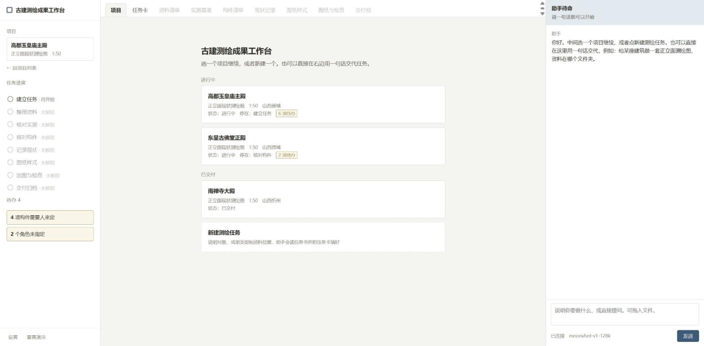
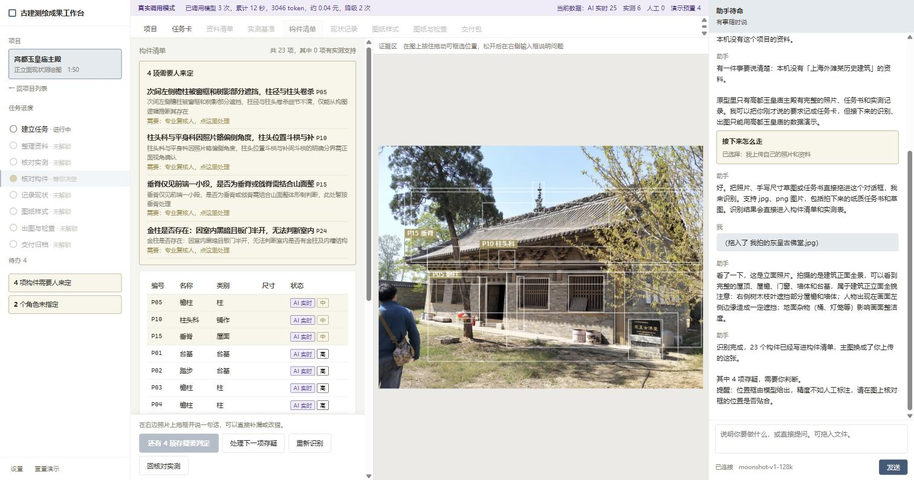
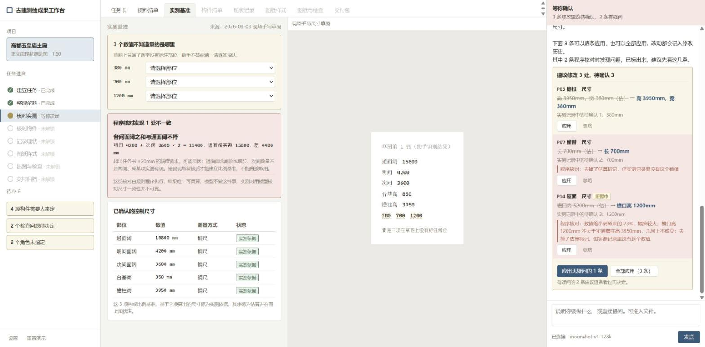
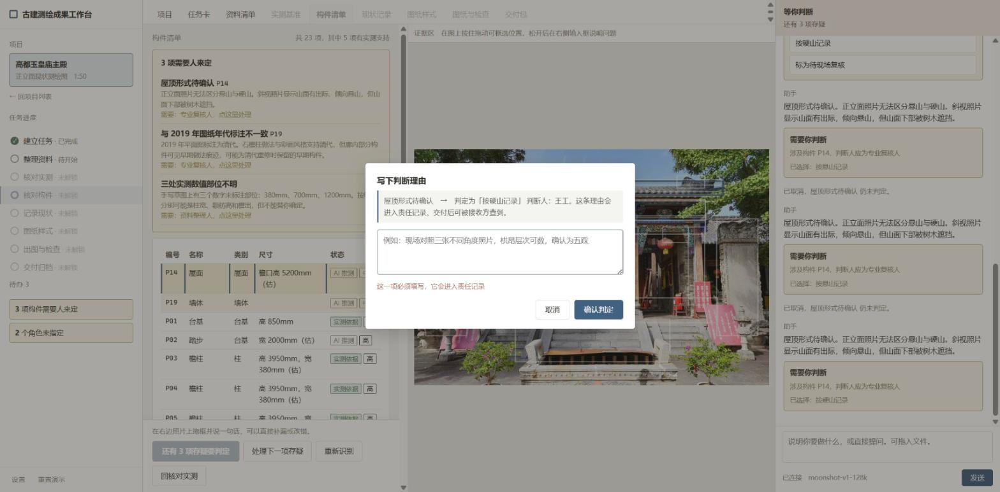
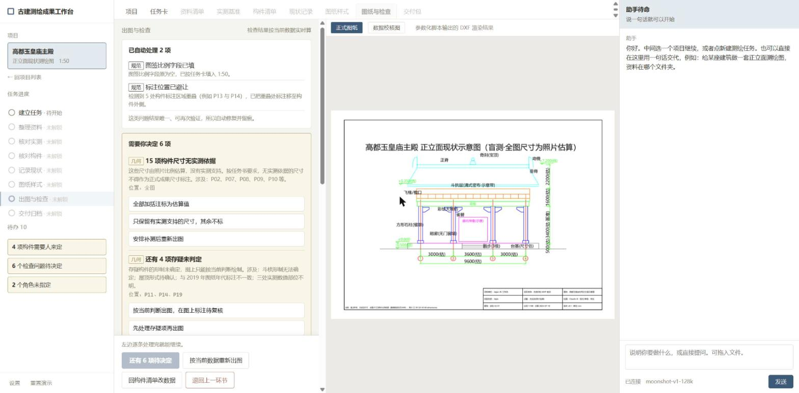

# 古建保护成果工作台

面向古建测绘与保护团队的 AI 成果工作台。产品把任务要求、照片、测量记录、历史图纸、构件对象、人工判断和成果版本放进同一条可追溯业务链，减少重复录入，并明确模型、规则、人工和演示数据各自承担的责任。

本仓库是求职作品展示版，包含可运行的 React 工作台、结构化演示项目、核心产品文档和质量验收基准。仓库中的建筑数据与生成成果仅用于流程验证，不是现场实测成果，也不能替代专业审核或法定签发。

## 产品问题

古建保护项目的资料通常分散在照片、表格、文字记录、CAD 和个人经验中。资料更新后，团队需要判断哪些对象、图纸、检查和交付版本受到影响。传统流程常见四类问题：

- 同一尺寸或构件信息被重复录入；
- 资料、判断和成果之间缺少可追溯关系；
- AI 推测、程序规则与现场事实容易混在一起；
- 局部修改造成无关成果返工，或旧成果继续被误用。

## 产品方案

- 以项目包导入任务、结构化数据和资料，并在导入前检查 schema、文件路径、MIME、数量、大小和哈希；
- 用受控业务命令记录项目版本、模型运行、规则运行、人工决定、成果和审计事件；
- 分开记录 `model`、`rule`、`human`、`demo` 四类业务来源；
- 只把证据不足、规则冲突、专业存疑和高风险问题送入人工队列；
- 数据变化后按依赖关系使受影响成果失效，保留未受影响内容；
- 支持导入、选择和导出 `project.json` 与 `.gujian.zip`；
- 生成代理 SVG、DXF、检查报告和交付清单，同时锁定正式签发。

## 界面预览

| 项目列表 | 上传资料进入业务链 |
|---|---|
|  |  |

| 程序核对建议 | 判断理由与来源 |
|---|---|
|  |  |



## 当前实现

`app/` 是 React 19、TypeScript、Vite 和本地 Node 服务组成的可运行验证版：

- IndexedDB 分别保存项目快照、资源、运行记录、决定、成果、交付和审计事件；
- Zod 负责项目数据与项目包校验；
- 项目命令服务提供版本检查和事务提交；
- 支持高都、东呈两套不同结构和资料完整度的演示数据；
- 高都验证代理交付路径，东呈验证五开间、资料缺失和交付阻断路径；
- 单元测试覆盖领域数据、业务命令、项目包和代理交付；
- Playwright 覆盖桌面工作台关键流程。

当前版本仍属于产品与工程验证。样例加载仍由前端选择内置项目 JSON，完整的资料入库、通用几何生成、专业制图和组织权限属于下一阶段目标。具体差距和迁移方案见技术架构文档。

## 快速运行

环境要求：Node.js 20.19 或更高版本。

```bash
cd app
npm install
npm run dev
```

浏览器访问 `http://127.0.0.1:5173/`。

```bash
npm run typecheck
npm run test
npm run build
```

AI 接口是可选能力。复制 `.env.example` 为 `.env` 并在本机填写密钥；不要把真实密钥提交到仓库。没有配置模型时，结构化项目、规则、人工确认、导入导出和本地代理成果仍可独立验证。

## 文档索引

- [目标用户调研与权重打分](docs/01_目标用户调研与权重打分.md)
- [用户与场景分析](docs/02_用户与场景分析.md)
- [MRD：古建保护历史信息归档](docs/03_MRD_古建保护历史信息归档.md)
- [调研结论](docs/04_调研结论.md)
- [核心 PRD](docs/05_核心PRD_古建保护成果工作台.md)
- [技术架构](docs/06_技术架构_古建保护成果工作台.md)
- [专业制图与建模质量基准](docs/07_专业制图与建模质量基准.md)
- [工作台视觉方案](docs/08_工作台视觉方案.md)
- [界面设计规范](docs/09_界面设计规范.md)
- [可迁移 AI 能力与流程影响](docs/13-2_可迁移AI能力与流程影响.md)
- [正式制图能力与验证样本预研](docs/13-11_正式制图能力与验证样本预研.md)

## 我的工作范围

本项目用于展示从行业问题研究到产品与技术验证的完整过程，包括：

- 用户、场景和任务研究；
- MRD、终局 PRD、流程和人工责任设计；
- 最小项目数据模型与来源责任设计；
- 本地优先技术架构与导入、导出、安全边界；
- AI 协作研发、测试、交叉审查和按任务提交；
- 专业 CAD、三维模型和交付成果的质量门槛设计。

## 责任与数据边界

- 演示数据不等于真实模型运行结果；
- AI 转写或识别结果始终先进入候选区；
- 人工确认不会把推测值变成现场实测值；
- 正式成果必须具备真实证据、责任身份、权限和专业签发；
- 当前仓库不实现法定签发、组织权限、云端多租户或 DWG 生成。

Copyright © 2026 Jiajia. All rights reserved.
