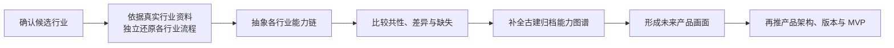

# 辅导 8 要点笔记（260719）

> 来源：本机辅导录音转写 260719_产品经理辅导 8.txt（未随仓库提供）  
> 记录时间：原文件标题为 260719，逐字稿时间标注为 2026-07-22，时长 1 小时 28 分。  
> 主题：跨行业能力抽象、调研结论、未来产品画面、AI 协作、快速学习与 Agent 工作流。

## 一句话结论

跨行业调研的最终产物是：**先独立抽象每个行业从信息输入到行业结果的完整能力链，再比较共性与差异，反向补全古建归档产品的未来能力图谱，并形成所有人一看就知道“产品最终是什么”的方向性结论。**

## 1. 当前调研做对了什么，缺了什么

已经完成的有效工作：

- 从古建归档出发，扩展到遗产数字化、建筑测量、医疗影像、无人机测绘、三维重建、自动驾驶、巡检、遥感等行业。
- 分开调研了产品级能力和技术级能力，梳理了行业上限、代表产品和当前边界。
- 从大量发散资料中逐步收敛，开始建立产品现状、未来状态、MVP 和能力差距之间的关系。

主要缺口：

- 调研结束后还缺一个明确的方向性结论，即产品未来到底是什么。
- 现有结论更像模块、技术和版本清单，缺少用户能感知的完整画面。
- 一些模块名称不够抽象，仍然受具体技术方法和现有方案影响。
- 研究路径曾经从古建既有能力链出发寻找相似行业，导致其他行业被已有框架限制。

## 2. 什么是行业级“抽象能力”

抽象能力回答的是某个行业在每个阶段**要完成什么结果**，不是通过什么工具或方法完成。

判断标准：

1. **以结果为导向**：先说明每一步要得到什么，再考虑如何实现。
2. **摒弃方法**：不把具体设备、软件、算法、数据格式或操作步骤写成一级能力。
3. **独立抽象行业**：每个行业先按自己的真实运转机制形成完整链路，不能先设一条统一链再套行业。
4. **保持同一颗粒度**：同一张图中的节点应处于相近层级，不能把行业阶段和单项操作并列。
5. **合并同目标步骤**：多个活动如果共同服务于同一个阶段结果，应合并为一个能力节点。
6. **保留行业差异**：足够抽象不等于空泛，节点仍应体现行业特有的输入、核心转换和输出。
7. **形成端到端链路**：至少看清楚行业信息如何输入、如何转成专业结果、如何审核，以及如何交付或归档。

老师现场给出的古建测绘链路只是形式示例，大意为：测绘信息输入、整理、分析、处理、结果输出、审核和归档。该示例用于说明抽象颗粒度，不应直接当作其他行业的统一答案。

## 3. 正确的跨行业调研顺序

关键顺序不能反：

- 先获取真实行业事实，再抽象能力。
- 先完成所有行业的独立链路，再总结共性。
- 先定义未来产品要达到什么，再让技术和功能为目标服务。
- 产品级调研与技术级调研分开进行，最终在产品结论处汇合。

## 4. 调研必须形成“有画面感”的产品结论

调研回答的是产品未来会长成什么样。完成调研后，需要形成两类相互支持的表达：

### 4.1 场景故事

用完整使用过程描述用户如何进入、产品如何持续协助、用户最终获得什么。它让团队对最终体验形成共同画面，不产出页面原型。

### 4.2 能力图谱

从场景故事中抽象出产品长期稳定的核心能力。未来的功能都应落在这些能力下，按能力归类增加。

对于古建归档项目，最终要回答：

- 产品接收哪些类型的遗产和环境信息。
- 如何把分散信息转成可理解、可核验的专业成果。
- 如何让成果经过审核后成为正式可归档记录。
- 如何让不同项目、不同时间形成的记录持续连接和更新。
- 用户使用时看到的是怎样的一条完整链路。

## 5. 做产品先回答“做不做”和“做成什么”

产品经理的方向判断会调动大量开发、设计、运营和预算资源，因此核心责任是先为决策提供充分依据：

1. 这件事是否值得做。
2. 如果做，最终要形成什么结果。
3. 这个结果带来什么用户价值和组织价值。
4. 现有行业事实是否证明它可实现。
5. 当前产品与未来状态之间差哪些能力。

技术调研的作用是证明目标并非脱离现实，不是替代产品目标。若先串技术方法，再猜能得到什么产品，容易出现方向倒置。

## 6. 与 AI 的正确协作关系

- 产品经理不能把思考和最终判断交给 AI。提出问题前，自己应先对产品方向有基本判断。
- AI 的价值是补充事实、拓展维度、建立论证、发现遗漏，并与人的判断相互校验。
- 当人和 AI 的结论不一致时，应追查前提、证据和推理链，而不是直接接受某一方。
- AI 容易在长任务中偏离目标，需要持续检查产出是否仍服务于原始问题。
- 宁可投入更多时间做出一个高质量范例，后续相似任务才能稳定复用。
- 信息应来自权威且固定的来源，避免同一类事实同时由多个互相冲突的文件定义。

## 7. 快速学习陌生行业的方法

产品经理不必一开始掌握行业全部技能，但需要快速理解行业本质和运转机制。

建议路径：

1. 先建立行业全景：主要对象、参与者、产品类型、工作链路和结果。
2. 再理解不同类型分别解决什么问题、适用于什么场景。
3. 把自己的产品场景与行业能力建立对应关系。
4. 对影响产品判断的关键细节继续深挖和多方验证。
5. 通过真实项目证明自己能快速进入新行业。

老师给出的节奏参考：一个月建立行业全貌，两个月深入关键细节。重点是逐步形成判断真伪和边界的能力。

## 8. Agent 团队与固定工作流

### 8.1 职能应按责任抽象

- **团队负责人**：初步判断任务、分配角色、审核结果、向用户交付，不代替专业角色完成全部工作。
- **产品经理**：负责顶层抽象、价值判断、方向和产品结论。
- **项目经理**：负责计划、资源、进度和风险。
- **PRD 专家**：把已确认的产品结论文档化，不替代产品经理重新定义方向。
- **领域专家**：按照固定来源和固定交付标准完成专业调研或分析。

职能定义应精简、结构化，并把思考与文档制作分开。

### 8.2 工作流应固化

对于反复执行的任务，应明确：

- 从哪些权威来源取信息。
- 输入是什么。
- 必须完成哪些阶段。
- 输出哪些文件。
- 使用什么检查清单验收。
- 由谁做最终判断。

这样用户只需提交核心输入，系统即可稳定完成整条链路。

### 8.3 记忆与文件管理

- 用固定开场或身份声明判断 Agent 是否仍按正确上下文工作。
- 上下文开始偏移时，优先新开对话并读取交接材料，不依赖不可控的自动压缩恢复。
- 全局记忆只保留长期通用信息；项目角色、流程和最新状态由项目文件维护。
- 同一类信息只保留一个权威来源，避免旧版本与新版本同时生效。
- 文件夹应有统一入口，减少多个层级重复生成项目记忆文件。

## 9. 求职层面的启发

- AI 产品经理的核心优势之一是借助 AI 快速进入陌生行业并形成可靠判断。
- 面对垂类经验要求，可以通过短时间形成行业分析和真实项目成果来证明迁移能力。
- 求职不应只依赖标准投递路径，应主动寻找与业务负责人沟通和展示能力的机会。
- 作品集应展示判断过程：如何理解行业、如何抽象问题、为什么做或不做、如何形成产品方向，而不只是展示最终 Demo。

## 10. 对当前古建项目的直接任务

1. 为每个候选行业独立建立一条端到端的抽象能力流程图。
2. 检查节点是否足够抽象，并合并服务于同一阶段结果的步骤。
3. 在全部行业链路完成后，再总结通用能力链和行业差异。
4. 用共性与差异检查古建归档原有能力是否缺少环境、时间、审核、归档或更新维度。
5. 将调研结果转成古建产品的未来场景故事和能力图谱。
6. 在未来产品画面明确后，再讨论产品架构、输入档位、版本路径和 MVP。

## 11. 行业能力链自检清单

- [ ] 流程是否从行业信息输入一直到正式结果或归档结果。
- [ ] 每个节点写的是阶段结果或能力，而不是设备、算法或操作方法。
- [ ] 每个行业是否先独立抽象，没有被预设的共性框架套用。
- [ ] 节点之间是否保持同一颗粒度。
- [ ] 能合并的步骤是否已经合并。
- [ ] 流程是否仍能看出该行业的核心对象和专业结果，而不是通用项目管理流程。
- [ ] 行业事实和能力判断是否能回溯到真实、权威来源。
- [ ] 把所有行业流程并排后，是否能一眼看到共性、差异和古建缺失能力。
- [ ] 调研结论是否能够继续推导出未来产品，而不是停留在资料汇总。

