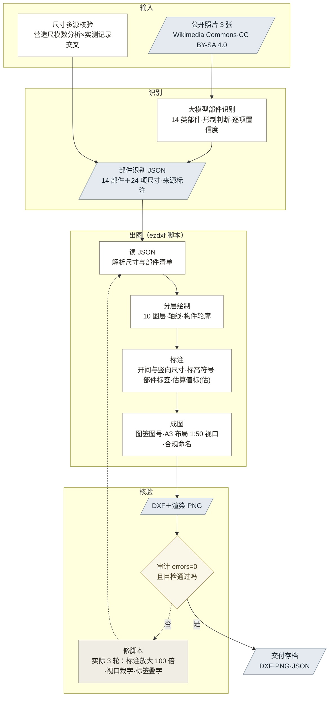

# 05 · PoC 路线 1 验证报告：照片到规范 CAD 图纸

## 1. 结论

H1 部分成立，闭环走通。多模态大模型从公开照片识别出全部 14 类主要立面部件（形制判断与文献记载一致），识别结果落成结构化 JSON 后由脚本自动生成带图层、轴线、标注的 DXF 立面图，DXF 审计零错误。

关键边界确认：照片能提供形制和相对比例，不能提供绝对尺寸。轴线尺寸来自文献核验值，门窗台基等无文献值的部件只能标（估）。

## 2. 工作流与产出

**图 1：PoC 路线 1 完整工作流**
（矩形为处理步骤，平行四边形为数据产物，菱形为质量门；虚线为返工回边）

图 1 中每一步的输入输出与工具对应 09 报告第三节的环节职责六字段说明；本图为南禅寺一次完整执行的实例，两处盲测样本沿同一条链执行（区别：无文献核验步，尺寸全部转照片比例估算）。

产出文件如表 1 所示（均在本目录）。

**表 1：产出文件清单**

| 文件 | 内容 |
|------|------|
| 素材/*.jpg | 正面、正面二、柱头铺作三张照片（CC BY-SA 4.0，作者 Patrick20242023） |
| 部件识别_南禅寺大殿正立面.json | 结构化识别结果：14 部件 + 24 项核心尺寸，逐项标注来源与置信度 |
| 生成立面图_南禅寺大殿.py | 读 JSON 生成 DXF 的脚本（ezdxf，10 个图层，含轴线和尺寸标注） |
| 南禅寺大殿_正立面现状测绘图.dxf | 交付图纸，含 A3 布局 |
| 南禅寺大殿_正立面_预览.png / 南禅寺大殿_A3布局_预览.png | 模型空间与 A3 布局渲染预览，用于目检核验 |

盲测扩样（2026-07-10，两样本沿同一工作流执行，验证记录见 09 报告）的产出如表 2 所示（均在本目录）。

**表 2：盲测扩样产出文件清单**

| 文件 | 内容 |
|------|------|
| 盲测素材/*.jpg | 东呈古佛堂 3 张（作者 仙女传奇）、高都玉皇庙 4 张（作者 Windmemories），均 CC BY-SA 4.0 |
| 部件识别_东呈古佛堂正立面.json | 盲测识别结果：18 项部件、六项形制差异点，尺寸全部为照片比例估算（基准假设门高 2500 mm） |
| 部件识别_高都玉皇庙正立面.json | 盲测识别结果：13 项部件、五项形制差异点，尺寸全部为照片比例估算（基准假设柱高 3400 mm） |
| 生成立面图_东呈古佛堂.py / 生成立面图_高都玉皇庙.py | 基于南禅寺脚本改写：框架段复用约六成，立面构成段按形制新写 |
| 东呈古佛堂_正立面现状示意图.dxf | 盲测图纸，1:100 A3 布局，195 实体，审计 errors=0 |
| 高都玉皇庙主殿_正立面现状示意图.dxf | 盲测图纸，1:100 A3 布局，97 实体，审计 errors=0 |
| 东呈古佛堂_正立面_预览.png 等 4 张 | 两样本各两张渲染预览（模型空间加 A3 布局），目检各 2 轮通过 |

## 3. 数据核验记录

**表 2：尺寸数据核验记录**

| 数据 | 采用值 | 核验情况 |
|------|--------|----------|
| 通面阔 | 11550 mm（轴线理想值） | 明间 16.5 尺 + 次间 2×11 尺（营造尺 300 mm，《建筑史学刊》2022-02）；与实测 11620 mm（维基百科等多源）差 70 mm，差异来自实测含歪闪变形 |
| 通进深 | 9900 mm | 三间各 11 尺，与实测 9.9 m 一致 |
| 平柱高 | 3900 mm | 13 尺，文献一致 |
| 铺作高/举高 | 1559 / 2079 mm | 柱高:铺作:举高 = 10.5:4.5:6 足材（足材 346.5 mm），文献模数分析 |
| 柱径 | 384 mm | 三维扫描实测均值 |

**核验发现的错误案例**：AI 辅助提取文献时曾返回"通面阔 5250 mm、明间 3180 mm"，与已核验的 11.62 m 直接矛盾（疑混入佛坛或内部尺寸），已弃用。产品链路中 AI 提取的数据需交叉核验，单源提取不可直接进档案。

## 4. 部件识别核验

照片识别的形制判断与文献逐项对照，无一冲突：三开间近方形平面、檐柱侧脚、阑额无普拍枋、柱头铺作五铺作双杪偷心造、无补间铺作、双层椽飞出檐深远、单檐歇山灰瓦顶、正脊两端鸱尾、明间双扇板门、两次间直棂窗加槛墙。以上均为唐代木构典型特征，识别未出现张冠李戴（如把耍头认成昂、把直棂窗认成槛窗）。

图纸核验：DXF 审计 errors=0；渲染目检两轮，首轮发现尺寸标注被放大 100 倍（ezdxf 内置标注样式的线性比例因子），修正后数值全部正确；开间标注闭合（3300+4950+3300=11550）。

## 5. 局限（如实记录）

1. 铺作为简化示意：真实华栱出跳方向朝向观察者，立面图中的正视投影简化为栌斗+泥道栱+散斗+耍头轮廓
2. 门窗、台基、脊饰、檐口高度为照片估算（图中已标"估"），未经测绘校正；瓦垄、柱础、门钉等细部未绘
3. 本次为单栋、单视角、有充分文献的理想样本；部件识别率的量化（≥80% 的 Go 标准）需要多样本、无文献辅助的盲测才有效力
4. 路线 2（摄影测量重建正射影像）未做，几何精度路线待验证

## 6. 对假设与文档的影响

- **H1**：语义识别与规范出图路径已通，技术风险从"路径是否存在"降为"精度能到多少"
- **02 MRD §5.6**：输入定义获技术印证，不改
- **产品机制候选**：AI 提取数据的多源一致性检查（见 §3 错误案例）

## 7. 下一步

1. ~~盲测扩样：选 2 到 3 处无现成测绘图的古建照片重跑~~ 已完成（2026-07-10，东呈古佛堂、高都玉皇庙两样本，见 09 报告；识别率量化待交叉验证表复核）
2. 路线 2：Meshroom/COLMAP 重建正射影像，验证几何精度
3. ~~按北京市《历史建筑数字化技术规范》核对图层与成果格式要求~~ 条款对照已完成（见 06 文档）；GB/T50001 图层与线型对照仍待查
4. 把本工作流的 token 与时间消耗记入单位经济模型（02 §7.3 回填）
