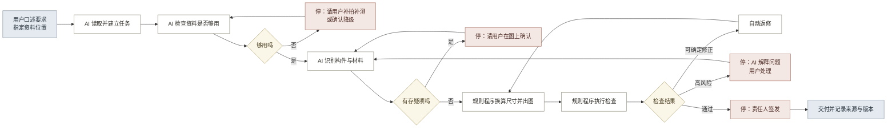

# 01 · AI 与制图能力边界 v1.0

> 本文合并原 01 可迁移 AI 能力与流程影响、02 正式制图能力与验证样本预研两份研究底稿，是产品判断的外部能力依据。结论已进入 PRD 与技术架构，本文保留证据与出处。

## 1. 结论

AI 价值分为任务处理和人机交互两层。任务处理层读取照片和文档，产出构件清单、材料清单、位置与尺寸预估、资料缺口和问题定位；人机交互层接收自然语言和图像框选，显示处理进度与证据，并在专业判断、规范选择和签发节点请求人工确认。

专业 CAD 不能由模型直接输出一组看似合理的线段。三维几何程序建立建筑模型，制图程序从模型生成平、立、剖和详图，独立工具负责检查文件。规则程序继续负责计算、校验、出图和组包。

第一套公开验证样本采用美国历史建筑调查的 Locke 镇资料，以 Dai Loy Gambling Museum 为单体建筑子集。该样本适合验证工程流程与 CAD 质量，不能单独证明中国传统木构构件识别能力。

## 2. 各环节的 AI 产出

各环节的输入、AI 产出和规则程序边界见表 1。

**表 1：各环节的 AI 产出**

| 环节 | 输入 | AI 产出 | 规则程序边界 |
|---|---|---|---|
| 建立任务 | 用户口述要求，一个资料文件夹 | 从任务书提取成果类型、比例、精度、规范和交付项，形成任务卡草稿；识别文件类型 | 可按扩展名和文件名分类；任务要求需结构化输入 |
| 整理资料 | 照片、扫描件、旧图纸、现场记录 | 标注拍摄部位、覆盖范围和可用性，形成遮挡、缺面和低分辨率清单 | 可检查格式、分辨率和数量；语义覆盖需人工标注 |
| 核对构件 | 立面照片 | 生成构件与材料候选，给出位置、数量、尺寸预估、依据和存疑原因 | 需预先提供固定类别及其可计算特征 |
| 记录现状 | 构件清单、实测尺寸、多角度照片 | 草拟空间关系，提取可见残损线索，标记无实测依据部位 | 可依据实测基准换算比例和校验几何关系 |
| 生成图纸 | 确认后的构件数据、画法规则 | 将非标准形制整理为可校验的画法参数 | 可稳定绘制已经参数化的标准形制 |
| 检查与签发 | 图纸、对象数据、规范要求 | 解释错误原因，定位位置，并按后果排序 | 可执行明确的字段、几何和规范检查 |
| 交付归档 | 成果、证据、检查记录、版本 | 起草交付说明，概括版本变化和修改原因 | 可组合文件、核对清单和比对字段差异 |
| 复查更新 | 不同时期的照片与图纸 | 形成差异候选及原因，区分采集条件与建筑变化 | 可执行配准、像素和结构化字段比对 |

## 3. 人机协作方式

五种协作方式对应问题审计中的 10 项人机协作问题（审计原文见 `../99_历史归档/`），见表 2。

**表 2：五种协作方式**

| 协作方式 | 用户实际做什么 | 系统实际做什么 | 解决问题 |
|---|---|---|---|
| 自然语言交代任务 | 说明项目、资料位置和特殊要求 | 读取资料，建立任务，列出已知信息和缺口 | 43、50 |
| 自动推进与停靠 | 回答系统提出的必要问题 | 完成当前步骤后继续处理；遇到责任节点时暂停，并显示动作和资料 | 42、45 |
| 原图框选修正 | 框出位置并说明问题 | 定位构件，更新数据与受影响成果，保存修正记录 | 44、49 |
| 项目内复用 | 确认术语、构件或做法 | 写入项目构件库；跨项目复用前再次确认 | 47、48 |
| 依据和责任始终可见 | 查看某条结果时点开依据 | 用不同标记区分实测依据、AI 推测和人工确认三种状态，并记录每次修改的人、时间、原因和影响范围 | 46、51 |

原图框选把证据、问题和修改对象连在同一处，省去在照片与表格之间反复定位。

## 4. AI、规则程序与人工的分工

分工原则是让 AI 做需要理解的事，让规则程序做需要确定的事，让人做需要负责的事。

完整的人机分工矩阵与自动执行条件见 [核心 PRD](../01_产品/01_核心PRD.md) 附录 A.2 与 A.4，该附录为分工口径的唯一来源。本节表 1 属能力分析视角，不构成责任分工定义。

## 5. 可迁移的 AI 能力与外部依据

表 1 中的 AI 产出依赖以下能力，每项都有已公开的实现和明确限制（见表 3）。

**表 3：可迁移能力及边界**

| 能力 | 用途 | 外部依据 | 主要限制 |
|---|---|---|---|
| 文档解析与视觉检索 | 读取任务书、扫描件、表格和图纸，返回原始位置 | [Docling](https://research.ibm.com/publications/docling-an-efficient-open-source-toolkit-for-ai-driven-document-conversion)、[MinerU](https://github.com/opendatalab/MinerU)支持复杂文档解析；[ColPali](https://arxiv.org/abs/2407.01449)支持按页面视觉内容检索 | 复杂图纸、手写内容和专业术语仍需样本验证 |
| 开放概念分割 | 用文本或图像提示定位未预设类别的构件 | [SAM 3](https://ai.meta.com/research/publications/sam-3-segment-anything-with-concepts/)支持开放词汇概念分割；[DINOv3](https://ai.meta.com/research/publications/dinov3/)提供通用视觉特征 | 外观相似、遮挡和地区做法差异会造成误判 |
| 多视图几何 | 从多张照片形成相机位置、深度和三维草稿 | [VGGT](https://github.com/facebookresearch/vggt)可联合预测多种三维属性 | 不能替代实测，也不能恢复不可见部位 |
| 点云构件语义分割 | 从扫描点云自动区分构件类别，为构件清单提供候选 | [Scan-to-BIM 实例分割](https://github.com/LTTM/Scan-to-BIM)提供全自动分割研究实现；[BIMNet 基准](https://github.com/LydJason/BIMNet)提供基于 IFC 的 14 类构件标注与几何加拓扑双维评测（AUTCON 2025） | 学界最好水平 mIoU 43.7%（BIM-Net++ 在 HePIC 数据集，2025），远未达到免核对程度，每个识别结果必须可人工确认 |
| 结构化生成 | 按固定字段输出对象、状态和问题 | [Structured Outputs](https://openai.com/index/introducing-structured-outputs-in-the-api/)可约束模型输出结构 | 输出事实仍需核对 |
| 参数化 CAD | 由对象参数和约束生成可编辑图形 | [CAD 约束生成研究](https://arxiv.org/abs/2504.13178)表明模型可辅助生成几何约束 | 画法规则与尺寸依据必须先确定 |
| 确定性规则检查 | 把明确要求写成机器可执行规则 | [buildingSMART IDS](https://www.buildingsmart.org/standards/bsi-standards/information-delivery-specification-ids/)展示了可机读信息要求与自动检查方法 | 不能判断真实性、价值和法律责任 |
| 受控工具调用 | 将自然语言映射到允许的动作，并调用指定工具 | [Anthropic agents](https://resources.anthropic.com/building-effective-ai-agents)与[评测方法](https://www.anthropic.com/engineering/demystifying-evals-for-ai-agents)说明工具调用与可重复评测 | 长流程会累积错误，流程顺序和停靠条件需由固定规则控制 |
| 风险校准 | 把低把握结果转成人工问题 | [Conformal prediction](https://arxiv.org/abs/2505.24693)提供覆盖风险的方法；[NIST AI RMF](https://www.nist.gov/itl/ai-risk-management-framework)强调风险治理与人工监督 | 必须用古建样本校准，不能直接采用通用置信度 |
| 跨期比较 | 对多时相资料提取变化候选 | [TerraMind](https://www.esa.int/Applications/Observing_the_Earth/ESA_and_IBM_collaborate_on_TerraMind)展示多模态多时相分析 | 需区分采集差异与真实变化 |
| 来源与版本追踪 | 记录资料、处理过程、人工修改与成果的关系 | [W3C PROV-O](https://www.w3.org/TR/prov-o/)提供通用来源关系模型 | 需要统一对象身份、权限与记录规则 |

编排层负责流程推进、停靠和退回；模型只在允许的动作清单内理解指令并调用工具。

## 6. AI 增量与验证重点

表 4 对比规则程序的能力上限和 AI 的新增产出。

**表 4：AI 增量与验证重点**

| 环节 | 规则方案 | AI 增量 | V1A 判断 |
|---|---|---|---|
| 建立任务 | 表单录入、必填校验 | 从口述和任务书生成任务卡草稿 | 建设 |
| 整理资料 | 格式、分辨率和数量检查 | 判断拍摄部位、覆盖范围和语义缺口 | 建设 |
| 核对构件 | 固定类别和字段管理 | 生成带位置、依据和存疑原因的构件候选 | 重点验证 |
| 记录现状 | 尺寸换算和几何校验 | 草拟空间关系和可见残损线索 | 有限建设 |
| 生成图纸 | 参数化绘制和稳定导出 | 整理非标准形制参数 | 规则程序主导 |
| 检查与签发 | 执行明确检查规则 | 解释错误、定位位置并说明后果 | 重点验证 |
| 交付归档 | 自动组包和模板说明 | 生成版本差异与限制条件草稿 | 先用模板 |
| 复查更新 | 配准和差异比对 | 解释差异原因并形成复查线索 | V3 评估 |

V1A 优先验证构件核对和检查解释。图纸生成由规则程序负责；交付说明先采用模板，真实需求成立后再评估 AI 价值。

## 7. 专业制图路径

### 7.1 能力分工

AI 负责理解与组织，几何和制图程序负责精确结果。

**表 5：正式制图能力分工**

| 环节 | AI 负责 | 程序负责 | 人工负责 |
|------|---------|----------|----------|
| 资料输入 | 分类、转写、对象关联和缺失分析 | 文件校验、哈希和单位转换 | 提供现场资料 |
| 建筑建模 | 识别对象、关系和几何候选 | 约束求解、三维几何和派生视图 | 审核关键预览 |
| 问题处理 | 分析冲突、形成方案和调用工具 | 验证规则、计算影响和应用修改 | 审核非唯一选择 |
| 专业制图 | 建议图纸目录、说明和编排 | 生成平、立、剖、详图和 CAD | 审核并签发 |
| 文件检查 | 汇总错误和提出修改方案 | 检查结构、图层、标注和打印 | 判断专业表达 |

### 7.2 开放技术候选

IfcOpenShell 可读写 IFC、处理三维几何，并从三维模型生成带标注的二维图纸。其官方文档说明二维图纸能力可以保留模型与图纸符号之间的语义关系，并已用于商业项目图纸。

ezdxf 可创建、读取、修改和写入多个版本的 DXF。它支持模型空间、图纸空间、图层、线型、文字、标注和审计，也可以把 DXF 渲染为 SVG 或 PDF。

Ortho2CAD 和 Drawing2CAD 证明多视图工程图可以辅助生成可编辑参数模型。两者目前面向机械零件，不处理建筑语义、古建构件、来源关系或建筑图纸表达。

Ortho2CAD 从光栅正投影图生成 CadQuery 代码。论文只评估 100 个测试样本。DeepCAD 的平均 IoU 为 0.7922，Fusion 360 测试的平均 IoU 为 0.5601。

训练数据主要是草图和拉伸操作。代码能够运行，不代表几何正确，也不能直接达到古建专业交付要求。

Drawing2CAD 从矢量图元生成参数化 CAD 操作。它保留线、弧等几何输入的思路可用于图纸解析，但没有建筑成果和事务所图纸质量验证。

DWG 需要受许可的转换工具或商业 SDK。修改文件扩展名不代表支持 DWG。

这些工具只能作为候选。正式选型要在 PRD 确认后，通过样本验证复杂屋面、构件细节、尺寸标注、字体、打印和不同 CAD 软件兼容性。

官方依据：

- [IfcOpenShell GitHub 仓库](https://github.com/IfcOpenShell/IfcOpenShell)
- [IfcOpenShell 功能说明](https://docs.ifcopenshell.org/introduction.html)
- [IfcOpenShell 二维图纸接口](https://docs.ifcopenshell.org/autoapi/ifcopenshell/draw/index.html)
- [ezdxf GitHub 仓库](https://github.com/mozman/ezdxf)
- [Ortho2CAD 论文](https://arxiv.org/abs/2607.08891)
- [Ortho2CAD GitHub 仓库](https://github.com/AdityaJoglekar/Ortho2CAD)
- [Drawing2CAD 论文](https://arxiv.org/abs/2508.18733)
- [Drawing2CAD GitHub 仓库](https://github.com/lllssc/Drawing2CAD)

### 7.3 文件质量门槛

CAD 与三维成果的完整质量基准见 [专业制图与建模质量基准](../02_技术/03_专业制图与建模质量基准.md)，该文为质量底线的唯一来源。本文不另设一套门槛。

验证样本的判定按该基准第 5 节 CAD 文件最低要求与第 6 节自动检查执行。

美国国家公园管理局的 HABS 指南覆盖现场记录、各类视图、CAD 制图、图幅、比例、标注、图签和最终打印。它可以作为公开测试样本的图面质量依据。

国内项目仍以项目确认的现行标准和委托要求为准。

标准依据：

- [HABS 实测图纸指南](https://www.nps.gov/subjects/heritagedocumentation/upload/HABS-Guidelines-Measured-Drawings_508.pdf)
- [历史建筑记录标准](https://www.nps.gov/subjects/heritagedocumentation/soi-standards-guidelines.htm)

## 8. 验证样本

### 8.1 第一套验证样本：Dai Loy HABS

#### 8.1.1 样本范围

Locke 镇 HABS 调查包含 18 张照片、1 张彩色透明片、18 张实测图、35 页文字资料和现场笔记 FN-94。

资料由美国国会图书馆公开提供。美国国家公园管理局说明，HABS 计划制作的材料属于公共领域。

本项目先下载满足验证所需的低分辨率预览、指定图纸和文字 PDF，不下载大体量视频、航拍或无关资料。

已核验的本地样本共 6 个文件、1,354,283 字节。

文件来源、哈希、验证方式和使用边界见 [`../05_验证证据/03_公开实测样本/Dai_Loy_HABS/README.md`](../05_验证证据/03_公开实测样本/Dai_Loy_HABS/README.md)。

公开入口：

- [Town of Locke，HABS CA-2071](https://www.loc.gov/pictures/item/ca0469/)
- [Locke 与 Walnut Grove 教学资料](https://www.nps.gov/articles/000/locke-and-walnut-grove-havens-for-early-asian-immigrants-in-california-teaching-with-historic-places.htm)
- [Dai Loy Gambling Museum 文字资料 PDF](https://tile.loc.gov/storage-services/master/pnp/habshaer/ca/ca0400/ca0492/data/ca0492data.pdf)

#### 8.1.2 单体建筑子集

Dai Loy Gambling Museum 建于 1916 年左右。HABS 文字资料记录建筑约 24 英尺宽、60 英尺深，并描述外立面、室内、结构、门窗、屋顶和空间用途。

Locke 镇实测图中的 Dai Loy 子集包括：

- 图纸第 16 张：一层和二层平面，含主要尺寸，比例为 1/4 英寸等于 1 英尺。
- 图纸第 17 张：A-A 剖面和西立面。
- 图纸第 18 张：B-B 剖面。
- HABS 照片：外立面、屋面、室内和构造细节。
- 文字资料：历史、尺寸、材料、构造和房间说明。

#### 8.1.3 测试任务

样本采用两种测试方式，避免把工程复现和未知信息推断混为一项能力。

工程复现将照片、文字和第 16 至 18 张图纸全部作为输入，用于验证资料追溯、三维建模、平立剖一致性和 CAD 文件质量。

未知信息盲测只输入照片、文字和第 16 张平面图，暂不提供第 17、18 张。系统应保留未知高度和不可见构造。

任务完成后再用第 17、18 张检查推断结果。未提供的尺寸不能标为现场实测。

两种测试均按以下顺序执行：

1. 建立任务、建筑和资料清单。
2. 转写原始尺寸并保留英制单位与原记录关系。
3. 识别楼层、空间、外墙、柱、门窗、楼梯、屋面和主要构造。
4. 建立带未知状态的三维建筑模型。
5. 生成一层平面、二层平面、屋顶平面、西立面和 A-A、B-B 剖面。
6. 生成可编辑 DXF、三维交换文件、SVG 或 PDF 预览、检查报告和项目数据。
7. 按当前测试方式，与输入图纸或暂存的对照图纸比较尺寸、对象、开口、剖切和表达。
8. 把项目包重新导入，验证资源、版本、来源和审计关系。

#### 8.1.4 通过条件

- 原始图纸明确给出的关键尺寸在单位换算后保持一致，错误为 0 项。
- 系统不补造未提供的尺寸；未知内容在模型和图纸中明确标注。
- 平面、立面、剖面和三维模型引用同一对象与几何版本。
- DXF 通过 7.3 节引用的质量基准。
- 每个关键尺寸、开口和构件可以定位到输入证据或明确的规则结果。
- AI 先处理问题并形成成组预览，专业人员不需要重复转写尺寸和处理理由。

### 8.2 中国古代木构样本评估

南禅寺大殿作为第二套内部研究样本。它是中国唐代木构，公开论文提供柱网、柱高、柱截面、部分屋架、铺作和材分数据，仓库已有三张 CC BY-SA 4.0 照片。

论文使用 2 mm 密度点云和手工测量。论文报告单点精度为 0.3 mm，整体误差不大于 3 mm。重要铺作构件的手工测量精度为 0.1 mm。

详细数据和来源指针见 [`../05_验证证据/03_公开实测样本/南禅寺_公开研究数据/README.md`](../05_验证证据/03_公开实测样本/南禅寺_公开研究数据/README.md)。

该样本把点云或手工测量值、统计值、作者复原尺寸和照片观察分开。论文表 10 的栌斗深度原始值与公布均值存在冲突，系统应保留冲突并进入问题处理，不能自动选择真值。

论文 PDF 和图版受版权保护，不复制到仓库。结构化转录只用于内部研究验证。外部发布前需要完成权利核对或换用明确开放的数据。

样本没有原始点云、扫描记录和现场测量表，因此不能取得正式成果资格。

南禅寺样本用于验证资料来源、数值冲突、柱网、柱高、柱截面、部分屋架与铺作尺寸，以及局部三维骨架和平立剖之间的一致性。

它缺少完整构件拓扑、梁架节点、屋面曲线、九脊关系、台基与门窗尺寸、侧后立面照片和内部资料，只能生成带未知项的局部研究模型和试验图。它不能验证完整建筑建模、事务所级 CAD、原始点云导入、总平面、院落关系和正式责任签发。

嵩山初祖庵大殿的公开研究展示了激光扫描、人工测量、历史图纸、HBIM 模型和平立剖输出。建筑类型更接近本产品的中国古建目标。

论文数据需要向作者申请，不能作为当前可直接运行的样本。

中国古建筑多模态数据集包含 581 张照片和 58 处建筑，可用于图像识别测试，但不包含足以校验专业 CAD 的完整实测尺寸和图纸，不能替代测绘基准。

香港古物古迹办事处的历史建筑记录体系更接近所需数据结构。其公开说明列出位置图、平面、屋顶平面、立面、剖面和大样。

敬罗家塾属于传统三进两院建筑。修复前，广东省文物考古研究所完成了全面测量、详细测绘图和施工图。

香港记忆“历史建筑的记录”栏目只公开 10 条媒体记录。敬罗家塾有两张展示人工绘图过程的图片，记录号为 `95840`、`95841`。

两条记录均标记为不可下载，版权说明只允许在香港记忆站内使用。公开资料不是完整测绘图，不能保存到项目仓库，也不能作为运行样本。

敬罗家塾只保留为申请对象。如果古物古迹办事处提供完整测绘图和明确的测试许可，再重新评估。

外部演示和正式泛化样本仍需同时满足以下条件：

- 中国古代木构单体，构件和屋面具有代表性。
- 有公开授权的现场照片、平面、立面、剖面和关键尺寸。
- 数据量可控，不依赖大型点云、航拍或视频才能运行。
- 可以保存到项目仓库或给出长期稳定的下载地址。

研究依据：

- [《建筑史学刊》2022 年第 2 期](https://www.jgcm.ac.cn/jah/article/2022/2)
- [南禅寺大殿研究论文 PDF](https://www.jgcm.ac.cn/jah/cn/article/pdf/preview/10.12329/20969368.2022.02001.pdf)
- [Wikimedia Commons：南禅寺大殿正面](https://commons.wikimedia.org/wiki/File:%E5%8D%97%E7%A6%85%E5%AF%BA%E5%A4%A7%E6%AE%BF%E6%AD%A3%E9%9D%A2.jpg)
- [Wikimedia Commons：南禅寺大殿正面二](https://commons.wikimedia.org/wiki/File:%E5%8D%97%E7%A6%85%E5%AF%BA%E5%A4%A7%E6%AE%BF%E6%AD%A3%E9%9D%A2%E4%BA%8C.jpg)
- [Wikimedia Commons：南禅寺大殿柱头铺作](https://commons.wikimedia.org/wiki/File:%E5%8D%97%E7%A6%85%E5%AF%BA%E5%A4%A7%E6%AE%BF%E6%9F%B1%E5%A4%B4%E9%93%BA%E4%BD%9C.jpg)
- [初祖庵大殿 HBIM 研究](https://www.nature.com/articles/s40494-025-01926-1)
- [中国古建筑多模态数据集](https://www.nature.com/articles/s41597-024-03946-1)
- [香港古物古迹办事处：历史建筑记录](https://www.hkmemory.hk/en/collections-amo-conservation_of_historic_buildings-recording_of_historic_buildings.html)
- [香港古物古迹办事处：敬罗家塾修复工程](https://www.amo.gov.hk/tc/historic-buildings/research-reports/king-law-ka-shuk/index.html)
- [香港记忆：敬罗家塾人工测绘记录 95840](https://www.hkmemory.hk/en/collection_details.html?catalogueRecordId=95840&channelId=8236)
- [香港记忆：敬罗家塾人工测绘记录 95841](https://www.hkmemory.hk/en/collection_details.html?catalogueRecordId=95841&channelId=8236)

## 9. 处理与返修路径

系统在证据不足、结论存疑、规范选择和正式签发四类节点请求人工处理，其余节点按固定流程推进（见图 1）。

**图 1：处理与返修路径**

停靠点与问题审计的对应关系见本节开头与 `../99_历史归档/`。用户可以在任何时刻插话改变方向，不必等系统走到停靠点。

近期返修由人工发起。取得真实错误样本并确定风险阈值后，再开放低风险自动返修。

## 10. 模型接入

本产品使用 `kimi-k2.6`，任务理解、资料识别和问题处理不再调用旧版模型。

模型能力边界为：支持文字、图像、视频、思考与非思考模式，以及多步工具调用。模型任务优先使用结构化输出或工具调用，不要求模型在自然语言中手写机器字段。

接口地址、密钥管理、请求参数、系统提示与预算口径属实现配置，见 [技术架构](../02_技术/01_技术架构.md) 第 7 章，本文不重复定义。

官方依据：

- [Kimi K2.6 官方说明](https://platform.kimi.com/docs/guide/kimi-k2-6-quickstart)
- [Kimi 官方模型列表](https://platform.kimi.com/docs/models)
- [Kimi 思考模式说明](https://platform.kimi.com/docs/guide/use-thinking-models)
- [Kimi Chat Completions、视觉输入、结构化输出和工具调用](https://platform.kimi.com/docs/api/chat)

## 11. AI 使用边界

专业人员负责补充实测和历史证据，判断遮挡部位、适用规范、保护价值与病害结论，并承担数据授权、正式审核和签发责任。

系统负责定位待判断事项、汇集证据并记录处理过程。确认按钮只保存人工决定，不转移专业责任。

