# 11 · 跨行业调研

调研按十个业务环节和两项贯穿能力组织，覆盖本案直接竞品、五个领先行业、一个技术上限参照和三个拓展行业。跨行业结论与产品定义见 [12 · 调研结论与未来架构](12_调研结论与未来架构.md)，产品现状见 [pm-context](.claude/context/pm-context.md) 与 09 工作流验证报告。

结论分三层标注，不混用：[事实] 附出处与日期，[分析] 为基于事实的推理，[推测] 附置信度与反面情景。

## 一 能力链定义：十个环节与两项贯穿能力

本案能力链覆盖从任务定义到档案运营的完整作业，共十个环节。

“数据处理与几何重建”和“对象识别”必须分开。照片能拼成点云或网格，只说明几何已经恢复，不代表系统识别出了斗拱、柱、梁。“复核与校正”和“成果检查与确认”也必须分开：前者修正识别与结构化数据，后者判断最终成果是否满足精度、规范和责任要求。成果确认原则上先于正式交付。

| 环节 | 名称 | 含义 | 本产品对应 |
|:----:|------|------|------------|
| 1 | 任务定义 | 明确对象范围、成果类型、适用规范、精度要求、角色与验收条件 | 项目、建筑单元、适用规范、图纸类型与负责人 |
| 2 | 数据获取 | 现场采集与存量资料导入，并在现场判断覆盖度、清晰度和资料完整性 | 拍照片、量尺寸；导入登记表与历史图纸；候选方式包括无人机倾斜摄影和手机 LiDAR |
| 3 | 数据处理与几何重建 | 对原始资料做校正、配准、去噪、拼接或空间重建，形成可测量的二维或三维基底；按输入类型选用 | 照片整理与尺寸对应；未来可接点云、网格、正射或图纸底图 |
| 4 | 对象识别 | 从图像、点云、模型或文档中识别对象、部位与异常 | 识别斗拱、柱、梁等构件 |
| 5 | 语义结构化 | 把识别结果整理成类型、数量、尺寸、关系、来源与版本等结构化数据 | 部件清单、参数表和构件关系 |
| 6 | 复核与校正 | 人工复核识别结果并修正类别、数量、尺寸、关系和异常；可按置信度分配复核任务 | demo 从识别草稿到校正完成的状态变化 |
| 7 | 规范成果生成 | 依据结构化数据、行业规则和参数化模板生成正式成果 | 规范 CAD 图纸、部件清单和审核材料 |
| 8 | 成果检查与确认 | 对最终成果做精度验证、规范检查、完整性检查和责任人审核，保留问题与确认记录 | 实体计数审计已验证；规范检查、精度基准和负责人确认待完善 |
| 9 | 交付接入 | 通过接收方认可的文件格式和流程节点，把已确认成果送入现有工具与业务流程 | DWG、PDF、结构化 JSON；对接 CAD 与项目验收流程 |
| 10 | 档案运营 | 为对象建立唯一身份，管理版本，比较变化并触发复查或维护任务 | 归档与场景 S3，MVP 后置 |

两项贯穿能力作用于多个环节：

1. **规则与数据模型**：统一定义对象类别、字段、关系、采集要求、质量规则、成果模板、交付字段和档案字段。它先于自动化实现，决定十个环节能否使用同一份数据。
2. **数据反馈与迭代**：把人工校正转为识别样本，把无法生成成果的构件转为模板需求，把成果检查问题转为规则修订依据，把历次成果转为版本记录。

账户权限、操作审计、部署方式、数据备份与安全属于运行支撑，不单列为业务环节。模型训练、基准评估、商业形态和需求侧也作为链外维度单独记录。

## 二 选行业

### 2.1 判断维度

1. 流程相似度：十个环节覆盖多少，是否具备规则定义与数据反馈
2. 领先度：投入规模与更新速度
3. 规范与合规压力：是否受强制规范约束，有无把合规要求做成标准产品的经验
4. 用户形态相似度：是否面向政府或企业机构，基层操作者的专业能力是否有限
5. 信息可得性：公开资料是否足够单人联网调研

### 2.2 候选行业清单

候选十三个。行业 0 为本案行业，作直接竞品基线，不参与找上限；行业 1 至 12 为跨行业候选。高中低评分为 [分析]，依据公开资料综合判断。

| 候选行业 | 概要 | 流程相似度 | 领先度 | 规范压力 | 用户相似 | 信息可得 |
|----------|--------|:------:|:------:|:--------:|:--------:|:--------:|
| 0 遗产数字化 | 扫描照片进，人工建模整理，出档案与图纸，项目制为主 | 完全相似 | 低 | 最高 | 本案用户 | 高 |
| 1 建筑外观 AI 测量 | 手机或航拍照片进，AI 出带尺寸三维模型与测量报告 | 最高，环节 1 至 9 较完整，对象即建筑外观 | 高 | 高，报告用于保险与法规场景 | 高，非专业拍摄者 | 高 |
| 2 医疗影像 AI | 影像进，识别病灶，出结构化报告，过监管审批 | 高，环节 1 至 9 较完整 | 高 | 最高 | 中 | 高 |
| 3 无人机测绘与实景三维 | 倾斜摄影进，三维重建单体化，出测绘成果 | 高，环节 1 至 9 较强，部分对象具备环节 10 | 高 | 高 | 高，同样面向政府机构 | 高 |
| 4 建筑逆向建模，点云转 BIM | 扫描进，构件识别，出 BIM 模型与图纸 | 高，环节 1 至 9 较完整，输出同为图纸 | 中 | 中 | 高 | 中 |
| 5 消费级三维捕获与神经渲染 | 手机 LiDAR 或照片进，几分钟出三维模型，非专业用户可操作 | 中高，环节 2 至 5 与环节 9 较强，成果确认弱 | 高 | 低 | 高 | 高 |
| 6 自动驾驶感知 | 摄像头点云进，实时场景重建与语义结构化 | 中，集中在环节 2 至 6 | 最高 | 中 | 低 | 高 |
| 7 电力与基建巡检 AI | 无人机拍杆塔桥隧，AI 识别部件缺陷，出规范巡检报告 | 中高，对象非建筑 | 高 | 高 | 高，面向大型政府或公共事业机构 | 中 |
| 8 工业质检 AI | 拍照进，缺陷识别，出质检报告 | 中高 | 高 | 中 | 中 | 中 |
| 9 遥感解译 | 卫星影像进，地物分类变化检测，出解译报告 | 中高 | 中高 | 高 | 高，面向政府机构 | 高 |
| 10 文档智能与档案数字化 | 扫描件进，OCR 结构化，出合规电子档案 | 高，空间识别弱但十个环节较完整 | 中 | 高 | 高 | 高 |
| 11 AI 建筑生成出图 | 文字或草图进，生成效果图与方案图 | 低，生成方向与规范成果相反 | 高 | 低 | 中 | 高 |
| 12 安防视频结构化 | 视频进，人车物事件结构化数据出，区县级批量部署 | 低，无空间重建与图纸段 | 高 | 中 | 高，面向基层政府机构 | 高 |

### 2.3 收敛结果：基线一个，入选五个，上限参照一个，拓展池六个

行业 0 作为直接竞品基线必选，调研对象六类：

| 类型 | 对象 | 概要 |
|------|------|--------|
| 国际平台型 | Arches，Getty 保护研究所 | 开源遗产数据管理平台，归档段国际事实标准 |
| 国际项目型 | Iconem、CyArk | 大场景遗产三维数字化，项目制 |
| 通用工具型 | Agisoft Metashape | 遗产摄影测量最常用工具 |
| 方法论体系 | HBIM 实践 | 扫描转历史建筑信息模型，学术加行业方法论，非单一公司 |
| 国内项目制服务商 | 华测文保方案、思看科技、泰来三维等 | 设备加人力驻场的数字化服务 |
| 国内信息化系统商 | 国衍科技等；文博在线公开资料少，不单列 | 文物数字资源管理系统，编目著录审批发布 |

帝测科技公开资料不足，不单列，归入国内项目制服务商类。

领先行业入选五个：1 提供完整作业参照，2 提供成果确认参照，3 与 4 提供数据获取、几何重建和成果生成参照，5 提供低门槛采集参照。

| 入选行业 | 定位 | 入选理由 | 头部对象 |
|----------|------|----------|------|
| 1 建筑外观 AI 测量 | 完整作业参照 | [事实] Hover 用手机环拍照片生成到英寸精度的带尺寸三维模型并自动算料，模型导出 DXF/DWG，已扫描 1200 万栋住宅（Hover 官网，2026）；EagleView 航拍自动出屋顶测量报告，精度 98.77%，为美国保险理赔通用凭证（EagleView，2025）。[分析] 对象即建筑外观，从采集到可信报告的流程与本案最接近 | Hover、EagleView、立面检测服务 |
| 2 医疗影像 AI | 成果检查与确认参照 | [分析] 识别、结构化、人工复核、规范报告、监管审批与责任签发已经形成成熟分工，可用于研究“AI 结果如何成为可正式使用的成果” | 联影智能、Aidoc、数坤科技 |
| 3 无人机测绘与实景三维 | 高精度数据获取与重建参照 | [事实] 实景三维中国由自然资源部 2022 年启动建设，属国家级政府工程（自然资源部文件，2022）。用于比较照片、点云和混合采集方式 | 大疆智图、Bentley iTwin Capture、华测导航 |
| 4 建筑逆向建模 | 规范成果生成参照 | [分析] 从实物反推构件，再按制图规范生成图纸或信息模型；参数化构件库与本产品的画法库问题相近 | Autodesk ReCap 与 Revit 工具体系、NavVis、广联达 |
| 5 消费级三维捕获与神经渲染 | 低门槛数据获取与重建参照 | [事实] iPhone Pro 系列 2020 年起内置 LiDAR（Apple 发布信息，2020），Polycam、Luma AI 等支持无测绘背景用户用手机完成分钟级三维重建；高斯溅射进一步改善重建质量与速度（SIGGRAPH，2023）。[分析] 用于判断手机采集在基层机构和乙方场景中的适用范围 | Apple、Polycam、Matterport、Luma AI，技术线含高斯溅射 |

上限参照一个，只拆解识别段技术上限；其使用场景与商业形态与本案无关联，不做场景与战略拆解：

| 上限参照 | 定位 | 理由 | 对象 |
|----------|------|------|------|
| 6 自动驾驶感知 | 识别段技术上限 | [分析] 全球资本最密集、迭代最快的识别行业，取其识别段技术发现作上限标定 | Tesla、华为 ADS、Waymo |

拓展池六个。第六节调研与本案直接相关的电力巡检、遥感解译和文档档案；其余三项只保留候选判断。

| 拓展池行业 | 发散时看的角度 |
|------------|----------------|
| 7 电力与基建巡检 AI | 户外少见构件识别加规范巡检报告，大型政府或公共事业机构如何采购标准产品 |
| 8 工业质检 AI | 审计与质检段：识别结果如何做质量把关 |
| 9 遥感解译 | 变化侦测：对应场景 S3 年检对比 |
| 10 文档智能与档案数字化 | 存量导入、可信检查与档案运营如何连接成完整产品 |
| 11 AI 建筑生成出图 | 只看降低专业门槛的交互与模板化，不看技术路线，理由见 2.2 |
| 12 安防视频结构化 | 基层政府机构采用此类产品时的部署、定价和验收，不看技术路线 |

## 三 拆能力：各行业公司级领先能力

能力表使用十个环节的简称。规则与数据模型、数据反馈与迭代单独标注；训练与评估、运行支撑、商业形态和需求侧不计入业务环节。图 1 至图 27 展示各对象的能力构成，跨行业结论见 12 调研结论与未来架构。

### 3.0 行业 0 本案行业直接竞品

**Arches：Getty 保护研究所的开源遗产数据管理平台**

| 能力 | 落在链上 | 内容 |
|------|:--------:|------|
| 遗产数据管理标准平台 | 档案运营 | [事实] Getty 保护研究所与世界建筑文物保护基金会联合开发的开源平台，2016 年起由 Getty 主导（Getty 官网）。牛津大学 EAMENA 项目用它记录中东北非 20 国受威胁遗址；濒危木构建筑计划 EWAP 2021 年起用它建开放数据库（Arches 项目官网） |
| 开源加可定制数据模型 | 规则与数据模型 | [事实] 免费开源，遗产机构可自定义数据模型建自己的清册系统（Arches 官网）。[分析] 输入靠人工录入，无 AI 识别，不出图纸 |

**图 1：Arches 能力构成**

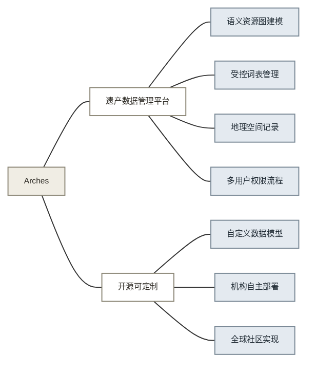

**Iconem：大场景三维数字化服务与 HeritageWatch.AI**

| 能力 | 落在链上 | 内容 |
|------|:--------:|------|
| 大规模照片自动重建 | 获取加处理与重建 | [事实] 无人机加相机采集，与微软研究院和 INRIA 合作的算法把数千张照片自动拼成高分辨率三维模型，可吸收游客捐赠照片改善模型（Microsoft 官方报道）。已做庞贝古城、吴哥窟、阿富汗石窟、圣彼得大教堂等 20 国项目 |
| 卫星加 AI 遗产监测 | 档案运营 | [事实] 2025 年 2 月与微软、Planet Labs、Aliph 基金会共同发起 HeritageWatch.AI，用卫星影像和 AI 监测受威胁遗产（HeritageWatch.AI 公告，2025-02） |
| 项目制而非产品 | 商业形态 | [分析] 每个遗址是一个定制项目，产出面向展示与研究的模型，不产出规范测绘图纸，无基层机构自助使用的产品形态 |

**图 2：Iconem 能力构成**

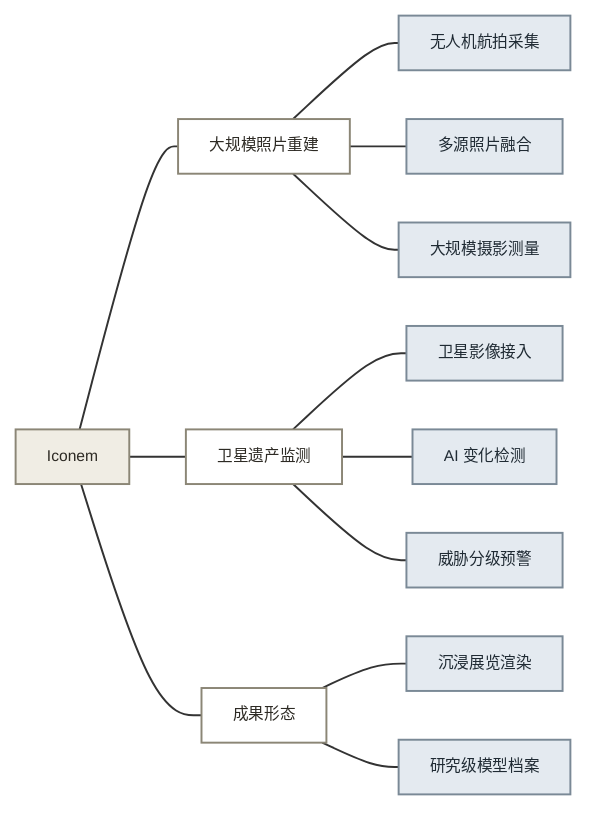

**CyArk：非营利遗产三维档案库**

| 能力 | 落在链上 | 内容 |
|------|:--------:|------|
| 高精度扫描存档 | 获取加档案运营 | [事实] 激光扫描加摄影测量为全球濒危遗产建三维档案，与 EWAP 合作，成果进 Arches 开放数据库（Arches 官网与 CyArk 项目记录）。[分析] 非营利模式靠基金会资助逐处做，覆盖速度受资金约束，不出规范图纸 |

**图 3：CyArk 能力构成**

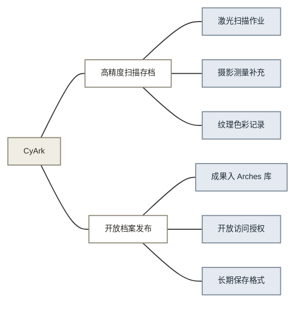

**Agisoft Metashape：摄影测量软件**

| 能力 | 落在链上 | 内容 |
|------|:--------:|------|
| 遗产摄影测量常用工具 | 处理与重建 | [事实] 照片进，输出密集点云、纹理网格、真正射、数字表面模型，文化遗产文档是官方列名核心应用场景；支持档案胶片扫描件处理（Agisoft 官网）。标准版 179 美元、专业版 3499 美元 |
| 通用工具形态 | 商业形态 | [分析] 全球遗产数字化项目最常用重建工具，输出止步于模型：无古建语义、无规范出图、需专业操作员调参 |

**图 4：Metashape 能力构成**

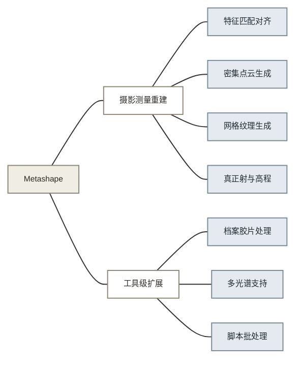

**HBIM 实践：学术与行业方法论，非单一公司**

| 能力 | 落在链上 | 内容 |
|------|:--------:|------|
| 扫描转历史建筑信息模型 | 获取至成果生成，人工驱动 | [事实] 激光扫描加摄影测量采集，常用 Leica RTC360、BLK360、FARO Focus，人工在 Revit 等软件建参数化历史构件模型，LOD 300 到 500，扫描精度可达 1 厘米（UK BIM 综述与 ScienceDirect 框架论文，2025） |
| 语义分割研究活跃 | 结构化 | [事实] 点云自动语义分割、本体知识建模是 HBIM 研究热点；2025 年综述指出 HBIM 存在标准化缺失、成本高、依赖专家人工的局限（ScienceDirect，2024 到 2025） |

**图 5：HBIM 实践能力构成**

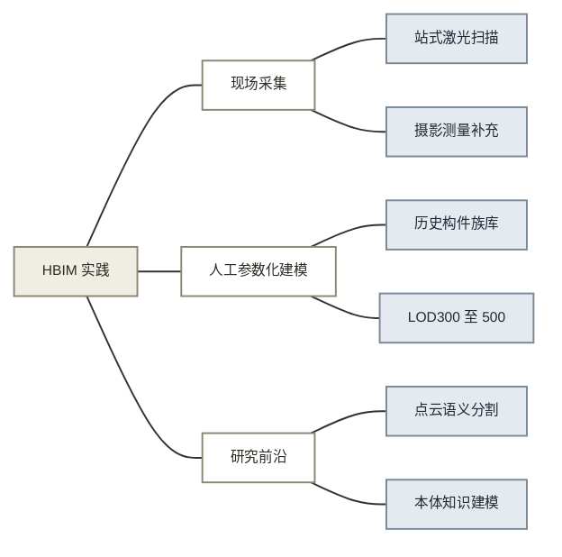

**国内项目制服务商：华测文保方案、思看科技、泰来三维等**

| 能力 | 落在链上 | 内容 |
|------|:--------:|------|
| 高精度采集服务成熟 | 获取 | [事实] 三维激光扫描每秒 50 万点、精度约 2 毫米，零接触不伤文物，古建扫描测绘是华测等厂商标准解决方案（华测官网方案页）。有团队累计完成 220 余个文物数字化项目、数据超 500TB（光明网，2025-09） |
| 项目制人力交付 | 获取至交付接入，人工驱动 | [分析] 商业形态为设备加人力驻场项目制：扫描外包、建模外包、图纸人工绘制 |
| 基层数字化瓶颈实证 | 需求侧 | [事实] 基层文保单位数字化瓶颈：基础设施不足、专业能力薄弱、应用场景缺失、技术标准不统一（光明网，2025-09）。2024 年 11 月新修文物保护法把文物数字化保护写进法条（东南网，2025-02） |

**图 6：国内项目制服务商能力构成**

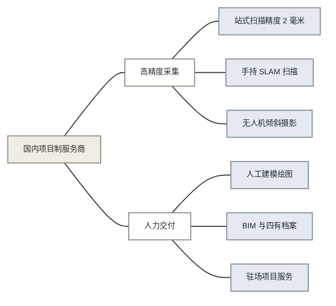

**国内文博信息化系统商：国衍科技等**

| 能力 | 落在链上 | 内容 |
|------|:--------:|------|
| 数字资源全流程管理 | 档案运营 | [事实] 面向博物馆、纪念馆及文博单位，覆盖资源上传、采集记录、编目著录、在线预览、审批发布、下载利用、分享服务、统计分析和操作审计（国衍科技方案页）。[分析] 纯管理系统形态，无 AI 识别、无出图 |
| 面向公众的数字文博平台 | 档案运营 | [事实] 数字文博大平台山海 APP 汇聚数字馆藏，自研文物神经核表面重建算法较传统采集时间减少 90%，六语言版本（中国博物馆协会，2024） |
| 行业内定位 | 商业形态 | [分析] 懂行业、做系统集成与管理软件，走项目制交付，不做 AI 自动化产品 |

**图 7：国内文博信息化系统商能力构成**

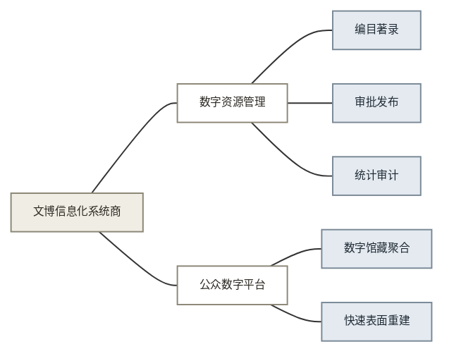

### 3.1 行业 1 建筑外观 AI 测量

**Hover：测量与估算平台**

| 能力 | 落在链上 | 内容 |
|------|:--------:|------|
| 手机环拍出测量模型 | 获取加处理与重建加识别加结构化 | [事实] 用户用手机绕建筑一圈拍照，应用引导取景，无需专用设备，AI 生成带尺寸三维模型，屋面、墙面、门窗、开口全要素达到英寸级精度（Hover 官网，2026） |
| 测量直转算料与报价 | 成果生成加交付接入 | [事实] 从测量自动生成屋面与墙面材料算量，承包商离场前即可发出报价；测量导出 PDF、Excel、JSON、XML，模型导出 SKP、DXF、DWG（Hover 官网，2026） |
| 规模与行业信任 | 商业形态 | [事实] 已扫描 1200 万栋住宅，超 30 万建筑从业者使用，美国前十保险公司中九家采用（Hover 官网，2026） |

**图 8：Hover 能力构成**

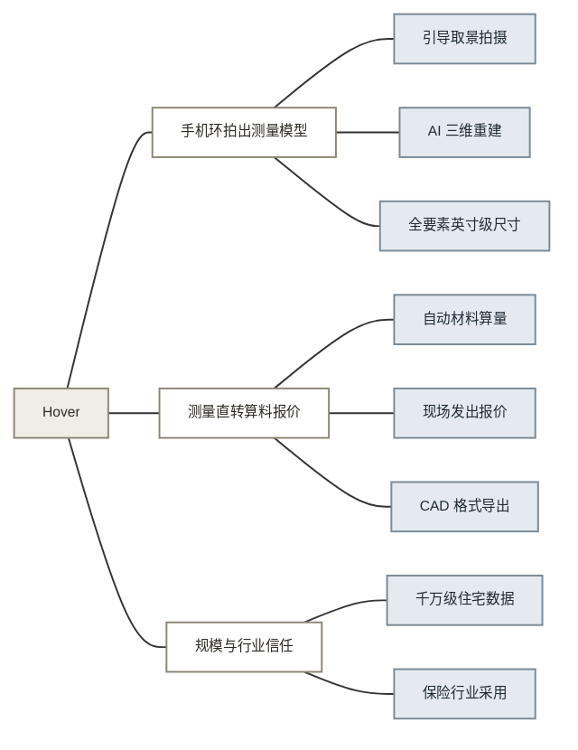

**EagleView：航拍屋顶测量报告**

| 能力 | 落在链上 | 内容 |
|------|:--------:|------|
| 航拍影像自动出测量报告 | 获取加处理与重建加识别加结构化加成果生成 | [事实] 自有机队采集正射与倾斜影像，摄影测量加 AI 自动计算面积、坡度、脊谷檐口等要素，生成屋顶测量报告，多数报告数小时内交付（EagleView 官网，2025） |
| 报告通过独立精度验证 | 成果确认 | [事实] 独立基准对比精度 98.77%，为已发布的最高精度；主流保险公司接受其报告作为理赔文件，满足即赔即用标准，减少定损争议（EagleView 与 Roofing Contractor，2025） |

**图 9：EagleView 能力构成**

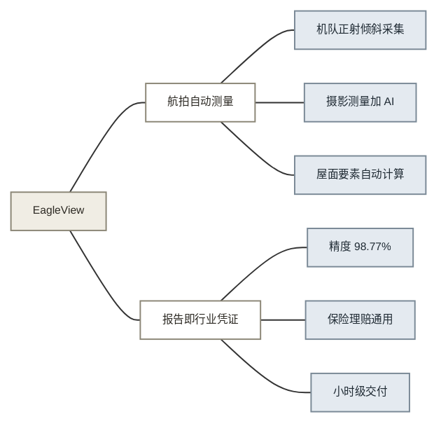

**立面检测服务：FISP 法规市场，多服务商形态**

| 能力 | 落在链上 | 内容 |
|------|:--------:|------|
| 法规强制的周期检测市场 | 需求侧加档案运营 | [事实] 纽约 FISP 要求六层以上建筑每五年立面检测，由合格外墙检查员主持（RAND Engineering，2025） |
| 无人机加热成像采集 | 获取加识别 | [事实] 无人机高清与热成像非接触采集，20 层建筑四个立面 2 到 4 小时完成；可识别锈蚀钢筋、混凝土剥落、灰缝细裂缝，热成像发现渗水与保温缺陷（THE FUTURE 3D 与 Dronegrafix，2025） |
| 预检加实检的人机分工 | 复核校正加成果确认 | [事实] 无人机数据用于预检，锁定需要吊篮实检的确切位置，避免整楼搭架（Existing Conditions，2025）。[分析] 形态为项目制服务，AI 止步缺陷提示，签字责任在检查员 |

**图 10：立面检测服务能力构成**

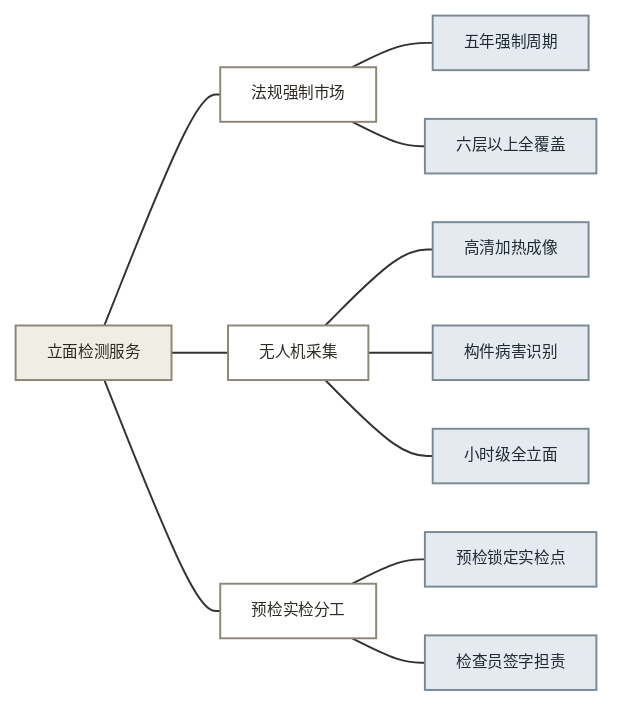

### 3.2 行业 2 医疗影像 AI

**联影智能：元智大模型与多类医疗智能体**

| 能力 | 落在链上 | 内容 |
|------|:--------:|------|
| 一扫多查 | 识别 | [事实] 一次胸部 CT 自动检出 37 种常见病种异常，平均 AUC 0.92，较此前最优提升超 10%；与中山医院联合版本可检 73 种（新华网，2025-04） |
| 语音转结构化文书 | 结构化加成果生成 | [事实] 电子病历智能体把医患对话转成结构化病历，自动生成入院录、首次病程录、出院小结，书写时长从 20 分钟缩到 5 分钟（新华网，2025-04） |
| 多类智能体按科室分工 | 商业形态 | [事实] 一次发布 10 余款智能体，覆盖影像诊断、临床治疗、科教、管理、患者服务（新华网，2025-04） |

**图 11：联影智能能力构成**

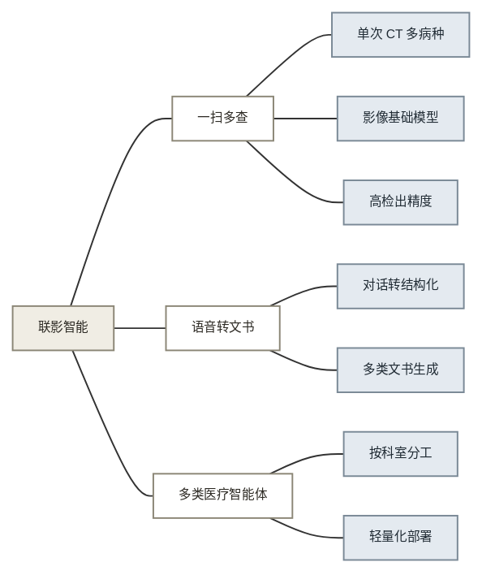

**Aidoc：CARE 基础模型与 First Read**

| 能力 | 落在链上 | 内容 |
|------|:--------:|------|
| AI 起草正式报告 | 成果生成 | [事实] First Read 分析胸片自动生成放射科报告初稿文本，2025 年获 FDA 突破性设备认定，为一年内第二个；报告由医生审核签发（Aidoc 官方与 MobiHealthNews，2025） |
| 基础模型复用到多病种 | 识别 | [事实] 肋骨骨折分诊工具 2025 年获 FDA 许可，与此前气胸、脑动脉瘤、肺栓塞工具共用同一基础模型架构，并已提交覆盖两位数病种的基础模型审批（Aidoc 官方，2025） |
| 分诊优先级自动排序 | 结构化 | [事实] AI 模块自动给检查分配优先级分数，急症前置（IntuitionLabs 行业综述，2025） |

**图 12：Aidoc 能力构成**

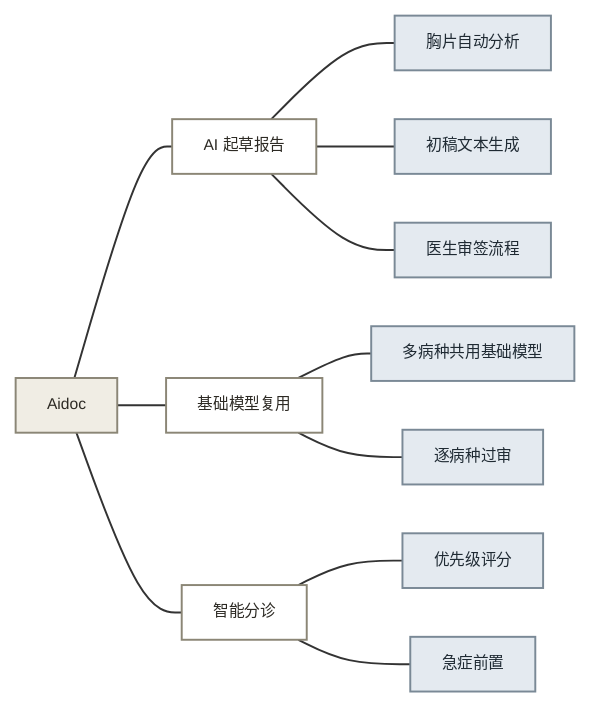

**数坤科技：冠脉 CTA AI 与数坤坤大模型**

| 能力 | 落在链上 | 内容 |
|------|:--------:|------|
| 一分钟内生成结构化报告 | 获取至成果生成 | [事实] 从原始 CTA 图像输入到智能结构化报告输出全流程 1 分钟；多中心验证灵敏度特异度均超 90%；80% 病人的冠心病影像诊断无需人为干预即可出具与有经验影像科医生相同的报告（动脉网，2025） |
| 多项监管证书 | 成果确认 | [事实] 截至 2025 年 8 月累计 18 张 NMPA 三类证居行业第一；冠脉 CTA AI 为全球唯一同时有 NMPA 三类证和欧盟 MDR CE 认证的同类产品（数坤官网与动脉网，2025） |
| 书写中自动检查质量 | 成果确认 | [事实] 数坤坤大模型语音自动生成规范报告，书写过程中同步做影像质控和报告质控（新浪财经，2025-04） |

**图 13：数坤科技能力构成**

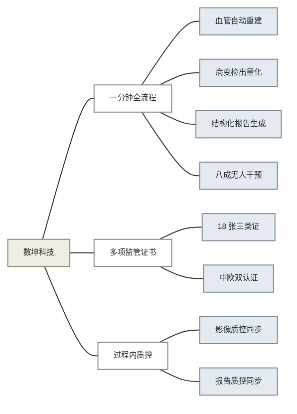

### 3.3 行业 3 无人机测绘与实景三维

**大疆：智图 DJI Terra**

| 能力 | 落在链上 | 内容 |
|------|:--------:|------|
| 航线自动规划 | 任务定义加获取 | [事实] 倾斜摄影自动生成 1 正射加 4 倾斜共五条航线；支持航点、建图、带状多种任务规划（大疆产品资料，2025） |
| 飞行中实时成图 | 获取加处理与重建 | [事实] 基于实时定位建图算法，飞行中同步生成二维正射影像，现场发现问题现场补拍（大疆产品资料，2025） |
| 重建、量测与导出集成 | 处理与重建加成果生成 | [事实] 照片自动重建高精度实景三维模型与点云，AI 自动优化水面等难点区域，模型上直接量坐标、距离、面积、体积，成果导出多种行业标准格式（大疆产品资料，2025） |

**图 14：大疆智图能力构成**

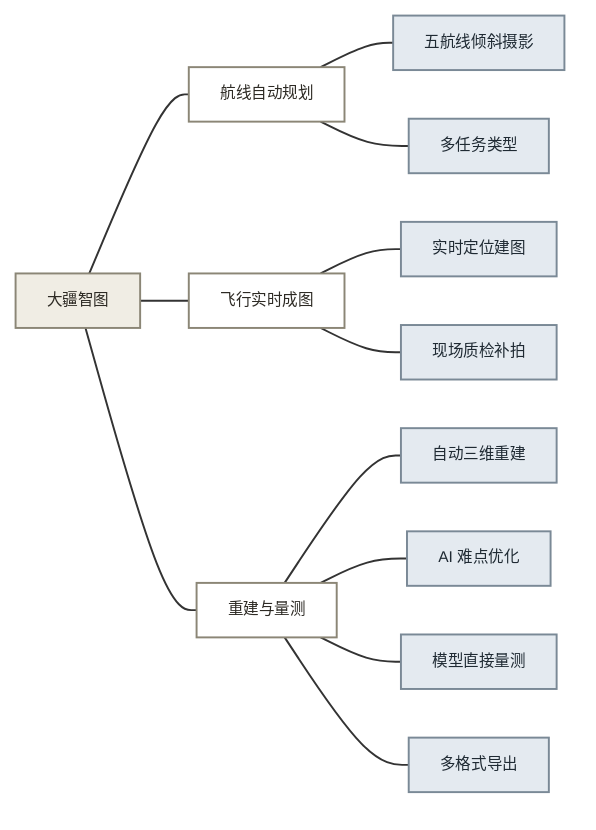

**Bentley：iTwin Capture Modeler，前身 ContextCapture**

| 能力 | 落在链上 | 内容 |
|------|:--------:|------|
| 多源输入混合重建 | 获取加处理与重建 | [事实] 照片、激光点云或混合传感器数据统一处理，输出工程级实景网格、数字表面模型、真正射、高斯溅射、点云（Bentley 官方，2025） |
| 从单体到全城可伸缩 | 运行支撑 | [事实] 同一套引擎从单个场地扩展到城市级建模，支持本地与云端并行多引擎处理（Bentley 官方，2025） |
| 自动特征提取 | 识别加结构化 | [事实] 自动特征提取与机器学习把实景数据转成可用于决策的信息（Bentley 官方，2025） |

**图 15：Bentley iTwin Capture 能力构成**

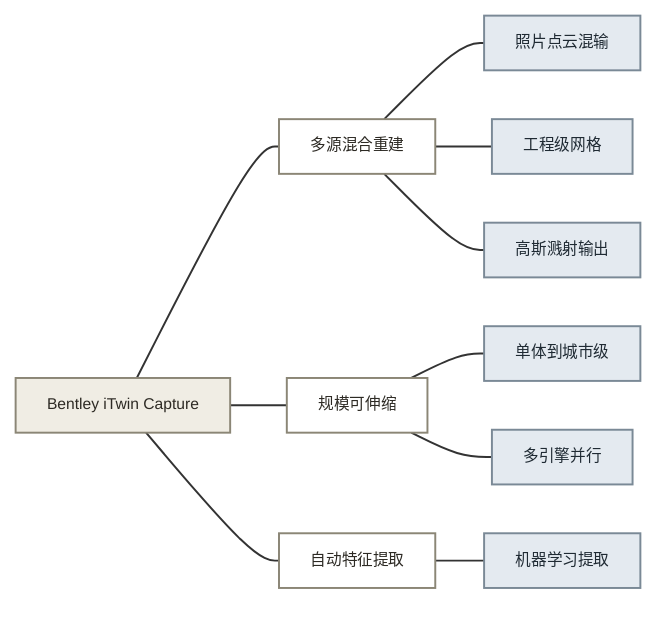

**华测导航：AU20/AA10 激光雷达系列与如是 RS30 手持扫描仪**

| 能力 | 落在链上 | 内容 |
|------|:--------:|------|
| 多平台激光雷达产品线 | 获取 | [事实] 机载 AA15/AA10、多平台 AU20、手持如是 RS30 覆盖空地不同作业场景；RS30 点频 64 万点每秒、测程 300 米、整机 1.7 千克（华测官网，2025） |
| 传感器与处理软件配套 | 获取加处理与重建 | [事实] GNSS 加惯导加激光加影像多源集成，配套点云预处理与后处理软件（华测官网与年报，2025） |
| 高研发投入 | 商业形态 | [事实] 2025 年一季度研发费用 1.31 亿元，占营收 16.63%（证券之星，2025-08） |

**图 16：华测导航能力构成**

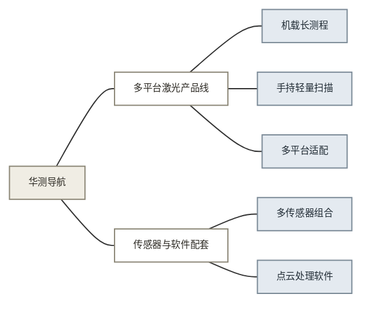

**实景三维中国：国家工程，非单一公司**

| 能力 | 落在链上 | 内容 |
|------|:--------:|------|
| 国家级三维基础数据 | 获取加处理与重建加档案运营 | [事实] 自然资源部 2022 年启动，2025 年底初步建成；310 个地级以上城市开展实景三维城市建设，累计生产约 11 万平方千米城市三维模型（中国政府网，2024-08；国家数据局，2025） |
| 语义化与实体编码 | 结构化加档案运营 | [事实] 海量空间数据轻量化处理、语义化建模、地理实体空间身份编码等关键技术自主可控（中国测绘学会，2025） |
| 应用场景体系 | 需求侧 | [事实] 形成 22 大类、100 余种应用场景，历史文化保护在列；目标为 50% 以上政府决策、生产调度和生活规划可通过线上实景三维空间完成（国家数据局，2025-08；中国政府网，2024-08） |

**图 17：实景三维中国能力构成**

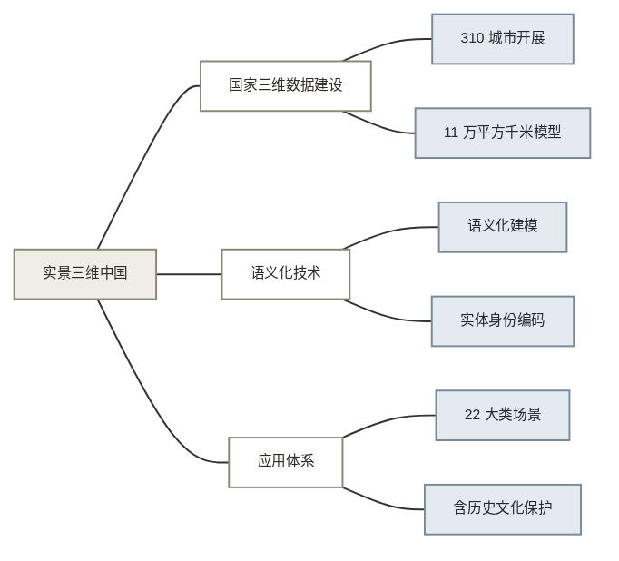

### 3.4 行业 4 建筑逆向建模

**Autodesk：ReCap Pro 与 Revit 2026 工具体系**

| 能力 | 落在链上 | 内容 |
|------|:--------:|------|
| 云端自动处理 | 处理与重建 | [事实] ReCap Pro 用云端自动提取工具从点云定义现状条件，点云转分段网格模型（Autodesk 官方，2025 到 2026） |
| 实景数据转参数化构件 | 识别加结构化加成果生成 | [事实] Revit 2026 的 ReCap Mesh 插件把点云和网格导入 Revit 后可转换为构件族、挂参数和连接点（BIM 资源网，2025 到 2026） |
| 接入现有设计流程 | 交付接入 | [事实] 成果直进 AutoCAD、Civil 3D、Revit、Inventor（Autodesk，2025） |

**图 18：Autodesk 能力构成**

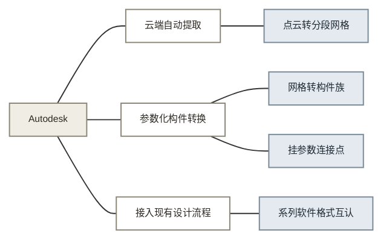

**行业整体自动化程度**

| 能力 | 落在链上 | 内容 |
|------|:--------:|------|
| 构件自动提取 | 识别加结构化 | [事实] 2025 年主流 scan-to-BIM 工具已能从点云自动提取墙、柱、梁、管线等构件并分类；下一代语义分割目标 500 种以上构件类型（Hitech、ENGINYRING 行业综述，2025） |
| 半自动为行业现状 | 复核校正 | [事实] 截至 2025，scan-to-BIM 是半自动流程，无一键全自动方案；自动化把交付周期从 4 到 8 周压到 2 到 6 周，成本降 30% 到 40%（多来源行业综述，2025） |

**NavVis：VLX 3 穿戴式扫描与 IndoorViewer**

| 能力 | 落在链上 | 内容 |
|------|:--------:|------|
| 边走边扫 | 获取 | [事实] 穿戴式设备，双 32 线激光雷达加 SLAM，步行速度采集测量级点云，比架站式快约 10 倍，室内弱光和复杂场地可用（NavVis 官方与 GPRS，2025） |
| 浏览器查看与检查点云 | 处理与重建 | [事实] IndoorViewer 在浏览器交互查看扫描成果、实时剖切、检查质量，支持 E57 多设备数据统一管理（NavVis 官方，2025） |

**图 19：NavVis 能力构成**

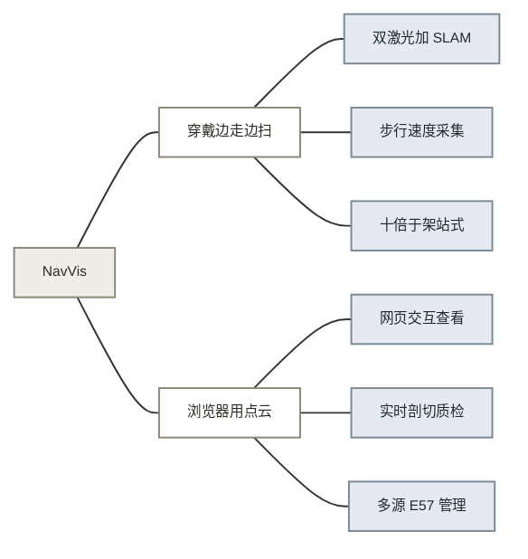

**广联达：数维建筑设计 GNA**

| 能力 | 落在链上 | 内容 |
|------|:--------:|------|
| 同一模型生成多种成果 | 结构化加成果生成 | [事实] 方案设计、施工图出图、工程量统计基于同一三维模型，修改效率提升 60% 以上；2025 年市占率 38.7%（搜狐与知乎评测，2025 到 2026） |
| 标准模块库加 AI 布局 | 规则与数据模型加成果生成 | [事实] 常用户型、楼梯、卫浴做成标准模块库直接调用组合；2025 新增 AI 智能布局，按用地条件自动生成符合规范的模块组合（同上） |
| 边设计边算量 | 结构化 | [事实] 设计过程中实时计算混凝土、钢筋用量（同上） |

**图 20：广联达数维能力构成**

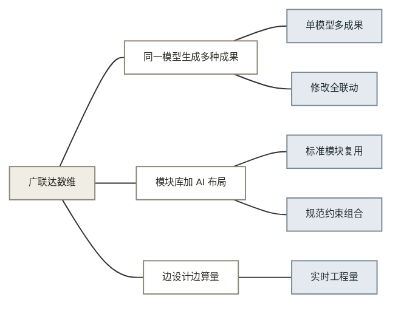

### 3.5 行业 5 消费级三维捕获与神经渲染

**Apple：RoomPlan 与 Object Capture API**

| 能力 | 落在链上 | 内容 |
|------|:--------:|------|
| 扫描直接出参数化结构 | 处理与重建加识别加结构化 | [事实] RoomPlan 用 LiDAR 手机扫房间 60 到 90 秒，输出参数化结构数据而非网格：墙的位置长度、层高、门窗位置、识别出的家具类型和尺寸，USD/USDZ 格式；单房间适用，最大约 9 乘 9 米（Apple 开发者文档与 ML 研究页） |
| 全程在设备端运行 | 处理与重建加识别 | [事实] 全流程在设备端神经引擎运行，不经服务器（Apple ML 研究页） |
| 能力以 API 开放 | 交付接入 | [事实] RoomPlan 与 Object Capture 均为开发者 API，第三方应用直接集成（Apple 开发者文档） |

**图 21：Apple RoomPlan 能力构成**

```mermaid
%%{init: {"themeVariables": {"fontSize": "8px"}, "flowchart": {"nodeSpacing": 25, "rankSpacing": 25, "padding": 8}}}%%
flowchart LR
R["Apple RoomPlan"] --- A["参数化扫描"] & B["设备端运行"] & C["第三方应用接入"]
    A --- A1["LiDAR 深度感知"] & A2["位姿实时追踪"] & A3["构件类型检测"] & A4["参数化几何输出"]
    B --- B1["神经引擎推理"] & B2["数据不出设备"]
    C --- C1["RoomPlan API"] & C2["Object Capture API"]
    classDef root fill:#F0EDE4,stroke:#8B8676,color:#2D2A24
    classDef cap fill:#FFFFFF,stroke:#8B8676,color:#2D2A24
    classDef sub fill:#E4EAF0,stroke:#7A8996,color:#1F2A33
    class R root; class A,B,C cap; class A1,A2,A3,A4,B1,B2,C1,C2 sub
```

**Polycam：扫描应用与 AI Spatial Report**

| 能力 | 落在链上 | 内容 |
|------|:--------:|------|
| 三种技术集成 | 获取加处理与重建 | [事实] LiDAR、摄影测量、高斯溅射三种模式一个应用，房间扫描精度 1 到 2 厘米，云端处理 3 到 8 分钟（THE FUTURE 3D 评测，2025 到 2026） |
| 扫描自动出专业报告 | 结构化加成果生成 | [事实] AI Spatial Report 自动生成含尺寸、面积、材料估算的空间报告，自动生成户型图（Polycam 产品发布，2025） |
| 专业格式全覆盖 | 交付接入 | [事实] 导出 DXF、LAS、OBJ、USDZ 等超过 15 种格式（Polycam 官方，2025） |

**图 22：Polycam 能力构成**

```mermaid
%%{init: {"themeVariables": {"fontSize": "8px"}, "flowchart": {"nodeSpacing": 25, "rankSpacing": 25, "padding": 8}}}%%
flowchart LR
    R["Polycam"] --- A["三技术融合采集"] & B["AI 空间报告"] & C["专业导出"]
    A --- A1["LiDAR 模式"] & A2["摄影测量模式"] & A3["高斯溅射模式"]
    B --- B1["尺寸面积估算"] & B2["自动户型图"]
    C --- C1["15 种以上格式"]
    classDef root fill:#F0EDE4,stroke:#8B8676,color:#2D2A24
    classDef cap fill:#FFFFFF,stroke:#8B8676,color:#2D2A24
    classDef sub fill:#E4EAF0,stroke:#7A8996,color:#1F2A33
    class R root; class A,B,C cap; class A1,A2,A3,B1,B2,C1 sub
```

**Matterport：数字孪生平台**

| 能力 | 落在链上 | 内容 |
|------|:--------:|------|
| 深度数据自动出平面图 | 处理与重建加结构化加成果生成 | [事实] 户型平面图直接从深度传感器数据自动生成，官方称每处物业节省约 10 小时人工编辑与标注（Matterport 2025 冬季版发布，2025-02） |
| AI 房间自动测量 | 识别加结构化 | [事实] AI 自动房间测量、二维三维布局与报告（Facilities Dive，2025） |
| 多人协同扫描合并 | 获取加处理与重建 | [事实] Merge 功能支持多人同时扫描同一物业并合并为单一数字孪生，最多 2000 个扫描点（Matterport 2025 冬季版发布，2025-02） |
| AI 空间信息提取 | 识别 | [事实] defurnish 一键移除家具杂物；Property Intelligence 自动提取物业详细信息（Matterport，2024 到 2025） |

**图 23：Matterport 能力构成**

```mermaid
%%{init: {"themeVariables": {"fontSize": "8px"}, "flowchart": {"nodeSpacing": 25, "rankSpacing": 25, "padding": 8}}}%%
flowchart LR
    R["Matterport"] --- A["自动出平面图"] & B["AI 测量"] & C["协同采集"] & D["AI 空间信息提取"]
    A --- A1["深度数据直出"]
    B --- B1["房间自动测量"] & B2["布局与报告"]
    C --- C1["多人同时扫描"] & C2["两千点合并"]
    D --- D1["一键除家具"] & D2["物业信息提取"]
    classDef root fill:#F0EDE4,stroke:#8B8676,color:#2D2A24
    classDef cap fill:#FFFFFF,stroke:#8B8676,color:#2D2A24
    classDef sub fill:#E4EAF0,stroke:#7A8996,color:#1F2A33
    class R root; class A,B,C,D cap; class A1,B1,B2,C1,C2,D1,D2 sub
```

**Luma AI：Luma 捕捉与 Dream Machine**

| 能力 | 落在链上 | 内容 |
|------|:--------:|------|
| 普通手机完成重建 | 获取加处理与重建 | [事实] 任意手机视频上传即可，无需 LiDAR，处理不到 1 分钟，消费级工具中视觉质量最好（THE FUTURE 3D 评测，2025 到 2026） |
| 实时拍摄覆盖引导 | 获取 | [事实] 拍摄时实时显示哪些角度已覆盖、哪些缺失（同上） |
| 生成式三维 | 商业形态 | [事实] Dream Machine 文字生成三维内容（同上）。[分析] 属生成式路线，输出不承诺与实物一致 |

**图 24：Luma AI 能力构成**

```mermaid
%%{init: {"themeVariables": {"fontSize": "8px"}, "flowchart": {"nodeSpacing": 25, "rankSpacing": 25, "padding": 8}}}%%
flowchart LR
    R["Luma AI"] --- A["零门槛重建"] & B["拍摄覆盖引导"] & C["生成式三维"]
    A --- A1["任意手机视频"] & A2["云端分钟级处理"]
    B --- B1["实时覆盖显示"] & B2["缺角提示"]
    C --- C1["文字生三维"]
    classDef root fill:#F0EDE4,stroke:#8B8676,color:#2D2A24
    classDef cap fill:#FFFFFF,stroke:#8B8676,color:#2D2A24
    classDef sub fill:#E4EAF0,stroke:#7A8996,color:#1F2A33
    class R root; class A,B,C cap; class A1,A2,B1,B2,C1 sub
```

### 3.6 上限参照：自动驾驶感知，仅识别段技术上限

**Tesla：占用网络**

| 能力 | 落在链上 | 内容 |
|------|:--------:|------|
| 占用网络 | 处理与重建加识别 | [事实] 从纯摄像头输入预测三维空间占用体积与占用流，不依赖预定义物体类别，未见过的障碍物也能感知（thinkautonomous 技术拆解，2024） |
| 训练算力规模 | 训练与评估 | [事实] 计划 2025 年底训练算力达 100 EFLOPS，比多数厂商高一个量级（行业分析，2025） |

**图 25：Tesla 能力构成**

```mermaid
%%{init: {"themeVariables": {"fontSize": "8px"}, "flowchart": {"nodeSpacing": 25, "rankSpacing": 25, "padding": 8}}}%%
flowchart LR
    R["Tesla 占用网络"] --- A["三维空间重建"] & B["动态占用预测"] & C["训练与评估"]
    A --- A1["多摄像头融合"] & A2["三维占用体素"]
    B --- B1["占用流预测"] & B2["类别无关感知"]
    C --- C1["真实场景数据"] & C2["大规模计算"]
    classDef root fill:#F0EDE4,stroke:#8B8676,color:#2D2A24
    classDef cap fill:#FFFFFF,stroke:#8B8676,color:#2D2A24
    classDef sub fill:#E4EAF0,stroke:#7A8996,color:#1F2A33
    class R root; class A,B,C cap; class A1,A2,A3,A4,B1,B2,C1,C2 sub
```

**华为：多模态感知与世界模型**

| 能力 | 落在链上 | 内容 |
|------|:--------:|------|
| 世界模型生成少见情况 | 训练与评估 | [事实] 云端世界引擎用扩散生成模型模拟行人遮挡突现、前车急刹等极端场景，生成超百万级少见情况数据（IT之家，2025） |
| 多模态融合感知 | 识别 | [事实] 车端融合视觉、听觉、触觉多模态数据（21经济网拆解，2025-08） |

**图 26：华为 ADS 4 能力构成**

```mermaid
%%{init: {"themeVariables": {"fontSize": "8px"}, "flowchart": {"nodeSpacing": 25, "rankSpacing": 25, "padding": 8}}}%%
flowchart LR
    R["华为感知"] --- A["少见情况生成"] & B["多模态感知"]
    A --- A1["世界模型模拟"] & A2["扩散模型生成样本"]
    B --- B1["视觉听觉触觉融合"] & B2["多来源交叉判断"]
    classDef root fill:#F0EDE4,stroke:#8B8676,color:#2D2A24
    classDef cap fill:#FFFFFF,stroke:#8B8676,color:#2D2A24
    classDef sub fill:#E4EAF0,stroke:#7A8996,color:#1F2A33
    class R root; class A,B,C cap; class A1,A2,A3,A4,B1,B2,C1,C2 sub
```

**Waymo：多传感器融合**

| 能力 | 落在链上 | 内容 |
|------|:--------:|------|
| 多传感器融合冗余 | 获取加处理与重建加识别 | [事实] 激光雷达、雷达、摄像头、外部音频全融合成统一场景理解，靠冗余数据源交叉验证保安全（Waymo 官方博客，2024 到 2026） |
| 模块化基础模型 | 识别加结构化 | [事实] 基于 LLM 与视觉语言模型组合的模块化 transformer，感知组件融合多传感器时序输入，输出对象、语义和嵌入供后续处理（Waymo 博客，2024-10） |
| 恶劣条件感知升级 | 获取 | [事实] 第六代系统激光雷达可穿透雨雾、避免高反光标志附近点云畸变（Waymo 博客，2026-02） |

**图 27：Waymo 能力构成**

```mermaid
%%{init: {"themeVariables": {"fontSize": "8px"}, "flowchart": {"nodeSpacing": 25, "rankSpacing": 25, "padding": 8}}}%%
flowchart LR
    R["Waymo Driver"] --- A["传感融合冗余"] & B["模块化基础模型"]
    A --- A1["四类传感器融合"] & A2["成像雷达时序图"] & A3["恶劣天气穿透"]
    B --- B1["感知预测分模块"] & B2["视觉语言模型"] & B3["语义嵌入输出"]
    classDef root fill:#F0EDE4,stroke:#8B8676,color:#2D2A24
    classDef cap fill:#FFFFFF,stroke:#8B8676,color:#2D2A24
    classDef sub fill:#E4EAF0,stroke:#7A8996,color:#1F2A33
    class R root; class A,B cap; class A1,A2,A3,B1,B2,B3 sub
```

### 3.7 信息来源

| 行业 | 来源 |
|------|------|
| 行业 0 | [Arches - Getty](https://www.getty.edu/projects/arches/)；[Arches 项目官网](https://www.archesproject.org/)；[Iconem - Microsoft 报道](https://news.microsoft.com/transform/heritage-activists-preserve-global-landmarks-ruined-in-war-threatened-by-time/)；[HeritageWatch.AI 公告 2025-02](https://heritagewatch.ai/wp-content/uploads/2025/02/10022025_-Microsoft-Planet-Aliph-Iconem_Announcement.pdf)；[Agisoft 官网](https://www.agisoft.com/)；[HBIM 2025 综述 - UK BIM](https://bimmodelingservices.co.uk/blogs/historic-building-information-modeling-in-2025/)；[HBIM 标准化框架 - ScienceDirect](https://www.sciencedirect.com/science/article/pii/S2212054825000220)；[古建三维扫描方案 - 华测](http://www.huace.cn/solution/56)；[文化遗产数字化 - 光明网 2025-09](https://digital.gmw.cn/2025-09/08/content_38271514.htm)；[科技赋能文化遗产 - 东南网 2025-02](http://fjnews.fjsen.com/2025-02/25/content_31849089.htm)；[文物数字化资源管理系统 - 国衍科技](https://www.cdgyte.com/solutions/collection-digital-resource-management)；[山海 APP 上线 - 中国博物馆协会](https://www.chinamuseum.org.cn/cma/detail.html?id=12&contentId=13802)；[混合 scan-to-BIM 方法 - Nature Scientific Reports 2026](https://www.nature.com/articles/s41598-026-38200-8)；[分类驱动半自动 Scan-to-HBIM - Buildings 2026](https://doi.org/10.3390/buildings16010021) |
| 行业 1 | [Hover 产品页](https://hover.to/product/)；[Hover 工作原理](https://hover.to/how-it-works/)；[Hover 测量报告](https://hover.to/reports/)；[EagleView 精度验证 98.77%](https://www.eagleview.com/eagleview/eagleview-roof-measurements-confirmed-to-be-98-77-accurate-compared-to-independent-benchmark-measurements/)；[EagleView 保险行业方案](https://www.eagleview.com/industry/insurance/)；[无人机 FISP 检测 - RAND Engineering](https://randpc.com/articles/building-envelope/drones-fisp-inspections-nyc/)；[无人机立面检测指南 - THE FUTURE 3D](https://www.thefuture3d.com/learn/drone-facade-inspection-guide/)；[FISP 与无人机 - Existing Conditions](https://www.existingconditions.com/insights/nycs-facade-inspection-safety-program-fisp-new-avenues-for-drone-technology-in-facade-surveying) |
| 行业 2 | [联影创新大会 - 新华网 2025-04](http://www.news.cn/health/20250410/aad26659221746b3b69bbee0699afbb9/c.html)；[Aidoc First Read FDA 认定](https://www.aidoc.com/about/news/aidoc-receives-fda-breakthrough-device-designation-for-ai-that-drafts-radiology-reports/)；[AI in Radiology 2025 - IntuitionLabs](https://intuitionlabs.ai/articles/ai-radiology-trends-2025)；[数坤冠脉 CTA AI - 动脉网](https://www.vbdata.cn/1518898127)；[数坤官网](https://www.shukun.com/about.html)；[数坤大模型 - 新浪财经 2025-04](https://news.sina.cn/sx/2025-04-09/detail-inesppua4229377.d.html?vt=4)；[Aidoc aiOS 平台](https://www.aidoc.com/platform/aios/)；[Aidoc Series E - Goldman Sachs 2026](https://am.gs.com/en-us/advisors/news/press-release/2026/aidoc-raises-150-million-series-e-goldman-sachs) |
| 行业 3 | [大疆智图功能 - CSDN](https://blog.csdn.net/qq_62821232/article/details/145366405)；[实景三维中国 - 中国政府网 2024-08](https://www.gov.cn/lianbo/bumen/202408/content_6971339.htm)；[实景三维赋能 - 中国测绘学会](https://csgpc.org/detail/25806.html)；[实景三维典型案例 - 国家数据局 2025-08](https://www.nda.gov.cn/sjj/swdt/xwfb/0829/20250829174904542626086_pc.html)；[Bentley iTwin Capture Modeler](https://www.bentley.com/software/itwin-capture-modeler/)；[华测产品线](http://www.huace.cn/pdList/5)；[如是 RS 系列 - 华测](https://www.huace.cn/informationDetail/229)；[华测 2025 半年报 - 证券之星](http://stock.stockstar.com/RB2025080800016935.shtml) |
| 行业 4 | [Scan to BIM AI - Hitech](https://www.hitechcaddservices.com/news/ai-ml-scan-to-bim-future/)；[Scan-to-BIM 2025 工作流 - ENGINYRING](https://www.enginyring.com/en/blog/scan-to-bim-automation-workflow-2025-cost-breakdown-tools-and-implementation-timeline)；[Revit 2026 新功能 - BIM资源网](https://www.bimzyw.com/12809.html)；[NavVis VLX 3 - Indovance](https://blog.indovance.com/navvis-new-vlx-3-mobile-mapping-system/)；[NavVis VLX - GPRS](https://www.gp-radar.com/article/what-is-the-navvis-vlx-mobile-mapping-system-how-does-it-work)；[广联达数维 GNA - 搜狐 2025](https://www.sohu.com/a/961161669_122571907)；[数维国产化 - 知乎 2026](https://zhuanlan.zhihu.com/p/2042916697968007094)；[复杂建筑 scan-to-BIM 挑战 - Hitech](https://www.hitechcaddservices.com/news/overcoming-scan-to-bim-challenges-complex-buildings/) |
| 行业 5 | [RoomPlan - Apple ML Research](https://machinelearning.apple.com/research/roomplan)；[RoomPlan Overview - Apple Developer](https://developer.apple.com/augmented-reality/roomplan/)；[Polycam vs Luma AI - THE FUTURE 3D](https://www.thefuture3d.com/equipment/compare/polycam-vs-luma-ai/)；[Polycam 评测 - THE FUTURE 3D](https://www.thefuture3d.com/software/polycam/)；[Polycam 高斯溅射](https://poly.cam/tools/gaussian-splatting)；[Luma AI 评测 - THE FUTURE 3D](https://www.thefuture3d.com/software/luma-ai/)；[Matterport 2025 冬季版发布](https://matterport.com/news/matterport-2025-winter-release-productivity-multiplied-delivers-the-next)；[Matterport AI 房间测量 - Facilities Dive](https://www.facilitiesdive.com/news/matterport-beta-ai-room-measurements-capture-tech/696138/)；[RoomPlan 局限评测 - it-jim](https://www.it-jim.com/blog/roomplan-framework-by-apple/)；[CoStar 完成收购 Matterport 2025-02](https://matterport.com/news/costar-group-completes-acquisition-of-matterport-ushering-in-a-new-era-of-3d) |
| 上限参照 | [Tesla 单网络驾驶架构拆解 - thinkautonomous](https://www.thinkautonomous.ai/blog/tesla-end-to-end-deep-learning/)；[Tesla 占用网络资料 - TESMAG](https://www.teslaacessories.com/blogs/news/a-deep-dive-into-tesla-fsd-v13-and-the-new-era-of-autonomous-driving)；[华为世界模型 - IT之家](https://www.ithome.com/0/883/347.htm)；[华为多模态感知拆解 - 21经济网 2025-08](https://www.21jingji.com/article/20250829/herald/a4dfe2e6ec7f43fbafdad6eefac258fe.html)；[AI & ML at Waymo](https://waymo.com/blog/2024/10/ai-and-ml-at-waymo/)；[Waymo 多传感器系统 2026-02](https://waymo.com/blog/2026/02/ro-on-6th-gen-waymo-driver/) |

## 四 定位上限：能力边界与应用型技术上限

### 4.1 各对象的能力边界

**行业 0 遗产数字化**

| 对象 | 已实现 | 未突破 |
|------|--------|----------|
| Arches | 遗产记录标准化管理、数据模型可定制、开源全球复用 | 内容全靠人工录入，平台不生产数据；无识别、无图纸 |
| Iconem | 数千张照片自动重建大遗址；发起卫星监测 | 产出为展示与研究模型，无构件语义、无规范图纸；项目制，机构无法自助使用 |
| CyArk | 高精度扫描存档并开放 | 基金会资助逐处做，覆盖速度受资金约束；不出图纸 |
| Metashape | 照片到点云、网格、正射全自动，可脚本批处理 | 输出止步几何模型，无语义；需专业操作员调参 |
| HBIM 实践 | LOD 300 到 500 精细历史构件模型 | [事实] 点云转 HBIM 依赖人工解读，慢且不一致（Nature Scientific Reports，2026）；BIM 平台为新建建筑设计，标准构件库无法表达历史异形构件（ScienceDirect，2025）；遥感数据到参数化竣工模型的高效转化被明确列为未解难题（Buildings 期刊，2026） |
| 国内项目制服务商 | 毫米级采集成熟、零接触 | 建模绘图为人力交付，产能随人数线性增长 |
| 文博信息化系统商 | 数字资源管理全流程 | 只管理已有资源，不生产内容，无 AI 环节 |

**行业 1 建筑外观 AI 测量**

| 对象 | 已实现 | 未突破 |
|------|--------|----------|
| Hover | 手机照片到英寸级测量模型，自动算料，导出 DXF/DWG | 对象为现代规则建筑，即标准化的墙、屋面、门窗；输出为测量与算料报告，非制式测绘图纸 |
| EagleView | 屋顶测量报告成为保险行业通用凭证，精度 98.77% | 只处理屋顶；依赖自有机队航拍覆盖 |
| 立面检测服务 | 无人机加热成像小时级全立面采集，识别构件病害 | AI 止步缺陷提示，签字责任在合格检查员；项目制服务形态 |

行业边界：规则现代建筑的外观测量已经形成可正式使用的标准报告；识别范围限于标准构件，不包含历史异形构件。

**行业 2 医疗影像 AI**

| 对象 | 已实现 | 未突破 |
|------|--------|----------|
| Aidoc | AI 起草报告获 FDA 突破性认定；分诊类近 2000 家医院商用 | [分析] 突破性认定是加速审评通道而非上市许可，起草报告尚未获准商用；一切输出需医生审签 |
| 数坤 | 80% 病例无人干预出报告，1 分钟全流程 | 20% 仍需人工；仅限已过审专科病种，每个新病种重新临床验证过审 |
| 联影 | 一次扫描检出至 73 种 | 检出属辅助诊断，签发环节人主导 |

行业边界：AI 独立签发无获批先例，AI 出草稿加人签字是监管限定的上限。

**行业 3 无人机测绘与实景三维**

| 对象 | 已实现 | 未突破 |
|------|--------|----------|
| 大疆 | 采集、重建、量测、导出全自动 | 输出止步几何模型与正射，无构件级语义，不出建筑规范图纸 |
| Bentley | 城市级多源重建 | 特征提取到决策信息级，未到构件级 |
| 华测 | 采集设备与处理软件配套完整 | 软件止步点云处理，后续建模依赖人工 |
| 实景三维中国 | 语义化建模加实体身份编码 | 语义化到地理实体级，一栋建筑一个编码，未到建筑构件级 |

行业边界：几何重建全自动已达成，语义化止步实体级。

**行业 4 建筑逆向建模**

| 对象 | 已实现 | 未突破 |
|------|--------|----------|
| Autodesk | 点云自动分段，网格可转构件族 | 转换需人工逐个确认；构件族库为现代标准构件 |
| scan-to-BIM 行业 | 墙柱梁管自动提取分类 | [事实] 半自动是行业现状，无一键方案；历史建筑的不规则墙厚、非正交几何超出标准构件表达能力（Hitech 与 ScienceDirect，2025） |
| NavVis | 十倍采集效率 | 只做采集与查看，不做建模 |
| 广联达 | 同一模型生成设计、图纸和工程量成果 | 逆向输入弱；模块库为现代标准件 |

行业边界：标准构件半自动，异形历史构件无成熟方案。

**行业 5 消费级三维捕获**

| 对象 | 已实现 | 未突破 |
|------|--------|----------|
| Apple RoomPlan | 扫描直出参数化结构 | [事实] 识别类别为固定 16 类家具加墙门窗，30% IOU 下平均精确率 91%、召回率 90%（Apple ML 研究页）；曲面斜面墙近版本才支持且存在几何简化伪影（it-jim 技术评测）；单房间 9 乘 9 米；消费级精度非测绘级 |
| Matterport | 自动出户型平面图 | 户型示意级，非规范测绘图纸 |
| Polycam | 1 到 2 厘米精度加自动报告 | 报告为估算性质，规范深度浅 |
| Luma | 视觉质量最好、零门槛 | 无语义、无尺寸保证 |

行业边界：封闭类别清单内参数化直出成立，开放类别加规范精度不成立。

**上限参照：自动驾驶感知**

| 对象 | 已实现 | 未突破 |
|------|--------|----------|
| Tesla | 从多摄像头预测三维占用与动态变化 | 面向道路障碍物，不包含古建构件语义、测量精度和规范成果 |
| 华为 | 多来源感知，并用世界模型生成少见情况样本 | 依赖道路场景数据与大规模计算，不能直接转用于古建识别 |
| Waymo | 多传感器时序融合，输出对象和场景语义 | 依赖昂贵且经过标定的传感器，输出不包含行业成果 |

技术边界：自动驾驶可作为复杂三维场景感知的上限参照，但不能证明古建构件识别、实测精度或规范出图能力。

### 4.2 按十个环节与贯穿能力定位上限

| 能力 | 当前最高水平 | 未突破的边界 |
|------|--------------|--------------|
| 1 任务定义 | 大疆按成果类型生成航线；医疗按检查目的选择协议；Hover 按测量成果引导拍摄 | 对象范围、适用规范、精度和验收条件仍需行业人员确定，不能由通用模型自动决定 |
| 2 数据获取 | 大疆在飞行中检查覆盖；NavVis 可边走边扫；Polycam 支持手机采集；Bentley 可统一接收照片与点云 | 存量资料的自动清洗、来源核验与新旧数据对齐仍弱；复杂遮挡仍需补采 |
| 3 数据处理与几何重建 | Metashape、大疆、Bentley 已能自动完成照片配准、点云或网格重建；RoomPlan 可在设备端恢复房间几何 | 反光、遮挡、弱纹理、异形构造和不同来源坐标对齐仍会产生缺失或误差；几何重建不提供构件语义 |
| 4 对象识别 | RoomPlan 在固定类别内达到约 90% 识别水平；医疗和电力按类别持续扩展；自动驾驶可识别开放道路中的多类对象 | 未限定类别、少见和异形构件的稳定识别无成熟产品；每扩展一类都需要样本和评估 |
| 5 语义结构化 | RoomPlan 直出带类型和尺寸的参数化对象；Hover 直出建筑外观尺寸；医疗影像直出结构化报告 | 成熟产品均先限定类别、字段和关系；开放对象范围内只能停在几何模型或零散标签 |
| 6 复核与校正 | 医疗和遥感按置信度分配复核任务；scan-to-BIM 与 HBIM 支持人在自动结果上修正 | 高责任场景仍保留人工复核；没有历史数据时无法可靠设定自动通过阈值 |
| 7 规范成果生成 | 文本报告和规则建筑测量报告可自动生成；现代标准构件可半自动生成 BIM 成果 | 历史异形构件到规范图纸仍依赖人工，参数化模板覆盖不足是主要限制 |
| 8 成果检查与确认 | 医疗采用规则检查、监管审批和医生签发；EagleView 采用独立精度验证；档案系统采用标准条文检查 | 模型准确不等于成果合格；AI 不能代替责任人，行业检查规则需单独建设和维护 |
| 9 交付接入 | Hover、Polycam 与 Autodesk 支持标准格式和既有设计工具；EagleView、遥感产品可直接进入理赔或核查流程 | 格式兼容已成熟，但跨机构字段、命名与审批节点仍需逐项适配 |
| 10 档案运营 | Arches 管理遗产记录；Matterport 管理空间对象；实景三维中国采用实体编码；遥感以变化检测触发核查 | 单体建筑的长期版本比较、变化解释与周期任务尚未形成成熟通用产品 |
| 规则与数据模型 | RoomPlan 先限定识别类别和字段；Revit、广联达以构件库驱动成果；医疗按病种定义报告与审批规则 | 历史建筑类别多、地方做法差异大，统一类别、参数和关系模型仍未解决 |
| 数据反馈与迭代 | 国网把巡检确认结果积累为缺陷样本；医疗把医生修改转为对照数据；参数化工具持续扩展模板 | 数据权属、校正质量与政府数据安全限制了跨项目复用 |

## 五 拆场景与战略

与本案有关的战略差异集中在成果用途、交付方式和数据的持续使用。

### 5.1 场景卡

**行业 0 遗产数字化**

| 对象 | 触发条件 | 用户动作 | 价值与亮点 | 产品定位 |
|------|----------|----------|------------|----------|
| Arches | 遗产机构要建清册或普查记录 | 管理员自定义数据模型，团队录入遗产记录与地理信息 | 免费开源；数据模型可定制成任何清册体系 | 遗产数据管理的开源标准平台 |
| Iconem | 重要遗址受威胁需抢救性存档 | 团队赴现场无人机采集数千照片，算法自动重建，成果进展览与研究档案 | 濒危遗产抢救；游客照片可参与改善模型 | 顶级遗址的定制数字化服务加监测公益 |
| CyArk | 基金会立项为濒危遗产存档 | 激光扫描加摄影测量，成果进开放数据库 | 高精度开放档案 | 非营利遗产三维档案库 |
| Metashape | 项目组需要从照片得到模型 | 操作员导入照片、调参、运行重建 | 买断制价格低、格式全 | 通用摄影测量工具 |
| HBIM 实践 | 精细修缮或研究项目立项 | 扫描后专家在 Revit 人工建历史构件模型 | LOD 300 到 500 精细度 | 方法论体系，非产品 |
| 国内项目制服务商 | 文保单位有专项预算立项 | 驻场扫描，回所人工建模绘图，交付档案图纸包 | 精度 2 毫米、零接触 | 设备加人力的项目制服务 |
| 文博信息化系统商 | 博物馆信息化采购 | 部署资源管理系统，馆员编目著录审批 | 全流程管理加审计 | 文博管理系统集成商 |

战略差异：Arches、CyArk、Iconem 采用开源标准或公益项目模式；国内服务商与系统商依赖设备、驻场人员和项目交付，尚未形成机构可自行使用的标准产品。

**行业 1 建筑外观 AI 测量**

| 对象 | 触发条件 | 用户动作 | 价值与亮点 | 产品定位 |
|------|----------|----------|------------|----------|
| Hover | 承包商上门查看工程并报价 | 绕建筑拍一圈照片，AI 出带尺寸模型和算料，离场前发出报价单 | 一次到场完成测量与报价；模型可导出 CAD | 施工与保险行业的外观测量平台 |
| EagleView | 保险公司处理屋顶理赔 | 调取航拍影像自动出测量报告，定损直接引用 | 报告即凭证，减少定损争议 | 保险理赔的第三方测量凭证服务 |
| 立面检测服务 | 法规到期强制检测 | 无人机预检锁定问题点位，检查员实检签字 | 免整楼搭架，降低检测成本 | 法规驱动的检测服务 |

战略差异：Hover 的测量结果直接用于施工报价，EagleView 的报告用于保险理赔，立面检测仍由检查人员完成最终交付。

**行业 2 医疗影像 AI**

| 对象 | 触发条件 | 用户动作 | 价值与亮点 | 产品定位 |
|------|----------|----------|------------|----------|
| 联影智能 | 影像科日常检查与病历书写 | 一次扫描多病种筛查；医生口述生成结构化文书 | 一扫多查；文书 20 分钟缩到 5 分钟 | 按场景提供不同 AI 产品，逐项投入使用 |
| Aidoc | 急诊影像产生的同一时刻 | AI 实时分析按急重排序推送，医生处理后签发 | [事实] aiOS 平台一次集成全院部署，实施 2 到 3 周；近 2000 家医院、年分析超 6000 万病例（Aidoc 官方，2025 到 2026） | 设备无关的全院临床 AI 接入平台 |
| 数坤科技 | 冠心病患者做 CTA 检查 | 1 分钟全流程出结构化报告，80% 病例医生只签发 | 累计 18 张三类医疗器械证 | 深入单一专科并逐项取得准入资格 |

战略差异：联影按使用场景提供多个产品，Aidoc 提供设备无关的统一接入平台，数坤深入单一专科并逐项取得监管资格。三者分别依靠场景覆盖、系统集成和监管准入形成竞争优势。

**行业 3 无人机测绘与实景三维**

| 对象 | 触发条件 | 用户动作 | 价值与亮点 | 产品定位 |
|------|----------|----------|------------|----------|
| 大疆 | 测绘队接项目要出实景成果 | 按向导规划航线，飞行中实时成图，自动重建并量测 | 采集、重建和量测集成；现场可补拍 | 无人机硬件与配套软件成套供给 |
| Bentley | 工程项目需要现状数字模型 | 照片、点云、混合传感器数据进同一平台统一重建管理 | 多源输入中立，单体到城市可伸缩 | 多源数据中立的重建平台 |
| 实景三维中国 | 政府测绘体系立项建设 | 各级测绘部门生产三维数据并设置实体编码 | 国家级三维数据，应用场景含历史文化保护 | 面向政府机构的国家工程与数据基础设施 |

战略差异：大疆以无人机配套软件，大规模多来源数据由 Bentley 平台处理，实景三维中国形成围绕国家工程提供产品和服务的市场。

**行业 4 建筑逆向建模**

| 对象 | 触发条件 | 用户动作 | 价值与亮点 | 产品定位 |
|------|----------|----------|------------|----------|
| Autodesk | 改造项目需要现状 BIM 模型 | 扫描数据进 ReCap 自动提取，转 Revit 构件继续设计 | 成果直接进入用户现有设计工具 | 把扫描数据接入现有设计软件 |
| NavVis | 大型设施要快速扫描建档 | 穿戴设备走一遍，成果浏览器直接看 | 十倍于架站式效率；看成果不装专业软件 | 采集硬件加软件订阅 |
| 广联达 | 设计院需要联动出图与算量 | 在同一模型上设计、出图和算量 | 修改模型后，图纸和工程量同步更新 | 国产 BIM 设计与算量平台 |

战略差异：Autodesk 把扫描数据接入自己的设计软件，NavVis 专注提高现场采集效率，广联达以国产软件覆盖设计、出图和算量。

**行业 5 消费级三维捕获**

| 对象 | 触发条件 | 用户动作 | 价值与亮点 | 产品定位 |
|------|----------|----------|------------|----------|
| Polycam | 专业个人要用手机出交付物 | 选模式扫描，云端出模型、报告、户型图 | 一个应用三种采集技术 | 面向专业消费者的订阅工具 |
| Matterport | 地产经纪或设施管理者拍摄物业 | 扫描上传成数字孪生，自动出平面图供展示管理 | 自动出平面图；累计数字化 1400 万空间 | 空间数据平台；[分析] 长期价值来自可重复使用的空间数据，其数据体系已并入地产分析平台 |

战略差异：同一种扫描技术，Polycam 以订阅软件提供，Matterport 则长期保存并重复利用空间数据。

### 5.2 可复用的抽象范式

| 范式 | 机制 | 代表 | 成立条件 |
|------|------|------|----------|
| 长期数据积累 | 产品每次使用都留下可复用数据，数据增加后可扩大识别类别和覆盖范围 | Matterport 空间数据、国网巡检缺陷样本 | 使用能够产生数据，且机构允许再次使用这些数据 |
| 统一接入平台 | 一次完成系统接入，再逐项增加能力；用户迁移成本较高 | Aidoc aiOS、Bentley iTwin、Autodesk | 客户集成成本高，后续能力可以分模块增加 |
| 深入单一专业领域并积累准入资格 | 单一领域覆盖完整流程，监管资格逐项取得 | 数坤 18 张三类证、联影多类场景产品 | 行业有强制审批或规范符合性要求，且按品类逐项认定 |
| 一套核心能力对应多个产品 | 同一套识别或数据能力按场景形成不同产品，逐项验证 | Aidoc 基础模型逐病种过审、联影多类医疗智能体 | 核心能力可复用，场景可逐个验证 |
| 报告即凭证 | 规范成果本身成为行业互信的通用凭证，产品价值从工具费升级为凭证费 | EagleView 保险理赔、数坤合规报告 | 行业存在多方互信需求，且成果精度可被独立验证 |
| 开源公共品成为事实标准 | 基金会驱动开源，形成行业数据标准 | Arches | 领域需要统一标准且无商业厂商愿做 |
| 项目制服务 | 人力定制交付，收入随项目数量和人员投入增长 | Iconem、国内服务商 | 缺少标准工具时采用；标准工具可减少重复人工 |

## 六 拓展行业定向调研

三个拓展行业分别补足少见构件识别、合规档案和变化核查。

### 6.1 电力与基建巡检 AI：大型机构采购少见构件识别产品的方式

| 发现 | 内容 |
|------|------|
| 市场规模与渗透 | [事实] 电网巡检无人机及相关服务 2024 年市场约 890 亿元，软件与服务占 28%；视觉 AI 自适应巡检渗透率近 30%，对应市场 74.8 亿元（CSDN 行业综述引用行业数据，2025） |
| 省级部署形态 | [事实] 国网江苏完成全省 10 万公里架空线路、28 万基杆塔的三维激光点云扫描，航线规划覆盖 24 万基杆塔；汇聚缺陷样本超 25 万张，部署覆盖 9 大类 80 余细类的 AI 缺陷识别模型（中国日报网，2024-09） |
| 产品发展方式 | [分析] 省公司统一建设平台：先建立全网点云与航线数据，再积累缺陷样本，AI 模型按缺陷类别逐类投入使用。识别对象包含户外少见实体构件，因此先建样本库，再逐类扩展模型 |

### 6.2 文档智能与档案数字化：合规电子档案如何形成标准产品

| 发现 | 内容 |
|------|------|
| 合规检测已标准化 | [事实] 电子档案真实性、完整性、可用性、安全性四性检测依据 GB/T 18894-2016 执行，检测项目可自定义，覆盖归档、移交、长期保存全过程（百度智能云方案页与行业资料，2025）。[分析] 规范符合性被拆解成机器可执行的检测项清单，合规审查为自动化流水线 |
| 产品形态 | [事实] 汉王等厂商产品融合 OCR、NLP、区块链，覆盖数字化、数据化、知识化、智慧化四层递进（汉王官网，2025）。[分析] 归档产品的能力演进有行业公认路径：先扫描录入，再结构化，再知识关联，最后智能应用 |

### 6.3 遥感解译：变化检测如何用于政府核查

| 发现 | 内容 |
|------|------|
| 变化检测已进执法流程 | [事实] 高分辨率卫星遥感影像智能变化检测系统已应用于土地利用变更调查、卫片执法、地方综合遥感监测项目（测科院软件测评通报，2025-04）。[分析] 卫片执法中，影像对比发现变化，生成图斑并下发县级核查，变化结果直接触发行政任务 |
| 人机分工形态 | [事实] AI 解译输出带置信度分数的分类产品供用户复核干预（遥感学报，2025）。[分析] 政府遥感场景同样保留人工复核，与医疗影像按置信度分配复核任务相似 |

来源：[电力巡检市场 - CSDN 行业综述](https://blog.csdn.net/weixin_41033724/article/details/147525158)；[国网无人机加 AI 平台 - 中国日报网 2024-09](https://cn.chinadaily.com.cn/a/202409/27/WS66f642bfa310b59111d9b8f7.html)；[档案数字化方案 - 百度智能云](https://ai.baidu.com/solution/ai/archives-administration)；[汉王智慧档案](https://www.hw99.com/index.php?m=content&c=index&a=lists&catid=236)；[测科院软件测评 2025-04](https://casm.ac.cn/pub/html/zgch/kjcx/kjjz/202504/15/243016.html)；[人工智能应用于遥感智能解译的七大准则 - 遥感学报 2025](https://www.ygxb.ac.cn/rc-pub/front/front-article/download/88700889/lowqualitypdf/%E4%BA%BA%E5%B7%A5%E6%99%BA%E8%83%BD%E5%BA%94%E7%94%A8%E4%BA%8E%E9%81%A5%E6%84%9F%E6%99%BA%E8%83%BD%E8%A7%A3%E8%AF%91%E7%9A%84%E4%B8%83%E5%A4%A7%E5%87%86%E5%88%99.pdf)
