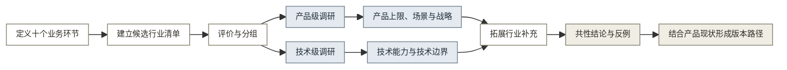

# 11 · 跨行业调研
## 一 调研问题与推导顺序

本报告回答三个问题：哪些行业与古建成果生产具有可比性，领先公司已经解决了什么问题，这些结果在什么条件下才能用于本案。

结论按以下规则标注：

- [事实] 来自产品官方文档、政府文件或论文，附来源和复核日期。
- [分析] 是基于多项事实得到的判断，不等同于已经验证的产品需求。
- [资料边界] 公开资料不足以支持具体数字或范围，因此相关说法不进入结论。
- 厂商公布的精度、效率、用户量和市场规模只代表其自身口径。

如图 1 所示，产品级调研与技术级调研从行业筛选后分开进行。两条线只在综合结论阶段汇合。

**图 1：跨行业调研推导顺序**

## 二 能力定义

调研对象统一放到十个业务环节中比较，避免只看到某家公司最显眼的功能。十个环节及问题见表 1。

**表 1：古建成果生产的十个环节**

| 环节 | 定义 | 本案需要回答的问题 |
|:----:|------|--------------------|
| 1 任务定义 | 明确对象、成果、规范、精度、角色和验收条件 | 开始采集前要交付什么，由谁确认 |
| 2 数据获取 | 现场采集并导入历史资料，检查覆盖与质量 | 照片、尺寸、图纸、登记表或点云是否齐全 |
| 3 几何处理 | 校正、配准、去噪、拼接或空间重建 | 不同资料能否落到统一坐标和尺度 |
| 4 对象识别 | 识别构件、部位和异常 | 系统能识别哪些对象，未知项如何表达 |
| 5 语义结构化 | 保存类别、数量、尺寸、关系、来源和版本 | 识别结果能否成为可编辑的构件数据 |
| 6 复核校正 | 人工检查并修正识别与结构化结果 | 谁修改，为什么修改，修改前后如何留痕 |
| 7 成果生成 | 按规则和模板生成图纸、清单或报告 | 构件数据能生成哪些正式成果 |
| 8 成果检查 | 检查精度、完整性、规范和责任记录 | 模型正确是否足以证明图纸合格 |
| 9 交付接入 | 按接收方格式和流程提交成果 | DWG、PDF、JSON 如何进入现有工作 |
| 10 档案维护 | 建立对象身份、版本、跨期比较和复查任务 | 一次交付如何转为长期可用的记录 |

规则与数据模型、数据反馈与评估贯穿十个环节。权限、审计、部署和备份属于运行条件，不作为业务环节重复计数。

### 2.1 产品级调研问题

产品级调研只研究用户如何使用产品、得到什么结果，以及结果如何进入真实工作，不解释算法机制。观察项见表 2。

**表 2：产品级调研框架**

| 观察项 | 需要记录的内容 | 对应环节 |
|--------|----------------|----------|
| 用户与触发条件 | 谁在什么任务下开始使用，原有替代方案是什么 | 1 |
| 用户输入与操作 | 用户准备什么资料，操作门槛和补充动作是什么 | 2、6 |
| 产品流程 | 产品把任务分成哪些步骤，异常如何退回 | 1、6、8 |
| 交付结果 | 生成模型、图纸、清单还是报告，谁最终确认 | 7、8、9 |
| 产品定位 | 工具、平台、项目服务、数据基础设施或公共品 | 9、10 |
| 持续使用条件 | 是否有固定复查任务、数据积累、预算或采购机制 | 10 |

### 2.2 技术级调研问题

技术级调研只研究输入、处理、输出和失败条件，不以市场规模或产品定位证明技术可行。观察项见表 3。

**表 3：技术级调研框架**

| 观察项 | 需要记录的内容 | 对应环节 |
|--------|----------------|----------|
| 输入与质量 | 数据类型、设备、控制点、覆盖度和误差来源 | 2 |
| 几何处理 | 配准、重建、尺度、坐标和几何输出 | 3 |
| 识别与结构化 | 类别范围、参数、关系、未知状态和置信度 | 4、5 |
| 人工校正 | 人工介入位置、修改记录和异常处理 | 6 |
| 成果生成 | 规则、模板、参数化输出和格式转换 | 7 |
| 成果检查 | 几何精度、识别评估、规范检查和责任确认 | 8 |
| 接口与版本 | 外部工具接入、对象身份、版本和跨期比较 | 9、10 |

同一家公司可以同时进入两条调研线，但使用不同问题。例如，Matterport 的用户流程属于产品级调研，多次扫描合并和标签继承属于技术级调研。

## 三 候选行业与筛选

候选行业清单必须保留，因为它说明调研范围如何从古建数字化扩展到其他行业。

### 3.1 评价维度

五个维度用于控制候选范围，具体作用见表 4。评分采用高中低，不换算数值总分。完整流程参照优先看流程相似度，技术上限参照优先看领先度，责任确认参照优先看规范压力；用户相似度用于判断产品方式能否借鉴，信息可得性是证据门槛。

**表 4：行业评价维度**

| 维度 | 作用 | 判断重点 | 优先级 |
|------|------|----------|:------:|
| 流程相似度 | 判断能否比较完整工作 | 十个环节覆盖多少，成果是否需要复核和交付 | 主判断 |
| 领先度 | 判断能否提供未来参照 | 是否规模使用，是否持续更新 | 主判断 |
| 规范压力 | 判断成果能否正式使用 | 是否有精度、审批、签字或监管要求 | 辅助判断 |
| 用户相似度 | 判断产品方式能否借鉴 | 是否面向机构，操作者是否需要专业支持 | 辅助判断 |
| 信息可得性 | 判断当前能否形成可靠结论 | 是否有官方资料、政府文件或论文 | 研究条件 |

统一总分会掩盖行业角色差异。自动驾驶的用户和成果与本案差异很大，但可以作为识别技术上限；文档档案只覆盖后半段，却适合研究合规检查。因此，评价表用于比较，最终按研究角色入选。

### 3.2 候选行业清单

候选范围包括十三个行业，评价结果见表 5，均属于 [分析]。

**表 5：候选行业评价**

| 候选行业 | 流程相似度 | 领先度 | 规范压力 | 用户相似度 | 信息可得性 |
|----------|:----------:|:------:|:--------:|:----------:|:----------:|
| 0 遗产数字化 | 高 | 低 | 高 | 高 | 高 |
| 1 建筑外观 AI 测量 | 高 | 高 | 高 | 高 | 高 |
| 2 医疗影像 AI | 高 | 高 | 高 | 中 | 高 |
| 3 无人机测绘与实景三维 | 高 | 高 | 高 | 高 | 高 |
| 4 建筑逆向建模 | 高 | 中 | 中 | 高 | 中 |
| 5 消费级三维捕获 | 中高 | 高 | 低 | 高 | 高 |
| 6 自动驾驶感知 | 中 | 高 | 中 | 低 | 高 |
| 7 电力与基建巡检 AI | 中高 | 高 | 高 | 高 | 中 |
| 8 工业质检 AI | 中高 | 高 | 中 | 中 | 中 |
| 9 遥感解译 | 中高 | 中高 | 高 | 高 | 高 |
| 10 文档智能与档案数字化 | 中高 | 中 | 高 | 高 | 高 |
| 11 AI 建筑生成出图 | 低 | 高 | 低 | 中 | 高 |
| 12 安防视频结构化 | 低 | 高 | 中 | 高 | 高 |

### 3.3 入选结果与研究角色

入选结果不是简单取评分最高者，而是让不同对象回答不同问题，分组见表 6。

**表 6：行业分组**

| 分组 | 行业 | 研究目的 | 处理方式 |
|------|------|----------|----------|
| 直接基线 | 遗产数字化 | 看现有遗产数据、三维记录和 HBIM 做到哪里 | 产品级和技术级都研究 |
| 完整流程参照 | 建筑外观 AI 测量 | 看低门槛采集如何形成可使用的测量结果 | 重点研究产品级 |
| 责任确认参照 | 医疗影像 AI | 看 AI 草稿、人工复核、质量检查和签发如何分工 | 产品级和技术级分开研究 |
| 几何处理参照 | 无人机测绘与实景三维 | 看多来源采集、重建、量测和工程格式 | 重点研究技术级 |
| 规范成果参照 | 建筑逆向建模 | 看点云或网格如何进入 BIM 和图纸流程 | 重点研究技术级 |
| 低门槛采集参照 | 消费级三维捕获 | 看固定类别识别、参数化输出和普通用户操作 | 产品级和技术级分开研究 |
| 技术上限参照 | 自动驾驶感知 | 只看复杂场景、多传感器和时序识别 | 不用于产品和商业推导 |
| 拓展池 | 电力巡检、遥感解译、文档档案 | 分别补充少见构件、变化核查和合规档案 | 围绕单一问题定向研究 |
| 暂不详研 | 工业质检、AI 建筑生成、安防视频 | 与空间重建、规范图纸或实物一致性距离较远 | 保留候选，不进入主要结论 |

## 四 产品级公司调研

产品级调研保留公司和项目差异，重点是用户任务、产品流程、交付结果和产品定位。

### 4.1 遗产数字化

遗产数字化已经形成数据平台、定制项目、公共档案和专业服务，但尚未形成基层机构可自行完成构件识别与规范出图的标准产品。代表案例见表 7。

**表 7：遗产数字化产品案例**

| 案例 | 用户与触发条件 | 用户流程 | 交付结果 | 产品定位 | 证据与边界 |
|------|----------------|----------|----------|----------|------------|
| Arches | 遗产机构建设清册、调查库或历史环境记录 | 管理员配置数据模型，团队录入空间、词表和遗产记录 | 可检索、可扩展的遗产数据库 | 开源遗产数据平台 | [事实] 机构可自行部署、配置和扩展；Greater London HER 和 EAMENA 已采用（[Getty](https://www.getty.edu/projects/arches/)，[Arches](https://www.archesproject.org/)，访问 2026-07-18）。不负责识别和出图 |
| Iconem | 重要遗址需要抢救性三维记录或展示 | 专业团队现场采集，项目团队完成处理和交付 | 三维记录、研究或展示材料 | 定制数字化服务 | [事实] 已在多地开展遗产记录；HeritageWatch.AI 是独立非商业项目（[Microsoft](https://news.microsoft.com/transform/heritage-activists-preserve-global-landmarks-ruined-in-war-threatened-by-time/)，访问 2026-07-18）。不能据此证明构件级监测成熟 |
| CyArk | 受威胁遗产的教育、研究或非商业使用需要原始三维资料 | 专业团队采集，项目方整理后通过 Open Heritage 3D 发布 | LiDAR、摄影测量影像和其他空间数据集 | 非营利项目与开放数据仓库 | [事实] Open Heritage 3D 收录数百个数据集，按不同 Creative Commons 许可开放；文化敏感和安全因素可能限制开放（[CyArk](https://www.cyark.org/whatwedo/openaccess/)，访问 2026-07-18）。开放数据不等于长期维护服务 |
| 国内项目制服务商 | 文保单位通过专项采购取得普查、测绘或数字化成果 | 服务商完成外业调查、资料研究、摄影、绘图和检查 | 调查记录、照片、图纸及约定的测绘数据 | 专业人员参与的项目服务 | [事实] 松江区第四次全国文物普查技术服务采购要求供应商具备 CGCS2000 坐标和三维激光扫描能力，工作范围覆盖现场调查、研究、摄影、绘图和检查（[松江区政府采购文件](https://www.songjiang.gov.cn/shsj_main/a21751f2-d02d-434c-a291-42b6273289cc/7c57b74f-ea14-4b05-8fc1-9930a04c4680/%E6%9D%BE%E6%B1%9F%E5%8C%BA%E7%AC%AC%E5%9B%9B%E6%AC%A1%E5%85%A8%E5%9B%BD%E6%96%87%E7%89%A9%E6%99%AE%E6%9F%A5%E6%8A%80%E6%9C%AF%E6%9C%8D%E5%8A%A1%E9%A1%B9%E7%9B%AE%EF%BC%88%E4%B8%80%E7%B1%BB%E8%B4%B9%E7%94%A8%EF%BC%89.pdf.pdf)，访问 2026-07-18）。这仍是服务采购，不是基层自助软件 |
| 地方文物普查平台 | 普查队需要采集、汇总和逐级审核不可移动文物数据 | 现场终端采集，PC 端汇总，在线或离线上传省级综合管理系统 | 普查记录、空间位置、照片和审核状态 | 政府数据采集与管理系统 | [事实] 第四次全国文物普查信息技术方案规定数据由采集终端汇总至 PC 端，再上传省级系统；苏州在普查基础上继续建设“文物一张图”（[甘肃省文物局](http://wwj.gansu.gov.cn/wwj/c118818/202410/174001523/files/1828ca8e39a243cdaf3ab517e0ab2ff5.pdf)、[苏州市政府](http://www.suzhou.gov.cn/wwpczl/pcdt/202507/e11898dfa7ef482db25dea2f1be7eab4.shtml)，访问 2026-07-18）。它管理普查数据，不直接生成古建构件图纸 |

产品差异集中在谁负责生产资料。Arches 提供数据平台，Iconem 和国内服务商承担项目交付，现有系统商主要管理已经形成的资料。

### 4.2 建筑外观测量

建筑外观测量最接近“普通用户采集、系统处理、结果直接进入下一项业务”的产品流程，代表案例见表 8。

**表 8：建筑外观测量产品案例**

| 案例 | 用户与触发条件 | 用户流程 | 交付结果 | 产品定位 | 证据与边界 |
|------|----------------|----------|----------|----------|------------|
| Hover | 承包商、保险或维修人员现场测量住宅外观 | 按应用引导拍摄多角度照片，检查资料后生成结果 | 带尺寸三维模型、测量和算量材料 | 外观测量与估算平台 | [事实·厂商口径] 官网称服务超过 25 万名专业用户，并称完整外观测量可达到英寸级（[Hover](https://hover.to/product/)，访问 2026-07-18）。对象主要是现代住宅 |
| EagleView | 保险、屋面工程或地产任务需要屋面测量 | 用户调用航拍资料或提交任务，平台生成测量报告 | 屋面尺寸和面积报告 | 第三方测量报告服务 | [事实·厂商口径] 98.77% 是丹佛地区独栋住宅屋面线性测量的特定基准，不是古建通用精度（[EagleView](https://www.eagleview.com/news-announcements/eagleview-roof-measurements-confirmed-to-be-98-77-accurate-compared-to-independent-benchmark-measurements/)，访问 2026-07-18） |
| 纽约 FISP 立面检查 | 高于 6 层的建筑按周期开展外墙检查 | 合格外墙检查员开展近距离检查并提交技术报告；无人机可补充采集，但不能替代现场责任 | 状态评级、技术报告和后续维修要求 | 法规驱动的专业检查服务 | [事实] 纽约市要求相关建筑每 5 年检查一次，报告由合格外墙检查员完成；现行规则保留近距离检查要求（[NYC Buildings](https://www.nyc.gov/site/buildings/safety/facade-local-law.page)、[无人机研究报告](https://www.nyc.gov/assets/buildings/pdf/LL102of2020-DroneReport.pdf)，访问 2026-07-18）。无人机和 AI 只能辅助采集与筛查 |

三类产品的共同点是结果直接服务报价、理赔或检查。古建图纸只有进入审核与交付流程，才具备同等产品价值。

### 4.3 医疗影像

医疗影像适合研究高责任成果中的分工，但医疗监管结论不能直接套用到文保验收，代表案例见表 9。

**表 9：医疗影像产品案例**

| 案例 | 用户与触发条件 | 用户流程 | 交付结果 | 产品定位 | 证据与边界 |
|------|----------------|----------|----------|----------|------------|
| Aidoc First Read | 胸片进入影像工作流程后生成报告草稿 | 系统分析影像并起草文本，临床人员检查和最终确认 | 放射报告草稿 | 研究中的报告起草产品 | [事实] 2026-06-25 获 FDA 突破性医疗器械认定，仍为研究用途，未获批准或许可（[Aidoc](https://www.aidoc.com/about/news/aidoc-receives-fda-breakthrough-device-designation-for-ai-that-drafts-radiology-reports/)，访问 2026-07-18） |
| 联影智能 | 影像检查、病历书写或科室任务 | 按放射、核医学、病历、客服等场景调用不同模型或智能助手 | 检测提示、结构化文书或工作辅助 | 多场景医疗 AI 产品组合 | [事实·厂商口径] “元智”包含文本、影像、视觉、语音和混合模型，覆盖放射、核医学、病历与服务场景；厂商称胸部 CT 产品覆盖 73 种异常，平均 AUC 为 95%，并列出多家医院部署案例（[联影智能](https://www.uii-ai.com/article/524.html)，访问 2026-07-18）。性能数字未用独立临床研究复核，不用于本案精度推导 |
| 数坤科技 | 专科影像任务需要结构化报告 | 专科产品处理影像，医生复核和签发 | 专科结构化报告 | 深入单一专科并逐项准入 | [资料边界] 官网可确认存在冠脉 CTA 等专科产品（[数坤科技](https://www.shukun.com/)，访问 2026-07-18），但本轮未找到可直接核验“80% 无需干预”和注册证总数的官方注册页，因此删除这些数字。该案例只支持“按专科拆分产品”，不支持自动签发 |

产品级结论不是“医疗已经全自动”，而是将识别、草稿、检查和责任确认分成不同环节。

### 4.4 测绘、逆向建模与消费级空间捕获

这些产品分别解决几何生产、既有设计软件接入和低门槛空间记录，不能合并成一种产品模式。不同产品流程见表 10。

**表 10：空间数据相关产品案例**

| 案例 | 用户与触发条件 | 用户流程 | 交付结果 | 产品定位 | 证据与边界 |
|------|----------------|----------|----------|----------|------------|
| DJI Terra | 测绘或检查项目需要生成二维、三维成果 | 导入航拍数据，处理、量测并导出结果 | 正射、数字表面模型、网格或点云 | 无人机测绘处理软件 | [事实] 5.0 版后常规航线规划不再由 Terra 提供，产品边界会随版本变化（[DJI Terra](https://www.dji.com/support/product/dji-terra)，访问 2026-07-18） |
| Bentley iTwin Capture | 工程项目需要处理照片和激光点云 | 将多来源数据交给同一处理环境 | 网格、点云、正射和数字表面模型 | 实景数据处理平台 | [事实] 支持本地或云端处理，规模从单体到城市（[Bentley](https://www.bentley.com/software/itwin-capture-modeler/)，访问 2026-07-18） |
| 实景三维中国 | 政府建设城市级三维空间数据 | 各地生产模型并接入政府应用 | 城市三维模型和地理实体数据 | 国家数据基础设施 | [事实] 310 个地级以上城市开展建设，累计约 11 万平方千米模型，历史文化保护在应用范围内（[自然资源部门信息](https://zrzyt.xinjiang.gov.cn/xjgtzy/mtxc/202504/4f06819015444d4c87d493ecf2f5821b.shtml)，访问 2026-07-18）。构件级能力未得到证明 |
| Autodesk ReCap 与 Revit | 改造或记录项目需要把扫描成果接入 BIM | 处理点云或网格，再在 Revit 中分类和转换 | 可继续编辑的 BIM 构件或设计资料 | 既有设计工具体系 | [事实] 用户需要建立分类组和图层，再将网格转为 Revit 族，不是一键逆向建模（[Autodesk](https://www.autodesk.com/support/technical/article/caas/sfdcarticles/sfdcarticles/How-to-create-Revit-families-from-Recap-Pro.html)，访问 2026-07-18） |
| NavVis VLX 3 | 大型室内、设施或复杂场地需要移动采集 | 操作者背负设备移动采集，处理后导出点云供团队查看和使用 | 带影像的点云及 E57、LAS、PTS 等格式 | 移动测绘硬件与软件 | [事实·厂商口径] VLX 3 配置两组 32 线激光扫描器、4 个 20 MP 相机，标称局部点云精度为 5 mm，并支持控制点和多种工程格式（[NavVis](https://knowledge.navvis.com/docs/navvis-vlx-3-specifications)，访问 2026-07-18）。设备精度不能直接代表完整项目成果精度 |
| 广联达数维建筑设计 GNA | 设计院在施工图阶段需要模型、图纸和算量联动 | 设计人员参数化建模、协同修改、自动标注并出图 | 总图、平立剖、门窗表、详图和工程量 | 国内 BIM 设计平台 | [事实·厂商口径] 官方产品页列出参数化建模、平立剖出图、门窗表、模型检查和实时算量（[广联达](https://m.glodon.com/mobile/product/detail/413)，访问 2026-07-18）。它面向正向设计，不能证明点云自动转为历史异形构件 |
| Matterport | 地产、设施或长期项目需要记录空间 | 多人或分次扫描后合并，添加标签并继续使用 | 空间记录、标签和衍生成果 | 空间数据平台 | [事实] Merge 支持多人扫描并合并最多 2000 个扫描点，标签可跨扫描复制和导入导出（[Matterport](https://matterport.com/news/matterport-2025-winter-release-productivity-multiplied-delivers-the-next)，访问 2026-07-18） |
| Polycam | 个人或小团队需要用手机生成空间资料 | 按目标选择 LiDAR 空间、摄影测量对象、Gaussian Splat 或平面图模式 | LiDAR 网格、摄影测量网格、写实场景或平面图 | 专业消费者订阅工具 | [事实] Floorplan 模式要求带 LiDAR 的 iOS 设备；Space 模式一次扫描可生成多类空间结果；Object 模式提供摄影测量网格和 Gaussian Splat（[Polycam 模式说明](https://learn.poly.cam/hc/en-us/articles/48565771018772-Which-Capture-Mode-Should-I-Use)、[Floorplan](https://learn.poly.cam/hc/en-us/articles/30299187161620-How-to-Create-Floorplan-Captures)，访问 2026-07-18）。官方未给出适用于本案的统一精度 |

测绘软件负责几何成果，BIM 工具负责接入设计环境，空间平台强调多次记录。三者对应的用户任务不同。

### 4.5 产品上限、场景与战略

产品上限来自真实交付和责任边界，不由单项算法指标决定，各行业上限见表 11。

**表 11：各行业的产品上限**

| 行业 | 已形成的产品能力 | 当前边界 | 主要产品策略 |
|------|------------------|----------|--------------|
| 遗产数字化 | 平台、项目服务和三维档案均已存在 | 自动识别、规范出图和基层自助使用未形成完整产品 | 开源平台、公益项目或项目制交付 |
| 建筑外观测量 | 普通用户采集后生成可用于报价或测量的结果 | 对象集中在规则住宅、屋面和立面 | 让测量结果直接进入报价、保险或检查 |
| 医疗影像 | AI 分析、草稿和分流进入临床工作 | 最终结论仍由责任人确认，产品按用途准入 | 逐场景、逐病种或平台化接入 |
| 测绘与实景三维 | 多来源资料可稳定生成工程几何成果 | 几何成果不包含古建构件语义 | 硬件配套软件、独立平台或国家工程 |
| 建筑逆向建模 | 扫描成果可进入 BIM 和设计软件 | 分类和异形构件建模仍依赖人工 | 接入用户已有设计环境 |
| 消费级空间捕获 | 普通用户可生成和重复使用空间记录 | 精度、类别和成果规范受限 | 订阅工具或长期空间数据平台 |

从产品级案例可以提炼四项判断：

1. 成熟产品先限定用户任务和交付结果，再设计采集与处理流程。
2. 自动化结果进入报价、理赔、设计或检查后，价值才可以衡量。
3. 高责任成果保留人工确认，系统负责草稿、检查和记录。
4. 平台型产品需要持续任务和数据积累；一次性交付不足以支持平台定位。

## 五 技术级公司调研

技术级调研沿十个环节比较输入、输出、条件和失败方式，不讨论产品定位。

### 5.1 数据获取与几何处理

照片、LiDAR 和激光点云已经可以稳定生成多种几何成果，但输入质量和坐标尺度仍决定结果是否可测量，比较见表 12。

**表 12：获取与几何处理案例**

| 案例 | 输入 | 已核实输出 | 成立条件 | 失败或误差来源 | 对本案的技术意义 |
|------|------|------------|----------|----------------|------------------|
| Agisoft Metashape | 多视角照片、控制点 | 点云、数字高程模型、正射和网格 | 重叠、清晰度、控制点和纹理满足要求 | 遮挡、反光、弱纹理和尺度不足 | 可作为通用重建模块，不承担古建语义（[Agisoft](https://www.agisoft.com/features/professional-edition/)，访问 2026-07-18） |
| DJI Terra | 无人机照片或激光雷达数据 | 正射、数字表面模型、网格和点云 | 航拍覆盖和数据质量满足任务要求 | 漏拍、水面、反光和版本功能变化 | 说明采集检查与重建工具应解耦 |
| Bentley iTwin Capture | 照片、激光点云或混合数据 | 网格、点云、正射、数字表面模型和 Gaussian Splat | 坐标、硬件和处理配置合适 | 多来源配准和复杂表面仍需控制 | 说明几何工具可以替换，输出需要统一接入 |
| Apple RoomPlan | 带 LiDAR 的 iPhone 或 iPad 传感器数据 | 墙体、开口、家具类别和尺寸的参数化 USD 或 USDZ | 固定室内类别，设备和扫描路径满足要求 | 开放类别、异形表面和测绘精度不在证明范围 | 说明固定类别内的参数化输出可行；5 分钟测试覆盖约 15 米 × 15 米房间（[Apple ML Research](https://machinelearning.apple.com/research/roomplan)，访问 2026-07-18） |
| NavVis VLX 3 | 移动激光扫描与 4 个 20 MP 相机 | 带影像点云，可导出 E57、LAS、PTS、XYZ、PLY 等格式 | 设备标定、扫描路线和控制点满足要求 | 标称 5 mm 是局部点云精度，不等于完整项目精度 | 可作为专业扫描与固定站式扫描之间的移动方案（[NavVis](https://knowledge.navvis.com/docs/navvis-vlx-3-specifications)，访问 2026-07-18） |
| Polycam | 手机 LiDAR、照片或视频 | LiDAR 网格、摄影测量网格、Gaussian Splat 或平面图 | 用户按输出目标选择模式，LiDAR 模式依赖兼容设备 | 官方未给出适用于古建测绘的统一精度；遮挡和采集路线仍影响结果 | 可作为基础采集和现场预览工具，不承担专业测绘结论（[Polycam](https://learn.poly.cam/hc/en-us/articles/48565771018772-Which-Capture-Mode-Should-I-Use)，访问 2026-07-18） |

Luma Dream Machine 官方页面介绍的是图像和视频生成，没有提供“文字生成可测量三维模型”的依据（[Luma Dream Machine](https://lumalabs.ai/dream-machine)，访问 2026-07-18）。因此，Luma 不作为三维技术证据。

### 5.2 识别、结构化与人工校正

现有成熟案例都先限定类别和字段，开放类别与异形构件仍缺少稳定方案，比较见表 13。

**表 13：识别与结构化案例**

| 案例 | 识别对象 | 结构化输出 | 人工介入 | 已知边界 | 对本案的技术意义 |
|------|----------|------------|----------|----------|------------------|
| Apple RoomPlan | 固定室内对象、墙、门窗和开口 | 类型、位置和尺寸 | 用户扫描与结果检查 | 类别封闭，不能证明古建开放类别识别 | 先做高频构件和未知状态 |
| ReCap 与 Revit | 分段网格和用户建立的分类组 | Revit 族、图层和参数 | 用户分类、转换和确认 | 不是全自动 scan-to-BIM | 自动草稿加人工确认比一键建模更现实 |
| Hover | 现代住宅屋面、墙面和开口 | 外观尺寸和测量项 | 用户按引导采集并检查 | 规则对象，厂商精度不能外推 | 类别与采集引导共同决定结果 |
| Aidoc First Read | 胸片中的目标信息 | 报告草稿文本 | 临床人员最终确认 | 尚未获批准或许可 | 识别、草稿和责任确认应采用不同状态 |
| HBIM 与点云语义分割 | 历史木构点云或切片图像 | 构件分割、参数化对象及模型对应关系 | 专家定义类别、校正分割并处理异形构件 | 2025 年论文证明的是特定传统木构案例的研究路径，不是跨地区通用产品 | 说明“有限类别分割加参数化建模”值得验证，但仍需本案类别、样本和误差基准（[npj Heritage Science](https://www.nature.com/articles/s40494-025-02151-6)、[ISPRS Annals](https://isprs-annals.copernicus.org/articles/X-M-2-2025/365/2025/isprs-annals-X-M-2-2025-365-2025.pdf)，访问 2026-07-18） |
| Tesla 感知系统 | 多路相机原始图像 | 语义分割、对象检测和单目深度估计 | 车辆系统持续采集并由专用训练与计算体系处理 | 官方页面未提供古建尺度精度、开放类别或成果检查依据 | 只说明纯视觉可以同时处理类别和深度，不证明普通照片可生成测绘图纸（[Tesla AI](https://www.tesla.com/AI)，访问 2026-07-18） |
| HUAWEI ADS 4 | 激光雷达、毫米波雷达、相机等车辆传感器 | 融合感知结果供定位、规划和控制使用 | 依赖车辆标定、专用硬件和道路运行数据 | 公开材料是系统与厂商口径，无法外推到静态古建构件 | 说明多传感器输入按各自优势组合，但传感器增加也会增加标定和运行成本（[Huawei 2025 年报](https://www-file.huawei.com/dam/asset/view/dec782afd1544f558c32fc76e3141334.pdf)、[行业与 AI 应用指南](https://www-file.huawei.com/dam/asset/view/c91dcb7998ce426da5e2cd8424a2d9b1.pdf)，访问 2026-07-18） |
| Waymo 研究与开放数据 | 相机、激光雷达和雷达时序数据 | 三维对象检测、跟踪、规划等研究任务 | 多传感器同步、标定和大规模标注 | 实时道路任务、硬件成本和评估口径均与本案不同 | 说明多传感器与时序数据可提高复杂环境感知上限，只作为技术参照（[Waymo Research](https://waymo.com/research/)，访问 2026-07-18） |

### 5.3 成果生成与成果检查

技术上可以由结构化数据生成多种成果，但成果检查必须独立于识别评估，比较见表 14。

**表 14：成果生成与检查案例**

| 案例 | 输入数据 | 自动生成内容 | 检查方式 | 技术边界 | 对本案的意义 |
|------|----------|--------------|----------|----------|--------------|
| Hover | 住宅外观测量数据 | 模型、测量和算量材料 | 厂商流程与用户检查 | 不能替代古建图纸规则 | 一份结构化数据可以生成多种成果 |
| EagleView | 屋面影像和测量数据 | 屋面测量报告 | 特定基准的线性与面积比较 | 指标只适用于测试对象 | 图纸或报告需要独立基准 |
| Revit 与 BIM 工具 | 构件对象、参数和规则 | 模型、图纸和清单 | 规则检查与专业人员审查 | 历史异形构件模板不足 | 构件库、画法和检查规则要分别管理 |
| 医疗报告产品 | 影像分析结果和结构化字段 | 报告草稿 | 规则检查、用途审批和责任人确认 | 医疗准入不能套用到文保 | 可借鉴多级确认，不借用监管结论 |

识别准确率、尺寸误差、规范符合率和最终通过率是不同指标。任何一个指标都不能代表完整成果已经合格。

### 5.4 档案版本与变化比较

档案阶段的技术重点是对象身份、版本来源和复查任务，不是把交付文件集中存放，比较见表 15。

**表 15：档案与变化案例**

| 案例 | 对象身份 | 版本或变化能力 | 数据来源 | 已知边界 | 对本案的意义 |
|------|----------|----------------|----------|----------|--------------|
| Arches | 由数据模型和资源关系描述遗产对象 | 支持记录、词表、空间和工作流扩展 | 机构录入和导入 | 不负责自动识别与图纸生成 | 借鉴对象身份和可配置数据模型 |
| Matterport | 同一空间记录和标签 | 多人扫描合并、标签复制和导入导出 | 多次空间扫描 | 平面图和标签不等于古建档案规范 | 说明长期价值来自同一对象的多次记录 |
| HeritageWatch.AI | 遗产地点与外部风险资料 | 计划使用卫星影像分析风险变化 | 卫星和项目数据 | 2025 年公告描述计划，不能证明稳定产品已经形成 | 只预留跨期影像和风险记录，不承诺自动解释残损 |
| 遥感变化核查 | 地块、图斑或空间单元 | 变化结果触发人工核查 | 跨期遥感影像 | 对象尺度和行政流程不同 | 变化检测应生成复查任务，而不是直接修改档案结论 |

### 5.5 技术上限

现有工具已经解决大部分几何重建问题，但没有跨过“开放古建构件识别、规范图纸生成、责任确认”三项组合边界。十个环节的上限见表 16。

**表 16：十个环节的当前技术上限**

| 环节 | 已有能力 | 尚未解决的问题 |
|------|----------|----------------|
| 任务定义 | 工具可按成果类型生成采集要求或处理配置 | 规范、精度、对象范围和验收条件仍由专业人员决定 |
| 数据获取 | 手机、无人机和扫描设备覆盖不同成本与精度 | 遮挡、弱纹理、尺度和历史资料质量仍需现场控制 |
| 几何处理 | 照片与点云可自动生成正射、网格和点云 | 多来源坐标统一和复杂表面误差仍需专业处理 |
| 对象识别 | 固定类别和规则对象已有成熟案例 | 少见、异形和开放类别古建构件没有成熟通用产品 |
| 语义结构化 | 固定字段内可输出类型、位置和尺寸 | 古建层级、连接、组合和地方做法尚未形成稳定模型 |
| 复核校正 | 多行业保留人在自动结果上修改 | 无真实历史数据时，无法设定可靠的自动通过条件 |
| 成果生成 | 报告、测量材料和标准 BIM 成果可自动或半自动生成 | 古建异形构件的画法模板和组合规则不足 |
| 成果检查 | 特定行业可做独立精度、规则或责任检查 | 古建规范尚未拆成完整机器检查项 |
| 交付接入 | 常见工程格式和既有软件接口较成熟 | 接收方字段、图层、签字和审批流程仍需逐项适配 |
| 档案维护 | 遗产平台和空间平台支持对象与版本记录 | 单体古建的固定复查周期、变化解释和预算来源尚未验证 |

### 5.6 公司级领先能力拆解

产品流程已经在第四节分开说明。表 17 只保留各公司或项目在技术链上的领先能力、输出和边界，避免用产品定位解释技术能力。

**表 17：公司级领先技术能力**

| 对象 | 对应环节 | 领先能力 | 主要输出 | 不能外推的内容 |
|------|----------|----------|----------|----------------|
| Arches | 5、9、10 | 可配置遗产数据模型、受控词表、空间关系和机构工作流 | 可检索遗产记录 | 不识别构件，不生成图纸 |
| Iconem | 2、3、10 | 多来源照片重建大场景；把卫星变化信息关联到遗产地点 | 三维记录与风险资料 | HeritageWatch.AI 的计划不能当作成熟监测产品 |
| CyArk | 2、3、10 | LiDAR、摄影测量与开放许可组合 | 原始三维遗产数据集 | 开放范围受文化敏感和安全条件限制 |
| Agisoft Metashape | 3 | 多视角照片重建点云、正射、数字高程和网格 | 通用几何成果 | 不提供古建语义和画法规则 |
| Hover | 1 至 9 | 引导拍摄、住宅外观测量、算量和工程格式导出连成同一流程 | 模型、测量和算量材料 | 规则住宅经验不能外推到异形古建 |
| EagleView | 2、3、7、8 | 航拍测量与独立基准验证分开 | 屋面测量报告 | 98.77% 只适用于特定住宅屋面基准 |
| 联影智能 | 4、5、7 | 按影像、病历、语音和科室任务组织模型与助手 | 检测提示和结构化文书 | 厂商 AUC 不能用于本案精度预测 |
| Aidoc | 4、7、8 | 从影像分析到报告草稿，并保留临床人员确认 | 报告草稿 | 突破性器械认定不等于已批准使用 |
| DJI Terra | 2、3、9 | 无人机影像或 LiDAR 处理、量测和多格式导出 | 正射、网格、点云 | 产品版本会改变航线与处理边界 |
| Bentley iTwin Capture | 3、9 | 照片与点云混合处理，从单体扩展到城市级 | 网格、正射、点云和 Gaussian Splat | 语义提取范围取决于项目配置 |
| 实景三维中国 | 3、5、10 | 城市三维模型、地理实体身份和政府数据接入 | 城市级三维空间数据 | 城市实体不等于古建构件 |
| ReCap 与 Revit | 3、5、7、9 | 点云或网格进入设计环境，经分类后转为构件族 | 可编辑 BIM 构件 | 分类与异形构件转换仍依赖人工 |
| NavVis VLX 3 | 2、3、9 | 移动扫描、控制点支持和多种点云格式导出 | 带影像点云 | 5 mm 是局部点云标称精度 |
| 广联达 GNA | 5、7、8 | 参数化模型同时支持平立剖、详图、检查和算量 | 施工图与工程量 | 正向设计能力不能证明 scan-to-BIM |
| Apple RoomPlan | 2 至 5、9 | 设备端扫描固定室内类别并输出参数化 USD | 墙、开口、家具和尺寸 | 固定类别和房间尺度不能外推到古建 |
| Polycam | 2、3、9 | 在同一应用中提供 LiDAR、摄影测量、Gaussian Splat 和平面图模式 | 网格、写实场景或平面图 | 官方未给出古建测绘统一精度 |
| Matterport | 2、3、10 | 多人扫描合并、标签复制和同一空间持续记录 | 空间记录与标签 | 标签和空间记录不等于规范档案 |
| Tesla | 3、4 | 相机网络执行语义分割、对象检测和单目深度估计 | 道路感知特征 | 不证明普通照片可生成测绘图纸 |
| HUAWEI ADS 4 | 2 至 4 | 激光雷达、雷达和相机融合感知 | 定位与规划使用的感知结果 | 依赖车辆标定、专用硬件和道路数据 |
| Waymo | 2 至 4 | 多传感器时序数据支持三维检测、跟踪和规划研究 | 道路对象与时序状态 | 成本、实时要求和评估口径与本案不同 |

## 六 拓展行业定向调研

拓展行业分别补一个主调研范围没有回答的问题，比较见表 18。

**表 18：拓展行业的产品问题与技术问题**

| 行业 | 产品级问题 | 技术级问题 | 当前证据状态 | 对本案的用途 |
|------|------------|------------|--------------|--------------|
| 电力与基建巡检 AI | 大型机构把无人机或机载 LiDAR 纳入既有线路巡检任务 | 采集走廊点云和影像，识别结果进入专业人员检查 | [事实·机构口径] 国网江苏 2026 年案例使用机载 LiDAR 检查跨江线路，设备沿线路采集通道空间数据（[国网江苏](http://www.js.sgcc.com.cn/xwzx/gsyw/2026/13607.shtml)，访问 2026-07-18）。公开报道没有给出训练集和误报率 | 采集设备服务既定巡检任务；少见缺陷仍需保留人工检查 |
| 文档智能与档案数字化 | 档案机构把合规检测作为归档和保管环节 | 将真实性、完整性、可用性和安全性分别转为检测项，并保存检测结果 | [事实] 国家档案局将“四性”作为电子档案检测对象；CAD 三维电子文件征求意见稿也要求检测合格后归档（[国家档案局标准解读](https://www.saac.gov.cn/daj/bzhgz/201909/3bd1227a126940768bba1e175be21a1c/files/8de2f0029b144e2586fcb4ede46e6203.pdf)、[CAD 电子文件归档规范征求意见稿](https://www.saac.gov.cn/daj/tzgg/202412/2d985055ba1145ce816da9030d24444a/files/dc6a31bee0f34e04af2e5fbc9f5efcb2.docx)，访问 2026-07-18） | 图纸归档不能只保存文件；应保存来源、版本、检查和迁移信息 |
| 遥感解译 | 上级产生疑问图斑，县级单位逐图斑核实并举证 | 内业判断形成清单，外业实地调查与照片举证后修改数据库 | [事实] 国土变更调查要求省级部门组织县级单元逐图斑核实；地方方案使用国土调查云开展变化图斑实地举证（[湖南省政府](http://www.hunan.gov.cn/zqt/zcsd/202303/t20230310_29269045.html)、[安徽地方实施方案](https://www.ahjd.gov.cn/OpennessContent/show/2919018.html)，访问 2026-07-18） | 变化算法只负责生成疑问对象，最终状态由现场核实和审核更新 |

工业质检、AI 建筑生成和安防视频结构化暂不详研。它们可以补充局部识别、交互或部署问题，但与古建空间重建和规范成果的距离较远。

## 七 综合结论

产品级与技术级调研支持的结论不同，不能混成一组“行业共性”。

### 7.1 产品级共性

产品级重复做法见表 19。

**表 19：产品级重复做法**

| 做法 | 代表案例 | 成立条件 | 不能外推的结论 |
|------|----------|----------|----------------|
| 先确定任务和交付物 | Hover、EagleView、专业检查服务 | 用户任务和验收要求清楚 | 不能由通用模型替用户选择规范 |
| 结果进入现有业务 | 测量进入报价，报告进入审核，扫描进入设计软件 | 接收方认可格式、精度和责任记录 | 生成更多文件不等于产品价值成立 |
| AI 草稿与人工确认分开 | Aidoc、ReCap 与 Revit | 异常状态、退回和责任人明确 | 不能用置信度阈值取消人工责任 |
| 平台依赖持续任务 | Arches、Matterport | 有对象身份、复查频率、权限和预算 | 一次性交付不会自然形成平台需求 |
| 产品范围逐项扩展 | 医疗用途、固定空间类别、BIM 构件族 | 每个新增类别有样本、规则和通过条件 | 不能直接承诺覆盖全部古建构件 |

### 7.2 技术级共性

技术级重复做法见表 20。

**表 20：技术级重复做法**

| 做法 | 代表案例 | 成立条件 | 不能外推的结论 |
|------|----------|----------|----------------|
| 几何与语义分层 | Metashape、Bentley、RoomPlan、Revit | 两层数据分别保存和检查 | 模型可看不等于构件已识别 |
| 多来源输入按任务分级 | 手机、无人机、摄影测量和激光点云 | 在同一对象和成果标准下比较 | 低成本采集不能自动替代专业测量 |
| 先限定类别和字段 | RoomPlan、住宅测量、BIM 构件族 | 类别、字段和未知状态明确 | 固定类别成功不能证明开放类别可行 |
| 生成与检查分开 | EagleView、医疗报告、BIM 规则检查 | 有独立基准、检查项和责任记录 | 识别准确率不能代表图纸合格率 |
| 校正数据用于后续改进 | 人工复核、规则修订和版本记录 | 数据权属和校正质量允许复用 | 保存修改记录不等于可以跨项目训练 |

### 7.3 对本案的反向定义

跨行业调研只能给出方向，近期产品仍需结合现状和真实用户验证。

1. 产品主线应是“多来源资料 → 可校正构件数据 → 可检查成果”，不能缩成照片识别。
2. 当前 demo 是第 0 代，只证明路径可以运行。下一版先验证真实图纸交付，不提前建设区域档案平台。
3. 输入保留基础、增强和专业三类方案，并用同一建筑、同一成果标准比较。
4. 构件识别从高频类别开始，保留未知、存疑、资料不足和类别不存在状态。
5. 构件校正、成果检查和负责人确认采用不同流程状态。
6. 档案功能沿用交付阶段的对象身份，在复查责任和使用频率得到验证后扩展。

这些判断在 [12 · 调研结论与未来架构 v0.4](12_调研结论与未来架构_v0.4.md) 中与产品现状连接，形成版本路径和未来架构。公开资料能说明行业做法和边界，不能替代本案的样本测试、真实交付和用户验证。

英国 HER 与中国普查平台也不能直接互换。英国 HER 是地方规划、开发控制和土地管理的主要信息来源，强调持续更新和公共访问；中国第四次全国文物普查通过采集终端、PC 端和省级系统逐级汇总，目标包括国家不可移动文物资源总目录和数据库（[Historic England](https://historicengland.org.uk/advice/technical-advice/information-management/hers/)、[Greater London HER](https://historicengland.org.uk/advice/planning/our-planning-services/greater-london-archaeology-advisory-service/greater-london-historic-environment-record/)、[第四次全国文物普查信息技术方案](http://wwj.gansu.gov.cn/wwj/c118818/202410/174001523/files/1828ca8e39a243cdaf3ab517e0ab2ff5.pdf)，访问 2026-07-18）。可借鉴的是对象身份、来源、审核和版本记录，不是照搬字段与开放方式。
