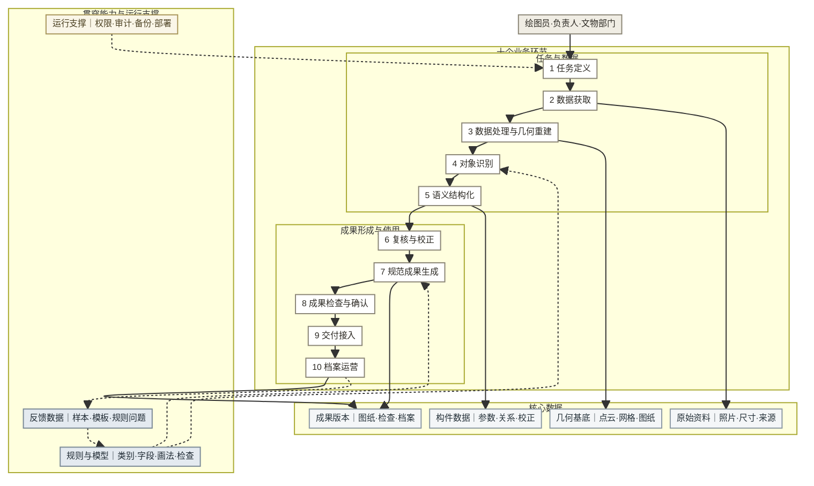

# 12 · 调研结论与未来架构

领先产品的共同方向是：先把对象、规则和成果要求结构化，再逐步提高采集、识别、校正、成果检查和长期使用的自动化程度。

## 一 跨行业发展路径

**表 1：十个业务环节的发展路径**

| 环节 | 领先产品反复出现的发展方向 | 能力成熟的前提 | 当前边界 | 代表对象 |
|:----:|----------------------------|----------------|----------|----------|
| 1 任务定义 | 从“用户自己决定怎么采”发展到“先选成果、规范和精度，再生成采集与检查任务” | 成果类型、对象范围和验收条件可配置 | 新项目的规范选择和责任分工仍需专业人员确定 | 大疆、Hover、医疗影像、测绘项目 |
| 2 数据获取 | 从单一设备采集发展到手机、无人机、激光扫描和存量资料并用；现场即时提示缺失 | 明确精度、覆盖度、来源和完整性要求 | 遮挡、存量资料质量和不同来源精度仍需人工判断 | Hover、大疆、NavVis、Bentley、档案数字化 |
| 3 数据处理与几何重建 | 从人工整理发展到自动配准、去噪、拼接和二维三维重建 | 原始数据覆盖充分，误差可以测量 | 反光、弱纹理、遮挡、异形几何和坐标对齐仍会产生缺失 | Metashape、大疆、Bentley、RoomPlan、Luma |
| 4 对象识别 | 从通用识别发展到限定类别、逐类验证和持续扩展 | 类别清单、样本、基准集和识别阈值明确 | 未限定类别时，少见和异形构件尚无稳定通用识别产品 | RoomPlan、Aidoc、数坤、国网巡检 |
| 5 语义结构化 | 从标签和位置发展到参数、关系、来源、身份和版本组成的领域对象 | 领域数据模型先定义 | 开放对象范围仍容易停在几何模型或零散标签 | Arches、RoomPlan、Hover、Revit、数坤 |
| 6 复核与校正 | 从平均检查全部结果发展到按置信度和风险分配复核任务；异常明确转人工 | 有历史错误数据和可校准阈值 | 高责任场景不能取消人工；初期只能逐项复核 | 数坤、遥感解译、scan-to-BIM、HBIM |
| 7 规范成果生成 | 从单一文件发展到同一结构化数据生成图纸、模型、清单和报告 | 规范可拆为规则，常见对象有参数化模板 | 历史异形构件和地方做法增加模板维护量 | EagleView、Hover、Revit、广联达、医疗报告 |
| 8 成果检查与确认 | 从“模型准确率”发展到精度、完整性、规范、责任四类检查分别留证 | 有独立基准、机器检查项和责任人制度 | AI 不能代替责任人；不同地区检查依据不同 | EagleView、数坤、Aidoc、档案四性检测、立面检测 |
| 9 交付接入 | 从下载单个文件发展到进入 CAD、BIM、理赔、核查或审批节点 | 格式、字段、命名和后续动作稳定 | 文件兼容不等于内容合格；机构流程仍需逐项适配 | Autodesk、Hover、EagleView、卫片执法 |
| 10 档案运营 | 从一次性交付发展到对象身份、版本时间线、跨期比较和任务提醒 | 对象长期存在，有持续维护责任和预算 | 没有固定复查周期时，变化检测难形成长期使用 | Arches、Matterport、实景三维中国、HeritageWatch.AI |
| 两项贯穿能力 | 规则与数据模型先定义；真实使用数据持续更新样本、模板和规则 | 数据权属、版本和维护责任明确 | 只积累文件而不分类处理问题，无法持续改善 | Arches、Revit、国网巡检、医疗影像 |

## 二 领先行业的共同能力

共同能力须在至少两个不相关行业独立出现，并能对应本产品的业务环节。

**表 2：跨行业共同能力**

| 编号 | 能力位置 | 共同能力 | 跨行业证据 | 适用边界 |
|:----:|----------|----------|------------|----------|
| C01 | 任务定义、数据获取 | 用最终成果反向定义对象范围、采集方式和检查项 | 大疆按成果规划航线；Hover 按测量项引导拍摄；医疗按检查目的选择协议 | 成果要求未明确时不能自动生成完整任务 |
| C02 | 任务定义 | 把规范、精度、角色和验收条件保存为项目配置 | 测绘项目按精度组织作业；医疗按审批要求确认；档案系统按规则检查 | 项目配置不能代替专业人员选择规范 |
| C03 | 数据获取 | 同时支持现场采集和存量资料导入 | Bentley 处理照片与点云；档案产品导入扫描件；遗产项目混用历史照片与现场数据 | 存量资料必须记录来源、时间和质量 |
| C04 | 数据获取 | 在现场提示覆盖不足、模糊、重复和缺失尺寸 | 大疆飞行中成图；Luma 显示覆盖；Hover 引导取景；NavVis 现场查看点云 | 只能保证输入可用，不能保证后续识别和成果正确 |
| C05 | 数据获取 | 按精度、成本和人员能力提供分级采集方式 | Polycam、Hover 用手机；大疆用无人机；NavVis、HBIM 用激光扫描 | 低成本方式不能完全代替高精度设备 |
| C06 | 数据获取、规则与数据模型 | 每份资料携带来源、时间、设备、精度和处理状态 | 测绘重视设备和精度；档案重视来源与真实性；医疗保留检查来源 | 自动记录可获得的字段，减少现场填写负担 |
| C07 | 处理与重建、识别 | 几何重建和语义识别分开保存、分别评估 | Metashape、Luma 停在几何层；RoomPlan、Hover 增加类别和参数 | 仅需展示模型的场景可以不做语义识别 |
| C08 | 处理与重建 | 多来源数据先配准到统一坐标和尺度 | Bentley 混合照片和点云；Matterport 合并多人扫描；实景三维中国统一空间身份 | 不同时间、精度和坐标来源会产生配准误差 |
| C09 | 处理与重建、复核校正 | 重建结果可视化，并能定位缺失区域重新采集 | 大疆现场成图补拍；NavVis 剖切检查；Luma 覆盖提示 | 自动提示不能判断所有历史构造是否采全 |
| C10 | 对象识别 | 先限定识别类别，再逐类扩展 | RoomPlan 固定类别；Aidoc 逐病种扩展；国网逐类上线缺陷识别 | 类别不限时只能输出几何或低可信标签 |
| C11 | 对象识别、复核校正 | 允许输出“未知、存疑、类别不存在”，不强制归类 | 医疗存疑病例转医生；Hover 复杂屋型人工介入；scan-to-BIM 异形构件人工建模 | 异常比例过高说明类别或产品范围需要调整 |
| C12 | 对象识别 | 每条识别结果保留依据、置信度、来源和模型版本 | 医疗和遥感输出置信度；本案 demo 已显示识别依据 | 置信度未经校准时不能直接作为自动通过标准 |
| C13 | 语义结构化、规则与数据模型 | 领域数据模型先于识别自动化 | Arches 先定义遗产记录；Revit 先定义构件；RoomPlan 先定义参数化对象 | 数据模型变化会影响采集、识别、检查、成果和档案 |
| C14 | 语义结构化 | 从类别标签扩展到参数、层级、连接关系、来源和版本 | Revit、广联达表达构件关系；Arches 表达遗产记录；实景三维中国使用实体编码 | 从出图所需关系开始，避免早期模型过重 |
| C15 | 语义结构化、成果生成 | 一份结构化数据生成多种成果 | 广联达同一模型生成图纸与算量；Hover 生成模型、算料和报价；联影生成多类文书 | 数据模型必须预留各成果所需字段 |
| C16 | 复核与校正 | 按置信度、错误影响和对象重要性排列复核任务 | 数坤分别处理常规与存疑病例；遥感结果带分数供复核 | 初期缺少阈值时应默认逐项复核 |
| C17 | 复核与校正、数据反馈与迭代 | 人工修改保留原值、新值、原因、人员和时间 | 医疗保留医生修改；档案审核留记录；专业建模保留版本 | 人工修改也需复核，不能直接作为正确样本 |
| C18 | 复核与校正 | 标准情况自动处理，例外情况明确转人工 | Hover 复杂屋型人工介入；医疗存疑病例转医生；HBIM 异形构件人工建模 | 必须统计异常比例和处理时间 |
| C19 | 成果生成、规则与数据模型 | 规则和参数化模板决定成果生成范围 | Revit 构件族、广联达模块库、医疗报告模板、HBIM 构件库 | 异形对象需要例外模板或人工绘制 |
| C20 | 成果生成、规则与数据模型 | 模板按构件类型、形制、地区规范和版本管理 | HBIM 历史构件库、Revit 构件族、医疗报告模板按场景区分 | 先验证高频类型，避免模板数量失控 |
| C21 | 成果检查与确认 | 最终成果检查独立于识别校正 | 档案四性检测；数坤报告过程检查；建筑测量成果验证 | 每类成果需要自己的检查清单 |
| C22 | 成果检查与确认 | 模型指标、成果精度、规范符合性分别验证 | 医疗看识别指标与监管审批；EagleView 做独立精度验证；档案按国标检查 | 需要独立基准样本和明确容差 |
| C23 | 成果检查与确认 | 机器检查与责任人确认并存 | 医生签发、立面检查员签字、测绘成果审核 | 产品必须保留退回、修改和再次确认状态 |
| C24 | 交付接入 | 采用接收方已接受的格式和工具 | Hover 导出 DXF/DWG；Autodesk 工具互通；遥感图斑进入核查系统 | 文件可打开不等于字段、命名和内容合格 |
| C25 | 交付接入、成果确认 | 交付包包含成果、结构化数据、检查报告和版本说明 | 医疗报告附审核；测绘成果附精度信息；档案交付包含检查结果 | 按接收机构要求裁减，避免重复材料 |
| C26 | 档案运营 | 为建筑、构件和成果建立唯一身份与版本时间线 | Arches 遗产记录；实景三维中国实体编码；Matterport 空间对象库 | 编码、命名和数据权属需要跨项目统一 |
| C27 | 档案运营 | 变化检测生成复查、维护或审批任务 | 卫片变化触发核查；HeritageWatch.AI 触发威胁预警 | 需要固定复查周期和明确责任人 |
| C28 | 数据反馈与迭代 | 校正问题分为识别样本、成果模板和检查规则三类处理 | 国网积累缺陷样本；医疗积累修改记录；Revit、HBIM 扩展构件模板；档案系统维护规则 | 三类问题不能混在同一张无分类清单中 |
| C29 | 运行支撑 | 数据敏感度决定设备端、云端或机构内处理 | RoomPlan 在设备端处理；医疗与电力采用机构平台；档案系统强调权限和审计 | 部署方式需根据数据分级和采购要求决定 |
| C30 | 训练与评估、产品管理 | 每个环节使用独立指标，不用识别准确率代替全流程效果 | 大疆检查覆盖；RoomPlan 评估识别；EagleView 验证成果精度；医疗记录审核 | 优先记录影响返工和交付的指标 |

## 三 反向定义本产品

### 3.1 当前能力与缺口

**表 3：十个环节及贯穿能力的现状**

| 能力 | 当前已有 | 关键缺口 |
|------|----------|----------|
| 1 任务定义 | demo 有项目、建筑单元、图纸类型与负责人 | 适用规范、精度、验收项和采集任务尚未形成统一配置 |
| 2 数据获取 | 真实照片上传、照片标记、实测尺寸录入 | 无历史图纸与登记表导入；无覆盖度、模糊和缺失尺寸检查 |
| 3 数据处理与几何重建 | 照片进入多模态模型前完成基础读取 | 无照片组配准、点云或二维底图处理；不同照片和尺寸的对应关系弱 |
| 4 对象识别 | Claude 多模态真实识别、受控词表、识别依据和置信度字段 | 样本少，无稳定基准集；构件类别清单未形成正式版本 |
| 5 语义结构化 | 部件表与结构化 JSON；类型、数量和尺寸等基础字段 | 构件关系、来源、对象身份、版本、规范字段和异常表达未统一 |
| 6 复核与校正 | 人工校正、重新校正、负责人审核前的状态控制 | 无按风险排序的复核队列；未完整保存修改原因和前后值 |
| 7 规范成果生成 | PoC 可生成 DXF；新建单元可生成 SVG 参数化示意图 | 参数化画法库覆盖范围有限；规范 DXF/DWG 尚未覆盖新建单元和多类构件 |
| 8 成果检查与确认 | 实体计数审计、负责人审核节点 | 无独立精度基准、规范检查清单、审核记录包和责任边界说明 |
| 9 交付接入 | demo 有出图设置、导出页面与交付记录；PRD 定义 DWG、PDF、JSON | 尚未形成完整真实交付包；未验证目标用户以 DWG 还是 PDF 为主 |
| 10 档案运营 | 本机保存版本状态和交付记录 | 无后端、统一编码、跨项目检索、版本比较和变化检测 |
| 规则与数据模型 | 受控词表、部分表单字段和初步画法库 | 缺正式构件数据模型、类别版本、检查规则、成果模板规则和档案字段 |
| 数据反馈与迭代 | 本机记录人工校正 | 未把问题分别转为识别样本、画法模板需求和检查规则问题 |
| 运行支撑 | 本机浏览器运行，API key 存本机 | 无账户权限、操作审计、数据备份、机构部署和数据安全方案 |

### 3.2 共同能力逐条转为产品功能

**表 4：从三十项共同能力反向定义功能**

| 共性 | 本产品需要的功能 | 主要使用者 | 建设阶段 |
|:----:|------------------|------------|----------|
| C01 | 创建任务时先选成果类型、对象范围和精度，再生成拍摄与尺寸清单 | 项目负责人、外业人员 | 下一阶段 |
| C02 | 项目配置：适用规范、成果版本、负责人、审核人和验收项 | 项目负责人 | 立即定义 |
| C03 | 照片、尺寸、登记表、历史图纸和已有模型统一导入 | 绘图员、项目负责人 | 下一阶段 |
| C04 | 角度覆盖提示、模糊与重复照片检查、缺失尺寸提醒 | 外业人员、绘图员 | 下一阶段 |
| C05 | 采集方式选择：普通照片、手机 LiDAR、无人机或专业扫描；显示精度和成本适用范围 | 项目负责人 | 中期，先做选择建议和数据接入 |
| C06 | 每份资料自动或人工记录来源、时间、设备、精度和处理状态 | 外业人员、绘图员 | 下一阶段 |
| C07 | 几何数据与构件语义分层保存，允许“有几何、无语义” | 绘图员、研发 | 下一阶段 |
| C08 | 照片、点云、图纸和实测尺寸的尺度与坐标对应 | 绘图员 | 中期 |
| C09 | 重建或照片覆盖查看；从缺失区域直接创建补采任务 | 外业人员、绘图员 | 中期 |
| C10 | 构件类别管理：版本、适用形制、样本数量、识别阈值和上线状态 | 产品维护者、文保专家 | 立即定义 |
| C11 | 明确的未知、存疑、类别不存在和资料不足状态；可转人工处理 | 绘图员 | 下一阶段 |
| C12 | 每条识别结果保存依据、置信度、资料来源和模型版本 | 绘图员、项目负责人 | 当前已有部分，下一阶段补全 |
| C13 | 古建构件数据模型：类型、数量、尺寸、层级、关系、来源、置信度、版本和规范字段 | 产品维护者、研发 | 立即定义 |
| C14 | 从出图需要出发，建立构件层级、连接、组合和定位关系 | 绘图员、研发 | 下一阶段 |
| C15 | 同一份构件数据生成图纸、部件清单、统计表、审核报告和档案字段 | 绘图员、项目负责人 | 下一阶段 |
| C16 | 复核队列按置信度、错误影响和构件重要性排序；初期默认逐项复核 | 绘图员 | 中期 |
| C17 | 校正记录保存原值、新值、原因、人员和时间 | 绘图员、项目负责人 | 下一阶段 |
| C18 | 异常处理：识别为空、资料不全、类别不存在、模板缺失和规则冲突时转人工 | 绘图员、项目负责人 | 下一阶段 |
| C19 | 参数化画法库：构件模板、参数范围、组合规则、适用规范和例外处理 | 产品维护者、研发 | 立即建设 |
| C20 | 画法模板按构件、形制、地区规范和版本管理；先覆盖高频类型 | 产品维护者、文保专家 | 下一阶段 |
| C21 | 分段检查：构件数量与关系检查、图层与尺寸检查、交付完整性检查 | 绘图员、项目负责人 | 下一阶段 |
| C22 | 三套独立结果：识别基准、尺寸精度报告、规范符合性检查 | 项目负责人、文物部门 | 下一阶段 |
| C23 | 负责人退回、修改、再次确认和最终确认记录；AI 不直接标记为最终合格 | 项目负责人 | 当前已有部分，下一阶段补全 |
| C24 | 真实导出 DWG、PDF、结构化 JSON；字段、图层、命名和版本一致 | 绘图员、项目负责人 | 下一阶段 |
| C25 | 交付包包含图纸、清单、结构化数据、检查报告和版本说明 | 项目负责人、文物部门 | 下一阶段 |
| C26 | 建筑、建筑单元、构件和成果统一编码；版本时间线和历史检索 | 文物部门、项目负责人 | 中期 |
| C27 | 跨期照片和构件数据比较，生成变化清单并创建复查任务 | 文物部门、巡查人员 | 后期 |
| C28 | 三类改进清单：识别样本、画法模板、检查规则；分别统计状态 | 产品维护者、研发 | 下一阶段 |
| C29 | 机构权限、操作审计、备份以及机构内处理选项 | 文物部门信息化人员 | 中期，先验证采购要求 |
| C30 | 分环节指标：补采率、重建失败率、识别修正率、单构件校正时间、成果检查问题数、交付退回率 | 产品经理、研发 | 下一阶段 |

### 3.3 产品定义与边界

本产品面向乙方绘图员和项目负责人，把照片、实测尺寸和历史资料整理为可校正的古建构件数据，生成经过检查、可交付、可追溯的规范图纸。档案版本和变化复查在图纸交付稳定后建设。

**表 5：产品边界**

| 边界项 | 本产品负责 | 不在当前范围 |
|--------|------------|--------------|
| 采集方式 | 定义采集要求，接入手机、无人机和激光扫描结果 | 开发采集硬件 |
| 几何重建 | 接入照片、点云、网格和图纸底图，保存坐标与尺度关系 | 开发通用三维重建工具 |
| 识别范围 | 覆盖经过验证的高频构件，保留未知和存疑状态 | 承诺识别全部古建构件 |
| 成果责任 | 机器检查与人工确认并存，保留修改和签发记录 | 由 AI 代替责任人确认或法定签章 |
| 档案运营 | 图纸交付稳定后复用对象编码和版本记录 | 当前阶段建设完整档案平台和变化检测 |

## 四 未来架构

**图 1：未来产品架构**

**表 6：架构模块**

| 模块 | 对应能力 | 核心数据 | 主要输出 |
|------|----------|----------|----------|
| 项目与任务 | 任务定义 | 成果类型、对象范围、适用规范、精度、角色、验收项 | 采集清单和检查要求 |
| 多来源资料 | 数据获取 | 照片、尺寸、登记表、历史图纸、来源与质量状态 | 完整且可追溯的项目资料 |
| 几何处理与接入 | 数据处理与几何重建 | 点云、网格、正射、图纸底图、坐标与尺度 | 可测量的二维或三维基底 |
| 构件识别 | 对象识别 | 识别类别、依据、置信度、资料与模型版本 | 构件识别草稿和异常状态 |
| 语义结构化 | 语义结构化 | 构件参数、层级、关系、来源、身份和版本 | 统一的构件对象与关系 |
| 复核与校正 | 复核与校正 | 原值、新值、修改原因、人员、时间和异常状态 | 经人工确认的构件数据 |
| 规范成果生成 | 规范成果生成 | 画法模板、组合规则、图层、图签和清单字段 | 图纸、清单和审核材料 |
| 成果检查与确认 | 成果检查与确认 | 精度基准、规范检查项、问题与确认记录 | 检查报告和正式成果版本 |
| 交付接入 | 交付接入 | 文件格式、字段、命名、接收方和交付记录 | DWG、PDF、JSON 与完整交付包 |
| 档案运营 | 档案运营 | 对象编码、历史版本、变化记录和复查周期 | 档案时间线、变化清单和复查任务 |
| 规则与数据模型 | 贯穿全部业务环节 | 类别、字段、关系、画法、检查和交付规则 | 可配置的业务约束 |
| 数据反馈与迭代 | 连接校正、检查和档案结果 | 识别样本、模板需求、规则问题 | 分类别的改进任务 |
| 运行支撑 | 支持全部模块 | 账户、权限、审计、备份和部署配置 | 安全、可追溯的机构使用环境 |

## 五 关键架构判断

**表 7：架构约束**

| 架构判断 | 依据 | 约束 |
|----------|------|------|
| 构件对象是核心数据，文件是输入或输出 | 同一构件需要连接照片、尺寸、关系、图纸和历次版本 | 所有资料和成果通过构件身份关联，避免形成互不关联的文件 |
| 几何数据与构件语义分层保存 | 点云或网格只有形状和坐标，不等于已经识别构件 | 几何、语义和成果分别保存、分别检查 |
| 类别、画法和检查规则独立管理 | 新增构件会同时改变识别字段、画法模板和检查项 | 规则可配置、可分版本，不散落在界面和程序代码中 |
| 采集工具与识别模型可以替换 | 设备、重建工具和模型会更新，但构件数据与交付要求相对稳定 | 通过接入接口转换为统一数据，并记录工具与模型版本 |
| 校正、成果检查和责任确认采用不同状态 | 三者分别改变构件数据、判断成果质量和承担交付责任 | 保留退回、修改、再次检查和最终确认记录 |
| 档案运营复用同一对象身份和版本记录 | 独立建立档案数据会造成图纸与档案不一致 | 图纸交付稳定后沿用同一编码和版本链扩展档案功能 |

## 六 待验证判断

**表 8：待验证判断与验证方式**

| 待验证判断 | 验证方式 | 影响的决策 |
|------------|----------|------------|
| 木构古建常见构件能否收敛为可管理的类别清单 | 统计至少三处不同时期、不同形制样本的构件类型与重复率 | 类别管理和画法库规模 |
| 目标用户开始采集前是否已明确图纸类型、规范和精度 | 访谈或观察三次真实项目准备过程 | 任务配置与采集清单范围 |
| 目标用户实际交付以 DWG 还是 PDF 为主 | 通过公开项目成果、导师行业资源或用户访谈核对 | 交付包优先级 |
| 哪些规范条文可转为机器检查项 | 对照 06 规范要点逐条标注可自动、需人工、无法判断 | 成果检查模块范围 |
| 照片与尺寸之外，登记表、历史图纸和点云的实际使用频率有多高 | 选择公开档案样本做一次完整导入演练，并记录缺失字段 | 多来源导入和几何数据接入优先级 |
| 人工校正数据能否跨项目用于模型和模板改进 | 明确数据权属、脱敏方式和机构部署要求 | 数据反馈方式和部署方案 |
| 区县文物部门是否有固定巡查或回访周期 | 查地方巡查制度并访谈目标用户 | 档案运营和变化检测的必要性 |
| 哪些异常最常导致无法识别、无法出图或交付退回 | 用不少于三个不同形制样本完整运行流程并分类记录 | 异常状态、人工出口和近期自动化边界 |

## 信息来源

跨行业事实与原始链接见 [11 · 跨行业调研](11_跨行业调研.md) 第三至第六节。本案现状依据 [07 · PRD MVP 图纸流程](07_PRD_MVP图纸闭环.md)、[09 · MVP 工作流验证报告](09_MVP工作流验证报告.md)、[demo README](demo/README.md) 与 [pm-context](.claude/context/pm-context.md)。
