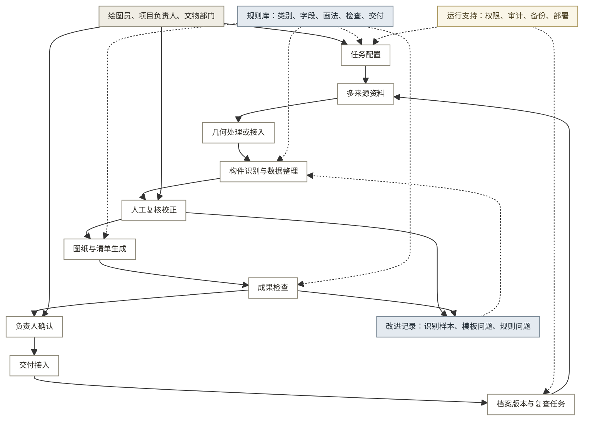

# 12 · 调研结论与未来架构 v0.3

状态：评审中。资料复核日期：2026-07-18。

产品近期应把“照片识别”收敛为“构件数据到可检查图纸”的人工复核流程，再逐步接入更可靠的几何数据和档案版本管理。

## 一 调研结论

跨行业证据支持 6 项产品判断，不能支持“一次识别全部构件并自动交付”的设想。

**表 1：调研结论与产品判断**

| 调研结论 | 主要证据 | 产品判断 | 置信度 |
|----------|----------|----------|:------:|
| 成果要求先于采集方式 | Hover 按测量项引导拍摄；DJI 按建模任务组织采集 | 创建任务时先设成果类型、规范、精度和验收项，再生成采集清单 | 高 |
| 采集需要分级 | 手机、无人机和激光扫描对应不同成本、精度和人员要求 | 保留基础、增强和专业 3 级输入，不把普通照片定义为唯一方案 | 高 |
| 几何与语义是两层数据 | Metashape、Bentley 先产出点云或网格；RoomPlan、Revit 再增加类别和参数 | 点云、网格、图纸底图与构件类别、参数、关系分别保存 | 高 |
| 识别范围要先限定 | RoomPlan 使用固定类别；Revit 依赖构件族；医疗产品按用途确认 | 先覆盖高频构件，保留未知、存疑、资料不足和类别不存在状态 | 高 |
| 复核、成果检查和责任确认不能合并 | ReCap 需要人工分类；EagleView 单独验证测量；Aidoc 保留临床确认 | AI 生成草稿，人员校正数据，系统检查成果，责任人最终确认 | 高 |
| 长期使用依赖对象身份和版本 | Arches 管理遗产记录；Matterport 支持跨扫描记录 | 图纸交付稳定后，沿用同一构件身份扩展版本比较和复查任务 | 中 |

详细证据和适用边界见 11 跨行业调研第三、四节。自动驾驶只作为复杂环境感知的技术参考，不用于证明古建识别或规范出图可行。

## 二 当前能力与主要缺口

第 0 代 demo 已验证基本路径可以运行，但没有证明精度、规范和真实交付成立。

现状依据以下资料：

- [07 · PRD MVP 图纸流程](07_PRD_MVP图纸闭环.md)
- [09 · MVP 工作流验证报告](09_MVP工作流验证报告.md)
- [demo README](demo/README.md)

**表 2：当前能力与下一步缺口**

| 模块 | 当前已有 | 主要缺口 | 近期目标 |
|------|----------|----------|----------|
| 任务与输入 | 项目、建筑单元、图纸类型、负责人；照片和实测尺寸录入 | 规范、精度、验收项、来源和质量状态没有统一配置 | 从成果要求生成采集与检查清单 |
| 几何数据 | 照片可供多模态模型读取 | 无照片组配准、点云、底图和坐标尺度关系 | 先接入已有几何成果，不自研通用重建工具 |
| 构件识别 | 多模态识别、受控词表、识别依据和置信度 | 样本少，类别清单和基准集未定版 | 限定高频类别，明确未知和存疑状态 |
| 构件数据 | 部件表和结构化 JSON；类型、数量、尺寸等基础字段 | 缺层级、连接、组合、来源、身份和版本 | 建立满足出图和检查的最小构件数据模型 |
| 人工校正 | 支持校正、重新校正和负责人审核前的状态控制 | 未完整保存修改前后值、原因、人员和时间 | 所有修改可追溯，异常可转人工处理 |
| 图纸生成 | PoC 可生成 DXF；部分新建单元可生成 SVG 参数图 | 画法模板少，真实 DWG、图层、图签和多构件组合未验证 | 用同一构件数据生成图纸、清单和检查材料 |
| 检查与交付 | 实体计数检查、审核节点、导出页面和交付记录 | 无独立尺寸基准、规范检查、真实交付包和接收方验证 | 分开记录精度、规范、完整性和负责人确认 |
| 档案与运行 | 本机保存版本状态和交付记录 | 无统一编码、跨项目检索、版本比较、权限和备份 | 图纸交付稳定后再建设机构级档案能力 |

## 三 产品定义与边界

本产品面向乙方绘图员和项目负责人，把多来源资料整理为可校正的古建构件数据，并生成经过检查、可交付、可追溯的图纸和清单。

**表 3：产品边界**

| 边界项 | 产品负责 | 当前不做 |
|--------|----------|----------|
| 现场采集 | 定义采集要求，检查资料质量，接入手机、无人机和扫描成果 | 开发采集硬件 |
| 几何处理 | 接入照片、点云、网格和图纸底图，记录坐标、尺度和来源 | 自研通用摄影测量或点云重建引擎 |
| 构件识别 | 覆盖经过样本验证的高频构件，保留异常状态 | 承诺识别全部古建构件 |
| 成果生成 | 用构件数据和画法规则生成图纸、清单和检查材料 | 让生成式模型直接绘制不可追溯的最终图纸 |
| 成果责任 | 机器检查与人工确认并存，保留退回、修改和确认记录 | 由 AI 代替责任人签字或作法定结论 |
| 档案维护 | 图纸稳定后复用对象编码和版本记录 | 当前阶段建设完整区域档案平台 |

档案管理已有 Arches 等通用平台，几何重建也有 Metashape、DJI Terra 和 Bentley 等工具。产品差异应放在古建构件数据、画法规则、检查规则和交付流程上。

## 四 未来产品架构

未来架构以构件数据连接资料、几何、图纸和档案，外部采集工具与识别模型可以替换。

如图 1 所示，业务流程保留 3 次人工判断：构件校正、成果检查和最终确认。

**图 1：未来产品架构**

**表 4：架构模块与输出**

| 模块 | 核心数据 | 主要能力 | 输出 |
|------|----------|----------|------|
| 任务配置 | 成果类型、对象范围、规范、精度、角色、验收项 | 生成采集要求和检查清单 | 项目任务 |
| 多来源资料 | 照片、尺寸、登记表、历史图纸、点云、来源和质量 | 导入、检查、关联和补采提醒 | 可追溯资料集 |
| 几何处理或接入 | 点云、网格、正射、底图、坐标和尺度 | 调用外部工具或导入已有成果 | 可测量几何基准 |
| 构件数据 | 类别、参数、层级、关系、来源、置信度和版本 | 识别、整理、异常表达和人工校正 | 已复核构件数据 |
| 成果生成 | 画法模板、组合规则、图层、图签和清单字段 | 从同一份构件数据生成多种成果 | 图纸、清单、审核材料 |
| 检查与确认 | 尺寸基准、检查项、问题、修改和确认记录 | 精度、规范、完整性检查和责任人确认 | 正式成果版本和检查报告 |
| 交付与档案 | 文件格式、对象编码、交付记录、历史版本和复查周期 | 提交成果、检索版本、比较变化和创建任务 | 交付包、时间线、复查任务 |
| 规则与运行 | 类别、字段、画法、检查规则、权限和备份配置 | 分版本管理规则，记录操作，支持机构部署 | 可维护的产品配置 |

## 五 产品版本演进

产品应从第 0 代验证样机逐步发展，先完成真实交付，再扩展多来源采集和档案维护。

**表 5：产品版本路径**

| 版本 | 目标 | 主要范围 | 进入下一版的条件 |
|------|------|----------|------------------|
| 第 0 代，当前 | 验证照片、识别、校正和出图路径能运行 | 单机 demo、少量样本、DXF 或 SVG 结果 | 能定位问题发生在输入、识别、数据还是出图环节 |
| 第 1 代，交付验证 | 生成一套可由真实用户检查的图纸交付包 | 任务配置、高频类别、异常状态、修改记录、画法模板、规范检查、DWG/PDF/JSON | 真实绘图员能完成校正，负责人能检查并说明退回原因 |
| 第 2 代，多来源与质量 | 降低补采和返工，支持不同项目条件 | 分级采集、点云或底图接入、坐标尺度对应、风险排序、机构权限和审计 | 至少一种增强采集方式在同一成果标准下优于基础方式，且部署要求明确 |
| 第 3 代，档案维护 | 让交付数据在后续巡查和修缮中继续使用 | 对象编码、版本检索、跨期比较、变化清单和复查任务 | 目标机构有固定复查责任、使用频率和预算来源 |

这一路径是产品能力顺序，不是项目管理阶段。第 1 代尚未验证前，不应提前建设区域级档案平台。

每轮验证只改变一个环节，并用同一组样本重跑完整流程。记录输入质量、识别错误、校正时间、出图问题和退回原因，确认改动有效后再调整下一环节。

## 六 分级采集策略

采集方式应按成果精度、现场条件和预算选择，不设唯一入口。

**表 6：三类采集方式**

| 级别 | 输入 | 适用情况 | 必要控制 | 局限 |
|------|------|----------|----------|------|
| 基础采集 | 多角度照片加实测控制尺寸 | 无专业设备、先验证构件和画法流程 | 拍摄覆盖提示、清晰度检查、关键尺寸必填 | 遮挡和尺度关系弱，不能承担高精度细部测量 |
| 增强采集 | 手机 LiDAR 或摄影测量结果加实测控制尺寸 | 常规项目需要更稳定的几何基准 | 设备与时间记录、尺度校验、缺失区域补采 | 设备差异和复杂表面仍会产生误差 |
| 专业采集 | 无人机影像、手持或站式激光点云 | 大体量、复杂空间或高精度项目 | 控制点、坐标、精度报告和专业人员审核 | 成本高，且点云仍需构件分类和制图 |

三类方式必须在同一建筑、同一图纸标准下比较。厂商公布的精度不能代替本项目实测结果。

## 七 架构约束

以下 6 项约束用于防止后续版本把文件、模型输出和责任状态混为一体。

**表 7：架构约束**

| 判断 | 依据 | 实施约束 |
|------|------|----------|
| 构件对象是主要数据，文件是输入或输出 | 同一构件需要关联照片、尺寸、关系、图纸和历次版本 | 所有资料和成果通过构件身份关联 |
| 几何和语义分层保存 | 点云或网格只有形状和坐标，不等于已经识别构件 | 几何、构件和成果分别保存、分别检查 |
| 类别、画法和检查规则分别管理 | 新增构件会同时影响识别字段、画法模板和检查项 | 三类规则各自分版本，不写死在页面或模型提示词中 |
| 采集工具和识别模型可以替换 | 工具会更新，构件数据和交付要求相对稳定 | 通过转换接口进入统一数据结构，并记录工具版本 |
| 校正、检查和确认采用不同状态 | 三者分别改变数据、判断质量和承担责任 | 保留退回、修改、再次检查和最终确认记录 |
| 档案沿用交付对象身份 | 另建档案记录会导致图纸与档案不一致 | 图纸稳定后沿同一编码和版本链扩展 |

## 八 待验证判断

未来架构能否成立，取决于 7 项一手验证，而不是继续增加桌面资料。

**表 8：待验证判断与决策条件**

| 优先级 | 待验证判断 | 验证方式 | 通过信号 | 影响决策 |
|:------:|------------|----------|----------|----------|
| P0 | 高频构件能否形成可维护的类别和画法清单 | 用 3 处不同时期、不同形制样本统计类别、未知项和模板复用 | 新样本主要复用既有高频类别和模板，新增项可单独转人工 | 第 1 代识别和画法范围 |
| P0 | 当前流程是否覆盖真实项目的角色和退回路径 | 观察或复盘 3 个真实项目 | 采集、绘图、审核、交付和返工责任都能落到具体角色和状态 | 工作流和权限设计 |
| P0 | 哪种采集方式满足目标图纸要求 | 同一建筑分别使用 3 类采集方式并对照实测基准 | 至少一种可承受成本的方式满足 06 规范中的目标精度 | 输入范围和设备建议 |
| P0 | 哪些规范条文可以机器检查 | 对 06 规范要点逐条分类，并用含已知错误的图纸测试 | 系统能稳定发现可自动项，人工项有明确检查入口 | 成果检查范围 |
| P1 | 真实交付包以哪些格式和字段为主 | 收集 3 套交付包并访谈绘图员、负责人和验收方 | 接收方对图纸格式、图层、图签、清单和签字要求基本一致 | DWG、PDF、JSON 优先级 |
| P1 | 制图流程和档案维护哪一项形成真实使用与采购意愿 | 分别展示或试用两段流程，记录继续使用意愿、预算来源和采购方式 | 用户愿意继续使用，并能说明预算来源和采购路径 | 版本顺序及产品重心 |
| P1 | 校正数据能否跨项目改进模型和模板 | 核对合同、保密、脱敏和机构部署要求 | 数据权属允许复用，或能在机构内完成改进 | 数据记录和部署方式 |
| P2 | 档案比较是否有固定使用场景 | 查制度并访谈 3 个基层单位 | 有明确复查周期、责任人和后续动作 | 第 3 代是否建设及其顺序 |

更完整的调研缺口见 11 跨行业调研第五节。

## 信息来源

跨行业事实和原始链接见 [11 · 跨行业调研](11_跨行业调研_v0.3.md) 第三至第六节。

本案现状见本文第二节，产品上下文见 [pm-context](.claude/context/pm-context.md)。

置信度：中。产品方向和架构约束已有多行业证据，类别、精度、规范、交付和采购仍需真实项目验证。
