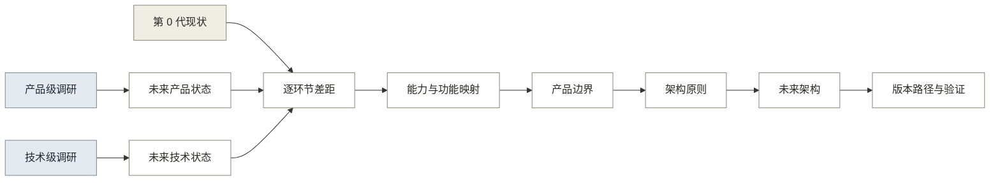
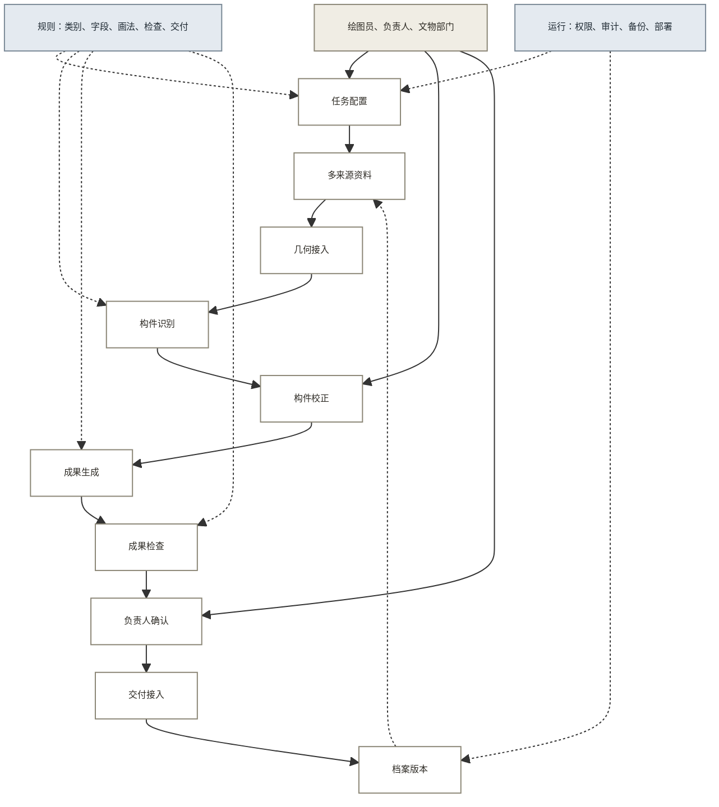

# 12 · 调研结论与未来架构

## 一 从调研到架构的推导关系

未来架构由两类调研和当前产品共同决定。产品级调研说明用户任务、责任和持续使用条件；技术级调研说明输入、处理、输出和失败条件。两类结论在形成产品目标前不合并。

如图 1 所示，推导先比较未来参照与当前状态，再由差距归纳产品能力、划定边界。架构原则决定模块关系，版本路径负责安排建设和验证顺序。

**图 1：从调研与现状到未来架构的推导关系**

推导使用同一套十个业务环节：任务定义、数据获取、几何处理、对象识别、语义结构化、复核校正、成果生成、成果检查、交付接入和档案维护。定义与公司级证据见 [11 · 跨行业调研 v0.4](11_跨行业调研_v0.4.md) 第 2 至 6 节。

## 二 调研给出的未来状态

产品级与技术级结论分别列出，避免用技术能力替代产品成立条件。

### 2.1 未来产品状态

成熟产品先限定任务与交付结果，再安排采集、处理和人工确认。表 1 将跨行业产品做法转为本案的产品要求。

**表 1：产品级调研结论**

| 调研结论 | 代表案例 | 本案要求 | 不能外推的内容 |
|----------|----------|----------|----------------|
| 任务和成果先于采集方式 | Hover、EagleView、纽约 FISP | 创建任务时先选成果类型、规范、精度、角色和验收项 | 通用模型不能替用户选择规范 |
| 自动结果进入既有业务后才产生可衡量价值 | 测量进入报价，报告进入审核，扫描进入设计软件 | 输出必须进入绘图、审核和交付流程 | 生成更多文件不等于价值成立 |
| 草稿、校正、成果检查和责任确认分开 | Aidoc、FISP、ReCap 与 Revit | 四类动作使用不同状态并保留退回记录 | 置信度不能代替责任人确认 |
| 产品范围按场景和类别逐项扩展 | 医疗专科产品、RoomPlan、BIM 构件族 | 先覆盖高频构件和一类图纸，再增加类别与成果 | 固定类别成功不能证明全部古建构件可识别 |
| 平台需要持续任务和明确管理责任 | Arches、Matterport、英国 HER | 只有出现固定复查、版本使用和预算来源时才扩展平台能力 | 一次性交付不会自然产生平台需求 |

### 2.2 未来技术状态

现有工具已经能生成多种几何成果，但开放古建构件识别、历史异形构件出图和成果责任仍需要专业人员。表 2 给出技术状态及其边界。

**表 2：技术级调研结论**

| 调研结论 | 代表案例 | 本案要求 | 技术边界 |
|----------|----------|----------|----------|
| 输入按成果要求分级 | 手机、无人机、摄影测量、移动与站式扫描 | 保留基础、增强和专业三类输入 | 厂商精度不能代替本项目实测 |
| 几何与语义分层保存 | Metashape、Bentley、RoomPlan、Revit | 点云或网格与构件类别、参数和关系分别保存 | 几何可测不等于构件已识别 |
| 多来源资料需要统一坐标、尺度和来源 | Bentley、NavVis、第四次全国文物普查 | 每份资料保存来源、时间、设备、坐标、尺度和质量状态 | 配准误差和历史资料误差仍需人工处理 |
| 识别先限定类别并允许异常状态 | RoomPlan、Hover、HBIM 研究 | 输出未知、存疑、资料不足和模板缺失，不强制归类 | 研究原型不能当作成熟产品 |
| 结构化数据可以生成多种成果 | GNA、Revit、Hover | 同一构件数据生成图纸、清单和检查材料 | 每种成果仍需要独立规则 |
| 成果检查独立于模型评估 | EagleView、医疗报告、电子档案“四性”检测 | 分别检查识别、尺寸、规范、完整性和责任记录 | 单一准确率不能表示图纸合格 |
| 变化结果先形成复查任务 | 遥感图斑核查、HER、Matterport | 跨期比较生成疑问清单，由人员核实后更新版本 | 系统不能直接解释损坏原因或修改档案结论 |

## 三 第 0 代产品现状

第 0 代已经证明照片、识别、人工校正和出图的路径可以运行，但没有证明真实项目精度、规范和交付效率。表 3 使用与调研相同的十个环节描述现状。

**表 3：第 0 代能力现状**

| 环节 | 当前已有 | 证据 | 主要限制 |
|:----:|----------|------|----------|
| 1 任务定义 | 项目、建筑单元、图纸类型和负责人 | demo 主流程 | 规范、精度和验收项未形成统一任务配置 |
| 2 数据获取 | 照片上传、部位标记和实测尺寸录入 | 07 PRD R002；demo | 无覆盖度检查；历史图纸、登记表和点云未接入 |
| 3 几何处理 | 多模态模型读取照片；PoC 用照片比例和控制尺寸出图 | 09 工作流报告 | 无照片组配准、点云、正射或统一坐标尺度 |
| 4 对象识别 | 真实多模态识别、受控词表、依据和置信度 | demo；09 三个样本 | 缺有实测基准的样本；类别清单未形成正式版本 |
| 5 语义结构化 | 部件表与 JSON；类型、数量、尺寸等字段 | PoC JSON；demo | 缺层级、连接、组合、来源、对象身份和版本字段 |
| 6 复核校正 | 修改、重新校正、增量保护和负责人审核 | demo 状态机 | 修改前后值、原因、人员和时间未完整形成可导出记录 |
| 7 成果生成 | PoC 脚本生成 DXF；新建单元生成 SVG 示意图 | 09 报告；demo README | 换形制约四成画法代码需重写；demo 未生成规范 DWG |
| 8 成果检查 | DXF 审计、PNG 目检、负责人审核节点 | 09 报告；demo | 无独立尺寸基准、规范检查清单和正式检查报告 |
| 9 交付接入 | 出图设置、导出页面和交付记录 | demo；07 PRD R006 | 真实 DWG、PDF、图层、图签和接收方流程未验证 |
| 10 档案维护 | 本机保存状态、版本号和交付记录 | demo | 无统一编码、跨项目检索、版本比较、权限和备份 |

09 工作流报告中的“审计 0 错误”只表示 DXF 文件结构可读。它不表示尺寸正确、画法符合规范或接收方已经验收。

## 四 未来状态与当前状态的差距

近期优先级按“是否阻断真实交付”排列。表 4 把每个环节的未来要求与当前限制连接起来。

**表 4：十个环节的差距与处理顺序**

| 环节 | 未来要求 | 当前差距 | 处理动作 | 优先级 |
|:----:|----------|----------|----------|:------:|
| 1 任务定义 | 成果、规范、精度、角色和验收项共同定义任务 | 只有基础项目字段 | 由成果要求生成采集与检查清单 | P0 |
| 2 数据获取 | 多来源资料可追溯并在入库前检查质量 | 主要依赖照片和手测尺寸 | 增加来源、覆盖、模糊、缺失和补采状态 | P0 |
| 3 几何处理 | 有可测量的二维或三维几何基准 | 缺坐标、尺度和配准 | 先接入已有点云、正射或底图，不自研通用重建引擎 | P1 |
| 4 对象识别 | 有限类别可评估，异常可以转人工 | 无正式类别版本和基准集 | 建立高频类别、未知状态和样本基准 | P0 |
| 5 语义结构化 | 构件参数、层级、关系、来源和版本统一 | JSON 字段不足以稳定出图 | 建立最小构件数据模型 | P0 |
| 6 复核校正 | 修改可追溯，异常有明确出口 | 留痕不完整 | 保存原值、新值、原因、人员和时间 | P0 |
| 7 成果生成 | 同一构件数据按规则生成正式成果 | 画法按建筑定制 | 建设高频构件画法与组合规则 | P0 |
| 8 成果检查 | 识别、尺寸、规范、完整性和责任分别检查 | 只有审计与目检 | 把 06 规范拆成机器项和人工项 | P0 |
| 9 交付接入 | 接收方认可格式、字段、命名和版本 | 未完成真实交付 | 形成 DWG、PDF、数据和检查记录的交付包 | P0 |
| 10 档案维护 | 对象身份、历史版本和复查任务持续使用 | 只有本机记录 | 沿用交付对象编码，真实复查需求出现后扩展 | P2 |

P0 不是一次同时开发的清单。第 1 代先把任务、构件数据、画法、检查和交付连成一个可由真实用户完成的流程，再根据同一组样本逐项改进。

## 五 从共同能力到产品功能

表 5 中的 30 项“共同能力”不是十三个候选行业都具备的能力交集。可以把它理解为从全部候选行业发散调研后汇总出的本案能力池，不能理解为所有行业的共有能力。

调研先按研究角色选出重点行业和拓展行业，再分别归纳产品级重复做法、技术级重复做法和公司级领先能力。表 5 只保留能够回应本案十个业务环节和当前差距的内容，并将其转换为产品功能与建设版本。其中既有多行业反复出现的做法，也有某个领先行业补足的单项能力。

**表 5：共同能力、产品功能与建设版本**

| 共同能力 | 能力说明 | 本产品功能 | 版本 |
|:----:|----------------|------------|:----:|
| 01 | 先定义成果，再确定采集内容 | 选择图纸类型、对象范围和精度后生成采集清单 | 第 1 代 |
| 02 | 任务包含规范、角色和验收条件 | 项目配置保存规范、负责人、审核人和验收项 | 第 1 代 |
| 03 | 原始资料使用统一入口 | 照片、尺寸、登记表、历史图纸和点云统一导入 | 第 1 至 2 代 |
| 04 | 采集时即时检查覆盖与质量 | 模糊、重复、角度覆盖和缺失尺寸提醒 | 第 2 代 |
| 05 | 采集方式按任务分级 | 显示三类采集方式的适用成果、成本和限制 | 第 2 代 |
| 06 | 每份资料保留来源和质量状态 | 保存人员、时间、设备、精度、坐标和处理状态 | 第 1 代 |
| 07 | 几何与语义分别保存 | 允许“已有几何、尚无构件类别”的中间状态 | 第 1 代 |
| 08 | 多来源数据统一坐标与尺度 | 建立照片、点云、图纸和控制尺寸的对应关系 | 第 2 代 |
| 09 | 缺失区域可以返回补采 | 从覆盖检查或几何视图创建补采任务 | 第 2 代 |
| 10 | 识别类别分版本管理 | 类别保存适用形制、样本数、阈值和上线状态 | 第 1 代 |
| 11 | 识别允许未知和存疑 | 提供未知、存疑、资料不足、类别不存在状态 | 第 1 代 |
| 12 | 识别结果可追溯 | 保存依据、置信度、资料来源和模型版本 | 第 1 代 |
| 13 | 领域数据模型先于规模自动化 | 定义构件参数、层级、关系、来源和版本 | 第 1 代 |
| 14 | 数据关系从成果需要出发 | 先建立出图需要的定位、连接和组合关系 | 第 1 代 |
| 15 | 一份数据生成多种成果 | 生成图纸、部件清单、统计表和检查材料 | 第 1 代 |
| 16 | 复核顺序由风险决定 | 按置信度、错误影响和构件重要性排序 | 第 2 代 |
| 17 | 人工修改完整留痕 | 保存原值、新值、原因、人员和时间 | 第 1 代 |
| 18 | 标准情况自动处理，例外转人工 | 识别为空、模板缺失和规则冲突都有人工出口 | 第 1 代 |
| 19 | 规则与参数模板决定生成范围 | 建立构件画法、参数范围和组合规则 | 第 1 代 |
| 20 | 模板按构件、形制和规范分版本 | 高频模板先上线，例外对象保留人工绘制 | 第 1 代 |
| 21 | 成果检查独立于识别校正 | 分别检查构件、图层、尺寸和交付完整性 | 第 1 代 |
| 22 | 模型、尺寸和规范使用不同基准 | 分别输出识别评估、尺寸误差和规范检查结果 | 第 1 代 |
| 23 | 机器检查与责任确认并存 | 保留退回、修改、再次检查和最终确认 | 第 1 代 |
| 24 | 使用接收方接受的格式 | 导出 DWG、PDF 和结构化数据并校验字段与命名 | 第 1 代 |
| 25 | 交付包含成果和检查证据 | 按接收方要求组合图纸、清单、检查与版本说明 | 第 1 代 |
| 26 | 对象具有唯一身份和版本时间线 | 统一建筑、单元、构件和成果编码 | 第 1 至 3 代 |
| 27 | 变化结果转成复查任务 | 跨期比较生成疑问清单，由人员确认后更新 | 第 3 代 |
| 28 | 校正问题按原因分类改进 | 分开记录识别样本、画法模板和检查规则问题 | 第 1 代 |
| 29 | 数据敏感度决定部署方式 | 支持权限、审计、备份和机构内处理配置 | 第 2 代 |
| 30 | 各环节使用独立指标 | 记录补采率、修正率、校正时间、检查问题和退回率 | 第 1 代 |

这 30 项能力不是 30 个独立页面。它们归入任务、资料、构件、成果、交付和运行六组模块，模块关系见第七节。

## 六 产品定义与边界

产品面向乙方绘图员和项目负责人，把多来源资料整理为可校正的古建构件数据，并生成经过检查、可交付、可追溯的图纸和清单。文物部门是近期接收方，只有在机构具备持续维护任务时才成为直接使用方。

表 6 明确产品负责的部分，避免把采集硬件、通用三维重建和法定责任混入产品范围。

**表 6：产品边界**

| 边界项 | 产品负责 | 当前不做 |
|--------|----------|----------|
| 现场采集 | 定义采集要求，检查资料质量，接入多类采集结果 | 开发手机、无人机或扫描硬件 |
| 几何处理 | 接入照片、点云、网格、正射和图纸底图，保存坐标与尺度 | 自研通用摄影测量或点云重建引擎 |
| 构件识别 | 覆盖经样本验证的高频构件，保留异常状态 | 承诺识别全部地区和时期的古建构件 |
| 成果生成 | 由构件数据和画法规则生成图纸、清单和检查材料 | 让生成式模型直接绘制不可追溯的最终图纸 |
| 成果责任 | 系统检查与人工确认并存，保留退回和修改记录 | 由 AI 代替负责人签字或作法定结论 |
| 档案维护 | 图纸稳定后复用对象编码、来源和版本记录 | 第 1 代建设区域级档案平台 |

产品差异放在古建构件数据、画法规则、检查规则和交付流程。通用几何重建、BIM 和遗产平台作为外部工具接入。

## 七 未来产品架构

产品边界确定后，先区分长期保留的数据与可以替换的工具，再安排模块和接口。分级采集是输入端的具体方案，不代表整套架构的建设顺序。

### 7.1 架构设计原则与不变项

不同版本可以更换采集设备、重建软件和识别模型，但构件身份、数据关系、检查状态和责任记录不能随工具变化。表 7 列出形成未来架构时采用的六项原则。

**表 7：架构设计原则与不变项**

| 设计判断 | 依据 | 架构约束 |
|----------|------|----------|
| 构件对象是主要数据，文件是输入或输出 | 同一构件需要关联照片、尺寸、关系、图纸和历次版本 | 所有资料和成果通过构件身份关联 |
| 几何与语义分层保存 | 点云或网格只有形状和坐标 | 几何、构件和成果分别保存、分别检查 |
| 类别、画法和检查规则分别管理 | 新增构件会同时影响字段、画法和检查项 | 三类规则各自分版本，不写死在界面或模型提示词中 |
| 外部工具和识别模型可以替换 | 工具更新快，构件数据和交付要求相对稳定 | 通过转换接口进入统一结构，并记录工具版本 |
| 校正、检查和确认使用不同状态 | 三者分别改变数据、判断质量和承担责任 | 保留退回、修改、再次检查和最终确认记录 |
| 档案沿用交付对象身份 | 另建档案记录会造成图纸与档案不一致 | 第 1 代建立编码，第 3 代沿同一版本链扩展 |

### 7.2 总体架构与模块

依据上述原则，未来架构以构件身份连接资料、几何、成果和版本。采集工具、重建软件和识别模型通过接口接入，构件数据与交付规则保持稳定。

如图 2 所示，主流程保留三类人工动作：构件校正、成果检查和负责人确认。

**图 2：未来产品架构**

架构模块及其数据如表 8 所示。每个模块都有明确输出，避免把文件、对象和责任状态混在一起。

**表 8：架构模块与输出**

| 模块 | 核心数据 | 主要能力 | 输出 |
|------|----------|----------|------|
| 任务配置 | 成果、对象、规范、精度、角色和验收项 | 生成采集要求与检查清单 | 项目任务 |
| 多来源资料 | 照片、尺寸、登记表、图纸、点云、来源和质量 | 导入、检查、关联和补采提醒 | 可追溯资料集 |
| 几何接入 | 点云、网格、正射、底图、坐标和尺度 | 调用外部工具或导入已有成果 | 可测量几何基准 |
| 构件数据 | 类别、参数、层级、关系、来源、置信度和版本 | 识别、异常表达和人工校正 | 已复核构件数据 |
| 成果生成 | 画法模板、组合规则、图层、图签和清单字段 | 从同一构件数据生成多种成果 | 图纸、清单和审核材料 |
| 检查与确认 | 尺寸基准、检查项、问题、修改和确认记录 | 精度、规范、完整性检查和责任确认 | 正式成果与检查记录 |
| 交付与档案 | 格式、对象编码、交付记录、历史版本和复查周期 | 提交、检索、比较和创建复查任务 | 交付包、时间线和复查任务 |
| 规则与运行 | 类别、字段、画法、检查、权限和备份配置 | 规则分版本、操作审计和机构部署 | 可维护配置与运行记录 |

### 7.3 输入端方案：分级采集

“多来源资料”和“几何接入”受成果精度、现场条件和预算影响最大，也是当前方案中不确定性较高的部分，因此单独展开。分级针对输入方案，不是产品版本或服务等级。

表 9 给出三类采集方案及其使用条件。照片不是唯一入口，专业扫描也不是所有项目的默认方案。

**表 9：三类采集方案**

| 级别 | 输入 | 适用任务 | 必要控制 | 不适用情况 |
|------|------|----------|----------|------------|
| 基础 | 多角度照片加实测控制尺寸 | 初步记录、规则立面和第 1 代流程验证 | 覆盖提示、清晰度检查、关键尺寸和来源必填 | 遮挡严重、高精度细部或复杂空间关系 |
| 增强 | 手机 LiDAR 或摄影测量成果加控制尺寸 | 常规项目需要更稳定的几何基准 | 设备与时间记录、尺度校验、缺失区域补采 | 设备不兼容、复杂反光表面或精度要求超出能力 |
| 专业 | 无人机影像、移动或站式激光点云 | 大体量、复杂空间或高精度项目 | 控制点、统一坐标、精度报告和专业人员审核 | 预算、现场许可或人员条件不满足 |

第 1 代先用基础方案完成真实交付验证。第 2 代再用同一建筑、同一图纸和同一检查标准比较三类输入，指标包括覆盖、误差、采集时间、处理时间、补采次数和总成本。比较结果用于选择接入方式，不预设增强或专业方案一定更优。

## 八 版本路径与验证

未来架构描述目标状态，不要求一次建成。版本按尚未解决的问题和可取得的证据排列，不按页面数量或开发周期排列。

### 8.1 分版本建设范围

第 1 代保留现有的项目、上传、识别、校正和导出习惯，只补真实交付所需能力；第 2 代重构输入与几何数据；第 3 代只有在持续使用成立后，才把项目交付工具扩展为档案维护产品。表 10 列出各版范围。

**表 10：产品版本路径**

| 版本 | 尚未确定的问题 | 主要能力 | 核心产物 | 完成本版的判断 |
|------|----------------|----------|----------|----------------|
| 第 0 代：路径样机 | 照片识别到出图能否运行 | 照片识别、人工校正、定制脚本或示意图、交付记录 | JSON、PoC DXF、demo SVG 与流程状态 | 已完成三个样本；问题能定位到输入、识别、数据或出图 |
| 第 1 代：交付验证 | 真实用户能否用构件数据完成规范交付 | 任务配置、高频类别、最小构件模型、画法库、修改记录、检查和正式导出 | 一套可检查的 DWG、PDF、数据与检查记录 | 绘图员完成校正；负责人按检查项退回或确认；问题记录能说明责任环节 |
| 第 2 代：多来源与质量 | 哪种采集方式能够降低补采和返工 | 三类采集建议、点云或底图接入、坐标尺度、覆盖检查、权限和审计 | 可追溯资料集、几何基准和质量报告 | 完成同样本对照；若增强或专业方案没有可接受的收益，则保留基础方案 |
| 第 3 代：档案维护 | 交付数据是否会被持续使用 | 对象编码、版本检索、跨期比较、疑问清单和复查任务 | 构件时间线、变化记录和复查结果 | 目标机构有固定复查责任、使用频率、数据权限和预算来源 |

每次改动只针对一个环节，再用同一组样本重跑完整流程。记录输入质量、识别修改、校正时间、图纸问题和交付退回原因；没有改善时撤回该改动或缩小范围。

### 8.2 各版本验证问题与进入条件

公开调研不能替代本案验证。表 11 把需要一手证据的问题放回对应版本。表中的三处样本、三个项目和三套交付资料是首轮验证范围，不是经过统计检验的固定门槛；样本差异较大或结果不稳定时，应继续补充。

**表 11：各版本验证问题与进入条件**

| 版本与验证问题 | 首轮取证方式 | 暂定通过信号 | 对应决策 |
|----------------|--------------|--------------|----------|
| 第 1 代：类别范围 | 统计 3 处不同时期、不同形制样本的类别、未知项和模板复用 | 新样本主要复用高频类别；例外可以转人工 | 确定识别与画法上线范围 |
| 第 1 代：真实流程 | 观察或复盘 3 个项目的采集、绘图、审核、交付和返工 | 每次退回能定位到角色、状态和原因 | 确定任务、权限和状态设计 |
| 第 1 代：规范检查 | 将 06 规范逐条分成机器项和人工项，并用含已知错误的图纸测试 | 机器项能够重复发现已知错误；人工项有明确入口 | 确定检查模块范围 |
| 第 1 代：交付包 | 收集 3 套交付资料，请绘图员、负责人和接收方核对 | 格式、图层、图签、清单和签字要求基本一致 | 确定 DWG、PDF 与数据优先级 |
| 第 2 代：采集方式 | 同一建筑用三类输入对照实测基准 | 至少一种可承受成本的方案满足目标成果要求 | 决定接入方式与设备建议 |
| 第 2 代：数据与部署 | 核对合同、保密、脱敏、复用和机构部署条款 | 校正数据可以合法复用，或可以在机构内完成改进 | 决定反馈数据和部署方式 |
| 第 3 代：持续使用 | 访谈或试用确认复查周期、责任人、使用频率和预算 | 机构会在交付后继续查询、比较并处理任务 | 决定是否建设档案维护模块 |

在用户暂不可触达时，可以先完成规范拆解、公开交付样本检查和同样本对照试验。真实角色、采购意愿、数据权属和签字流程只能通过一手材料确认，不能由网络资料代替。

## 信息来源

跨行业公司、论文、政府文件、标准和综合结论见 [11 · 跨行业调研 v0.4](11_跨行业调研_v0.4.md) 第 4 至 7 节。

第 0 代现状来自 [07 · PRD MVP 图纸流程](07_PRD_MVP图纸闭环.md) 第 3 至 6 节、[09 · MVP 工作流验证报告](09_MVP工作流验证报告.md) 第 9 至 12 节、[demo README](demo/README.md) 和 [pm-context](.claude/context/pm-context.md)。
