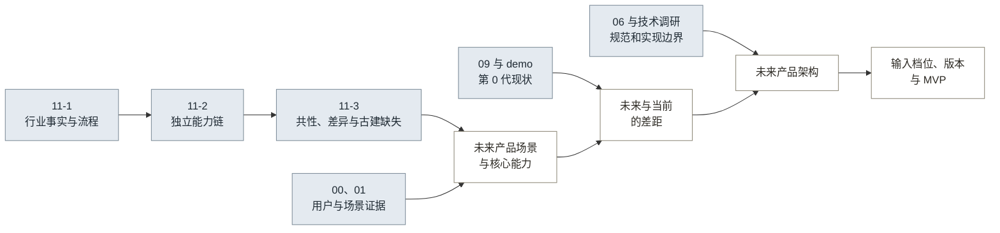
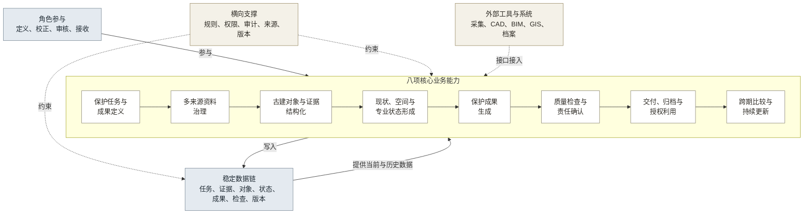
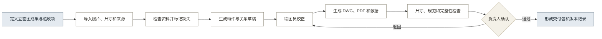

# 12 · 调研结论与未来架构

## 一、方向结论

当前阶段聚焦第 1 代正式成果 MVP 验证，产品化决策需要真实交付证据。

### 1.1 产品定义

产品长期应被定义为：

> 面向古建测绘与文保项目团队，以建筑、构件及其证据为核心，把多来源现场与历史资料转成可校正的保护成果，经专业复核形成可交付、可归档、可持续更新的正式记录。

产品名称暂定为“古建保护成果生产与持续归档工作台”。

近期范围为成果生产、检查和交付。持续档案在交付后的使用需求得到验证后建设。

### 1.2 目标角色

第 1 代暂按操作用户、责任用户、接收方和买单方四类角色设计（见表 1）。真实项目中的角色分工和采购关系仍待验证。

**表 1：近期目标角色与任务**

| 角色 | 近期定位 | 核心任务 |
|---|---|---|
| 乙方绘图员或资料整理人员 | MVP 直接操作用户 | 整理资料、校正对象数据、生成成果 |
| 乙方项目负责人 | MVP 责任用户 | 配置成果要求、审核问题、确认交付 |
| 区县文物部门业务人员 | 近期成果接收方 | 检查成果完整性、查询和后续使用 |
| 区县文物部门或项目总包方 | 潜在买单方 | 购买项目交付能力或产品化服务 |

验证方式：记录真实项目中的操作人员、成果确认人、接收单位、采购决策人、预算来源和合同关系。

## 二、从调研到架构

**图 1：从跨行业调研到未来架构的推导关系**

各类证据承担不同作用：

- 11-1 支持行业流程和结果成立条件。
- 11-2 支持各行业能力链及其抽象层级。
- 11-3 支持跨行业共性、古建缺失能力和长期产品方向。
- 00、01、06、09 和 demo 分别补充用户、规范、技术边界和第 0 代现状。

## 三、未来产品画面

### 3.1 目标业务场景

未来产品围绕正式成果的定义、生产、确认、交付和更新组织完整业务过程。

项目负责人收到一项古建测绘、修缮或建档任务后，先在产品中明确保护对象、需要交付的成果、适用规范、精度要求、审核角色和验收条件。系统据此形成资料要求和检查清单。

项目团队导入照片、尺寸、历史图纸、文字记录和空间资料。系统检查来源、时间、覆盖、质量和缺失项，并将资料关联到建筑、构件、环境和历史事件。

系统形成构件、空间关系和专业状态草稿，明确标记遮挡、资料不足、类别不明和关系存疑的内容。绘图员完成校正后生成图纸、清单和现状记录，项目负责人依据检查结果确认成果。

确认后的成果形成包含正式文件、结构化数据、检查记录、版本说明和元数据的交付包。后续巡查、修缮或补测资料进入同一对象的时间线，变化先形成复查任务，经专业人员确认后更新记录。

### 3.2 用户可感知的完整流程

用户从任务定义开始，最终获得可追溯的交付成果和后续复查任务（见图 2）。

**图 2：未来产品的用户流程**

这条流程描述未来用户获得的结果。具体采集设备、识别模型和重建方法在技术方案中另行确定。

## 四、未来能力图谱

### 4.1 主能力链

未来产品需要八项长期稳定的业务能力，按照成果形成顺序衔接（见图 3）。

**图 3：未来产品主能力链**

### 4.2 能力定义

八项能力的结果边界见表 2。

**表 2：未来产品能力定义**

| 能力 | 要完成的结果 | 能力边界 |
|---|---|---|
| 保护任务与成果定义 | 明确对象、成果、规范、精度、角色和验收条件 | 覆盖成果成立条件；日常进度、财务和资源管理不在本模块范围内 |
| 多来源资料治理 | 让每份资料具有来源、时间、质量、覆盖和使用状态 | 覆盖资料使用条件；采集设备和通用文件存储不在本模块范围内 |
| 古建对象与证据结构化 | 建立建筑、构件、环境、历史和资料之间的身份与关系 | 候选对象经人工校正并关联来源后进入正式数据 |
| 现状、空间关系与专业状态形成 | 形成可核验的尺度、空间关系、保存现状、专业判断和不确定区域 | 几何、语义和专业判断分别记录，外部重建成果通过接口接入 |
| 保护成果生成 | 从同一对象数据形成图纸、清单、记录和检查材料 | 成果保留对象和来源关系，并进入独立检查 |
| 质量检查与责任确认 | 分别检查精度、规范、完整性、真实性和责任记录 | 技术检查、专业检查和责任确认分别记录，专业责任由指定角色承担 |
| 交付、归档与授权利用 | 形成正式成果包、元数据、版本和访问条件 | 近期形成最小交付包，持续档案由后续使用证据决定 |
| 跨期比较与持续更新 | 将新资料与既有对象比较，形成复查问题并更新记录 | 系统形成变化疑问，专业人员确认后更新正式记录 |

### 4.3 支撑能力

以下能力横向支撑主链，其价值通过主流程体现。

- 规则管理：类别、字段、画法、检查和交付要求分别管理并保留版本。
- 权限与审计：不同角色查看、修改、检查和确认的权限不同。
- 来源与版本：每项对象、结果和判断都能追溯到资料、人员、时间和工具版本。
- 外部工具接入：采集、几何处理、CAD、BIM、GIS 和档案系统通过稳定数据结构接入。
- 运行与部署：部署方式根据项目的数据权属、保密和合规要求确定。

## 五、待验证的产品价值

### 5.1 用户价值

用户价值假设集中在减少重复劳动、降低修改遗漏和提高成果可追溯性（见表 3）。

**表 3：用户价值假设与验证指标**

| 当前问题 | 产品改变 | 可验证结果 |
|---|---|---|
| 资料分散，重复整理 | 一次导入后按对象和来源关联 | 整理时间、重复录入次数 |
| 构件判读和绘图脱节 | 校正后的对象数据直接驱动成果 | 从校正到出图的人工时间 |
| 修改分散在多个文件 | 修改在同一对象和版本链上记录 | 修改遗漏、数据不一致问题 |
| 图纸生成与检查混在一起 | 生成、检查和责任确认分开 | 检查发现率、退回原因可定位 |
| 交付后资料失去联系 | 交付包沿用对象、证据和版本关系 | 接收方能否追溯和再次使用 |

### 5.2 组织价值

四类角色的组织价值都需要一手证据（见表 4）。

**表 4：组织价值假设与验证指标**

| 角色 | 所在组织 | 组织价值 | 可验证结果 |
|---|---|---|---|
| 操作用户 | 测绘或文保勘察设计项目组 | 减少重复整理、重画和跨文件同步，使同一人员能够处理更多成果 | 单项成果工时、重复录入次数、人工修改量 |
| 责任用户 | 乙方项目负责人或专业审核人 | 提前发现资料、尺寸、规范和完整性问题，降低交付退回和责任不清 | 审核时间、退回次数、问题定位时间、责任记录完整率 |
| 接收方 | 区县文物部门、委托方或代理验收人 | 获得能够检查来源、版本和问题记录的成果包，降低接收后无法核验和再次利用的风险 | 验收问题数、核验时间、资料可追溯率、后续调用成功率 |
| 买单方 | 乙方企业、项目总包方或文物部门 | 在约定成本内提高项目交付稳定性，并积累可复用的对象、规则和成果资料 | 单项交付成本、一次通过率、规则复用率、续用或采购意愿 |

当前证据覆盖操作路径。责任用户、接收方和买单方价值仍需代理交付或真实项目验证。

## 六、产品边界

产品负责把行业要求和多来源资料转成可审核的专业成果。采集设备、通用工程软件和专业责任人继续承担各自职责（见表 5）。

**表 5：产品责任边界**

| 边界项 | 产品负责 | 边界外事项 |
|---|---|---|
| 任务与标准 | 把成果、规范、精度、角色和验收项转为任务要求 | 替专业人员决定保护等级或法定标准 |
| 现场资料 | 定义资料要求、检查质量、保存来源和缺失状态 | 开发相机、无人机或扫描设备 |
| 几何成果 | 接入或组织已有几何成果，保存尺度、坐标和偏差 | 自研通用摄影测量或点云重建引擎 |
| 古建对象 | 形成有限范围内可校正的构件与关系数据 | 承诺自动识别全部地区、时期和异形构件 |
| 成果生成 | 从结构化对象和规则生成图纸、清单和记录 | 让生成式模型直接签发最终图纸 |
| 质量与责任 | 提供检查、退回、修改和确认记录 | 代替有责任的专业人员确认 |
| 归档与维护 | 形成可追溯交付包，并预留同一对象的版本链 | 在持续需求未验证前建设区域管理平台 |

## 七、当前状态与未来能力的差距

第 0 代目前只提供识别、校正、样本出图和状态流转能够串联的证据。正式交付和产品价值仍需真实交付验证（见表 6）。

**表 6：第 0 代已完成事项与待验证事项**

| 当前能力 | 已完成 | 尚未证明 |
|---|---|---|
| 输入 | 照片上传、部位标记、尺寸录入 | 真实项目覆盖、精度和补采要求 |
| 识别 | 多模态识别、部件表、依据和置信度 | 有实测基准的类别表现和适用范围 |
| 校正 | 人工修改、重新校正和状态流转 | 完整修改原因、责任和跨文件一致性 |
| 出图 | 三样本脚本 DXF、demo 示意 SVG | 可复用画法库、正式 DWG 和真实交付 |
| 检查 | 文件审计、预览目检和负责人审核节点 | 尺寸、规范、完整性和真实性独立检查 |
| 交付 | 导出页面、交付记录和本机版本 | 接收方采用、档案包和外部系统接入 |

“DXF 审计零错误”的证据范围限于文件结构可读取。尺寸正确性、画法合规性和接收方验收仍需独立验证。

## 八、行业证据到产品版本的对应关系

未来能力和版本顺序依据行业证据与古建缺口确定（见表 7）。

**表 7：行业证据、古建缺口、未来能力、架构模块与版本的对应关系**

| 行业证据 | 古建缺口 | 未来能力 | 架构模块 | 最早进入版本 |
|---|---|---|---|---|
| 测绘、建筑设计和医疗均先定义任务、适用范围与结果成立条件 | 成果、规范、精度、角色和验收条件未共同定义 | 保护任务与成果定义 | 保护任务与成果定义 | 第 1 代：一类正式成果模板 |
| 遗产、档案和遥感要求记录来源、时间、质量、覆盖与适用范围 | 照片、尺寸、历史资料和空间成果缺少统一质量与缺失状态 | 多来源资料治理 | 多来源资料治理 | 第 1 代：照片、尺寸和来源；第 3 代扩展多来源 |
| 遗产、BIM、巡检和自动驾驶依靠稳定对象身份关联历次信息 | 建筑、构件、资料、成果和版本关系不足 | 古建对象与证据结构化 | 古建对象与证据结构化 | 第 1 代：最小建筑与构件模型 |
| 测绘、BIM、巡检和遥感分别处理几何、语义、专业判断和不确定性 | 几何基准、空间关系、保存现状和专业状态表达不足 | 现状、空间关系与专业状态形成 | 现状、空间关系与专业状态形成 | 第 1 代：必要实测基准和有限状态；第 3 代扩展空间成果 |
| 建筑出图、工业质检和档案通过规则把对象转成正式结果 | 出图逻辑按样本定制，其他保护成果尚未形成稳定规则 | 保护成果生成 | 保护成果生成 | 第 1 代：一类立面成果；第 2 代扩展成果类型 |
| 医疗、质检、测绘和安防把自动结果、独立检查与责任确认分开 | 文件审计和人工目检覆盖基础检查，尺寸、规范、完整性和责任需要独立证据 | 质量检查与责任确认 | 质量检查与责任确认 | 第 1 代：独立检查和负责人确认 |
| 遗产和档案把正式文件、元数据、检查记录、版本和权限共同交付 | 当前范围为文件导出和本机版本，元数据、检查记录和权限尚未形成完整交付包 | 交付、归档与授权利用 | 交付、归档与授权利用 | 第 1 代：最小交付包；第 4 代形成持续档案 |
| 遥感、巡检和遗产保护先形成变化疑问，再由专业人员确认更新 | 当前缺少同一对象的跨期比较、复查任务和历史时间线 | 跨期比较与持续更新 | 跨期比较与持续更新 | 第 4 代：持续档案 |

该表确定能力进入版本的最早时间，真实项目验证状态另行记录。

## 九、未来产品架构

未来架构直接承接八项核心能力，并遵守五项约束：

1. 正式成果和验收条件决定输入要求。
2. 原始证据、古建对象和正式成果分别保存。
3. 几何、语义和专业状态分别校正和记录。
4. 成果生成、质量检查和责任确认使用不同状态。
5. 对象身份、来源和版本贯穿交付与更新，未知和存疑内容进入人工处理。

### 9.1 总体架构

总体架构以八项核心能力为主链，角色参与业务过程，稳定数据支持全过程，规则和外部工具横向接入（见图 4）。

**图 4：未来产品总体架构**

### 9.2 核心模块

八个核心模块与第 4.1 节的能力链一一对应（见表 8）。

**表 8：未来产品核心模块**

| 模块 | 核心责任 | 主要输出 | 边界外事项 |
|---|---|---|---|
| 保护任务与成果定义 | 定义成果、对象、规范、精度、角色和验收项 | 任务要求、资料清单、检查清单 | 法定标准由专业人员确定 |
| 多来源资料治理 | 导入、检查并关联现场和历史资料 | 可追溯资料集、缺失清单 | 外业采集由项目团队完成 |
| 古建对象与证据结构化 | 管理建筑、构件、环境、历史和资料关系 | 已校正对象及证据关系 | 未知对象进入人工处理 |
| 现状、空间关系与专业状态形成 | 保存几何基准、空间关系、保存现状、专业判断和不确定性 | 可核验现状与专业状态 | 通用重建由外部工具完成 |
| 保护成果生成 | 按规则生成图纸、清单、记录和检查材料 | 成果草稿及来源关系 | 正式成果进入检查和确认流程 |
| 质量检查与责任确认 | 执行检查、退回、修改和确认 | 检查报告、问题和确认记录 | 专业责任由责任用户承担 |
| 交付、归档与授权利用 | 组合交付包，管理元数据、版本和访问条件 | 正式成果包和归档版本 | 区域监管平台留待后续验证 |
| 跨期比较与持续更新 | 对比新旧资料，形成复查问题并更新记录 | 变化清单、复查任务和历史版本 | 变化事实由专业人员确认 |

### 9.3 稳定数据链

稳定数据链与八项核心能力逐步对应，从保护任务延伸到后续复查（见图 5）。

**图 5：未来产品稳定数据链**

外部工具通过接口产生或更新链上的数据。正式记录保留对象身份、来源、检查和版本关系。

## 十、输入档位

输入档位由目标成果和核验责任决定，同一成果始终执行统一质量标准（见表 9）。

**表 9：输入档位与适用成果**

| 输入档位 | 必要输入 | 适用成果 | 成果限制 | 进入阶段 |
|---|---|---|---|---|
| 最低档 | 保护对象身份、任务与验收条件、带来源的现场照片、形成目标成果所需的实测尺寸、操作者和负责人 | 一张可检查的正式立面图、最小构件数据、检查记录、版本说明和交付清单 | 无实测基准时不能形成正式尺寸成果；不支持完整档案和跨期结论 | 第 1 代 |
| 标准档 | 最低档全部内容，加多角度或正射影像、控制尺寸、已有图纸、现场记录、必要历史资料和完整来源元数据 | 多类图纸、构件清单、现状记录和较完整的成果交付包 | 资料未建立统一空间基准时不能形成高精度空间模型 | 第 2 代 |
| 增强档 | 标准档全部内容，加点云或其他空间成果、坐标基准、历次资料、修缮记录、权属权限和外部系统要求 | 多来源现状基准、空间关系成果、跨期比较、持续档案和外部系统交换 | 历次可比资料是形成变化事实的前提；资料缺失时形成补充任务 | 第 3 至第 4 代 |

输入档位执行以下规则：

1. 先定义成果和验收条件，再据此确定最低输入。
2. 必要资料缺失时形成补充清单；无法补充时，输出明确标注用途和限制的辅助草稿。
3. 估算结果需要明确标注，实测事实需要保留测量依据，视觉质量和测量精度分别评价。
4. 档位用于描述资料条件；定价需要根据真实交付成本另行验证。

## 十一、版本路径

版本顺序依据需要获得的证据确定（见表 10）。

**表 10：产品版本路径**

| 阶段 | 核心未知问题 | 建设范围 | 通过信号 | 本阶段不覆盖 |
|---|---|---|---|---|
| 第 0 代：路径样机 | 识别、校正和出图能否串联 | 照片识别、部件表、人工校正、样本出图、状态流转 | 三个样本路径可复现，问题可定位 | 真实交付结论 |
| 第 1 代：正式成果 MVP | 真实项目人员能否完成可检查、可追溯的交付 | 一类任务、一类图纸、有限构件、最小对象数据、独立检查、交付包 | 用户能完成校正和审核，成果进入真实或代理交付检查 | 多图种、三维模型、完整档案平台 |
| 第 2 代：成果生产扩展 | 对象数据能否稳定复用于更多成果和项目 | 扩展构件、画法、图纸、清单、现状记录和规则版本 | 新项目主要复用既有对象和规则，例外可转人工 | 全地区、全时期自动覆盖 |
| 第 3 代：多来源与协作 | 哪种输入和协作方式能降低补采与返工 | 历史资料、空间成果接入，几何基准，权限和审计 | 同对象对照显示质量或成本收益，且机构部署条件成立 | 自研采集硬件和通用重建引擎 |
| 第 4 代：持续档案 | 交付后的数据是否会被持续查询和更新 | 对象时间线、跨期比较、复查任务、授权利用和外部档案接入 | 存在固定责任人、复查频率、数据权限和预算 | 无持续需求时不建设区域平台 |

第 2 代和第 3 代可以根据真实项目证据调整先后。若多来源输入是第 1 代正式交付的前置条件，接入范围限定为必要的一种几何成果。完整多来源平台留待后续版本验证。

## 十二、第 1 代 MVP 定义

### 12.1 核心验证问题

第 1 代 MVP 的核心问题是正式成果能否在真实工作中完成。验证范围包括图纸生成、资料检查、对象校正、质量检查和责任确认：

> 乙方绘图员和项目负责人能否基于一套可追溯的构件数据，完成一张符合约定检查要求的古建立面图，并形成接收方可以核验的交付包。

验证重点是正式成果生产和责任确认能否完成。

### 12.2 MVP 输入、处理和输出

MVP 仅覆盖一类正式成果所需的最小输入、对象、处理和输出（见表 11）。

**表 11：MVP 输入、处理与输出定义**

| 项目 | MVP 定义 |
|---|---|
| 目标用户 | 乙方绘图员、项目负责人 |
| 使用场景 | 已完成基础外业资料的古建立面测绘或现状建档 |
| 输入 | 一组真实项目照片、必要实测尺寸、建筑身份、来源记录和成果要求 |
| 对象范围 | 一类典型建筑或一组高频构件，其他对象允许未知和人工处理 |
| 核心处理 | 资料检查、构件草稿、人工校正、规则出图、独立检查、负责人确认 |
| 输出 | DWG、PDF、结构化构件数据、检查记录、版本说明和交付清单 |
| 责任边界 | AI 形成草稿，绘图员校正，负责人确认 |

### 12.3 MVP 流程

MVP 必须完整经过资料检查、对象校正、成果生成、独立检查和负责人确认（见图 6）。

**图 6：第 1 代 MVP 流程**

### 12.4 纳入范围

第 1 代 MVP 必须包含完成一类正式成果交付所需的最小能力。

- 一类正式成果的任务、规范和验收模板。
- 原始资料的来源、时间、质量和缺失状态。
- 建筑、构件、尺寸、关系、证据和版本的最小数据模型。
- 未知、存疑、资料不足和规则缺失的人工出口。
- 可复用的有限构件画法与组合规则。
- 生成、检查、退回、修改和确认的不同状态。
- DWG、PDF、结构化数据、检查记录和版本说明组成的交付包。

### 12.5 排除范围

第 1 代 MVP 不建设与单类正式成果验证无关的扩展能力。

- 三维模型和写实浏览。
- 平面、剖面和详图等多图种扩展。
- 全地区、全时期、全部古建构件自动识别。
- 完整点云处理、摄影测量或其他通用几何重建。
- 区域档案平台、跨期变化和公众展示。
- 由 AI 自动确认或签发正式成果。

### 12.6 验证指标与方式

真实项目数据缺失时，验证指标先记录基线，再根据实测结果确定准确率或效率门槛（见表 12）。

**表 12：MVP 验证指标**

| 验证层 | 核心指标 | 需要的证据 |
|---|---|---|
| 资料质量 | 补充资料次数、缺失项数量、输入问题占比 | 真实项目资料和补充记录 |
| 对象校正 | 未知项、修改项、校正时间、跨文件不一致问题 | 校正记录和对象版本 |
| 成果生产 | 从资料进入到形成初稿和定稿的时间 | 与原工作方式对照 |
| 成果质量 | 尺寸问题、规范问题、完整性问题和退回原因 | 独立检查清单和问题记录 |
| 交付采用 | 接收方或代理验收人能否理解、核验和采用交付包 | 真实或代理交付评审 |
| 产品价值 | 是否减少重画、返工或重复整理 | 用户复盘和对照工时 |

验证分为代理交付和真实交付。代理交付检查流程完整性、规则问题和结果可追溯性；真实交付检查工作适配、成果采用、组织价值和付费信号。

## 十三、当前假设与待验证问题

以下内容仍是产品假设，需要通过一手验证。跨行业网络资料用于补充背景信息。

1. 真实项目中的操作用户、责任用户、接收方和买单方分别由谁承担。
2. 乙方绘图员和项目负责人是否愿意使用结构化对象数据。
3. 一张正式立面图的输入、审核和交付要求在不同地区、项目和保护等级之间有多大差异。
4. 当前规则出图能否从样本定制转为有限类别内的稳定复用。
5. 接收方对结构化数据、检查记录、版本说明和图纸文件的实际需求。
6. 节省多少整理、绘图和返工时间才能形成实际付费意愿。
7. 数据权属、保密和部署要求是否允许项目数据用于后续改进。
8. 交付完成后是否存在固定复查责任、使用频率和预算，从而支持持续档案产品。
9. 对象关系、画法规则、检查规则和责任记录能否跨项目复用，并形成产品差异。

在真实用户暂不可触达时，可先使用公开交付资料、规范清单和具有实测基准的样本完成代理验证。用户采用、付费、签字和数据权属需要通过一手材料确认。

## 十四、信息来源

本文件的结论依据跨行业研究、当前产品证据和现行图纸规范资料。

- 跨行业事实和行业来源见 [11-1 候选行业事实与流程调研](11-1_候选行业事实与流程调研.md)。
- 13 个行业的独立抽象流程见 [11-2 候选行业抽象流程定义](11-2_候选行业抽象流程定义.md)。
- 跨行业共性、差异和古建缺失能力见 [11-3 跨行业比较与缺失分析](11-3_跨行业比较与缺失分析.md)。
- 当前第 0 代状态见 [09 MVP 工作流验证报告](09_MVP工作流验证报告.md) 和 [demo README](demo/README.md)。
- 图纸规范现状见 [06 图纸成果规范要点](06_图纸成果规范要点.md)。该文件当前主要依据北京市规范征求意见稿，适用范围限于相关地区。真实项目应采用项目所在地规范和合同要求。
- 既有目标用户和场景证据见 [00 目标用户调研与权重打分](00_目标用户调研与权重打分.md) 与 [01 用户与场景分析](01_用户与场景分析.md)。
- 编号 00 至 09 提供用户、规范、技术和第 0 代样本证据；未来能力和产品方向由 11 系列逐步推导。
