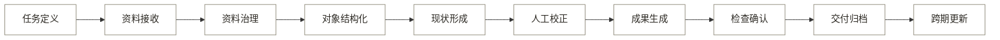

# 13-1 · AI 业务问题审计

## 一、结论

核心问题是任务、证据、对象、成果、检查和责任之间缺少稳定关系。AI 可以减少整理、绘制和机械检查，但不能补造实测与历史事实，也不能承担专业结论和正式签发。

## 二、业务链

审计沿十个业务阶段展开，再归入八个一级模块（见图 1）。

**图 1：问题审计覆盖的业务链**

## 三、问题清单

表 1 列出 41 项问题及其影响、成因和具体依据。“待验证”表示缺少真实项目证据。

**表 1：完整业务链问题清单**

| 编号 | 阶段 | 问题 | 影响 | 成因 | 具体原因 |
|---:|---|---|---|---|---|
| 1 | 任务定义 | 当前项目缺少统一的任务与验收模板 | 质量、成本、效率 | 信息缺失、协作衔接 | 已确认：成果范围、规范、精度和交付项分散在不同文件中，尚无一份经真实项目责任人确认的模板。 |
| 2 | 任务定义 | 当前规则只覆盖一个地区的征求意见稿 | 质量、成本 | 信息缺失、责任机制 | 已确认：现有规则主要来自北京《历史建筑数字化技术规范》征求意见稿；国家要求和其他地方标准的适用对象、成果内容与责任要求尚未纳入。 |
| 3 | 任务定义 | 目标成果与最低输入缺少对应关系 | 质量、成本、效率 | 信息缺失、协作衔接 | 行业要求：成果用途、比例、精度和覆盖范围决定需要怎样的照片、控制点和实测资料；当前尚未形成逐项对应表。 |
| 4 | 任务定义 | 操作、审核、接收和采购角色尚未通过真实项目确认 | 质量、成本、效率 | 信息缺失、责任机制 | 待验证：四类角色来自当前产品假设，没有乙方合同、用户访谈或真实交付记录证明实际分工。 |
| 5 | 资料接收 | 多来源资料缺少统一接收结构 | 质量、成本、效率 | 协作衔接 | 已确认：第 0 代只接收照片和尺寸，尚未建立草图、历史文档、已有图纸和空间成果的统一入口。 |
| 6 | 资料接收 | 真实项目所需的来源与权限信息不完整 | 质量、成本 | 信息缺失、责任机制 | 已确认：公开样本记录了图片来源和许可，但没有真实项目中的拍摄位置、测量责任、数据权属、保密和部署条件。 |
| 7 | 资料接收 | 覆盖不足、遮挡和低分辨率发现过晚 | 质量、成本、效率 | 信息缺失、协作衔接 | 已确认：两个盲测样本已因树木遮挡和细部不清无法确认开间、铺作与屋顶细节；行业规范要求完整覆盖，遮挡处需补测或明确省略。 |
| 8 | 资料接收 | 实测尺寸的记录形式和录入成本未知 | 成本、效率 | 信息缺失、协作衔接 | 待验证：目前只有产品假设，尚未取得乙方实际尺寸草图、表格样本和录入工时。 |
| 9 | 资料治理 | 文件与对象命名规则尚未完全落地 | 质量、成本、效率 | 信息缺失、协作衔接 | 已确认：样本仍使用“临时 002”“临时 003”等项目内编号，缺少正式文保编号，照片、JSON 和图纸的命名方式也不完全相同。 |
| 10 | 资料治理 | 复杂文档无法只靠通用文字识别统一提取 | 质量、成本、效率 | 技术限制、人工判断 | 技术原因：扫描件、表格和图纸同时包含文字、图形、版面与阅读顺序；只识别文字会丢失行列、标注和图文关系。 |
| 11 | 资料治理 | 完整性、适用性和补采需求缺少统一判断标准 | 质量、成本、效率 | 信息缺失、人工判断 | 行业要求：资料是否够用取决于具体成果、比例、精度和用途；没有真实任务书时，系统无法统一判断“够不够用”。 |
| 12 | 资料治理 | 文件版本之间缺少明确引用关系 | 质量、成本、效率 | 协作衔接 | 已确认：当前主要靠文件名和目录区分版本，没有记录哪份原始资料、哪次修改生成了哪版成果。 |
| 13 | 对象结构化 | 构件词表和分类范围尚未统一 | 质量、成本 | 技术限制、人工判断 | 已确认：三个样本包含墙包柱、敞廊、不同铺作和屋顶等差异，当前没有经专业人员确认的统一词表、同义词和适用范围。 |
| 14 | 对象结构化 | 遮挡和细节缺失使对象无法确定 | 质量、成本、效率 | 技术限制、信息缺失 | 已确认：盲测样本中开间数、铺作构成、屋顶类型和部分材质只能给出倾向判断，无法从现有照片确定。 |
| 15 | 对象结构化 | 同一构件缺少跨文件稳定身份 | 质量、成本、效率 | 技术限制、协作衔接 | 已确认：P01 等构件编号在每栋建筑中重新开始，照片、JSON 和图纸之间没有共同的唯一对象编号。 |
| 16 | 对象结构化 | 几何、语义、判断和证据混存在同一记录中 | 质量、成本、效率 | 协作衔接 | 已确认：现有 JSON 把估算尺寸、构件类别、形制判断和照片依据写在同一对象记录中，各类信息没有独立版本，修改后难以判断影响范围。 |
| 17 | 对象结构化 | 模型置信度不能代表当前古建任务的真实风险 | 质量 | 技术限制、信息缺失 | 已确认：现有高、中、低置信度来自模型描述，没有使用带实测和专家标注的古建数据校准；机器学习研究也表明原始置信度通常不等于真实正确概率。 |
| 18 | 现状形成 | 普通照片不能独立提供正式绝对尺寸 | 质量 | 技术限制、信息缺失 | 技术原因：照片只有像素比例；没有控制点、实测尺寸或已知尺度，就不能把像素距离转换为可复测的真实尺寸。 |
| 19 | 现状形成 | 普通照片中的几何关系可能偏离真实状态 | 质量、成本、效率 | 技术限制、信息缺失 | 技术原因：镜头畸变、拍摄倾斜和深度位移都会改变图像尺度；行业测量成果需要正射校正、测量控制和精度检查。 |
| 20 | 现状形成 | 外观不能独立证明年代、病害性质、真实性或保护价值 | 质量 | 信息缺失、人工判断、责任机制 | 行业要求：国家文物局要求这些结论结合历史调查、现场探查和必要检测；照片只能提供可见线索。 |
| 21 | 现状形成 | 上游 AI 错误会进入后续成果 | 质量、成本 | 技术限制 | 已确认：当前同一次 AI 输出同时提供类别、数量、形制和估算尺寸，出图脚本直接读取该 JSON，上游误判不会被自动纠正。 |
| 22 | 人工校正 | 全量逐项核对难以稳定节省人力 | 成本、效率 | 技术限制、人工判断 | 已确认：现有流程要求人工逐部件核对，核对项会随构件数增加；目前没有风险分流，也没有真实工时基线。 |
| 23 | 人工校正 | 审核一致性尚未验证 | 质量、成本 | 人工判断 | 待验证：当前只有 JIAJIA 一次照片判读，没有第二位专业审核人或真实验收结果，不能证明不同人员的判断是否一致。 |
| 24 | 人工校正 | 同一修改需要在多种成果间重复同步 | 质量、成本、效率 | 协作衔接 | 已确认：JSON、DXF、PNG 和说明为独立文件；修改对象数据后仍需重跑脚本并再次核对各项输出。 |
| 25 | 人工校正 | 校正记录不足以支持复用和追责 | 质量、成本、效率 | 协作衔接 | 已确认：现有报告记录了部分错误和处理，但未统一记录每次修改的人、原因、引用证据及受影响成果。 |
| 26 | 人工校正 | 自动结果可能引发过度信任或重复检查 | 质量、成本、效率 | 人工判断、责任机制 | 行业风险：NIST 指出使用者可能过度相信生成结果，也可能因不了解系统而过度排斥；本项目尚未进行真实用户测试。 |
| 27 | 成果生成 | 建筑形制变化会导致出图代码大幅改写 | 成本、效率 | 技术限制 | 已确认：两个新样本各有约四成立面构成代码需要重写，只有框架、图层和图签等部分能够复用。 |
| 28 | 成果生成 | 画法与检查规则尚未形成可复用规则集 | 质量、成本、效率 | 信息缺失、技术限制 | 已确认：当前每栋建筑使用独立脚本，现有规范整理只覆盖一个征求意见稿，也没有完成构件组合和地方规则库。 |
| 29 | 成果生成 | 文件可读取不等于内容正确 | 质量、成本 | 技术限制 | 已确认：两个 DXF 的结构审计均为零错误，但人工目检仍发现标签压线和文字重叠，证明语法检查不能替代内容检查。 |
| 30 | 成果生成 | 图面布局和多种输出的一致性依赖人工 | 质量、成本、效率 | 技术限制、协作衔接 | 已确认：两个样本均因手写标签坐标发生重叠；DXF、PNG、JSON 和说明也需分别生成和复核。 |
| 31 | 检查确认 | 检查集中在出图后，错误发现较晚 | 质量、成本、效率 | 协作衔接 | 已确认：第 0 代流程在 DXF 和预览图生成后才进行完整审计与目检，输入和对象错误会先进入出图。 |
| 32 | 检查确认 | 当前缺少独立的尺寸和专业检查基准 | 质量 | 技术限制、信息缺失 | 已确认：自动检查只验证 DXF 文件结构，照片判读由同一项目人员完成；目前没有实测真值、合格成果或独立专业验收结果。 |
| 33 | 检查确认 | 不同风险的问题采用相同审核方式 | 成本、效率 | 人工判断、责任机制 | 已确认：当前所有构件都逐项人工核对，格式问题、无实测尺寸和专业判断没有采用不同审核路径。 |
| 34 | 检查确认 | AI 不能承担正式成果责任 | 质量、成本 | 责任机制 | 行业要求：文物保护工程文件需由具备资质的单位和责任人员签署、盖章，并由相关单位和人员承担质量责任。 |
| 35 | 交付归档 | 交付包仍需人工组合 | 质量、成本、效率 | 协作衔接 | 已确认：当前交付物是分开的 DXF、PNG 和 JSON，没有自动形成文件清单、检查记录、版本说明和权限说明。 |
| 36 | 交付归档 | 导出成果与原始证据之间的关系不完整 | 质量、成本、效率 | 协作衔接、责任机制 | 已确认：JSON 保留部分照片来源，但 DXF 和 PNG 中的构件没有指向原始照片、校正记录和责任人，接收方需要人工对应。 |
| 37 | 交付归档 | 接收格式、结构化数据需求和部署边界尚未确认 | 质量、成本、效率 | 信息缺失、责任机制 | 待验证：当前没有接收方访谈、真实验收清单、数据权属条款或部署要求。 |
| 38 | 跨期更新 | 不同时间的同一构件缺少稳定身份 | 质量、成本、效率 | 技术限制、协作衔接 | 已确认：构件编号只在单个样本内有效，当前没有跨项目对象编号、时间线或历史版本关系。 |
| 39 | 跨期更新 | 采集差异可能被误判为建筑变化 | 质量、成本 | 技术限制、信息缺失 | 技术原因：设备、视角、光照和季节都会改变图像表现；当前没有同一建筑的受控跨期样本用于区分采集差异与真实变化。 |
| 40 | 跨期更新 | 视觉差异不能直接等同于病害或修缮变化 | 质量 | 人工判断、责任机制 | 行业要求：病害类型、程度和成因需要现场调查、检测和专业评估，图像差异只能形成复查线索。 |
| 41 | 跨期更新 | 持续复查需求尚未成立 | 成本、效率 | 信息缺失、责任机制 | 待验证：目前没有交付后的固定责任人、复查频率、数据权限、使用记录和预算证据。 |

## 四、问题分组

41 项问题归入八个一级模块（见表 2）。

**表 2：八个问题组**

| 问题组 | 编号 | 共同问题 |
|---|---:|---|
| G1 保护任务与成果定义 | 1 至 4 | 成果、输入、规范和责任角色没有共同定义 |
| G2 多来源资料治理 | 5 至 12 | 多来源资料缺少统一接收、检查、命名和版本关系 |
| G3 古建对象与证据结构化 | 13 至 17 | 构件词表、身份、证据和不确定状态没有分开管理 |
| G4 现状、空间关系与专业状态形成 | 18 至 21 | 照片线索、实测尺度、空间关系和专业结论没有清楚分界 |
| G5 保护成果生成 | 27 至 30 | 出图依赖样本脚本，规则、布局和多种输出难以复用 |
| G6 质量检查与责任确认 | 22 至 26、31 至 34 | 人工校正、分阶段检查、独立基准、风险分级和责任记录不足 |
| G7 交付、归档与授权利用 | 35 至 37 | 交付包、来源关系、接收条件和权限边界不完整 |
| G8 跨期比较与持续更新 | 38 至 41 | 跨期对象身份、变化判断和持续复查条件尚未建立 |

问题 22 至 26 属于质量控制和责任判断，因此归入 G6。问题编号按业务顺序排列，G1 至 G8 按能力顺序排列。

## 五、人工职责

人工工作包括专业判断、责任确认和重复劳动，三者应分别处理（见表 3）。

**表 3：八项核心能力中的人工工作性质**

| 核心能力 | 当前人工工作 | 承担作用 | 可减少部分 | 必须保留 |
|---|---|---|---|---|
| 保护任务与成果定义 | 解释任务书、选择规范、确认成果与角色 | 专业判断、责任确认 | 重复抄写要求和整理验收项 | 规范选择、任务批准和责任人确认 |
| 多来源资料治理 | 接收、命名、分类、查缺和登记来源 | 重复劳动、责任确认 | 文件整理、命名检查和缺失提示 | 权限确认及补拍补测决定 |
| 古建对象与证据结构化 | 识别构件、统一术语、关联照片与记录 | 专业判断、重复劳动 | 候选标注和跨文件重复录入 | 存疑类别、术语和对象身份确认 |
| 现状、空间关系与专业状态形成 | 实测、校正比例、判断空间、构造和保存状态 | 专业判断 | 特征匹配、比例计算和机械检查 | 现场实测、不可见部分和专业结论 |
| 保护成果生成 | 绘图、标注、排版并同步多种成果 | 重复劳动、专业判断 | 规则明确的绘制、布局和同步修改 | 特殊形制与正式画法确认 |
| 质量检查与责任确认 | 校正存疑内容，检查精度、规范和完整性并签发 | 专业判断、责任确认、重复劳动 | 低风险检查、问题定位和记录整理 | 未知、冲突、高风险事项及正式签发 |
| 交付、归档与授权利用 | 组合文件、登记版本、追溯来源和管理访问条件 | 重复劳动、责任确认 | 交付包组合、版本关联和完整性检查 | 接收确认、权限与部署决定 |
| 跨期比较与持续更新 | 比较新旧资料、判断变化并更新正式记录 | 专业判断、责任确认 | 差异定位和复查任务整理 | 变化定性、复查责任和正式更新 |

主要核对来源：[国家文物局《文物保护工程设计文件编制深度要求》](https://public.zhengzhou.gov.cn/D0107Y/189122.jhtml)、[北京市《历史建筑数字化技术规范》征求意见通知](https://scjgj.beijing.gov.cn/hdjl/myzj/bzzxdyjzj/202412/t20241223_3971872.html)、[Historic England 遗产测量规范](https://historicengland.org.uk/images-books/publications/geospatial-survey-specifications-cultural-heritage/)、[ICOMOS 遗产记录原则](https://publ.icomos.org/publicomos/jlbSai?base=technica&file=2819.pdf&html=Bur&path=International_Chartes_for_Conservation_and_Restoration_chap12.pdf)、[国家档案局《电子档案管理办法》](https://www.saac.gov.cn/daj/xzfgk/202412/41b270e9dfc44f48a09adcc5f4fe8296.shtml)、[NIST 生成式 AI 风险框架](https://nvlpubs.nist.gov/nistpubs/ai/NIST.AI.600-1.pdf)、[神经网络置信度校准研究](https://proceedings.mlr.press/v70/guo17a.html)、[W3C PROV-O](https://www.w3.org/TR/prov-o/)、[IBM Docling](https://research.ibm.com/publications/docling-an-efficient-open-source-toolkit-for-ai-driven-document-conversion)，以及[09 MVP 工作流验证](09_MVP工作流验证报告.md)、[01 用户与场景分析](01_用户与场景分析.md)和[当前产品决策](.claude/context/pm-context.md)。
