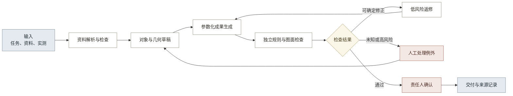

# 13-2 · AI 能力与流程变化

## 一、结论

AI 可以辅助资料解析、构件识别、几何草拟、成果生成、问题分流和跨期比较，但不能直接把照片变成正式成果。近期应结合 AI、参数化程序、确定性检查和人工确认。

## 二、能力与依据

可迁移能力及其依据见表 1。

**表 1：可迁移 AI 能力及边界**

| 能力 | 初步判断 | 外部验证 | 可用于古建 | 主要限制 |
|---|---|---|---|---|
| 文档解析与视觉检索 | 读取扫描件、表格、图纸和照片，并返回原始位置 | [Docling](https://research.ibm.com/publications/docling-an-efficient-open-source-toolkit-for-ai-driven-document-conversion)、[MinerU](https://github.com/opendatalab/MinerU)支持复杂文档解析；[ColPali](https://arxiv.org/abs/2407.01449)支持按页面视觉内容检索 | 资料目录、字段草稿、页码与图像区域定位 | 复杂图纸、手写内容和专业术语仍需样本验证 |
| 开放概念分割 | 用文本或图像提示定位未预设类别 | [SAM 3](https://ai.meta.com/research/publications/sam-3-segment-anything-with-concepts/)支持开放词汇概念分割；[DINOv3](https://ai.meta.com/research/publications/dinov3/)提供通用视觉特征 | 构件候选、区域标注、数量草稿 | 外观相似、遮挡和地区分类会造成误判 |
| 多视图几何 | 从多张照片形成相机、深度、点云和三维草稿 | [VGGT](https://github.com/facebookresearch/vggt)可联合预测多种三维属性；[VGGT-Omega](https://vggt-omega.github.io/)扩展到更大规模场景 | 配准、可见范围、比例和几何草稿 | 不能替代实测，也不能恢复不可见事实 |
| 结构化生成 | 按固定字段输出对象和状态 | [Structured Outputs](https://openai.com/index/introducing-structured-outputs-in-the-api/)可约束模型输出结构 | 构件、证据、状态和问题草稿 | 结构正确不代表事实正确 |
| 参数化 CAD | 由对象参数和约束生成可编辑图形 | [CAD 约束生成研究](https://arxiv.org/abs/2504.13178)表明模型可辅助生成几何约束 | 规则明确的立面、标注和图层 | 画法规则与尺寸依据必须先确定 |
| 确定性规则检查 | 把明确要求写成机器可执行规则 | [buildingSMART IDS](https://www.buildingsmart.org/standards/bsi-standards/information-delivery-specification-ids/)展示了可机读信息要求与自动检查方法 | 字段、命名、尺寸关系、图层和交付完整性 | 不能判断真实性、价值和法律责任 |
| 协作调度与评测 | 让专用模型和工具分工，并持续记录错误 | [Anthropic agents](https://resources.anthropic.com/building-effective-ai-agents)与[评测方法](https://www.anthropic.com/engineering/demystifying-evals-for-ai-agents)强调任务分解、工具调用和可重复评测 | 资料解析、生成、检查、返修的任务编排 | 流程越长，错误累积和维护成本越高 |
| 风险校准 | 把低把握结果转成人工问题 | [Conformal prediction](https://arxiv.org/abs/2505.24693)提供覆盖风险的方法；[NIST AI RMF](https://www.nist.gov/itl/ai-risk-management-framework)强调风险治理和人工监督 | 未知项、冲突项和高风险项分流 | 必须用古建样本校准，不能直接采用通用置信度 |
| 跨期比较 | 对多时相、多模态资料提取变化候选 | [TerraMind](https://www.esa.int/Applications/Observing_the_Earth/ESA_and_IBM_collaborate_on_TerraMind)展示了多模态地球观测基础模型 | 新旧照片、图纸和空间资料差异提示 | 采集差异不等于真实变化，专业结论仍需人工 |
| 来源与版本追踪 | 记录资料、处理过程、人工修改和成果关系 | [W3C PROV-O](https://www.w3.org/TR/prov-o/)提供通用来源关系模型 | 证据链、版本和责任记录 | 需要统一对象身份、权限与记录规则 |

## 三、对流程的影响

八个问题组的处理方式见表 2。

**表 2：问题、能力与流程变化的对应关系**

| 问题组 | AI 与程序能力 | 处理结果 | 流程变化 | 人工责任 |
|---|---|---|---|---|
| G1 保护任务与成果定义：1 至 4 | 文档解析、规则提取、结构化输出 | 任务、输入、验收和角色草稿 | 规则确认前移 | 选择规范并确认责任人 |
| G2 多来源资料治理：5 至 12 | 文档解析、视觉检索、来源追踪、质量检查 | 资料目录和缺失清单 | 合并导入、整理、登记和查缺 | 核对字段与权限，决定补采 |
| G3 古建对象与证据结构化：13 至 17 | 开放概念分割、结构化输出、统一身份、风险校准 | 带来源和状态的对象草稿 | 对象数据替代跨文件重复录入 | 确认术语、类别、身份和未知项 |
| G4 现状、空间关系与专业状态形成：18 至 21 | 多视图几何、尺度约束、几何检查 | 分开记录线索、实测、空间关系和专业状态 | 无依据尺寸和结论不能进入成果 | 完成实测并确认专业结论 |
| G5 保护成果生成：27 至 30 | 结构化生成、参数化 CAD、自动布局 | 同一对象版本生成正式成果 | 删除重复绘图和多文件修改 | 确认画法、尺寸和特殊构件 |
| G6 质量检查与责任确认：22 至 26、31 至 34 | 风险分流、问题队列、校正记录、分阶段检查 | 例外处理和独立检查记录 | 检查前移，按风险分流 | 处理例外、复核并签发 |
| G7 交付、归档与授权利用：35 至 37 | 来源追踪、版本关系、完整性检查 | 可追溯交付包 | 合并组包、版本说明和接收检查 | 确认接收、授权和部署条件 |
| G8 跨期比较与持续更新：38 至 41 | 跨期身份、资料比较、变化候选 | 复查问题、时间线和更新记录 | 交付后增加复查与更新 | 确认变化、责任和更新条件 |

八个问题组直接对应八个一级模块。

## 四、处理判断

问题是否能够解决，取决于产品能否消除成因，而不是是否能生成一个自动结果（见表 3）。

**表 3：问题处理分类**

| 判断 | 问题编号 | 判断依据 | 产品含义 |
|---|---|---|---|
| 可彻底解决 | 9、12、15、16、21、24、25、27、30、31、33、35、36、38 | 在限定成果和数据范围内，可通过统一身份、来源关系、参数规则和分阶段检查消除流程性成因 | 删除重复录入、重复修改、晚检查和人工组包 |
| 可局部优化 | 1 至 3、5 至 7、10、11、13、17、19、22、23、26、28、29、39 | AI 可减少整理、初判和检查工作，但内容仍受项目条件、样本、地区规则或人员差异影响 | 保留人工确认，减少机械工作和低风险全量检查 |
| 暂时必须保留 | 4、8、14、18、20、32、34、37、40、41 | 缺少真实项目、实测、不可见事实、独立基准、接收要求或法定责任，AI 不能补造 | 在真实证据出现前设为阻断项或人工责任点 |

## 五、处理循环

AI 与程序可连接输入、处理、校验、返修和交付。只有确定性、低风险问题可以自动返修（见图 1）。

**图 1：多能力处理循环**

近期由人工推动返修。取得真实错误样本和风险阈值后，系统才自动返修低风险问题。

## 六、AI 边界

AI 不能补造缺失的实测、遮挡信息和历史证据，不能自行确定适用规范、保护价值和病害结论，也不能承担数据授权、正式审核和签发责任。此类事项必须保留明确的人工角色；持续档案能力还必须先证明复查责任、使用频率、权限和预算真实存在。
