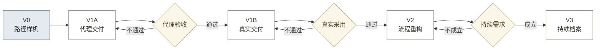
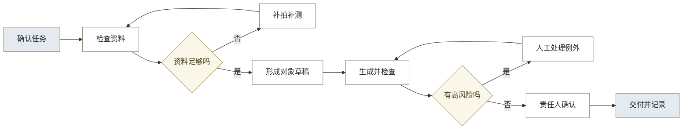

# 13-3 · AI 产品架构与路线图

## 一、产品判断

近期只验证一类正式立面成果的采用、单位成本和付费可能，不建设完整数字档案平台。价值前提与立项条件见 12 第一部分。

AI 负责整理、草拟、生成、机械检查和问题定位。项目人员负责实测、规范选择、专业判断和签发。V2、V3 必须等待前一版本的真实证据。

三层产品方案分别对应近期、中期和长期，版本不是按功能数量拆分（见表 1）。

**表 1：三层产品方案与时间路线**

| 层级 | 时间 | 目标 | 流程变化 | 主要交付 | 对应版本 |
|---|---|---|---|---|:---:|
| 流程优化 | 近期 | 证明成果采用、成本改善和付费可能 | 保留主流程，合并资料整理，检查前移，人工集中处理例外 | 可核验、可采用的正式立面成果包 | V1A、V1B |
| 流程重构 | 中期 | 降低单位成本并提高跨项目复用 | 删除重复录入与组包，合并生成和检查，按风险安排人工审核 | 可跨项目复用的成果生产流程 | V2 |
| 成果升级 | 长期 | 形成持续服务和可复用数据资产 | 增加跨期身份、变化复查、授权查询和系统交换 | 可追溯、可更新的古建数字档案 | V3 |

## 二、一级模块

八个问题组对应八个一级模块（见表 2）。

**表 2：一级模块近期范围**

| 问题组 | 一级模块 | 近期范围 | 人工边界 |
|---|---|---|---|
| G1：1 至 4 | 保护任务与成果定义 | 任务、输入、规则、验收和角色模板 | 选择规范并确认责任人 |
| G2：5 至 12 | 多来源资料治理 | 照片、尺寸、来源、权限和缺失检查 | 确认权限并决定补采 |
| G3：13 至 17 | 古建对象与证据结构化 | 建筑与构件身份、证据、状态和未知项 | 确认术语、类别和身份 |
| G4：18 至 21 | 现状、空间关系与专业状态形成 | 实测基准、空间关系、专业状态和不确定区域 | 完成实测和专业判断 |
| G5：27 至 30 | 保护成果生成 | 一类立面图的画法、布局和导出 | 确认画法、尺寸和特殊构件 |
| G6：22 至 26、31 至 34 | 质量检查与责任确认 | 问题队列、校正记录、分阶段检查和签发状态 | 处理例外、复核并签发 |
| G7：35 至 37 | 交付、归档与授权利用 | 成果、证据、检查、版本和权限组成的交付包 | 确认接收、权限和部署条件 |
| G8：38 至 41 | 跨期比较与持续更新 | 仅预留跨期身份和版本字段 | 确认变化、复查责任和预算 |

## 三、迭代架构

产品按五个阶段增加能力，每个阶段都有进入条件（见图 1）。

**图 1：产品迭代架构**

只有通过当前阶段，才增加下一阶段能力（见表 3）。

**表 3：各版本的架构增量与进入条件**

| 版本 | 优先级 | 处理问题 | 架构增量 | 主要交付 | 进入下一版的条件 |
|---|:---:|---|---|---|---|
| V0 路径样机 | 已完成 | 证明照片、识别、校正和样本出图能够串联 | 照片输入、AI JSON、人工核对、单栋脚本、DXF 与 PNG | 三个样本及验证报告 | 不直接进入 V2，先补齐正式交付能力 |
| V1A 代理交付 | P0 | 1 至 37，先处理一类成果的完整交付 | 新增任务控制、资料检查、对象证据、尺度状态、例外处理、参数化出图、独立检查和交付包 | 一套可由代理验收人核对的正式立面成果包 | 来源、尺寸依据、问题、检查、责任和版本均可核对 |
| V1B 真实交付 | P0 | 重点验证 4、8、23、26、32、37，并复核 1 至 37 | 接入真实人员、资料、软件、权限和工作记录；不扩展成果类型 | 被真实项目采用的立面成果及人工基线 | 质量不下降，净成本可测，并出现续用或付费信号 |
| V2 流程重构 | P1 | 深化 5、10、12、15、16、21、22、24、25、27 至 33、35、36 | 新增多来源解析、多视图几何、跨项目对象、生成与检查调度、低风险返修和多成果输出 | 可复用于多个项目的成果生产流程 | 复用和自动检查节省的成本高于规则维护与校正成本 |
| V3 持续档案 | P2 | 38 至 41，并扩展 6、12、36、37 | 新增跨期身份、变化候选、复查任务、授权查询和外部档案接口 | 可追溯、可复查、可交换的持续记录 | 已有固定责任人、复查频率、数据权限和预算 |

## 四、V2 目标流程

V2 在 V1B 证明真实采用后，把资料、对象、生成、检查和低风险返修连接为连续流程（见图 2）。

**图 2：V2 重构后的业务流程**

外业实测、规范确认、专业结论和正式签发在所有版本中保留。V2 删除重复录入和低风险全量检查，但不删除专业责任。

## 五、验证与投入

V1 先记录人工基线，再判断质量、成本和效率是否改善（见表 4）。

**表 4：V1 验证指标**

| 目标 | 核心指标 | 数据来源 | 通过判断 |
|---|---|---|---|
| 质量 | 关键错误、退回原因、成果采用 | 独立检查、接收记录 | 不低于原流程，无证据结果减少 |
| 成本 | 总人时、返工人时、模型和支持成本 | 分阶段计时、费用记录 | 单项成果净成本下降 |
| 效率 | 总周期、首稿时间、补充次数、返修轮次 | 状态与版本记录 | 同类成果交付时间缩短 |
| 责任 | 检查、退回、确认和签发记录 | 审计记录 | 正式成果可追到责任人和依据 |
| 采用 | 绘图员、负责人和接收方实际使用 | 使用记录、访谈 | 成果进入真实工作，用户无需脱离系统重新制作 |

V1 的开发投入为低置信度估算，用户价值、付费和回收周期仍缺少真实数据（见表 5）。

**表 5：V1 商业估算**

| 判断项 | 当前估算 | 依据 | 证据状态 |
|---|---|---|---|
| 开发投入 | 8.0 至 11.5 个角色月；按每角色月 3 万至 5 万元计算约 24 万至 57.5 万元 | 一类立面成果、复用现有模型和工具，不含销售、外业、长期支持及私有部署 | 低置信度，需由真实团队报价替换 |
| 用户价值 | 节省的整理、绘图、审核和返工人时，加上减少退回造成的损失 | V1B 的人工基线与实际使用记录 | 尚无真实人时和退回成本，不能给出金额 |
| 付费可能 | 现有 MRD 仅提出乙方按项目、席位或使用量采购的假设 | 试用后的主动询价、继续使用、采购或介绍意向 | 尚无用户访谈、报价接受或付款证据，不能把假设当定价 |
| 回收周期 | 研发投入除以月贡献金额；月贡献金额为收入减去模型、实施、交付和支持成本 | 真实成交价、付费客户数、月交付量和直接成本 | 当前不能形成可信年限，V1B 后计算 |

## 六、当前行动

近期只获取真实输入、建立人工基线并验证交付。

1. 获取一套包含实测基准、任务书、适用规范和交付要求的真实或可代理资料。
2. 记录原流程在资料整理、绘图、审核和返工上的分阶段人时。
3. 按[13-4 模块优先级](13-4_产品模块总图与迭代优先级.md)完成 V1A，并进行代理验收。
4. 使用真实项目执行 V1B，再依据质量、成本、效率、责任、采用和付费证据决定是否进入 V2。
