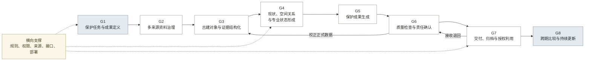

# 13-4 · 产品模块与优先级

## 一、结论

八项能力直接对应八个一级模块，共含 51 个子功能。P0 只建设验证正式成果采用、单位成本和付费可能所需的能力；G8 等持续复查责任、权限、频率和预算成立后再建设。

## 二、八个一级模块

八个模块的结果和范围见表 1。

**表 1：一级模块**

| 编号 | 一级模块 | 结果 | 问题 | 近期范围 | 后续范围 |
|:---:|---|---|---|---|---|
| G1 | 保护任务与成果定义 | 明确对象、成果、规范、精度、角色和验收条件 | 1 至 4 | 一类正式立面成果模板 | 规则版本与多项目配置 |
| G2 | 多来源资料治理 | 每份资料具有来源、时间、质量、覆盖和使用状态 | 5 至 12 | 照片、尺寸及缺失检查 | 文档、图纸和空间资料接入 |
| G3 | 古建对象与证据结构化 | 建立建筑、构件、环境、历史和资料的身份与关系 | 13 至 17 | 最小对象、证据和未知状态 | 跨项目词表与对象复用 |
| G4 | 现状、空间关系与专业状态形成 | 形成可核验尺度、空间关系、保存现状和不确定区域 | 18 至 21 | 实测基准与有限关系 | 多视图几何和外部重建接入 |
| G5 | 保护成果生成 | 从同一对象数据形成图纸、清单、记录和检查材料 | 27 至 30 | 一类正式立面成果 | 多类成果和多格式输出 |
| G6 | 质量检查与责任确认 | 分别检查精度、规范、完整性、真实性和责任记录 | 22 至 26、31 至 34 | 例外校正、分阶段检查和签发 | 风险校准与低风险自动返修 |
| G7 | 交付、归档与授权利用 | 形成正式成果包、元数据、版本和访问条件 | 35 至 37 | 最小正式交付包 | 授权复用和外部系统交换 |
| G8 | 跨期比较与持续更新 | 比较新旧资料，形成复查问题并更新正式记录 | 38 至 41 | 预留身份和版本字段 | 跨期比较、复查和持续更新 |

## 三、子功能清单

状态分为“样机”“局部”“未建”和“待验证”。样机只表示路径已运行，不表示成果合格。

### 3.1 G1 保护任务与成果定义

G1 定义成果成立条件（见表 2）。

**表 2：保护任务与成果定义子功能**

| 编号 | 功能 | 状态 | 问题 | 前置 |
|---|---|---|---|---|
| M1-01 | 任务与成果模板：记录对象、用途和成果范围 | 未建 | 1、3 | 无 |
| M1-02 | 规范与精度配置：选择地区、规范版本、比例和精度 | 局部：一个地区的征求意见稿 | 1 至 3 | M1-01 |
| M1-03 | 成果与最低输入矩阵：说明所需资料和实测条件 | 未建 | 3 | M1-01、M1-02 |
| M1-04 | 角色、责任与验收配置：定义操作、审核、接收和签发责任 | 待验证 | 1、4 | M1-01 |

### 3.2 G2 多来源资料治理

G2 形成可判断是否够用的资料集（见表 3）。

**表 3：多来源资料治理子功能**

| 编号 | 功能 | 状态 | 问题 | 前置 |
|---|---|---|---|---|
| M2-01 | 多来源导入：接收照片、尺寸、草图、文档、图纸和空间资料 | 局部：照片和尺寸 | 5、10 | M1-03 |
| M2-02 | 来源与时间登记：记录取得方式、人员、位置和时间 | 局部：公开样本来源 | 6 | M2-01 |
| M2-03 | 权属与使用状态：记录授权、保密、范围和限制 | 待验证 | 6 | M1-04、M2-02 |
| M2-04 | 覆盖与质量检查：识别缺面、遮挡、模糊和重复 | 局部：人工检查 | 7 | M1-03、M2-01 |
| M2-05 | 缺失与补采任务：形成补拍、补测、补文件或降级清单 | 未建 | 7、8、11 | M2-04 |
| M2-06 | 文件命名与版本关系：记录资料、修改和成果引用 | 局部：目录和文件名 | 9、12 | M2-01 |

### 3.3 G3 古建对象与证据结构化

G3 形成具有身份、关系、证据和状态的对象（见表 4）。

**表 4：古建对象与证据结构化子功能**

| 编号 | 功能 | 状态 | 问题 | 前置 |
|---|---|---|---|---|
| M3-01 | 构件词表与分类：管理术语、同义词、地区和范围 | 局部：未经专业确认 | 13 | M1-02 |
| M3-02 | 候选对象识别：定位构件并形成类别和数量草稿 | 样机：缺少标注基准 | 13、14、17 | M2-01、M3-01 |
| M3-03 | 统一对象身份：为建筑、构件、环境、历史和资料编号 | 局部：样本内部编号 | 15 | M2-06、M3-01 |
| M3-04 | 对象关系：记录组成、位置、相邻、从属和历史关联 | 局部：关系不完整 | 15、16 | M3-03 |
| M3-05 | 证据与状态：分开记录事实、推断、判断、来源和未知项 | 局部：JSON 混合记录 | 14、16、17 | M2-02、M3-03 |
| M3-06 | 正式数据准入：校正并关联证据后进入正式数据 | 未建 | 14、17 | M3-02 至 M3-05、M6-04 |

### 3.4 G4 现状、空间关系与专业状态形成

G4 分开记录测量、几何、专业判断和未知区域（见表 5）。

**表 5：现状、空间关系与专业状态形成子功能**

| 编号 | 功能 | 状态 | 问题 | 前置 |
|---|---|---|---|---|
| M4-01 | 实测与尺度基准：记录控制点、实测值、精度和责任 | 局部：缺真实基准 | 18、19 | M1-03、M3-03 |
| M4-02 | 图像校正与可见范围：记录视角、畸变、遮挡和边界 | 未建 | 18、19 | M2-04、M4-01 |
| M4-03 | 多视图几何草稿：形成配准、深度、比例和几何候选 | 未建 | 18、19、21 | M4-01、M4-02 |
| M4-04 | 空间与构造关系：记录位置、层级、连接和组合 | 局部：依赖样本脚本 | 19、21 | M3-04、M4-01 |
| M4-05 | 保存现状与专业状态：记录可见现状、结论和依据 | 局部：照片判读 | 20 | M3-05、M4-04 |
| M4-06 | 不确定区域与复核要求：标记不可见、无依据和待检测内容 | 局部：文字说明 | 18 至 20 | M3-05、M4-02、M4-05 |

### 3.5 G5 保护成果生成

G5 从同一版对象数据生成正式成果（见表 6）。

**表 6：保护成果生成子功能**

| 编号 | 功能 | 状态 | 问题 | 前置 |
|---|---|---|---|---|
| M5-01 | 构件画法与组合规则：把有限形制转为参数规则 | 局部：单栋脚本 | 27、28 | M1-02、M3-01、M4-04 |
| M5-02 | 正式图纸生成：依据对象、实测和规则生成立面图 | 样机：未正式验收 | 27、28 | M3-06、M4-01、M5-01 |
| M5-03 | 标注与布局：生成尺寸、文字、图签和版面 | 样机：存在重叠 | 29、30 | M1-02、M5-02 |
| M5-04 | 清单、记录与检查材料：生成配套材料 | 局部：仍需分别整理 | 24、30 | M3-05、M5-02 |
| M5-05 | 多格式同步与导出：生成 DWG、PDF 和结构化数据 | 局部：仍需分别复核 | 24、30 | M5-02 至 M5-04 |

### 3.6 G6 质量检查与责任确认

G6 负责例外校正、独立检查和责任确认（见表 7）。

**表 7：质量检查与责任确认子功能**

| 编号 | 功能 | 状态 | 问题 | 前置 |
|---|---|---|---|---|
| M6-01 | 输入与数据预检：检查资料、字段、身份和状态 | 局部：检查较晚 | 21、31 | M1-03、M2-04、M3-05 |
| M6-02 | 未知与冲突识别：发现证据不足和上下游不一致 | 局部：人工报告 | 21、31 | M3-05、M4-06、M6-01 |
| M6-03 | 风险分级与例外队列：按后果决定处理路径 | 未建 | 22、26、33 | M6-01、M6-02 |
| M6-04 | 人工校正与依据记录：保存人员、原因、证据和影响 | 局部：记录不统一 | 22 至 25 | M3-03、M3-05、M6-03 |
| M6-05 | 几何与尺寸检查：核对尺度、比例和图形 | 未建：缺独立基准 | 29、32 | M4-01 至 M4-04、M5-02 |
| M6-06 | 图纸、规范与完整性检查：检查图层、标注、布局和规则 | 局部：仅文件结构 | 28 至 31 | M1-02、M5-03 至 M5-05 |
| M6-07 | 独立基准对照：用实测、合格成果或第二审核人验证 | 待验证 | 23、32 | M6-05、M6-06 |
| M6-08 | 低风险自动返修：只处理能再次验证的问题 | 未建 | 22、26、33 | M6-03 至 M6-07 |
| M6-09 | 审核与签发状态：分别记录技术、专业和责任确认 | 未建 | 4、34 | M1-04、M6-03 至 M6-07 |

### 3.7 G7 交付、归档与授权利用

G7 形成可接收、可追溯的成果包（见表 8）。

**表 8：交付、归档与授权利用子功能**

| 编号 | 功能 | 状态 | 问题 | 前置 |
|---|---|---|---|---|
| M7-01 | 交付与验收配置：定义文件、数据、检查和责任要求 | 未建 | 35、37 | M1-01、M1-02、M1-04 |
| M7-02 | 正式成果包组合：汇集成果、数据、证据和检查记录 | 未建 | 35 | M5-05、M6-06、M6-09、M7-01 |
| M7-03 | 文件清单与完整性检查：核对格式、版本和缺项 | 未建 | 35、37 | M7-01、M7-02 |
| M7-04 | 元数据、版本和修改说明：记录输入、处理和成果关系 | 未建 | 35、36 | M2-06、M6-04、M7-02 |
| M7-05 | 成果与来源追溯：定位原始资料、校正和责任人 | 局部：JSON 来源 | 36 | M2-02、M3-03、M3-05、M7-02 |
| M7-06 | 接收与退回：把问题送回对应对象和检查环节 | 未建 | 35、37 | M6-03、M7-03 至 M7-05 |
| M7-07 | 使用与验收记录：记录采用情况和退回原因 | 待验证 | 37 | M1-04、M6-09、M7-06 |
| M7-08 | 权限与授权利用：控制查看、修改、导出和复用 | 待验证 | 36、37 | M2-03、M7-01 |
| M7-09 | 运行与部署边界：记录本地、云端、保密和软件要求 | 待验证 | 37 | M2-03、M7-08 |
| M7-10 | 授权查询与外部交换：提供检索、数据或接口 | 未建 | 36、37 | M7-03 至 M7-09 |

### 3.8 G8 跨期比较与持续更新

G8 提出变化疑问，由专业人员确认更新（见表 9）。

**表 9：跨期比较与持续更新子功能**

| 编号 | 功能 | 状态 | 问题 | 前置 |
|---|---|---|---|---|
| M8-01 | 跨期对象身份与时间线：连接同一建筑和构件的多期记录 | 未建 | 38 | M2-06、M3-03、M7-04 |
| M8-02 | 跨期资料配准与差异候选：定位可能变化的位置和属性 | 未建 | 39、40 | M4-02、M4-03、M8-01 |
| M8-03 | 采集差异判断：标记设备、视角、光照和季节影响 | 未建 | 39 | M2-02、M4-02、M8-02 |
| M8-04 | 复查任务与专业确认：形成现场复查和变化结论 | 未建 | 40、41 | M6-03、M6-09、M8-02、M8-03 |
| M8-05 | 正式记录更新：保留旧版并记录责任和依据 | 未建 | 38 至 41 | M7-04、M7-08、M8-04 |

## 四、横向支撑能力

五项支撑能力贯穿主链，不单设一级模块（见表 10）。

**表 10：横向支撑能力**

| 支撑能力 | 主要归属 | 支撑的一级模块 | 近期建设 | 后续扩展 |
|---|---|---|---|---|
| 规则管理 | G1 | G1、G3、G5、G6、G7 | 规范、字段、有限画法和检查规则 | 地区、成果类型和规则版本扩展 |
| 权限与审计 | G6、G7 | G1 至 G8 | 修改、检查、确认和签发记录 | 细粒度权限与跨组织审计 |
| 来源与版本 | G2、G3、G7 | G2 至 G8 | 资料、对象、校正和成果追溯 | 跨期来源链与工具版本 |
| 外部工具接入 | 各数据生产模块 | G2、G4、G5、G7 | CAD 和基础文件导入导出 | 重建、BIM、GIS 和档案系统接口 |
| 运行与部署 | G7 | G1 至 G8 | 单项目运行和数据导出边界 | 私有部署、组织配置和运行监控 |

## 五、模块依赖

主链按成果形成顺序连接。G6 负责校正和检查，G7 将退回问题送回 G6，G8 只使用正式记录（见图 1）。

**图 1：一级模块依赖**

## 六、建设优先级

建设顺序同时受成果依赖和价值验证约束。先完成 G1 至 G4，再建设 G6 的前置检查、G5 的成果生成、G6 的正式检查和 G7 的交付；G8 不进入当前版本（见表 11）。

**表 11：建设优先级**

| 顺序 | 优先级 | 建设包 | 范围 | 原因 | 完成条件 |
|---:|---|---|---|---|---|
| 1 | P0 · V1A | G1 任务与成果边界 | M1-01 至 M1-04 | 先确定成果、输入、规范、角色和验收条件 | 一类正式立面成果的成立条件可逐项确认 |
| 2 | P0 · V1A | G2 资料治理 | M2-01 至 M2-06 | 先发现覆盖、质量、权限和实测缺口，避免错误进入对象处理 | 已知缺口形成补拍、补测、补文件或降级决定 |
| 3 | P0 · V1A | G3 对象与证据 | M3-01 至 M3-05 | 生成、校正和追溯必须共享同一对象身份和证据结构 | 每个候选对象可回到原始资料、状态和版本 |
| 4 | P0 · V1A | G4 现状与专业状态最小能力 | M4-01、M4-02、M4-04 至 M4-06 | 正式尺寸和专业状态必须区分测量、判断与未知区域 | 无依据尺寸和无证据结论不能进入正式成果 |
| 5 | P0 · V1A | G6 前置质量控制 | M6-01 至 M6-04，并完成 M3-06 | 候选对象必须经过例外校正后才能成为正式数据 | 未知、冲突和高风险项进入队列，修改依据完整 |
| 6 | P0 · V1A | G5 正式成果生成 | M5-01 至 M5-05 | 在正式对象和尺度之上减少重复绘图与多文件同步 | 同类样本无需重写核心脚本，多类文件来自同一对象版本 |
| 7 | P0 · V1A | G6 正式检查与责任 | M6-05、M6-06、M6-09 | 检查必须覆盖几何、图纸、规则和责任状态 | 关键问题不能自动通过，检查和签发分别留痕 |
| 8 | P0 · V1A | G7 最小正式交付 | M7-01 至 M7-05、M7-08 | 产品价值由完整交付验证，不由单张预览图验证 | 代理接收方可定位文件、来源、版本、问题、责任和访问条件 |
| 9 | P0 · V1B | 真实项目交付验证 | M6-07、M7-06、M7-07、M7-09，并校准 M6-03 | 真实人员、基准、接收和权限决定 V1 是否成立 | 成果进入真实工作，质量、工时、返工、采用和付费信号可记录 |
| 10 | P1 · V2 | 输入、几何与成果扩展 | 扩展 G1 至 G5，建设 M4-03 | 先证明单类成果，再扩展地区、资料、形制和成果类型 | 跨项目复用收益高于规则、模型和校正成本 |
| 11 | P1 · V2 | 检查返修与授权交换 | M6-08、M7-10，并扩展 G6、G7 | 自动返修必须建立在真实错误样本和独立基准上 | 自动返修不增加关键漏检，授权交换条件明确 |
| 12 | P2 · V3 | G8 持续档案 | M8-01 至 M8-05，并扩展 M7-10 | 跨期能力依赖固定责任、权限、复查频率和预算 | 真实用户持续复查并使用历史记录，专业更新责任明确 |

P0 是正式立面成果的必要范围，不表示全部自动完成。P1 需先证明真实采用和成本收益；P2 需先证明持续复查需求和付费关系。
