# 13 个候选行业的抽象流程定义（V2）

> 版本定位：本版只描述行业级业务流程，不描述设备、算法、数据格式、技术参数或具体操作方法。  
> 抽象原则：将服务于同一阶段目标的活动合并，只保留阶段之间的输入、判断、责任和结果关系。

## 统一抽象框架

各行业虽然对象不同，但都可以归纳为以下主链条：

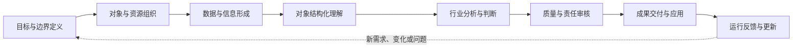

- **目标与边界定义**：明确为什么做、为谁做、处理什么，以及结果需要满足的责任和质量边界。
- **对象与资源组织**：确认业务对象、已有信息、参与主体和工作范围。
- **数据与信息形成**：形成支撑后续理解和判断的基础信息。
- **对象结构化理解**：把原始信息转换为具有行业含义的对象、关系和状态。
- **行业分析与判断**：依据行业规则和目标形成测量、评价、预测或决策结果。
- **质量与责任审核**：确认结果是否完整、可信、合规，并明确最终责任主体。
- **成果交付与应用**：把审核后的结果交付到业务场景或下游系统。
- **运行反馈与更新**：根据对象变化、使用反馈和新要求持续修订结果与流程。

---

## 0. 遗产数字化

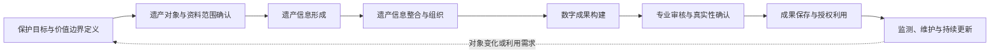

- **保护目标与价值边界定义**：明确数字化服务于保护、研究、管理或传播中的哪些目标。
- **遗产对象与资料范围确认**：界定需要记录的实体、环境、历史信息和权利范围。
- **遗产信息形成**：形成能够描述遗产现状和语境的基础记录。
- **遗产信息整合与组织**：统一不同来源的信息并建立对象、时间和语境之间的关系。
- **数字成果构建**：形成满足既定用途的数字表达和信息成果。
- **专业审核与真实性确认**：确认成果对遗产对象的表达是否完整、可信并可追溯。
- **成果保存与授权利用**：对正式成果进行长期保存，并按权限支持业务和公众使用。
- **监测、维护与持续更新**：根据遗产变化、保护活动和信息迁移要求更新数字记录。

---

## 1. 建筑外观 AI 测量

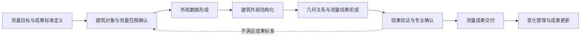

- **测量目标与成果标准定义**：明确测量用途、对象层级和结果应达到的质量要求。
- **建筑对象与测量范围确认**：界定建筑范围、需要表达的外观对象和不可覆盖部分。
- **外观数据形成**：形成能够支撑建筑外观理解和测量的基础数据。
- **建筑外观结构化**：将外观数据组织为建筑部分、要素及其空间关系。
- **几何关系与测量结果形成**：将结构化对象转换为符合业务定义的测量结果。
- **结果验证与专业确认**：判断结果是否达到规定标准，并处理不确定和异常部分。
- **测量成果交付**：按照业务需要组织并发布正式测量成果。
- **变化管理与成果更新**：在建筑状态或测量要求变化后更新成果。

---

## 2. 医疗影像 AI

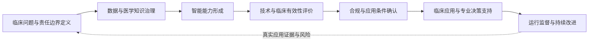

- **临床问题与责任边界定义**：明确要解决的临床问题、适用对象、使用场景和最终责任主体。
- **数据与医学知识治理**：建立支撑能力形成和评价的数据、知识、权利与质量基础。
- **智能能力形成**：形成面向既定临床任务的稳定输出能力。
- **技术与临床有效性评价**：分别确认输出是否可靠，以及输出是否对既定临床用途有效。
- **合规与应用条件确认**：确认产品或服务进入医疗场景前应满足的法规、质量和安全要求。
- **临床应用与专业决策支持**：在明确的人机关系中向医疗专业人员提供辅助信息。
- **运行监督与持续改进**：持续识别性能变化、风险事件和适用条件变化，并受控更新。

---

## 3. 无人机测绘与实景三维

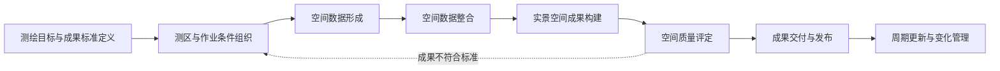

- **测绘目标与成果标准定义**：明确测区、用途、成果类型和质量要求。
- **测区与作业条件组织**：统筹测区条件、业务范围、安全责任和工作资源。
- **空间数据形成**：形成覆盖目标区域的基础空间记录。
- **空间数据整合**：统一不同批次和来源数据之间的空间与时间关系。
- **实景空间成果构建**：形成面向测绘、展示或管理用途的空间成果。
- **空间质量评定**：确认成果的空间可信度、完整性和适用范围。
- **成果交付与发布**：将正式成果交付到使用主体和业务环境。
- **周期更新与变化管理**：根据区域变化和应用需要维护成果时效性。

---

## 4. 建筑逆向建模：点云转 BIM

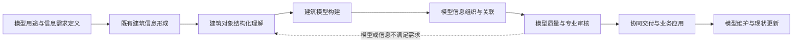

- **模型用途与信息需求定义**：明确模型服务的业务目的，以及所需对象、信息和质量层级。
- **既有建筑信息形成**：形成对建筑当前状态的基础记录。
- **建筑对象结构化理解**：将现状信息组织为建筑对象、空间及其关系。
- **建筑模型构建**：将结构化理解转换为统一的建筑信息模型。
- **模型信息组织与关联**：完善对象属性、关系、来源和业务关联。
- **模型质量与专业审核**：确认模型与现状、信息要求和业务规则之间的一致性。
- **协同交付与业务应用**：向设计、保护、改造、运维或管理主体交付受控模型。
- **模型维护与现状更新**：在建筑变化或业务要求调整后更新模型。

---

## 5. 消费级三维捕获与神经渲染

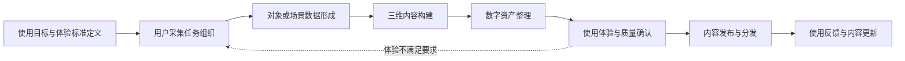

- **使用目标与体验标准定义**：明确内容面向的用户场景、表现要求和使用边界。
- **用户采集任务组织**：将内容采集要求转化为普通用户可完成的任务。
- **对象或场景数据形成**：形成支撑三维内容表达的基础数据。
- **三维内容构建**：把基础数据转换为可浏览的对象或场景表达。
- **数字资产整理**：形成边界清晰、状态完整且可管理的内容资产。
- **使用体验与质量确认**：确认内容在目标环境中的视觉、交互和运行质量。
- **内容发布与分发**：将审核后的内容提供给目标平台和用户。
- **使用反馈与内容更新**：根据使用问题、设备变化和内容需求持续维护。

---

## 6. 自动驾驶感知

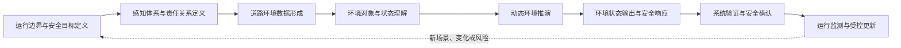

- **运行边界与安全目标定义**：明确系统允许工作的环境、条件和必须满足的安全结果。
- **感知体系与责任关系定义**：界定感知需要理解的内容及其与其他车辆能力之间的责任关系。
- **道路环境数据形成**：形成对车辆自身状态和周边环境的连续记录。
- **环境对象与状态理解**：将环境数据转换为道路对象、空间关系和当前状态。
- **动态环境推演**：形成对环境变化和相关对象未来状态的判断。
- **环境状态输出与安全响应**：向下游能力提供环境信息，并在不确定或越界时触发安全处置。
- **系统验证与安全确认**：确认感知能力在规定范围内满足性能和安全要求。
- **运行监测与受控更新**：利用运行证据识别新风险并管理系统变化。

---

## 7. 电力与基建巡检 AI

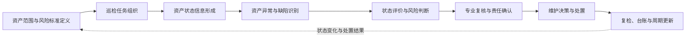

- **资产范围与风险标准定义**：明确巡检对象、风险等级、状态标准和责任边界。
- **巡检任务组织**：依据资产风险和管理要求确定本次检查范围与任务。
- **资产状态信息形成**：形成能够反映资产当前状况的检查记录。
- **资产异常与缺陷识别**：从状态信息中形成与具体资产对象关联的异常记录。
- **状态评价与风险判断**：综合异常、历史和资产重要性形成状态及风险结论。
- **专业复核与责任确认**：由责任主体确认结论、证据和处置要求。
- **维护决策与处置**：把确认结果转换为维护、修复、限制使用或持续观察等业务行动。
- **复检、台账与周期更新**：验证处置结果并更新资产全生命周期记录。

---

## 8. 工业质检 AI

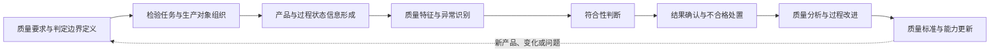

- **质量要求与判定边界定义**：明确产品质量特征、允许状态和放行责任。
- **检验任务与生产对象组织**：把质量要求关联到具体产品、批次、工序和检验阶段。
- **产品与过程状态信息形成**：形成能够支撑质量判断的产品和生产过程记录。
- **质量特征与异常识别**：将状态信息转换为可比较的质量特征和异常对象。
- **符合性判断**：依据既定标准形成合格、不合格或需要进一步确认的结果。
- **结果确认与不合格处置**：确认质量结论并完成隔离、复检、返工或其他处置。
- **质量分析与过程改进**：从质量结果中识别系统性问题并推动生产过程调整。
- **质量标准与能力更新**：根据产品、过程和风险变化更新判定标准及质检能力。

---

## 9. 遥感解译

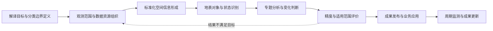

- **解译目标与分类边界定义**：明确要回答的问题、区域时间范围和对象分类规则。
- **观测范围与数据资源组织**：组织满足任务范围和时效要求的对地观测信息。
- **标准化空间信息形成**：形成具有一致空间、时间和质量含义的基础信息。
- **地表对象与状态识别**：把基础信息转换为地表对象、类别和状态表达。
- **专题分析与变化判断**：围绕业务问题形成空间分布、数量、关系或变化结论。
- **精度与适用范围评价**：确认结果的可信程度、误差和可使用边界。
- **成果发布与业务应用**：向规划、资源、环境、灾害等业务提供正式成果。
- **周期监测与成果更新**：使用新的观测信息持续维护时效性。

---

## 10. 文档智能与档案数字化

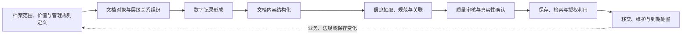

- **档案范围、价值与管理规则定义**：明确哪些文档进入处理范围，以及对应的价值、权利和保管要求。
- **文档对象与层级关系组织**：确认文档、案卷、集合和业务事项之间的原有关系。
- **数字记录形成**：形成能够代表原始文档的正式数字记录。
- **文档内容结构化**：把文档内容组织为可识别的结构和阅读关系。
- **信息抽取、规范与关联**：形成可检索的信息对象，并与统一业务语义建立联系。
- **质量审核与真实性确认**：确认数字记录、结构化信息和原始语境之间的一致性。
- **保存、检索与授权利用**：同时满足长期保存、业务检索和访问控制要求。
- **移交、维护与到期处置**：按照制度处理持续保管、迁移、移交或合法处置。

---

## 11. AI 建筑生成出图

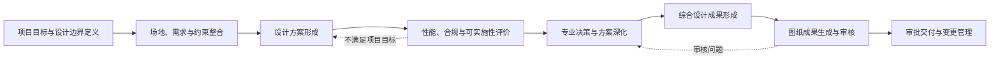

- **项目目标与设计边界定义**：明确设计任务、阶段目标、责任主体和成果要求。
- **场地、需求与约束整合**：把场地条件、使用需求、性能目标和规则转为统一设计边界。
- **设计方案形成**：在设计边界内形成可比较的候选方案。
- **性能、合规与可实施性评价**：从项目目标出发判断方案是否成立并识别问题。
- **专业决策与方案深化**：由专业主体选择、调整并逐步确定方案。
- **综合设计成果形成**：整合各专业要求，形成一致的正式设计信息。
- **图纸成果生成与审核**：把正式设计信息转成图纸成果并确认其完整性和一致性。
- **审批交付与变更管理**：完成责任审批、正式发布，并持续控制后续变化。

---

## 12. 安防视频结构化

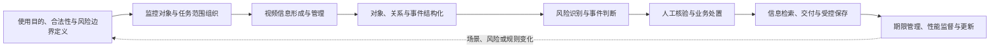

- **使用目的、合法性与风险边界定义**：明确为何使用视频能力、允许处理什么以及对个人权益的限制。
- **监控对象与任务范围组织**：把使用目的转为明确的对象、区域、事件和责任范围。
- **视频信息形成与管理**：形成连续、可管理并与业务时间空间关联的视频信息。
- **对象、关系与事件结构化**：将视频转换为可查询的对象、状态、关系和事件记录。
- **风险识别与事件判断**：依据业务规则形成告警、线索或风险结果。
- **人工核验与业务处置**：由责任人员核验证据并决定是否采取行动。
- **信息检索、交付与受控保存**：支持授权检索、证据交付和安全保存。
- **期限管理、性能监督与更新**：依法管理保存期限，并根据误报漏报和场景变化调整系统。

---

## 行业流程的合并边界

为了避免流程重新落入具体功能，本版采用以下合并原则：

1. 所有用于建立基础记录的活动统一归入“数据与信息形成”。
2. 所有用于消除信息差异并建立统一语境的活动统一归入“信息整合”。
3. 所有用于把原始信息转换为行业对象和关系的活动统一归入“结构化理解”。
4. 所有用于形成行业结论的活动统一归入“行业分析与判断”。
5. 所有用于确认可信度、合规性和责任归属的活动统一归入“质量与责任审核”。
6. 所有用于正式发布结果并进入业务场景的活动统一归入“成果交付与应用”。
7. 所有用于处理交付后变化和新要求的活动统一归入“反馈与更新”。

因此，这些流程适合用于行业比较、产品边界讨论和一级能力规划；若进入具体产品设计或项目实施，再在相应阶段下拆分二级流程。
