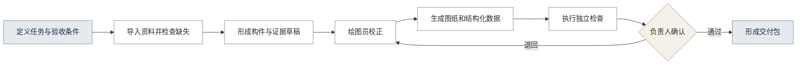

# 01 · 用户与场景分析

## 一、用户结论

第 1 代 MVP 的直接用户是乙方绘图员和项目负责人，成果接收方和买单方需要分别验证。产品不能把政府机构、具体岗位、操作用户和采购主体合并成同一个“目标用户”。

## 二、用户分层

四类角色在同一交付过程中承担不同责任（见表 1）。

**表 1：第 1 代用户分层**

| 层级 | 具体角色 | 核心任务 | 主要问题 | 第 1 代关系 |
|---|---|---|---|---|
| 操作层 | 乙方绘图员、内业整理人员 | 整理资料、校正对象、生成成果 | 重复描绘、跨文件同步、规范细节多 | P0，直接操作 |
| 责任层 | 乙方项目负责人、专业审核人 | 定义成果、审核问题、确认交付 | 初稿检查成本高、退回原因难定位 | P0，审核确认 |
| 接收层 | 区县文物部门、委托方、代理验收人 | 核验成果、来源、版本和完整性 | 结果难追溯、资料难再次利用 | P1，成果接收 |
| 买单层 | 乙方企业、项目总包方、文物部门 | 决定采购和预算 | 需要证明成本、风险或管理价值 | 待真实项目验证 |

区县科员不作为默认操作用户。只有真实项目证明其具备测绘资料和成果生产职责时，才增加区县自用分支。

## 三、核心场景

第 1 代只验证一个场景：乙方项目团队完成一张可检查、可追溯的古建筑现状立面图，并形成接收方能够核验的交付包。

### 3.1 触发条件

场景由修缮勘察、测绘建档或现状记录任务触发。项目负责人已经获得委托要求，需要明确一张立面图的适用规范、精度、对象范围、审核角色和交付条件。

### 3.2 使用前

绘图员和项目负责人当前需要完成以下工作：

- 接收合同、任务书和成果要求。
- 整理照片、测稿、尺寸、已有图纸和来源记录。
- 判断资料是否满足目标成果要求。
- 在 CAD 或其他专业工具中人工整理和绘制。

主要问题是资料与成果分散、重复录入、修改无法同步、检查与生成混在一起。

### 3.3 使用中

用户在产品中完成的流程见图 1。

**图 1：第 1 代核心使用流程**

### 3.4 使用后

项目负责人将交付包提交给委托方、文物部门或代理验收人。交付包包括 DWG、PDF、结构化构件数据、检查记录、版本说明和交付清单。

接收方退回时，问题需要关联到具体对象、资料、规则或检查项。修改后形成新版本，不覆盖历史记录。

## 四、角色动作

操作用户、责任用户和接收方的动作必须分别记录（见表 2）。

**表 2：角色动作与结果**

| 角色 | 使用前 | 使用中 | 使用后 |
|---|---|---|---|
| 绘图员 | 整理照片、测稿、尺寸和已有资料 | 处理缺失项、校正构件和关系、生成成果 | 根据退回问题修改并形成新版本 |
| 项目负责人 | 定义成果、规范、精度和验收条件 | 查看检查结果、退回问题或确认成果 | 提交交付包，复盘工时和退回原因 |
| 接收方或代理验收人 | 接收任务和验收依据 | 不参与生产 | 检查文件、来源、版本、问题记录和使用限制 |
| 买单方 | 确认项目目标和成本责任 | 原则上不参与具体操作 | 根据成果采用、成本和风险决定续用或采购 |

## 五、输入场景分支

输入不足时不能把辅助草稿当作正式成果（见表 3）。

**表 3：输入条件与场景结果**

| 输入条件 | 可形成的结果 | 必须提示的限制 |
|---|---|---|
| 照片、必要实测尺寸、任务和验收条件齐全 | 一张正式立面成果及最小交付包 | 仍需人工校正、独立检查和负责人确认 |
| 有照片但缺少必要实测基准 | 辅助草稿、补测清单或代理演示结果 | 不得形成正式尺寸结论 |
| 有正射影像、控制尺寸和已有图纸 | 更完整的图纸和对象关系 | 仍需核实来源、时间和适用范围 |
| 有点云、坐标和历次资料 | 多来源空间成果和跨期比较的输入 | 第 1 代不处理完整空间和变化结论 |

## 六、需要验证的用户假设

用户分析仍包含七项未验证判断（见表 4）。

**表 4：用户与场景假设**

| 编号 | 假设 | 验证方式 | 不成立时的影响 |
|---|---|---|---|
| U1 | 绘图员愿意使用结构化对象数据完成校正 | 真实项目观察和操作记录 | 交互和对象范围需要重做 |
| U2 | 项目负责人需要独立检查和责任记录 | 代理或真实交付评审 | 检查模块和角色关系调整 |
| U3 | 必要实测尺寸已有可录入记录 | 查看真实测稿并记录录入时间 | 输入方式需要支持测稿识别或其他接入 |
| U4 | 新增录入成本小于减少的整理、绘图和返工成本 | 同一成果人工方式与产品方式计时 | 产品价值不成立或输入范围需要收缩 |
| U5 | 接收方需要结构化数据、检查记录和版本说明 | 交付包评审 | 交付包内容缩减或调整 |
| U6 | 乙方企业、总包方或文物部门存在明确买单关系 | 采购流程访谈和真实项目 | 商业路径调整 |
| U7 | 一张立面图能够代表足够高频和高成本的任务 | 真实项目图纸类型与工时分布 | 第 1 代成果类型需要调整 |

## 七、分析边界

当前用户和场景结论支持继续执行代理交付，不证明真实采用和付费。真实用户、责任人和接收方完成一轮生产、审核和交付后，才能确认第 1 代场景成立。
