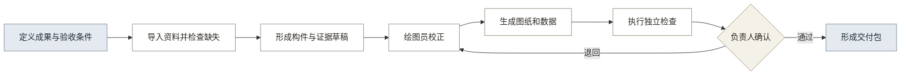

# 07 · PRD：第 1 代正式立面成果 MVP

## 一、产品结论

第 1 代 MVP 用于验证一张古建筑现状立面图能否从任务定义开始，经过资料检查、对象校正、成果生成、独立检查和负责人确认，形成可核验的正式交付包。

本 PRD 不批准全面产品化，也不包含完整档案平台。

## 二、目标与证据

产品目标按照正式成果成立条件定义（见表 1）。

**表 1：产品目标与验证证据**

| 目标 | 验证指标 | 证据来源 |
|---|---|---|
| 资料可用 | 缺失项、补充次数、输入问题占比 | 资料检查记录 |
| 对象可校正 | 未知项、修改项、校正时间 | 对象版本和修改记录 |
| 成果可检查 | 尺寸、规范、完整性和来源问题 | 独立检查表 |
| 责任可确认 | 退回、修改、确认和版本记录完整 | 审核记录 |
| 交付可核验 | 接收方或代理验收人能够理解和检查交付包 | 交付评审 |
| 产品有价值 | 相比原方式减少整理、重画或返工 | 工时对照和用户复盘 |

缺少真实项目基线时只记录数值，不预设效率和准确率门槛。

## 三、用户与责任

四类角色在产品中承担不同任务（见表 2）。

**表 2：角色与权限**

| 角色 | 当前对象 | 主要权限 | 不承担的责任 |
|---|---|---|---|
| 操作用户 | 乙方绘图员、内业整理人员 | 导入资料、处理缺失、校正对象、生成成果 | 不签发最终成果 |
| 责任用户 | 乙方项目负责人、专业审核人 | 配置要求、查看检查、退回、确认 | 不由 AI 替代专业判断 |
| 接收方 | 委托方、文物部门、代理验收人 | 查看交付包、检查记录和版本 | 不参与内部对象校正 |
| 产品负责人 | JIAJIA | 固定验证范围、查看指标、作出产品决策 | 不代替真实项目责任人 |

## 四、使用场景

第 1 代只覆盖修缮勘察、测绘建档或现状记录任务中的一张正式立面图。

### 4.1 前置条件

- 已明确保护对象和成果用途。
- 已明确适用规范、精度、审核角色和验收条件。
- 至少具有带来源的现场照片。
- 正式尺寸成果具有必要实测尺寸或可靠空间基准。
- 项目资料具有合法使用条件。

### 4.2 核心流程

用户流程从任务定义到交付包结束（见图 1）。

**图 1：第 1 代正式立面成果流程**

## 五、输入与输出

### 5.1 最低输入

最低输入必须足以支持目标成果和责任确认（见表 3）。

**表 3：最低输入**

| 输入 | 必填内容 | 检查要求 |
|---|---|---|
| 任务信息 | 项目、建筑、成果类型、用途 | 对象和成果唯一 |
| 验收条件 | 适用规范、精度、图幅、格式、检查项 | 条件可以转成检查清单 |
| 照片 | 全景和必要细部、拍摄时间、来源 | 覆盖与清晰度满足对象判断 |
| 实测资料 | 必要尺寸、单位、部位、测量方式、来源 | 无单位或无来源不能作为正式尺寸 |
| 角色 | 绘图员、负责人、接收方或代理验收人 | 操作和确认责任明确 |

### 5.2 输入不足

输入不足时必须生成补充清单，不得静默生成正式结果：

- 缺少必要实测基准：只生成辅助草稿和补测清单。
- 照片覆盖不足：标记遮挡、缺失部位和需要补拍的内容。
- 来源不明：资料可以暂存，但不能进入正式成果依据。
- 规范或验收条件不明：任务不得进入正式成果生成。

### 5.3 输出

第 1 代交付包至少包含表 4 所列内容。

**表 4：MVP 输出**

| 输出 | 内容 | 用途 |
|---|---|---|
| DWG | 立面线划、尺寸、标高、图号、图签和版本 | 专业编辑与正式交付 |
| PDF | 固定版式的立面成果 | 查看、审核和签署 |
| 结构化数据 | 建筑、构件、尺寸、关系、证据和版本 | 追溯、复用和后续成果 |
| 检查记录 | 尺寸、规范、完整性和来源检查 | 证明问题已被检查 |
| 审核记录 | 退回、修改、确认、人员和时间 | 证明责任过程 |
| 版本说明 | 当前版本的变更、限制和未解决问题 | 防止错误覆盖和误用 |
| 交付清单 | 文件名、格式、校验信息和使用说明 | 接收方核验 |

## 六、需求总览

第 1 代包含九项必要需求（见表 5）。

**表 5：需求总览**

| 编号 | 需求 | 主要结果 | 优先级 |
|---|---|---|:---:|
| R001 | 任务与验收条件定义 | 任务书、资料要求、检查清单 | P0 |
| R002 | 资料导入与质量检查 | 可用资料集、缺失清单 | P0 |
| R003 | 构件与证据草稿 | 最小对象数据和不确定项 | P0 |
| R004 | 人工校正与版本记录 | 已校正对象数据 | P0 |
| R005 | 立面成果生成 | DWG、PDF 和结构化数据 | P0 |
| R006 | 独立质量检查 | 检查报告和问题清单 | P0 |
| R007 | 负责人退回与确认 | 审核记录和确认状态 | P0 |
| R008 | 交付包与版本管理 | 可核验交付包 | P0 |
| R009 | 验证数据记录 | 工时、问题、退回和采用证据 | P0 |

## 七、功能要求

### 7.1 R001 任务与验收条件定义

产品必须在资料处理前固定成果要求。

- 新建项目和建筑单元。
- 选择一类立面成果模板。
- 记录委托方、对象身份、适用规范、精度、图幅、格式和负责人。
- 从成果模板生成资料清单和检查清单。
- 验收条件变更时形成新版本并记录原因。

验收标准：

- 任务缺少适用规范、成果用途或负责人时不能进入正式成果生成。
- 每项检查要求能够回溯到规范、合同或项目约定。

### 7.2 R002 资料导入与质量检查

产品必须让每份输入资料具有来源、时间、质量和使用状态。

- 上传照片、测稿、尺寸表和必要已有图纸。
- 记录资料来源、时间、提供人和使用权限。
- 检查格式、单位、覆盖、清晰度和必要字段。
- 输出可用、待确认、缺失和不适用四类状态。
- 生成补拍、补测或补充资料清单。

验收标准：

- 无单位的尺寸不能提交。
- 来源不明资料不能进入正式结果依据。
- 缺少必要实测基准时自动切换为辅助草稿状态。

### 7.3 R003 构件与证据草稿

产品必须把资料转成可校正的建筑和构件对象。

- 形成建筑、构件、尺寸、位置关系、来源和置信状态。
- 记录每项判断引用的照片、尺寸或已有资料。
- 将遮挡、类别不明、关系存疑和资料不足标记为待处理。
- 自动结果不得覆盖已人工确认的对象。

验收标准：

- 每个对象能够回溯到至少一项证据或人工录入记录。
- 未知和存疑项不能被自动写成已确认事实。

### 7.4 R004 人工校正与版本记录

产品必须允许绘图员确认、修改、删除和新增对象。

- 按待处理优先级展示对象。
- 修改尺寸或关系时记录人员、时间、原因和前后值。
- 支持草稿、校正中、待检查、退回修改和已确认状态。
- 重开校正时创建新版本，不覆盖历史版本。

验收标准：

- 待处理项未完成时不能提交独立检查。
- 所有修改可以回溯到具体人员和版本。

### 7.5 R005 立面成果生成

产品必须从同一份已校正对象数据生成图纸和结构化数据。

- 生成 DWG 和 PDF。
- 包含轮廓、构件、必要尺寸、标高、图号、图签和版本。
- 按项目适用规范配置图层、线型、比例和命名。
- 无实测依据的数值必须明确标记为估算，不得混入正式尺寸。

验收标准：

- DWG 和 PDF 使用同一对象版本。
- 图签版本与系统版本一致。
- 文件能够在约定 CAD 软件中正常打开。

### 7.6 R006 独立质量检查

产品必须把成果生成和成果检查分开。

- 尺寸检查：单位、来源、关联和必要尺寸完整性。
- 规范检查：图号、图签、比例、图层、命名和格式。
- 完整性检查：任务要求的对象和文件是否齐全。
- 来源检查：关键对象和判断能否回溯到资料。
- 输出问题等级、对象、依据和建议处理方式。

验收标准：

- 检查报告不能由生成状态自动标记通过。
- 每个问题可以定位到对象、文件、规则或资料。

### 7.7 R007 负责人退回与确认

产品必须由责任用户决定成果是否进入交付。

- 负责人查看成果、原始证据、修改记录和检查问题。
- 未解决的阻断问题存在时不能确认。
- 退回时选择或填写原因，并关联具体问题。
- 确认时记录人员、时间、对象版本和成果版本。

验收标准：

- AI 和绘图员都不能代替负责人确认。
- 退回后修改必须形成新版本并重新检查。

### 7.8 R008 交付包与版本管理

产品必须形成接收方能够核验的成果包。

- 组合 DWG、PDF、结构化数据、检查记录、审核记录、版本说明和交付清单。
- 按项目规则生成文件名。
- 记录文件版本和校验信息，禁止静默覆盖。
- 标明使用限制、未解决问题和辅助草稿状态。

验收标准：

- 交付清单与实际文件一致。
- 接收方能够识别当前版本、责任人和使用限制。

### 7.9 R009 验证数据记录

产品必须为代理和真实交付保存同一口径的验证数据。

- 记录各阶段开始和结束时间。
- 记录缺失项、修改项、规则例外、检查问题和退回原因。
- 记录接收方是否理解、核验和采用成果。
- 记录继续使用、采购或介绍其他项目的意向。

验收标准：

- 代理交付和真实交付使用相同字段。
- 系统能够导出一份不含敏感原始资料的验证摘要。

## 八、状态规则

成果状态按照责任变化管理（见表 6）。

**表 6：成果状态**

| 状态 | 进入条件 | 允许动作 | 退出条件 |
|---|---|---|---|
| 资料准备 | 任务已建立 | 导入、检查、补充资料 | 必要输入满足 |
| 对象校正 | 已形成对象草稿 | 确认、修改、新增、删除 | 待处理项完成 |
| 待检查 | 校正完成 | 执行独立检查 | 检查完成 |
| 退回修改 | 存在问题或负责人退回 | 修改对象和成果 | 新版本重新检查 |
| 待确认 | 阻断问题已解决 | 负责人确认或退回 | 负责人作出决定 |
| 已确认 | 负责人确认 | 形成交付包 | 新需求或退回触发新版本 |
| 已交付 | 交付包完成 | 查看、下载、记录接收反馈 | 不覆盖，只能创建新版本 |

## 九、非功能要求

非功能要求优先保证可追溯、兼容和数据安全（见表 7）。

**表 7：非功能要求**

| 类别 | 要求 | 验证方式 |
|---|---|---|
| 可追溯 | 尺寸、对象、修改、检查和确认均关联来源、人员、时间和版本 | 抽查记录 |
| 一致性 | DWG、PDF、结构化数据和检查记录引用同一对象版本 | 自动对照 |
| 兼容性 | 文件能够在约定 CAD 和 PDF 工具中打开 | 双软件检查 |
| 安全 | 未授权项目资料不得用于训练或外部传播 | 授权和部署检查 |
| 可恢复 | 历史版本不能静默覆盖 | 版本回查 |
| 可理解 | 接收方无需查看生产过程即可理解交付清单和限制 | 代理或真实交付评审 |

## 十、不做范围

第 1 代不包含以下内容：

- 三维模型和写实浏览。
- 平面、剖面和详图等多图种。
- 完整点云处理、摄影测量和通用几何重建。
- 全地区、全时期、全部构件自动识别。
- 在线多人协同编辑。
- 区域档案平台、跨期变化和公众展示。
- AI 自动确认、签署或发布正式成果。

## 十一、信息来源

- 产品方向、输入档位、架构和版本以 `12_调研结论与未来架构.md` 为准。
- 用户和场景以 `01_用户与场景分析.md` 为准。
- 图纸规范现状见 `06_图纸成果规范要点.md`；真实项目必须改用项目所在地规范和合同要求。
- 第 0 代路径证据见 `09_MVP工作流验证报告.md`。
- 验证方法和状态见 `08_第1代验证方案.md`。
