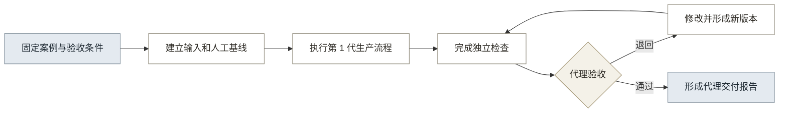

# 08 · 第 1 代验证方案

## 一、验证结论

当前只证明第 0 代样本路径可以运行，尚未证明正式成果、真实采用、效率和付费价值。验证必须先完成代理交付，再在出现真实项目机会时使用同一口径完成真实交付。

代理交付可以支持继续完善第 1 代，不能批准全面产品化或第 2 代建设。

## 二、当前证据状态

现有证据按照能够支持的判断分级（见表 1）。

**表 1：当前证据状态**

| 证据项 | 当前状态 | 能证明 | 仍不能证明 |
|---|---|---|---|
| 三个样本识别、校正和出图 | 已完成 | 路径可复现，问题可定位 | 真实精度、正式交付和效率 |
| 跨行业事实与能力调研 | 已完成 | 行业能力方向和边界 | 古建用户采用 |
| 目标角色公开资料 | 部分完成 | 乙方存在绘图和负责人分工 | 真实操作习惯和采购关系 |
| 图纸规范研究 | 部分完成 | 北京规范征求意见稿可作代理检查参考 | 全国适用性和真实合同要求 |
| 资料输入条件 | 部分完成 | 照片和测稿是常见资料 | 实际质量、录入成本和权限 |
| 代理交付 | 待执行 | 流程、规则、检查和交付包 | 真实采用、法定验收和付费 |
| 真实交付 | 待机会 | 实际效率、采用、责任和付费信号 | 单个项目不能证明规模化市场 |

## 三、核心假设

第 1 代验证围绕七项假设进行（见表 2）。

**表 2：核心验证假设**

| 编号 | 假设 | 主要验证方式 | 当前状态 |
|---|---|---|---|
| V1 | 最低输入能够支持一张正式立面成果 | 代理交付和真实交付 | 待执行 |
| V2 | 结构化对象能够减少重复整理和重画 | 人工基线与产品过程计时 | 待执行 |
| V3 | 有限构件规则能够跨案例复用 | 代理案例与后续真实案例对照 | 待执行 |
| V4 | 独立检查能够提前发现交付问题 | 检查表和退回记录 | 待执行 |
| V5 | 项目负责人认可退回、修改和确认记录 | 代理或真实审核 | 待执行 |
| V6 | 接收方能够理解和核验交付包 | 代理或真实交付评审 | 待执行 |
| V7 | 乙方、总包方或文物部门愿意继续使用或付费 | 真实项目反馈和采购信号 | 待一手验证 |

## 四、代理交付方案

### 4.1 目标

代理交付验证第 1 代流程、输入档位、规则、独立检查和交付包是否完整，不验证真实市场采用。

### 4.2 案例选择

代理案例同时满足以下条件：

1. 存在合法可用的现场照片或公开资料。
2. 存在可作为检查基准的实测图纸、控制尺寸或正式研究成果。
3. 能够明确成果用途、适用规范和验收条件。
4. 不是第 0 代三个已知样本，避免重复验证。
5. 复杂度能够覆盖有限构件规则，同时允许未知和人工处理。

### 4.3 角色

代理交付至少设置生产和检查两类责任：

- 代理操作人：按 07 PRD 完成资料检查、对象校正和成果生成。
- 产品负责人：固定范围、记录过程，不在生产开始后更换指标。
- 代理验收人：优先由未参与生产的建筑、测绘或文保领域人员承担。

若暂时没有独立代理验收人，结果只能标记为内部检查完成，不能标记为代理验收通过。

### 4.4 固定输入

开始生产前建立输入快照：

- 任务书和验收条件。
- 最低输入档位清单。
- 原始照片、实测资料和来源信息。
- 人工方式的成果或工时基线。
- 适用规范和检查清单。
- 数据使用和引用条件。

生产开始后新增资料必须记录时间和原因。

### 4.5 执行步骤

代理交付按照图 1 执行。

**图 1：代理交付验证流程**

### 4.6 代理交付准出条件

代理交付同时满足以下条件才算通过：

- 最低输入是否满足能够被明确判断。
- 缺失资料能够形成补充清单或辅助草稿限制。
- 对象、尺寸、图纸和检查记录能够回溯到来源和版本。
- 独立检查能够发现并定位问题。
- 至少完成一次退回、修改和新版本检查。
- 代理验收人能够根据交付清单理解成果、限制和责任记录。

## 五、真实交付方案

### 5.1 进入条件

真实交付需要满足以下条件：

- 乙方或项目方明确授权使用资料进行验证。
- 项目所在地规范、合同成果和验收条件可获得。
- 真实绘图员或项目负责人能够参与或观察。
- 数据权属、保密、存储和删除条件有书面记录。

### 5.2 执行要求

真实交付沿用代理交付的字段和指标，不为获得更好结果临时改变口径。

1. 记录原人工方式的任务、人员、工时、退回和成果。
2. 使用相同成果要求执行产品方式。
3. 记录资料补充、校正、规则例外、检查问题和负责人确认。
4. 由真实接收方或代理验收人检查交付包。
5. 记录成果是否进入真实项目、需要哪些人工补充和最终采用状态。
6. 记录继续使用、采购、续用或介绍其他项目的意向及理由。

### 5.3 真实交付准出条件

真实交付形成以下证据后，才允许申请第 2 代验证：

- 目标用户能够完成操作和审核。
- 结果进入真实或合同约定的交付检查。
- 结构化对象减少至少一种重复劳动，具体幅度以基线记录为准。
- 问题能够定位到输入、对象、规则、检查或责任环节。
- 至少出现继续使用、采购讨论或明确拒绝及其原因。

## 六、证据包

每次代理或真实交付必须保存表 3 所列证据。

**表 3：交付验证证据包**

| 证据 | 内容 | 目的 |
|---|---|---|
| 任务快照 | 成果、规范、精度、角色和验收条件 | 防止验证过程中改变目标 |
| 输入快照 | 原始资料、来源、质量、缺失和授权 | 判断输入是否成立 |
| 人工基线 | 原方式工时、文件、问题和退回 | 形成价值对照 |
| 操作记录 | 各阶段时间、操作和异常 | 判断流程成本 |
| 对象版本 | 初稿、修改、原因和证据 | 判断校正和可追溯性 |
| 成果包 | DWG、PDF、结构化数据和清单 | 判断结果完整性 |
| 检查记录 | 问题、依据、处理和复查 | 判断质量控制 |
| 审核记录 | 退回、确认、人员和版本 | 判断责任过程 |
| 交付反馈 | 理解、采用、拒绝和改进意见 | 判断场景与产品价值 |
| 商业信号 | 继续使用、采购、价格和介绍意向 | 判断付费关系 |

## 七、指标

指标先建立基线，再决定下一阶段门槛（见表 4）。

**表 4：验证指标**

| 维度 | 指标 | 代理交付 | 真实交付 |
|---|---|:---:|:---:|
| 资料 | 缺失项、补充次数、输入耗时 | 记录 | 记录 |
| 对象 | 未知项、修改项、校正时间 | 记录 | 记录 |
| 规则 | 新增规则、例外和人工处理数 | 记录 | 记录 |
| 质量 | 尺寸、规范、完整性和来源问题 | 记录 | 记录 |
| 审核 | 退回次数、确认时间和问题定位 | 记录 | 记录 |
| 交付 | 验收人能否理解和核验 | 必须 | 必须 |
| 效率 | 相比人工方式的工时变化 | 可估算 | 必须 |
| 采用 | 是否进入真实项目 | 不适用 | 必须 |
| 商业 | 继续使用或采购意向 | 不形成结论 | 必须记录 |

## 八、决策

验证结果只允许形成三类决策：

- 继续完善第 1 代：代理交付通过，问题可定位和修正。
- 申请第 2 代验证：真实交付形成采用、效率和付费信号。
- 调整或暂停：正式成果无法成立、不能减少重复劳动，或目标组织没有采用意愿。

JIAJIA 负责最终判断。AI 可以整理证据和检查遗漏，不能代替产品决策。

## 九、当前下一步

当前下一步是确定一个新的代理案例，并在开始生产前完成任务快照、最低输入清单、人工基线和代理验收安排。
